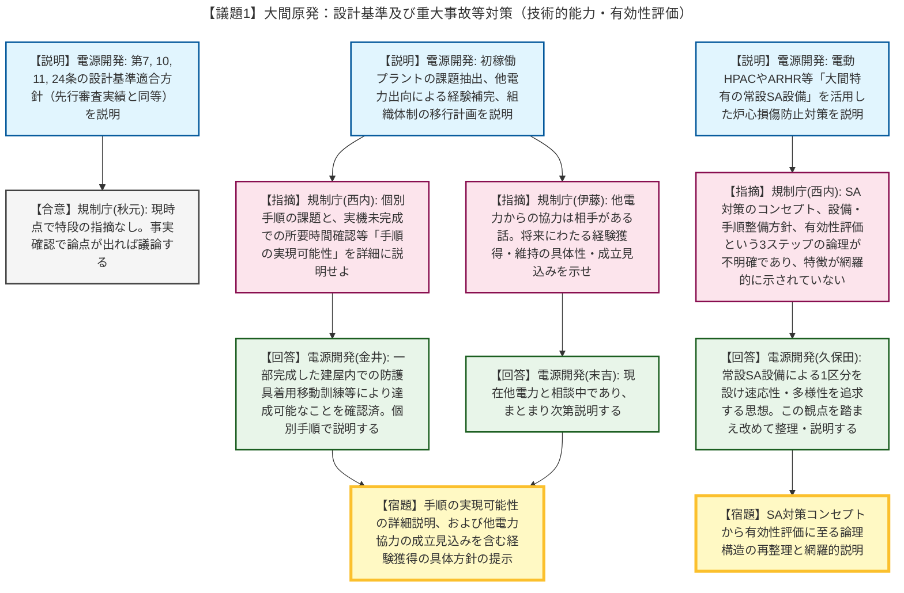
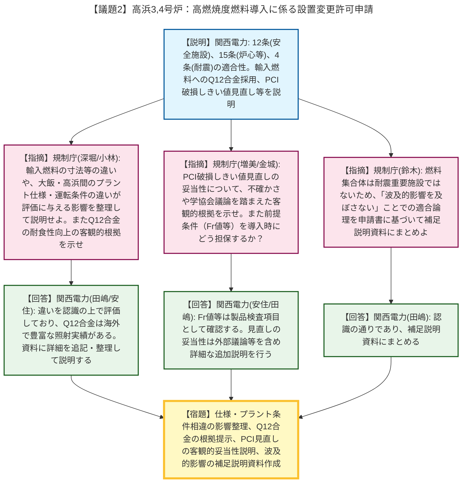

# 第1408回原子力発電所の新規制基準適合性に係る審査会合（令和8年4月28日）
> 出典 : https://youtube.com/live/FRirw_1FG6o?si=VTbc2eKxZldznQB2

# 会合の概要
* **未経験事業者に対する厳しい実効性の追求（大間原発）:** 初めて原子炉を運転する電源開発に対し、重大事故時の手順の成立性（未完成の建屋内での移動時間など）や、他電力からの協力・出向による運転経験補完の実効性について、「相手のある話であり、本当に協力を得られるのか具体的な根拠を示すべき」と極めて現実的かつ厳しい指摘がなされ、現場に強い緊張感が走りました。
* **SA対策の全体コンセプトの論理構築要求（大間原発）:** 大間原発の特徴である「常設SA設備（電動HPACや代替残留熱除去系等）への依存」について、安全性の向上をどう図るかというコンセプトから設備・手順の整備方針、そして有効性評価への落とし込みという一連のストーリーが網羅的に示されていないと指摘され、論理の再構築が求められました。
* **新技術および評価基準見直しに対する客観的根拠の要求（高浜原発）:** 輸入燃料への新合金（Q12）の採用や、PCI（ペレット-被覆管相互作用）破損しきい値の大幅な見直しに対し、定性的な説明や事業者独自の評価にとどまらず、不確かさの考慮や学協会等での第三者的な議論を含めた定量的な技術的根拠を提示するよう強く求められました。

---

# 議題ごとの詳細整理

## 【議題1】電源開発（株）大間原子力発電所の設計基準への適合性及び重大事故等対策について

* **議論の背景と論点:** 大間原発の設計基準（第7条、10条、11条、24条）、重大事故時の技術的能力（1.0共通事項、添付書類5）、および炉心損傷防止対策の有効性評価について議論されました。特に、大間原発が「電源開発にとって初めて運転する原子炉」であることに起因する課題（運転経験の不足、未完成の建屋での手順の成立性）の克服方法と、大間特有の「常設SA設備」を活用した対策コンセプトの明確化が主要な論点となりました。

* **質疑応答（詳細）:**
  * **＜設計基準（第7条、10条、11条、24条）＞**
    * 【説明者側】電源開発（村田、篠原、小林、阿部）より、不法侵入防止の物理的障壁、誤操作防止のための視認性・操作性向上、安全避難通路への可搬型照明の配備、安全保護回路への不正アクセス防止やATWS緩和設備（自動減圧系自動起動阻止機能）の独立性等について先行審査実績と同等の方針であることが説明されました。
    * 【規制側】規制庁（秋元）は、現時点において特段の指摘事項はないが、事実確認を進める中で論点が見出されれば改めて議論するとし、電源開発もこれに同意しました。
  * **＜重大事故等の技術的能力＞**
    * 【説明者側】電源開発（津田、後藤、水谷）より、初稼働プラントであることの課題抽出と対応として、教育訓練の実施、他電力への出向等による運転経験の補完、段階的な組織体制の移行計画について説明されました。
    * 【規制側】規制庁（西内）から、共通事項の基本方針だけでなく、個別の手順等において初めて運転することに起因する課題がないか、また、実機や建屋が未完成の中で所要時間の確認等が行えない手順の「実現可能性」をどう検証するのか詳細な説明が求められました。
    * 【説明者側】電源開発（金井）は、一部完成している建屋内で防護具を着用しての移動訓練を実施し、机上評価（4km/h）が達成可能であることを確認していると回答しました。
    * 【規制側】規制庁（菊川、反町）から、事象発生後4時間で参集する要員（22名）の実効性ある確保策と、参集要員が直ちに復旧作業に加わる実態が図（47ページ）に正しく反映されていないとの指摘がありました。
    * 【説明者側】電源開発（金井、後藤）は、大間町内への待機当番体制の構築を検討していること、図については実態に合うよう修正すると回答しました。
    * 【規制側】規制庁（伊藤）から、他電力の協力を得る方針について「相手がある話であり、本当に協力を得られるのか具体的な根拠（成立する見込み）を示すべき」と、また「経験を積んだ人員の年齢構成等を含め、将来にわたって経験を獲得・維持していく具体的な計画」を示すよう厳しい指摘がありました。
    * 【説明者側】電源開発（末吉）は、他電力と出向等の協力に向けた相談を進めている最中であり、まとまり次第説明すると回答しました。
    * 【規制側】規制庁（本水）から、組織体制の移行プロセスの役割分担の明確化と、教育訓練の内容を保安規定に定める方針であるかの確認がありました。
    * 【説明者側】電源開発（下岡）は、マイルストーンごとの機能強化計画を検討しており、教育内容等は保安規定に定めると回答しました。
  * **＜炉心損傷防止対策の有効性評価＞**
    * 【説明者側】電源開発（太田、奥野）より、急速減圧による燃料被覆管破裂を回避するために「電動HPAC（代替高圧注水系）」を最優先とし、全交流電源喪失時には「FLSD（ディーゼル駆動式低圧注水系）」、格納容器除熱には専用ループの「ARHR（代替残留熱除去系）」を用いるという大間特有の常設SA設備を活用した対策が説明されました。
    * 【規制側】規制庁（西内）は、大間の重大事故等対策の全体像について「大間のSA対策のコンセプト」「それを達成する設備・手順の整備方針」「有効性評価での評価方法」の3ステップに分解されておらず、特徴的な対策が網羅的かつ論理的に示されていないと指摘しました。
    * 【説明者側】電源開発（久保田）は、DBAの3区分に加え「常設SA設備の1区分」を設置することで、速応性や信頼性を高め多様性を追求する設計思想であることを補足し、次回以降この観点を踏まえて整理し直すと回答しました。

* **結論と宿題事項（アクションアイテム）:**
  * 【宿題】建屋未完成等に伴う個別手順の実現可能性（移動時間等）について、訓練実績等を含めて詳細に説明すること。
  * 【宿題】他電力からの協力を得る方針の成立見込み（具体的な根拠）と、将来にわたり中核技術者が経験を獲得・維持する方針を示すこと。
  * 【宿題】大間のSA対策のコンセプトから設備・手順の整備方針、有効性評価に至る論理構造を整理し、特徴を網羅的に説明し直すこと。

---

## 【議題2】関西電力（株）高浜発電所３号炉及び４号炉の高燃焼度燃料導入に係る設置変更許可申請の審査について

* **議論の背景と論点:** 高浜3,4号炉への高燃焼度燃料（国産および輸入ステップ2燃料）の導入に関する第12条（安全施設）、第15条（炉心等）、第4条（地震による損傷の防止）への適合性が議論されました。輸入燃料への新合金（Q12）の採用、プラント間の運転条件の相違、およびPCI破損しきい値の見直しの客観的妥当性が主要な論点となりました。

* **質疑応答（詳細）:**
  * **＜第12条（安全施設）及び第4条（耐震）＞**
    * 【説明者側】関西電力（田嶋、橋爪）より、既許可（平成10年の旧MOX申請）と同様の設計を行うことで適合する方針であること、燃料集合体は耐震重要施設ではないが、炉心支持構造物等の安全機能を損なわないよう波及的影響を考慮する設計であることが説明されました。
    * 【規制側】規制庁（鈴木）は、燃料集合体が耐震重要施設ではないことと、波及的影響を及ぼさないことをもって適合とする論理について、申請書の該当部分を引用した補足説明資料を作成するよう求めました。関電はこれに同意しました。
  * **＜第15条（炉心等）＞**
    * 【説明者側】関西電力（田嶋、安住）より、輸入燃料は国産燃料とペレット長さ等に違いがあるが評価結果は同等であること、輸入燃料にはジルコニウム98.8%の「Q12合金」とモノブロック型シンブルを採用し寸法安定性が向上すること、また、被覆管の製造法改良（カーンズファクター：Frの向上）を踏まえ「PCI破損しきい値」を見直すことが説明されました。
    * 【規制側】規制庁（深堀）は、輸入燃料と国産燃料の寸法等の仕様の違いがなぜ評価結果に影響しないのか、理由をつけて説明するよう指摘しました。また、Q12合金の耐食性向上について定性的な説明だけでなく、評価や実験結果に基づく具体的な根拠を示すよう求めました。
    * 【説明者側】関西電力（安住、田嶋）は、仕様の違いを反映した相対評価で健全性を確認していること、Q12合金は海外で1500体以上・66000MWd/tの照射実績があることを挙げ、資料に詳細を追記すると回答しました。
    * 【規制側】規制庁（小林）は、大飯3,4号炉（4ループ、UO2のみ）と高浜3,4号炉（3ループ、MOX混在）のプラント仕様や運転履歴の違いによる相違点を抽出し、解析条件や評価への影響を整理して説明するよう求めました。
    * 【説明者側】関西電力（田嶋）は、線出力密度等の違いを認識しており、設計への影響を整理して説明すると回答しました。
    * 【規制側】規制庁（増美、金城）は、PCI破損しきい値の見直しについて、出力急昇試験結果と比較する際の前提条件（Fr値等）を明示し、見直しの妥当性を不確かさの考慮や学協会での議論を含めた客観的根拠を用いて説明するよう強く求めました。また、導入される燃料がその条件を満たすことをどう確認するのか問いました。
    * 【説明者側】関西電力（安住、田嶋）は、Fr値等は製品検査項目として確認する方針であり、見直しの妥当性については外部の議論等を含めた詳細な追加説明を行うと回答しました。
    * 【規制側】規制庁（山内）から、高燃焼度用燃料設計コード（FINEコード）についてMOX燃料への適用実績を問われ、関西電力（安住）は、自社にはないが他社プラントでの使用実績があると回答しました。

* **結論と宿題事項（アクションアイテム）:**
  * 【宿題】先行プラント（大飯3,4）との燃料仕様の違い、およびプラント仕様・運転条件の違いが解析・評価に与える影響を整理し説明すること。
  * 【宿題】Q12合金の耐食性向上等に関する具体的な根拠（実績・評価結果等）を資料に追記すること。
  * 【宿題】PCI破損しきい値見直しの妥当性について、不確かさや学協会等の議論を踏まえた客観的根拠を示し、前提条件（Fr値等）の製品検査での担保方法を含めて説明すること。
  * 【宿題】第4条（耐震）に関して、燃料集合体からの波及的影響防止による適合論理を申請書に基づいて補足説明資料にまとめること。

---

# 論理構造の可視化（Mermaid）

以下に各議題の議論のフローをMermaid形式で記述します。

