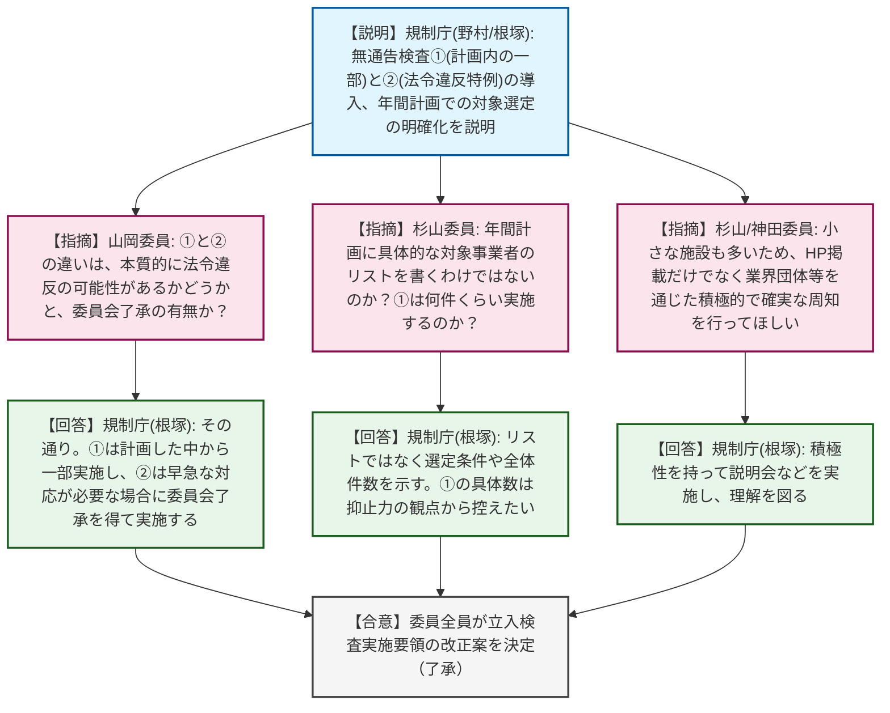
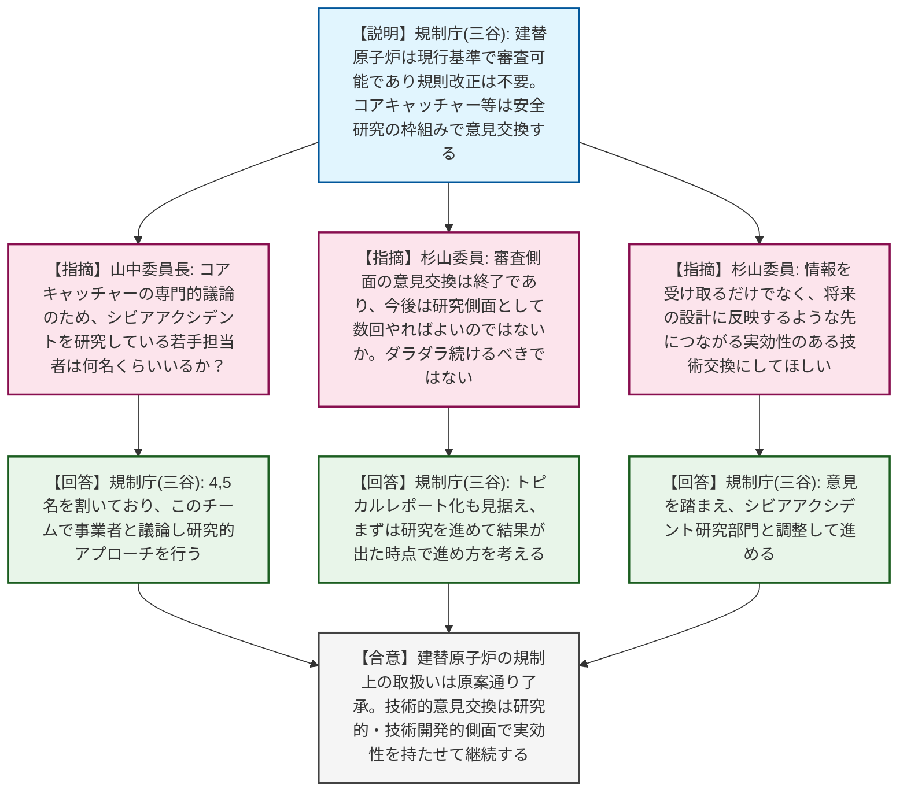
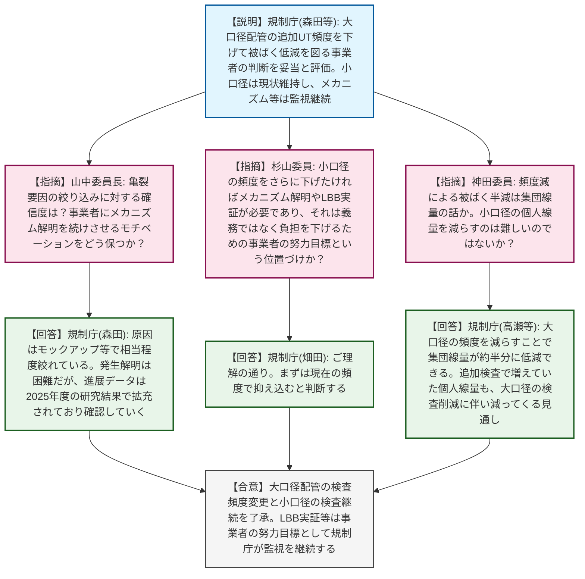

# 第7回原子力規制委員会（令和8年4月28日）
> 出典 : https://youtube.com/live/pH70r1VSFbo?si=-o99lexR4TMsZz_4

# 会合の概要
* **無通告立入検査の導入と事業者への丁寧な周知の徹底:** IAEAの勧告を踏まえた「事前に通告を行わない立入検査」の導入が決定されました。規制側からは、新たな規制の枠組みが千差万別な事業者に混乱を招かないよう、ホームページでの公開にとどまらず、事業者側に確実に伝わる積極的な周知活動を行うよう事務局に強く釘が刺されました。
* **建替原子炉に対する「先につながる」技術意見交換の要求:** 建替原子炉（コアキャッチャー等）の設計について、現行の基準で審査可能であるとの判断が下されました。これに伴い、今後の事業者との技術的意見交換は「研究・技術開発的側面」に限定されることとなりましたが、規制側からは「単に情報を一方的に受け取るだけでなく、将来の設計反映に活きる実効性のある議論にせよ」と、漫然とした活動を戒める発言がありました。
* **大飯3号機配管亀裂問題における現実的対応と今後の「努力目標」の明確化:** PWRの加圧器スプレイライン配管溶接部で発生した応力腐食割れ（SCC）について、作業員の被ばく低減を目的とした大口径配管の超音波探傷試験（UT）頻度の引き下げが妥当と判断されました。一方で小口径配管については、メカニズムの完全解明が困難であることを理由に現状の高頻度検査を維持することとし、「さらに頻度を下げたいのであれば、原因究明や破断前漏洩（LBB）の実証を自ら進めるべき」と、事業者の自己責任（努力目標）として突き放しつつ厳格に監視する姿勢が明確にされました。

---

# 議題ごとの詳細整理

## 【議題1】「放射性同位元素等の規制に関する法律に基づく立入検査実施要領」の改正
* **議論の背景と論点:** IAEAの勧告等を受け、立入検査実施要領を改正し、「事前に通知を行わない立入検査」を導入すること、および年間計画に基づく対象事業者の選定を明確化することが提案されました。無通告検査の対象や、全国の多様な事業者に対する周知の方法が論点となりました。
* **質疑応答（詳細）:**
    * 【説明者側】規制庁（野村、根塚）より、①計画に基づくが通告を行わない立入検査の導入、②法令違反の可能性がある場合等の特例（委員会了承を得て対象に関わらず無通告で実施）、③年間計画における選定の明確化、を柱とする改正案が説明されました。
    * 【規制側】山岡委員より、無通告検査①（計画に基づくが通告しない）と②（法令違反等の特例）の本質的な違いは、法令違反の可能性があるかどうか、そして委員会了承を得るかどうかという理解でよいか質問がありました。
    * 【説明者側】規制庁（根塚）は、ご認識の通りであると回答しました。
    * 【規制側】杉山委員より、年間計画に基づく対象事業者選定の明確化について、年間計画に具体的な対象事業者のリストを書くという意味ではないのか確認がありました。
    * 【説明者側】規制庁（根塚）は、リストを明示するのではなく、選定の条件や全体件数、月ごとの按分などの方針を示すものだと回答しました。
    * 【規制側】杉山委員より、対象事業者が千差万別である中で、無通告検査①は何件くらい実施する方針か質問がありました。
    * 【説明者側】規制庁（根塚）は、全事業者が対象になり得るが、抑止力的な意味合いもあるため具体的な数は控えたいと回答しました。
    * 【規制側】杉山委員より、施行後の周知方法について、ホームページに載せるだけでは相手からアクセスしないと見られないため、こちらから伝わるような積極的な周知をしてほしいと指摘がありました。
    * 【説明者側】規制庁（根塚）は、業界団体への案内や説明会等を通じ、積極性を持って理解を図ると回答しました。
    * 【規制側】神田委員からも、非常に小さな施設など管理の仕方が異なる施設も多いため、組織に対してきっちりと周知してあげる対応をお願いしたいと要望がありました。
* **結論と宿題事項（アクションアイテム）:**
    * 立入検査実施要領の改正について、全委員一致で原案通り決定（了承）されました。事務局は、改正内容について多様な事業者へ積極的かつ確実に伝わる周知活動を実施することが求められました。

## 【議題2】建替原子炉の設計に関する規制上の取扱い
* **議論の背景と論点:** 建替原子炉（次世代炉）の設計に関して事業者が予見性がないと主張していた論点について、現行の設置許可基準規則・解釈で審査対応が可能（改正不要）と結論付けられました。今後、コアキャッチャー等の新技術に関する事業者との意見交換を「研究的側面」でどう進めていくかが論点となりました。
* **質疑応答（詳細）:**
    * 【説明者側】規制庁（三谷）より、現行の規則・解釈を改正する必要はなく、申請があれば現行基準で審査を行う方針が示されました。また、コアキャッチャー等に関する事業者からの専門的な議論の要望については、既存の安全研究等の枠組みを活用して意見交換を実施すると説明されました。
    * 【規制側】山中委員長より、コアキャッチャーのような新技術の議論において、規制庁側でシビアアクシデントを研究している若手担当者は何名くらいいるのか質問がありました。
    * 【説明者側】規制庁（三谷）は、シビアアクシデント部門で4,5名を割いており、このチームで事業者と議論を継続し、研究面からのアプローチを行っていくと回答しました。
    * 【規制側】杉山委員より、現行基準で審査可能と判断した以上、規制・審査側面での意見交換は終了であり、以後は研究側面としての意見交換であると整理した。申請はずっと先であるため、ダラダラと続けるものではなく数回やればよいのではないかと見通しを問いました。
    * 【説明者側】規制庁（三谷）は、本委員会で了承を得た後、シビアアクシデント研究部門と進め方を検討する。事業者が将来的にはトピカルレポートも視野に入れていることから、まずは研究を進めて結果が出た時点で考えたいと回答しました。
    * 【規制側】杉山委員から、規制側が情報を受け取る一方ではなく、良いアイデアが出たら将来の設計に反映するくらいの、先につながる実効性のある技術・意見交換にしてほしいと強い要望が出されました。
    * 【説明者側】規制庁（三谷）は、意見を踏まえて部門間で調整して進めると回答しました。
* **結論と宿題事項（アクションアイテム）:**
    * 建替原子炉の設計に関する規制上の取扱い（現行基準での審査対応）について、原案通り了承されました。
    * 今後の技術的意見交換は、コアキャッチャーに関する研究的・技術開発的側面に限定し、漫然と続けるのではなく将来の設計反映を見据えた実効性のあるものとすることが合意されました。

## 【議題3】大飯発電所3号機加圧器スプレイライン配管溶接部における亀裂を踏まえた非破壊検査の見直し
* **議論の背景と論点:** 大飯3号機で発生した応力腐食割れ（PWR-SCC）に関し、作業員の被ばく低減のため、事業者が大口径配管の超音波探傷試験（UT）の追加検査頻度を通常のISI頻度（10年または7年）に戻す方針を示しました。大口径配管の頻度変更の妥当性と、メカニズム解明や破断前漏洩（LBB）成立の証明を「事業者の努力目標」としてどう位置付けるかが論点となりました。
* **質疑応答（詳細）:**
    * 【説明者側】規制庁（森田、畑田、高瀬）より、大口径配管は内表面で圧縮応力となるため亀裂が進展しにくく、検査頻度を落とす事業者の判断は妥当と評価する旨が報告されました。一方、小口径配管についてはメカニズムが完全に解明されていないため毎定検での追加検査を継続し、メカニズム解明やLBB成立については事業者の更なる知見拡充が必要であると説明されました。
    * 【規制側】山中委員長より、亀裂の発生要因を「3年未満の作業員による溶接や補修溶接」等に絞り込んだことに対する確信度と、事業者にメカニズム解明を続けさせるモチベーションをどう保つか質問がありました。
    * 【説明者側】規制庁（森田）は、原因については過去のモックアップ試験等で相当程度絞り込めていると回答しました。発生メカニズムの完全解明は稀な事象のため困難とされているが、亀裂進展データについては2025年度までの研究でデータ拡充が行われていると聞いており、その結果を確認していくと回答しました。
    * 【規制側】杉山委員より、大口径配管の頻度変更は妥当だが、小口径配管の検査頻度をさらに下げたければ、原因究明やLBB成立の実証が必要であり、それは彼らの義務ではなく「負担を下げたければ努力せよ」という位置づけであると確認しました。
    * 【説明者側】規制庁（畑田）は、ご理解の通りであり、まずは現在の頻度で抑え込むと判断していると回答しました。
    * 【規制側】神田委員より、大口径配管の検査頻度減による被ばく半減は集団線量の話か、また小口径の個人線量を減らすのは難しいのではないかとの指摘がありました。
    * 【説明者側】規制庁（高瀬等）は、集団線量全体（約94.8mSv）のうち大口径分を減らすことで約半分の49.7mSvに低減できると回答しました。また個人線量についても、現状追加検査で3〜4割増えている分が、大口径の検査削減に伴い減ってくる見通しであると説明しました。
* **結論と宿題事項（アクションアイテム）:**
    * 作業員の被ばく低減を目的とした大口径配管の追加的UT検査の頻度変更（通常ISI頻度への移行）と、小口径配管の毎定検での検査継続、および規制検査による監視方針が了承されました。
    * PWR-SCCのメカニズム解明やLBB成立については、小口径配管の検査負担を軽減するための「事業者の自己責任に基づく努力目標」として位置付け、規制庁は研究の進捗を監視し必要に応じて委員会に報告することとされました。

---

# 論理構造の可視化（Mermaid）

以下に各議題の議論のフローをMermaid形式で記述します。

