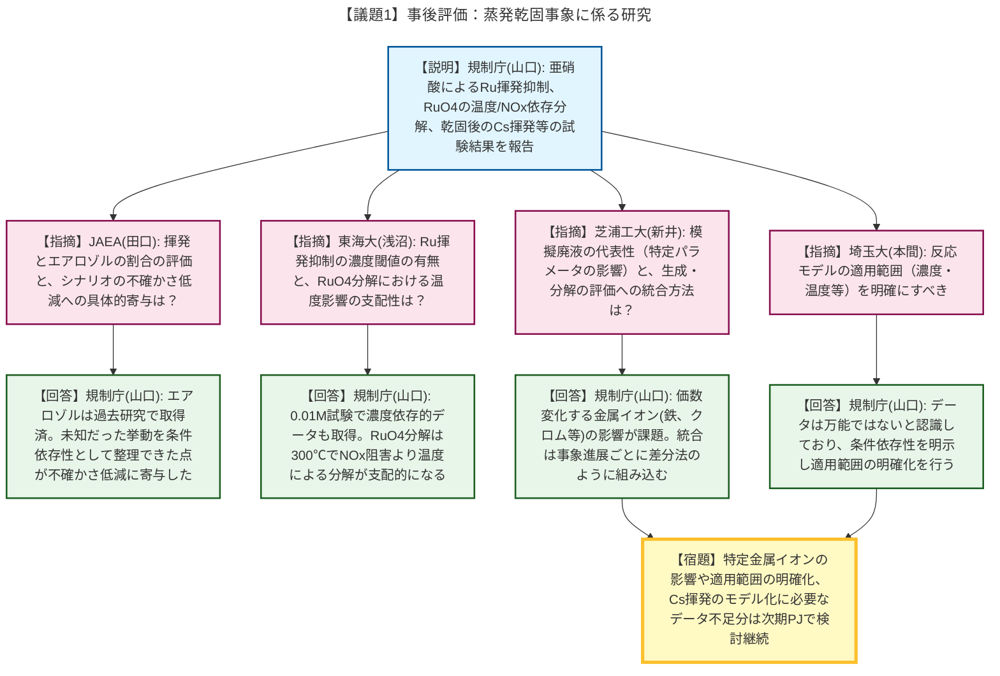
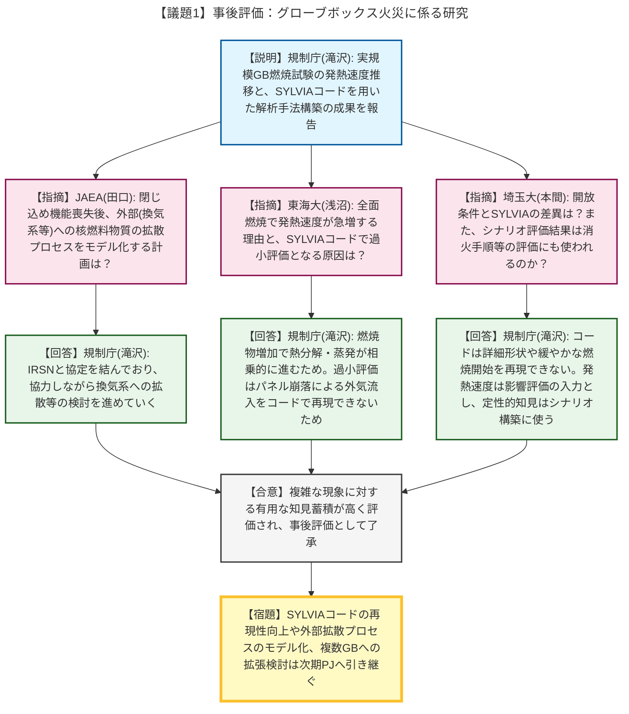

# 第9回核燃料サイクル技術評価検討会（令和8年4月28日）
> 出典 : https://youtube.com/live/7YDngeL6EgU?si=lBU529BIT3PwIVox

# 会合の概要
* **事後評価対象プロジェクトへの高い評価:** 令和7年度に終了した「再処理施設及びMOX燃料加工施設における重大事故等の事象進展に係る研究」の事後評価が行われました。外部有識者からは、非常に複雑で困難な現象（蒸発乾固事象、グローブボックス火災）に対して実験的なアプローチで挑み、多くの貴重なデータを取得したことが高く評価されました。
* **事象進展モデルの不確かさ低減への寄与:** ルテニウム（Ru）の揮発・分解挙動や、実規模グローブボックスの燃焼時の発熱速度など、これまで未知であった挙動が条件依存性として整理されました。これにより、重大事故シナリオの不確かさが低減し、リスク情報を活用した原子力規制検査の基盤が構築されたことが確認されました。
* **残存課題の明確化と次期プロジェクトへの継承:** 模擬廃液における特定金属イオン（鉄、クロム等）の影響評価や、SYLVIAコードによる火災時の酸素流入・急激な燃焼の再現など、明らかになった課題や適用限界については、今年度（令和8年度）から開始された次期安全研究プロジェクトに引き継がれ、さらなる高度化が図られることが合意されました。

---

# 議題ごとの詳細整理

## 【議題1】安全研究プロジェクトの技術的観点からの評価（再処理施設及びMOX燃料加工施設における重大事故等の事象進展に係る研究 事後評価）

### ① 蒸発乾固事象に係る研究
* **議論の背景と論点:** 高レベル廃液の冷却機能喪失による蒸発乾固事象について、先行研究で未考慮だった亜硝酸によるRu揮発抑制、RuO4分解挙動、乾固後のセシウム（Cs）揮発などのデータ取得状況と、それらがシナリオの不確かさ低減にどう寄与したかが論点となりました。
* **質疑応答（詳細）:**
    * 【説明者側】規制庁（山口）より、亜硝酸添加によるRu揮発抑制効果、NOxによる分解阻害と温度影響の限界、凝縮液へのRu吸収モデル、過レニウム酸セシウム等を模擬した乾固後の揮発挙動について研究成果が報告されました。
    * 【指摘】JAEA（田口）から、気相移行するRuのうち、エアロゾルと揮発の割合の評価方針、および本研究がシナリオの不確かさ低減にどう寄与したか質問がありました。
    * 【回答】規制庁（山口）は、エアロゾル化の割合は過去のプロジェクトで取得済みであると回答。不確かさ低減については、未知だった挙動を「NOx阻害限界」などの条件依存性として整理できた点が大きく寄与したと説明しました。
    * 【指摘】東海大（浅沼）から、亜硝酸によるRu揮発抑制に濃度閾値があるのか、またRuO4分解においてNOx阻害より温度影響が支配的になるのか質問がありました。
    * 【回答】規制庁（山口）は、追加試験（0.01M）により濃度依存的なデータも蓄積できていると回答。また、300℃程度になるとNOxの阻害よりも温度による分解が支配的になることが示唆されたと説明しました。
    * 【指摘】芝浦工大（新井）から、模擬廃液の代表性（濃度や組成のばらつきに対する網羅性）と結果に影響し得るパラメータは何か、また亜硝酸の生成と分解をどう統合して事故進展評価に使うのか質問がありました。
    * 【回答】規制庁（山口）は、実機想定範囲で設定したが全てのばらつきは網羅できておらず、特に価数変化する金属イオン（鉄、クロム等）が影響すると考え次期PJで検討すると回答。統合については、事象進展ごとの生成・分解速度を差分法のように統合し評価する構想であると説明しました。
    * 【指摘】芝浦工大（新井）から、乾固後のCs等揮発挙動について、優先してモデル化すべき現象と不足データは何か質問がありました。
    * 【回答】規制庁（山口）は、600〜800℃で揮発するレニウム含有化合物（Cs模擬）のデータ、および温度依存の放出速度データが必要であると回答しました。
    * 【指摘】埼玉大（本間）から、各反応モデルの適用範囲（濃度・温度等）を明確にすべきとの指摘がありました。
    * 【回答】規制庁（山口）は、本データは万能ではないと認識しており、条件依存性を明示して適用範囲の明確化を行うと同意しました。

### ② グローブボックス（GB）火災に係る研究
* **議論の背景と論点:** MOX燃料加工施設等で想定されるGB火災について、実規模GBを用いた燃焼試験（開放条件・換気条件）とSYLVIAコードによる事象進展解析の妥当性、および結果の活用方法が論点となりました。
* **質疑応答（詳細）:**
    * 【説明者側】規制庁（滝沢）より、実規模GBを用いた火災試験による発熱速度の推移や、SYLVIAコードによる解析結果、および解析手順の構築成果が報告されました。
    * 【指摘】JAEA（田口）から、閉じ込め機能喪失後の外部（部屋や換気系）への核燃料物質の拡散プロセスをモデル化して組み込む計画があるか質問がありました。
    * 【回答】規制庁（滝沢）は、IRSN（フランス放射線防護原子力安全研究所）と協定を結んでおり、協力しながら換気系への拡散等の検討を進めていくと回答しました。
    * 【指摘】東海大（浅沼）から、片側着火と全面燃焼とで発熱速度の上昇が単純な2倍ではなく急激に大きくなる理由と、解析コードで発熱速度の最大値を過小評価してしまう原因について質問がありました。
    * 【回答】規制庁（滝沢）は、燃焼物が増えると受熱量も急増し熱分解・蒸発が相乗的に促進されるためと回答。過小評価の原因については、パネル崩落による外気流入（酸素濃度上昇）を現在のSYLVIAコードでは再現できない制限があるためと説明しました。
    * 【指摘】埼玉大（本間）から、開放条件とSYLVIA解析での大きな違いはどこか、またシナリオ評価結果は消火手順等の評価にも使われるのか質問がありました。
    * 【回答】規制庁（滝沢）は、SYLVIAは詳細形状（グローブ穴等）や緩やかな燃焼開始を再現できないと説明。また、発熱速度は火災影響評価のインプットとして使い、パネル溶融等の定性的な知見はシナリオ構築そのものに活用できると回答しました。複数GBへの拡張についても過去データを参照して検討していくと述べました。

* **結論と宿題事項（アクションアイテム）:**
    * 本安全研究プロジェクトは、極めて複雑な現象に対して有用な知見を蓄積し、シナリオの不確かさ低減とリスク情報の高度化に大きく貢献したものと高く評価されました。
    * 【宿題】特定金属イオンの影響評価、各反応モデルの適用範囲の明確化、SYLVIAコードの再現性向上や外部拡散プロセスのモデル化といった残存課題については、今年度（令和8年度）から開始された次期安全研究プロジェクトにおいて継続して検討を行うこと。
    * 各専門家は、後日評価シート及び意見シートを事務局へ提出すること。

---

# 論理構造の可視化（Mermaid）

以下に各議題の議論のフローをMermaid形式で記述します。

