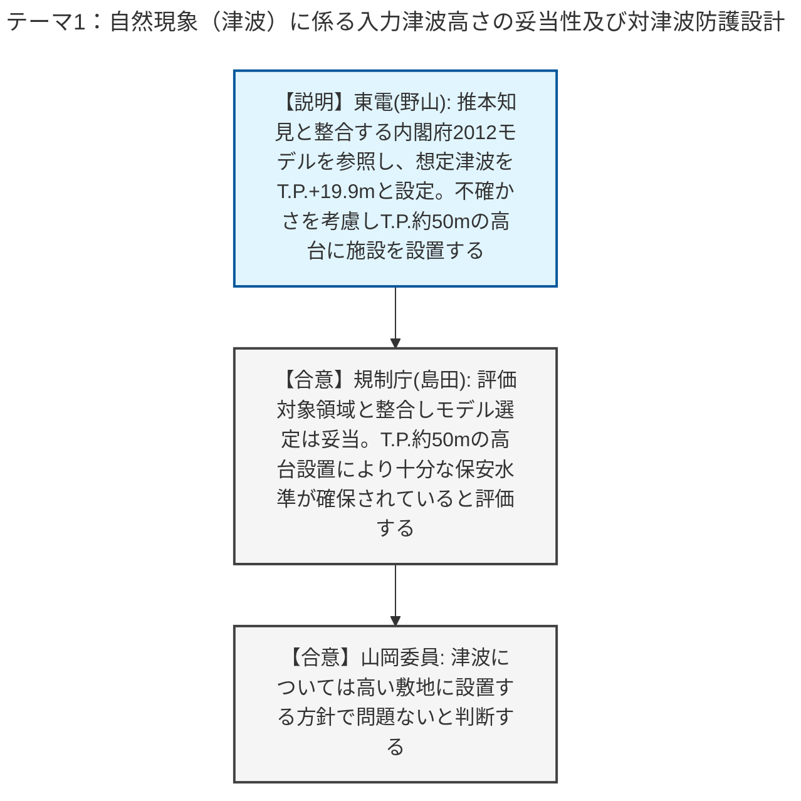
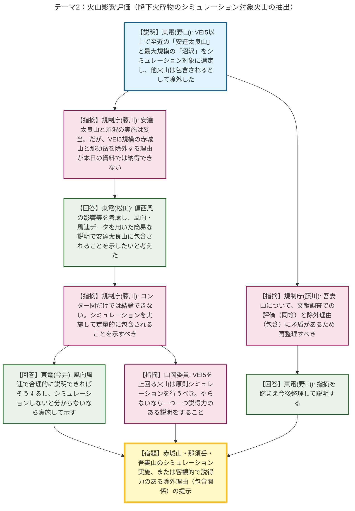

# 第47回実用発電用原子炉施設の廃止措置計画に係る審査会合（令和8年5月12日）
> 出典 : https://youtube.com/live/bLqDUtimtIQ?si=jjkOA8K84avcQlSK

# 会合の概要
* **津波防護設計の妥当性確認と了承:** 福島第二原子力発電所には基準津波が設定されていないため、内閣府2012年モデルに基づく福島県津波ハザードマップを参照し、想定津波高さをT.P.+19.9mと設定しました。規制側は、この波源選定が地震調査研究推進本部（推本）の知見と整合していることを確認し、T.P.約50mの高台に乾式貯蔵施設を設置するという方針により十分な保安水準が確保されていると評価、津波に関する審査は概ね妥結しました。
* **降下火砕物シミュレーション対象火山の選定に対する厳しい指摘:** 降下火砕物の層厚評価において、東京電力は安達太良山と沼沢の2火山のみをシミュレーション対象としました。しかし規制庁から、VEI5規模でありながら風向や位置の観点で影響が懸念される赤城山や那須岳、および選定除外の論理に矛盾が見られる吾妻山について、「本日の説明ではシミュレーション対象から除外する理由として不十分である」と厳しく指摘され、論理の再構築またはシミュレーションの実施が強く求められました。
* **山岡委員からの原則の提示:** 山岡委員から、「VEI（火山爆発指数）が5を上回る火山については、原則としてシミュレーションを行うべきであり、やらないのであれば他プラントの評価を用いるなど、説得力のある説明を一つ一つ丁寧に行うこと」との指針が示され、次回の明確な回答が宿題となりました。

---

# 議題ごとの詳細整理

## 【議題1】東京電力ホールディングス（株）福島第二原子力発電所1〜4号炉の廃止措置計画変更認可申請の審査について

### テーマ1：自然現象（津波）に係る入力津波高さの妥当性及び対津波防護設計
* **議論の背景と論点:** 前回（1月）の審査会合での指摘事項No.25（内閣府2012モデル選定の妥当性）およびNo.18（周辺施設への影響防止と設計方針）に対する回答が論点となりました。
* **質疑応答（詳細）:**
    * 【説明者側】東京電力（野山）より、推本や最新知見を踏まえ、千島海溝・日本海溝沿いの波源を網羅する福島県の津波ハザードマップ（内閣府2012モデル）を参照し、想定津波高さをT.P.+19.9mと設定したことが説明されました。パラメータスタディは未実施ですが、不確かさを考慮してT.P.約50mの高台に乾式貯蔵施設を設置することで、遡上波の到達や漏水・浸水を完全に防護する設計方針が示されました。
    * 【規制側】規制庁（島田）は、福島県の選定波源が推本の評価対象領域と整合し、内閣府モデルの選定は妥当であると評価しました。また、T.P.約50mへの設置方針により十分な保安水準が確保されていると判断し、津波設計について追加のコメントはないと表明しました。
    * 【規制側】山岡委員も、高い敷地に設置するという方針により津波防護は問題ないと同意しました。
* **結論と宿題事項（アクションアイテム）:**
    * 津波の入力高さ設定および防護設計方針については、規制側から妥当と判断され、実質的に了承されました。

### テーマ2：火山影響評価（降下火砕物の層厚設定と対象火山の抽出）
* **議論の背景と論点:** 前回指摘事項No.26に対する回答として、文献調査、地質調査（ボーリングコア確認）、シミュレーション対象火山の抽出フローが説明されました。VEI5以上の火山に対するシミュレーションの要否（包含関係の論理）が主要な争点となりました。
* **質疑応答（詳細）:**
    * 【説明者側】東京電力（野山）より、文献調査と敷地内の地質調査（最大5cm）から、最大層厚を16cm程度と評価したことが説明されました。火山影響評価ガイドに基づき、影響を及ぼし得る13火山を抽出し、VEI5以上で至近の「安達太良山」と噴出規模最大の「沼沢」の2火山をシミュレーション対象に選定し、他は包含されるとして除外したと説明されました。
    * 【規制側】規制庁（藤川）は、安達太良山と沼沢のシミュレーション実施は妥当としつつ、除外された「赤城山」「那須岳」「吾妻山」の3火山について説明が不足していると指摘しました。赤城山は東電自身のコンター試算で7.2cmとなっており、偏西風の影響で最も厳しい可能性があること、那須岳は西南西方向の代表であり安達太良山と同規模であることを挙げ、シミュレーション対象に加えるべきと指摘しました。
    * 【説明者側】東京電力（松田）は、シミュレーションを回さずとも、風向・風速データを用いて安達太良山の評価に包含されることを簡易的な説明で示せると考えて提示したと回答しました。
    * 【説明者側】東京電力（今井）が補足し、絶対にシミュレーションをやらないと決めているわけではなく、風向風速で合理的に説明できればそうするし、シミュレーションしないと分からないなら実施してお示しすると回答しました。
    * 【規制側】規制庁（藤川）は、本日の資料だけでは除外する理由が理解できず、コンター試算だけでなく定量的に包含されることを示す必要があると強く指摘しました。また、吾妻山について、文献調査（P22）では安達太良山と同等としつつ、抽出結果（P37）では包含されるとしており説明が矛盾している点も再整理を求めました。
    * 【説明者側】東京電力（野山）は、指摘を踏まえて今後整理して説明すると回答しました。
    * 【規制側】山岡委員は、降下火砕物の評価において、VEIが5を上回る火山については原則としてシミュレーションを実施すべきであり、やらないのであれば説得力のある論理（距離が遠い等）を一つ一つ分かりやすく説明するよう求めました。
* **結論と宿題事項（アクションアイテム）:**
    * 【宿題】赤城山および那須岳について、シミュレーションを実施して定量的に評価するか、風向風速データ等を用いて安達太良山等に包含されることを客観的かつ説得力のある形で説明すること。
    * 【宿題】吾妻山について、文献調査結果と包含の論理に生じている矛盾を解消し、シミュレーション対象から除外する理由を再整理すること。
    * 【宿題】次回審査会合にて、安達太良山および沼沢（および追加の必要性が生じた火山）のシミュレーション結果（層厚評価）を報告すること。

---

# 論理構造の可視化（Mermaid）

以下に各テーマの議論のフローをMermaid形式で記述します。

