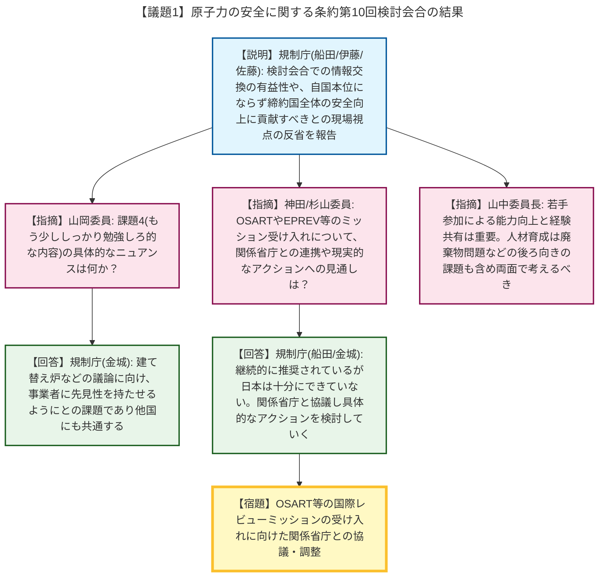
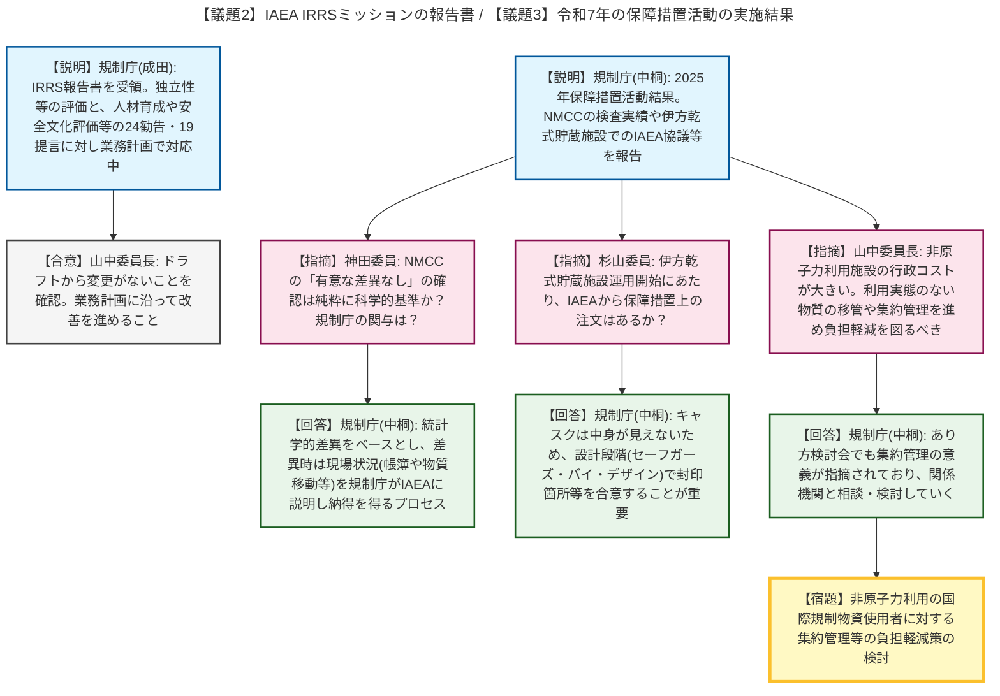
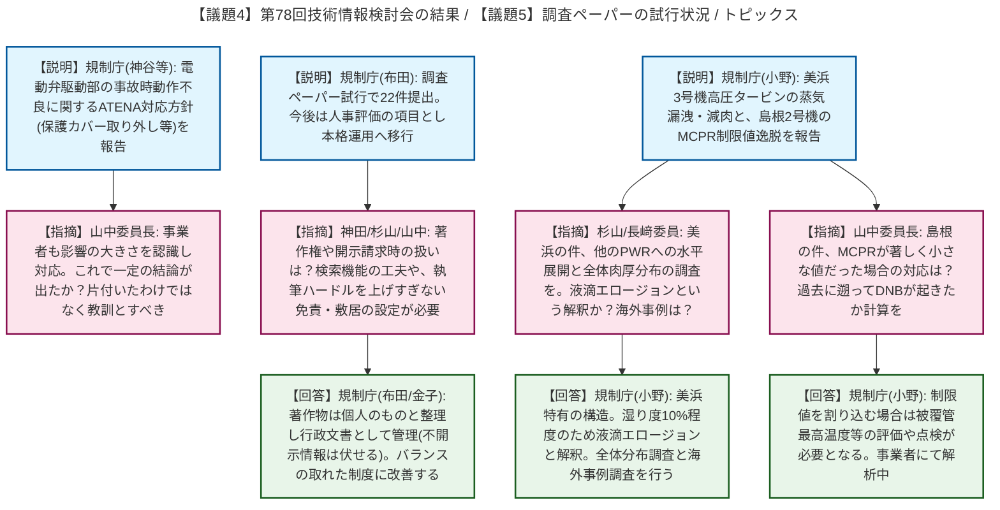

# 第8回原子力規制委員会（令和8年5月13日）
> 出典 : https://youtube.com/live/c2pZMWL9HKU?si=k2V5MYzuH6Fio1RE

# 会合の概要
* **国際的レビューの受け入れと経験の共有:** 原子力安全条約検討会合やIAEAのIRRSミッション等の国際会議・レビューの報告が行われました。OSART（運転管理評価）やEPREV（緊急事態対応評価）等のレビューミッションを日本も積極的に受け入れるべきとの勧告に対し、関係省庁と連携して具体的なアクションにつなげること、また若手職員の派遣による能力向上と国際的貢献を継続することが確認されました。
* **保障措置活動における行政コスト低減と集約管理の推進:** 令和7年の保障措置活動に関して、非原子力利用の国際規制物資使用者（1800超の事業所）に対する行政コストの増大が問題視されました。利用実態のない物質の譲渡や集約管理を進め、日本国としての負担軽減を図るよう、委員会から積極的な問題提起と関係機関への働きかけが求められました。
* **調査ペーパーの本格運用と心理的ハードルの設定:** 職員個人の知見や経験を共有する「調査ペーパー」の試行結果が報告され、本格運用への移行が了承されました。行政文書としての情報公開請求リスクに対し、「組織の公式見解ではなく個人の著作物」として扱い免責を明確にすること、一方で執筆のハードルを上げすぎて自発性を削がないようバランスの取れた制度設計にすることが強調されました。

---

# 議題ごとの詳細整理

## 【議題1】原子力の安全に関する条約第10回検討会合の結果
* **議論の背景と論点:** 原子力安全条約（CNS）第10回検討会合に参加した規制庁職員より、国際的な議論の動向と日本の課題（グッドプラクティスとチャレンジ）が報告されました。
* **質疑応答（詳細）:**
    * 【説明】長官官房総務課（船田室長等）、審査グループ（伊藤安全審査官）、伊方原子力規制事務所（佐藤検査官）から、他国の原子力規制の状況を直に知る有益性や、自国本位にならず締約国全体の安全向上に貢献すべきであるという現場の視点からの反省と抱負が語られました。
    * 【指摘】山岡委員より、日本に対する課題（チャレンジ）として示された内容の具体的なニュアンスについて質問がありました。
    * 【回答】金城審議官は、建て替え炉などの今後の議論に向け、事業者に先見性を持たせるようにとの課題であり、他国にも共通する問題意識であると回答しました。
    * 【指摘】神田委員より、OSARTやEPREV等のレビューミッションの受け入れについて、日本特有の課題なのか、また関係省庁との調整状況について質問がありました。
    * 【回答】船田室長および金城審議官は、継続的に受け入れを推奨されているものであり、他国が積極的にアピールしている一方で日本は十分にできていない事情があるとし、今後関係省庁と協議していくと回答しました。
    * 【指摘】杉山委員は、OSARTは東電や関電以外の他事業者にも促すべきであり、EPREVは内閣府等と連携して現実的な受入時期を検討する具体的なアクションにつなげるべきと指摘しました。
    * 【指摘】山中委員長は、若手職員の参加によるレベルアップと日本の経験の国際的な共有は重要であると述べ、人材育成については前向きな面だけでなく、廃棄物問題などの「後ろ向きの重り」も含めて両面で考えるべきと総括しました。
* **結論と宿題事項（アクションアイテム）:**
    * 【宿題】OSARTやEPREV等の国際レビューミッションの受け入れについて、関係省庁と協議し具体的なアクションを検討すること。

## 【議題2】国際原子力機関(IAEA)の総合規制評価サービス(IRRS)ミッションの報告書
* **議論の背景と論点:** 本年1月に受け入れたIRRSミッションの最終報告書が受領され、その内容（勧告24件、提言19件、良好事例）と今後の対応方針が報告されました。
* **質疑応答（詳細）:**
    * 【説明】IRRS対応室（成田総括主任）より、規制枠組みの強化や合同防災訓練の実施が良好事例として評価された一方、人材確保・育成戦略の策定、安全文化の自己・独立評価プロセスの確立、グレーデッドアプローチの整合性レビュー等の勧告・提言がなされ、これらを令和8年度業務計画に位置づけ対応中であることが説明されました。
    * 【指摘】山中委員長より、ミッション直後のドラフトから確定プロセスにかけて内容に変更はなかったか確認がありました。
    * 【回答】成田総括主任は、勧告・提言等に実質的な変更はないと回答しました。
    * 【合意】山中委員長は、すでに業務計画に沿って対応が進んでいることを確認し、評価に基づく不断の改善を進めることで合意しました。

## 【議題3】我が国における令和7年(2025年)の保障措置活動の実施結果
* **議論の背景と論点:** 2025年の計量管理・保障措置検査の実績が報告され、核物質管理センター（NMCC）の活動の重要性や、非原子力利用の国際規制物資使用者への対応に伴う行政コストの削減（集約管理）が論点となりました。
* **質疑応答（詳細）:**
    * 【説明】放射線防護グループ（中桐参事官）より、2177施設からの報告聴取、1954人日の検査実績（NMCCが1812人日を担当）、環境試料分析におけるJAEAクリアの貢献、伊方発電所の乾式貯蔵施設の運用開始に伴うIAEAとの協議などが報告されました。
    * 【指摘】山岡委員は、非核兵器保有国として極めて重要な活動であり、もっと国民に知ってもらうよう広報を進めるべきと述べました。
    * 【指摘】杉山委員は、NMCCへの期待がさらに大きくなることを踏まえ、国内保障措置制度のあり方検討会の議論を充実させるべきと指摘しました。
    * 【指摘】神田委員より、NMCCによる「保障措置上有意な差異がないことの確認」は純粋に科学的な基準によるものか、また規制庁がどう関わっているのか質問がありました。
    * 【回答】中桐参事官は、分析自体はNMCCに依頼し統計学的差異（2シグマ等）をベースとするが、差異が出た場合はIAEAと照合し、帳簿管理の不備や核物質の移動などの現場状況を規制庁がIAEAに説明し、納得を得て不正なしとの結論に至るプロセスであると回答しました。
    * 【指摘】杉山委員より、伊方の乾式貯蔵施設運用開始にあたり、IAEAから保障措置のしやすさの観点でどのような注文があったか質問がありました。
    * 【回答】中桐参事官は、キャスクは中身が見えないため封印や監視がポイントとなり、設計段階（セーフガーズ・バイ・デザイン）でIAEAと合意することが重要であると説明しました。
    * 【指摘】山中委員長より、非原子力利用の国際規制物資使用者（1800超）への対応が行政コストを増大させているため、利用実態のない物質の移管や集約管理を進め負担軽減を図るべきであり、良いアイデアがあれば提案してほしいと要望がありました。
    * 【回答】中桐参事官は、あり方検討会でも集約管理の意義が指摘されており、関係機関と相談していくと回答しました。
* **結論と宿題事項（アクションアイテム）:**
    * 【宿題】非原子力利用の国際規制物資使用者に対する集約管理等の負担軽減策について、関係機関と協議し具体案を検討・提案すること。

## 【議題4】第78回技術情報検討会の結果概要
* **議論の背景と論点:** 技術情報検討会における国内外の事故トラブル情報のスクリーニング結果や、安全研究からの最新知見（ICRPの公衆の線量係数への対応等）が報告されました。
* **質疑応答（詳細）:**
    * 【説明】技術基盤課（神谷課長等）より、ICRPのEIR（公衆の線量係数）パート1の安全研究への反映、NRCの非常用ディーゼル発電機（EDG）検査監査報告、電動弁駆動部の事故時動作不良に関するATENAの対応方針（保護カバー取り外し等）、大飯3号機の加圧器スプレイライン配管SCCに関する報告が行われました。
    * 【指摘】山中委員長より、電動弁の件は事業者も影響の大きさを認識し隙のない対応をしてくれたと評価しつつ、これで一定の結論が出たのか確認がありました。
    * 【回答】小嶋総括調査官は、保護カバーの取り外しや他機器への水平展開は今後の対応であり、適宜聞き取りを行っていくと回答しました。
    * 【論点】山中委員長は、片付いたわけではなく、今後も同様の視点で教訓として踏まえなければならないと念押ししました。

## 【議題5】調査ペーパーの試行の状況と今後の取組み
* **議論の背景と論点:** 規制庁職員が個人の知見や経験をまとめて共有する「調査ペーパー」制度の試行結果と、今後の本格運用に向けた課題（情報公開請求への対応、著作権、心理的ハードル）が議論されました。
* **質疑応答（詳細）:**
    * 【説明】調査室（布田室長等）より、試行期間中に22件が提出され知見共有の効果が確認できたため、人事評価の項目にも位置づけて本格運用へ移行することが報告されました。
    * 【指摘】神田委員より、調査ペーパーの著作権の扱いは職務著作か個人帰属か、また外部から情報公開請求があった場合の扱いはどうなるか質問がありました。
    * 【回答】布田室長および金子長官は、組織としてオーサライズしたものではないため著作物は個人のものと整理しつつ、行政文書として管理し、開示請求があった場合は不開示情報（肖像権等）を伏せた上で公開する手続きとなると回答しました。
    * 【指摘】杉山委員は、タイトルだけで内容が分からないものもあるため、キーワード検索機能などの工夫が必要と指摘しました。
    * 【指摘】山中委員長は、ベテラン職員の伝承手段として非常に有用であると評価しつつ、外部への開示を前提とすることで執筆のハードルが上がり制度が形骸化することを懸念し、無用な批判にさらされないようなバランスの取れた敷居の設定を議論して進めるよう要望しました。
* **結論と宿題事項（アクションアイテム）:**
    * 調査ペーパーの本格運用への移行が了承されました。
    * 【宿題】情報公開時の免責条項の明確化や検索性の向上など、作成者が執筆しやすく、かつ有用な知見が蓄積されるシステムへの改善を継続すること。

## 【その他】原子力施設等におけるトピックス
* **議論の背景と論点:** 関西電力美浜3号機における高圧タービン蒸気漏洩による手動停止、および中国電力島根2号機における最小限界出力比（MCPR）の制限値逸脱事象について、状況報告と今後の規制対応方針が議論されました。
* **質疑応答（詳細）:**
    * 【説明】事故対処室（川崎室長）、実用炉監視部門（小野管理官補佐）より、美浜3号機では高圧タービンケーシングのプラグキャップ部からの蒸気漏洩と減肉（2mm以下）が確認されたこと、島根2号機では燃料支持金具の寸法違いによりMCPRが制限値（1.07）を下回る運転期間があったことが報告されました。美浜の件は新規性のある法令報告事象として公開会合で原因調査・対策評価を行う方針が示されました。
    * 【指摘】杉山委員より、美浜の件について他のPWR等への水平展開の必要性と、キャップ部周辺の全体の肉厚分布を調べるよう要望がありました。
    * 【回答】小野管理官補佐は、美浜3号機のタービンは三菱の設計で特有の構造（不要な開口部をキャップで塞いだ構造）であると説明し、全体分布の調査は承知したと回答しました。
    * 【指摘】長﨑委員より、気相中のFAC（流れ加速型腐食）ではなく、液滴エロージョンという解釈か、また海外での類似事例はあるか質問がありました。
    * 【回答】小野管理官補佐は、タービン内での断熱膨張により湿り度が10%程度になるため液滴エロージョンと考えており、海外事例は今後調査すると回答しました。
    * 【指摘】山中委員長より、島根2号機のMCPR逸脱について、著しく小さな値だった場合の規制対応はどうなるか、また実際にDNB（沸騰遷移）が起きたかどうかの過去に遡った計算が必要であると指摘しました。
    * 【回答】小野管理官補佐は、現在事業者で解析中であり、制限値を割り込む場合は燃料被覆管の最高温度やドライアウト時間の評価、燃料集合体の点検等が必要となるが、現状漏洩は確認されていないと回答しました。

---

# 論理構造の可視化（Mermaid）

以下に各議題の議論のフローをMermaid形式で記述します。

