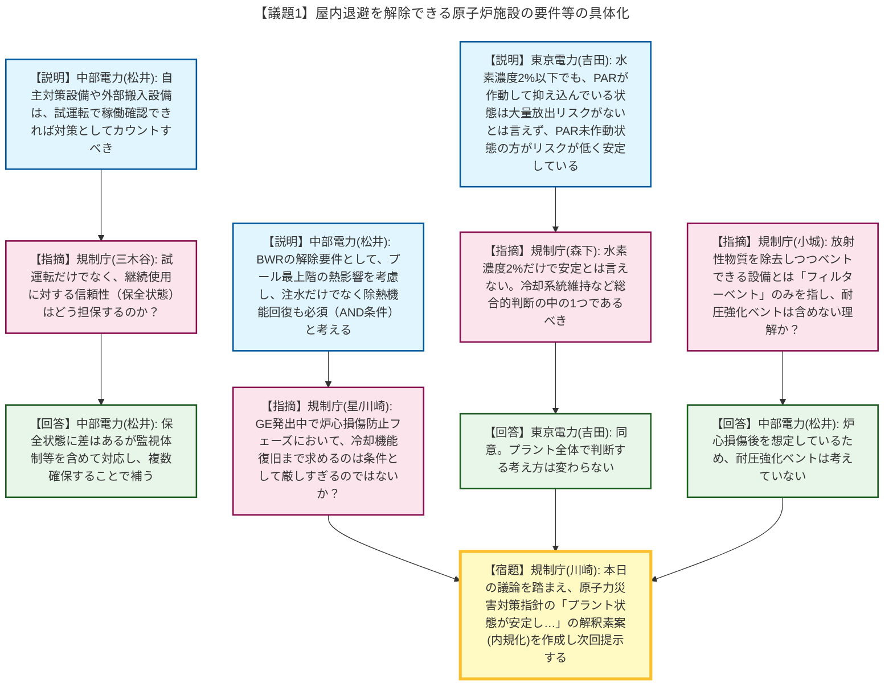
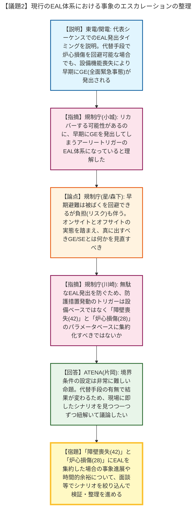

# 第16回緊急時活動レベルの見直し等への対応に係る会合（令和8年5月13日）
> 出典 : https://youtube.com/live/-TcMkGSc3HA?si=4XUPaN9uwc7kMmwI

# 会合の概要
* **屋内退避解除の要件に関する考え方のすり合わせ:** 屋内退避を解除できる原子炉施設の状態（安定状態）について、代替・可搬型設備を対策としてカウントする条件や、BWRにおける除熱機能の必須性、水素濃度（PAR（静的触媒式水素再結合装置）の作動有無）の扱いについて事業者と規制庁の間で認識のすり合わせが行われました。規制庁は本日の議論を踏まえ、原子力災害対策指針の解釈（内規化）に向けた素案を次回提示することとなりました。
* **現行EALの「アーリートリガー」問題の浮き彫り:** BWRおよびPWRの代表的な事故シーケンスにおける事象進展とEAL（緊急時活動レベル）の発出タイミングが整理・報告されました。代替手段により炉心損傷が回避可能なシナリオであっても、設備の機能喪失をトリガーとする現行EAL（GE22等）では早期に全面緊急事態（GE）が発出されてしまう（アーリートリガー）という課題が明確になりました。
* **EAL発出基準の「パラメータベース」への集約化の提案:** 住民に不要な避難リスク（負担）を強いる無駄なEAL発出を防ぐため、規制庁から「防護措置の発動タイミングは、設備ベースではなく、障壁の喪失（42シリーズ）と炉心損傷（28シリーズ）といったパラメータベースを中心に集約化すべきではないか」との強い問題提起がなされ、今後シナリオを絞り込んで検証を進めることで合意しました。

---

# 議題ごとの詳細整理

## 【議題1】屋内退避を解除できる原子炉施設の要件等の具体化
* **議論の背景と論点:** 前回（12月24日）の会合で規制庁から提示された屋内退避解除の要件等の論点に対し、事業者の見解が示されました。許認可を受けていない自主対策・可搬型設備のクレジット（カウント）可否、注水・除熱機能の複数確保の考え方、およびプラント安定状態の判断基準（水素濃度の扱い等）が論点となりました。
* **質疑応答（詳細）:**
    * 【説明者側】中部電力（松井）より、実施体制が整い試運転等で稼働確認できれば、自主対策設備やサイト外からの搬入設備も対策としてカウントするのが合理的であるとの見解が示されました。
    * 【規制側】規制庁（三木谷）は、試運転での担保は理解するが、継続使用に対する信頼性（保全状態）についてはどうかと質問しました。
    * 【説明者側】中部電力（松井）は、保全状態に差はあるが監視体制等を含めて対応し、数（多様性）を揃えることで信頼性を補うと回答しました。
    * 【説明者側】中部電力（松井）は、BWRの解除条件について、燃料プールが最上階にあり除熱喪失で建屋全体の温度が上昇して他のSA設備が機能喪失するリスクがあるため、注水だけでなく「崩壊熱相当の除熱機能の回復」も必須（AND条件）であると説明しました。
    * 【規制側】規制庁（星、川崎）は、炉心損傷防止フェーズでGEが出ている状態において、冷却機能（補機冷等）まで復旧していなければ解除できないとするのは条件として厳しすぎる（多くを求めすぎている）のではないかと懸念を示しました。
    * 【説明者側】中部電力（松井）及び東京電力（吉田）は、水素濃度が2%以下であってもPAR（静的触媒式水素再結合装置）が作動して抑え込んでいる状態は「大量放出リスクがない」とは言い切れず、PARが未作動で設計内に収まっている状態の方がリスクが低い（安定している）と主張しました。
    * 【規制側】規制庁（小城）から、格納容器から放射性物質を除去しつつベントできる設備とは「フィルターベント」を指し、「耐圧強化ベント」は含めないという理解でよいか確認がありました。
    * 【説明者側】中部電力（松井）は、炉心損傷後の想定であるため耐圧強化ベントは考えていないと回答しました。
* **結論と宿題事項（アクションアイテム）:**
    * 【宿題】規制庁（川崎）は、本日の議論を踏まえて原子力災害対策指針の「プラント状態が安定して一定の要件を満たし」という解除要件の解釈素案（内規化）を作成し、次回の会合で提示して合意を目指すこととなりました。

## 【議題2】現行のEAL体系における事象のエスカレーションの整理
* **議論の背景と論点:** 現行のEALが設備の機能喪失をベースとしているため、代替措置で事象が収束に向かう場合でも過剰に早い段階でGE（全面緊急事態）が発出されてしまう「アーリートリガー」の問題が論点となりました。真に必要な住民防護措置発動のタイミングとは何か、EAL体系の集約化に向けた議論が行われました。
* **質疑応答（詳細）:**
    * 【説明者側】東京電力（吉田）及び関西電力（山野）より、BWR（TQUV、SBO等）およびPWR（SBO+シールLOCA、大破断LOCA時再循環喪失等）の代表的な事故シーケンスにおける事象進展とEALの発出タイミングが図示して説明されました。代替設備（低圧代替注水系など）の起動により炉心損傷を回避できるシナリオであっても、GE22（高圧・低圧注水機能喪失）などが早い段階で発出される実態が示されました。
    * 【規制側】規制庁（小城）は、リカバーする可能性があるのに早期にGEを発出してしまうEAL体系になっていることを確認しました。
    * 【規制側】規制庁（森下、星）は、EALは住民防護を迅速に開始する仕組みだが、避難には負担（リスク）も伴うため、本当にGE/SEとして出すべきものはどういうものか、オンサイトとオフサイトの実態を踏まえた合理的なバランスが大事であると指摘しました。
    * 【規制側】規制庁（川崎）は、住民に不必要な負担を与える「無駄なEAL」は発出させたくないと述べ、設備ベースのEAL（GE22, 23等）は警戒事態の入り口としては残すとしても、防護措置発動のトリガーとしては「障壁の喪失（42シリーズ）」と「炉心損傷（28シリーズ）」といったパラメータベースに集約化を図るべきではないかと強い問題提起を行いました。
    * 【説明者側】ATENA（片岡）は、真に出すべきGE/SEの境界条件の設定は非常に難しい命題であるとし、代替手段の有無で結果が変わるため、実際の現場に即したシナリオの進展を見つつ一つずつ紐解きながら議論を進めたいと回答しました。
* **結論と宿題事項（アクションアイテム）:**
    * 【宿題】EALの判断基準を「障壁の喪失（42シリーズ）」と「炉心損傷（28シリーズ）」に集約した場合に、漏れる事象がないか、時間的余裕がどうなるかについて、面談等を通して特定のシナリオに絞り込みながら段階的に検証・整理を進めることとなりました。

---

# 論理構造の可視化（Mermaid）

以下に各議題の議論のフローをMermaid形式で記述します。

