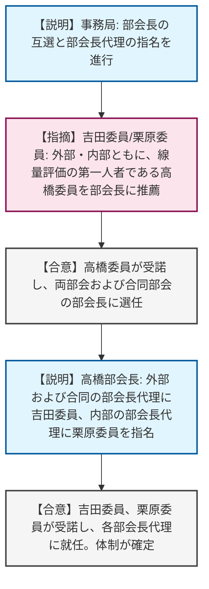
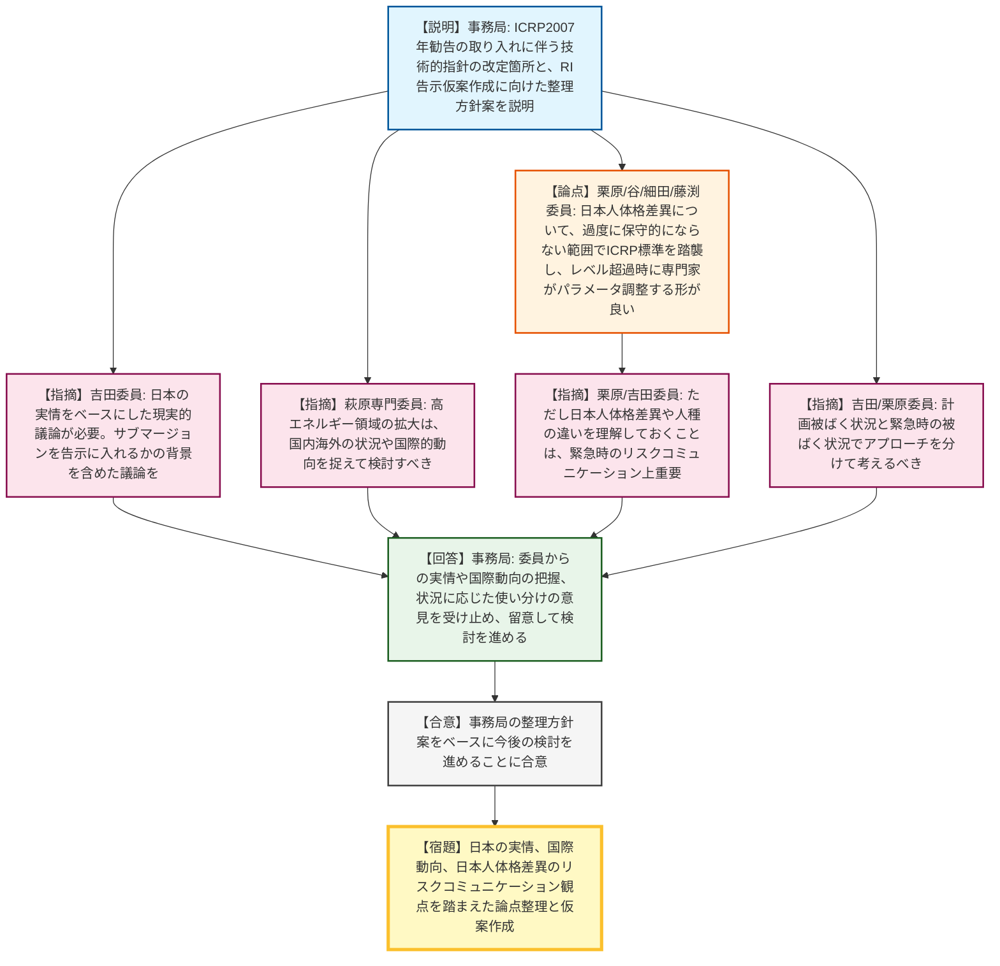
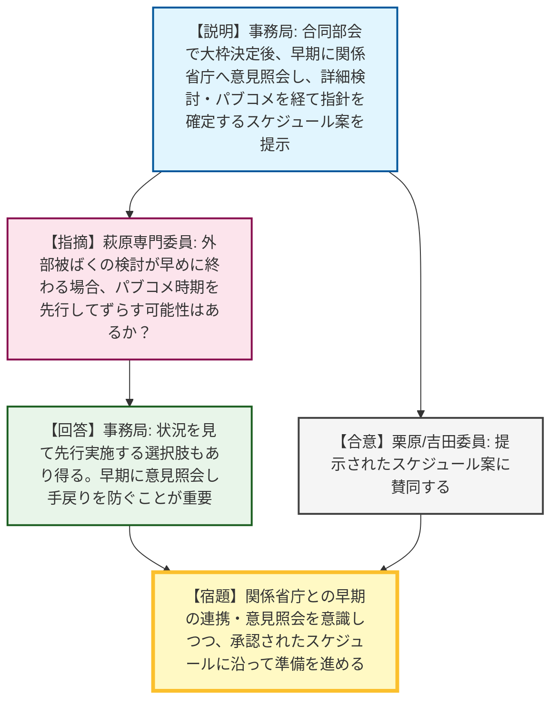

# 第1回放射線審議会外部被ばく・内部被ばくの評価法（実効線量係数等）に係る技術的指針合同検討部会（令和8年5月15日）
> 出典 : https://youtube.com/live/klJUORbptqI?si=aRJU0BS1rDEl_5Ad

# 会合の概要
* **技術的指針合同検討部会の発足と体制確立:** ICRP2007年勧告の法令取り入れに向け、「外部被ばく」および「内部被ばく」の実効線量係数等に係る技術的指針を見直すための新部会が発足し、高橋委員が両部会および合同検討部会の部会長に就任して議論が本格的にスタートしました。
* **日本人体格差異と国際基準踏襲のバランスに関する活発な議論:** RI告示等の基準値算出にあたり、日本人の体格差異をどう扱うかが大きな論点となりました。委員からは、「過度に保守的にならない範囲でICRPの国際的な標準モデル（線量係数）を踏襲し、レベルを超えた場合に専門家が個別のパラメータ調整を行うのが現実的である」との大勢を占める意見が出された一方、「リスクコミュニケーションの観点や、国内で働く外国人労働者の存在を考慮し、差異に関する科学的理解と説明付けは別途整理しておくべき」との重要な指摘がなされ、事務局もこれに同意しました。
* **関係省庁を巻き込んだ実効性のあるスケジュール策定:** 法令改正は規制庁だけでなく多省庁に波及するため、合同部会の早い段階で仮の数値を提示し、関係省庁から実務上の懸念や意見を早期に引き出すという事務局の戦略的なスケジュール案が示されました。委員からも強い賛同が得られ、手戻りを防ぐための計画的な進行が了承されました。

---

# 議題ごとの詳細整理

## 【議題1】部会長の選任及び部会長代理の指名
* **議論の背景と論点:** 新たに設置された「外部被ばく・内部被ばくの評価法（実効線量係数等）に係る技術的指針合同検討部会」および各個別部会の体制構築のため、委員間での部会長の選出と、部会長による部会長代理の指名が行われました。
* **質疑応答（詳細）:**
    * 【説明者側】事務局（森川）より、委員の紹介の後、部会長の互選と部会長代理の指名を進行しました。
    * 【委員側】吉田委員より、外部被ばく部会の部会長として、ICRP2007年勧告の線量評価手法や実効線量係数の第一人者である高橋委員を推薦しました。
    * 【合意】高橋委員がこれを受諾し、外部被ばく部会の部会長に選任されました。
    * 【委員側】高橋部会長より、外部被ばく部会の部会長代理に吉田委員を指名しました。
    * 【合意】吉田委員がこれを受諾しました。
    * 【委員側】栗原委員より、内部被ばく部会の部会長についても同様の理由から高橋委員を推薦しました。
    * 【合意】高橋委員がこれを受諾し、内部被ばく部会の部会長に選任されました。
    * 【委員側】高橋部会長より、内部被ばく部会の部会長代理に栗原委員を指名しました。
    * 【合意】栗原委員がこれを受諾しました。
    * 【合意】事務局（森川）より、両部会の合同検討部会についても高橋委員に部会長を依頼し、部会長代理に吉田委員を指名して全会一致で承認されました。
* **結論と宿題事項（アクションアイテム）:**
    * 高橋委員が合同検討部会および両個別部会の部会長に就任し、吉田委員が外部被ばく部会・合同部会の部会長代理、栗原委員が内部被ばく部会の部会長代理に就任することで体制が確定しました。

## 【議題2】実効線量係数等（ICRP2007年勧告の取り入れ）の検討状況
* **議論の背景と論点:** ICRP2007年勧告の法令取り入れに向け、技術的指針の改定方針と、それに伴うRI告示別表（数量告示）の仮案作成に向けた技術的論点（放射線種・エネルギー範囲の拡大、照射方向、核種・化学形の選定、日本人とICRPモデルの差異等）の事務局の整理方針案の妥当性が問われました。
* **質疑応答（詳細）:**
    * 【説明者側】事務局（鈴木）より、ICRP2007年勧告の公表状況、法令等への影響箇所、技術的指針の改定対象箇所が説明されました。また、RI告示別表の仮案作成に向けた事務局案として、放射線種・エネルギー範囲の追加検討、後方照射（PA）の考慮、日本人体格差異の認識下での現行の導出過程の踏襲等の方針が提示されました。
    * 【委員側】吉田委員より、ICRPは全世界的なものであり、JAEAのヒアリング情報などをベースに日本の実情を認識しながら現実的な議論を進めるべきとの指摘と、サブマージョンによる内部照射データを告示別表に入れるかについて背景を含めた深い議論が必要であると指摘されました。
    * 【委員側】萩原専門委員より、高エネルギー領域の拡大について、国内・海外ともに該当施設が少ない現状を踏まえ、国際的動向を捉えて検討すべきと指摘されました。
    * 【委員側】栗原委員より、これまでの改定経緯を振り返ること、また、公衆の線量係数についてプロスペクティブ（計画的）な評価と事故時の評価を分けて整理すべきと指摘されました。
    * 【委員側】栗原委員より、日本人の体格差異（甲状腺へのヨウ素のアップテイク割合等）について、過度に保守的にならない範囲であれば、法令等の実効線量係数にはICRPの数値を踏襲していくことでよいのではないかとの意見が示されました。
    * 【委員側】谷専門委員より、栗原委員に賛同し、通常は基本値（ICRP値）を用い、レベルを超えた場合に専門家がパラメータを調整して正確な評価を行う形が良いとの意見が示されました。
    * 【委員側】細田専門委員より、両委員に賛同しつつ、日本人による差異の認識については、最新のCT画像解析を用いた呼吸気道関連の論文等を参考に、理由付けの情報として部会で議論してもよいとの意見が示されました。
    * 【委員側】吉田委員より、計画被ばく状況と緊急時の被ばく状況でアプローチを分けて考えるべきとの意見が追加されました。
    * 【委員側】栗原委員より、日本人の感受性・体格差異について理解しておくことは、事故時等におけるリスクコミュニケーションの情報提供として重要であるとの意見が追加されました。
    * 【委員側】吉田委員より、国内の除染等の現場には外国人の作業者も多いため、日本人を対象とした前提だけでは説明が不十分であり、人種による違いの考慮が必要との意見が示されました。
    * 【委員側】藤渕専門委員より、日本人の場合は安全寄りになるが逆の場合も生じ得るため、ICRPの国際的な基準に従う考え方がよいとの意見が示されました。
    * 【説明者側】事務局（黒川課長等）は、委員からの意見（日本の実情や国際動向の把握、状況に応じた使い分け等）を受け止め、指摘された留意点を踏まえて指針の検討・整理を進めると回答しました。
* **結論と宿題事項（アクションアイテム）:**
    * 事務局が提示したRI告示別表の仮案作成に向けた整理方針案は概ね妥当と認められ、今後の検討のベースとすることに合意しました。
    * 【宿題】日本の実情（JAEAのヒアリング等）や国際的動向の反映、サブマージョンの取り扱いの整理、計画被ばくと緊急時被ばくの区別、および日本人体格差異のリスクコミュニケーション上の観点を踏まえて、事務局にて論点整理および仮案の作成を進めること。

## 【議題3】今後の部会予定
* **議論の背景と論点:** 技術的指針の改定および法令改正に向けた、合同検討部会と個別部会の開催スケジュール、関係省庁との意見調整、パブリックコメントの実施時期について、事務局から提案されたスケジュールの妥当性が議論されました。
* **質疑応答（詳細）:**
    * 【説明者側】事務局（鈴木）より、合同部会で大枠を決め、関係省庁へ早期に意見照会を行った後、詳細検討を各部会で進め、パブコメを経て指針を確定・意見具申するという全体のスケジュールイメージが説明されました。
    * 【委員側】栗原委員、吉田委員から、提示されたスケジュール案に賛同する旨が示されました。
    * 【説明者側】事務局（黒川課長）より、関係省庁との接続が重要であり、論点整理後に実務上「困る」と言われる手戻りを防ぐため、早い段階で仮の数字を提示して意見を引き出すことが目的であると補足説明されました。
    * 【委員側】萩原専門委員より、外部被ばくの検討が早めに完了しそうな場合、外部被ばくだけ先にパブコメを実施する可能性はあるかと質問されました。
    * 【説明者側】事務局（黒川課長）は、パブコメがどれくらい集まるかの状況を見て、先行して実施する選択肢もあり得ると回答しました。
* **結論と宿題事項（アクションアイテム）:**
    * 事務局が提示したスケジュールイメージ案について、部会として了承・合意しました。
    * 【宿題】関係省庁との早期の連携・意見照会を意識しつつ、承認されたスケジュールに沿って次回以降の部会の準備を進めること。

---

# 論理構造の可視化（Mermaid）

以下に各議題の議論のフローをMermaid形式で記述します。

