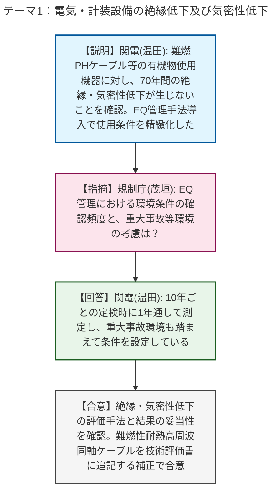
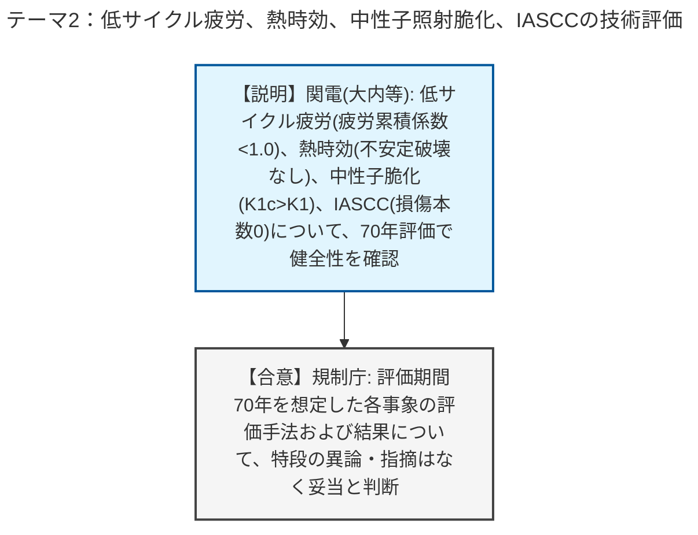
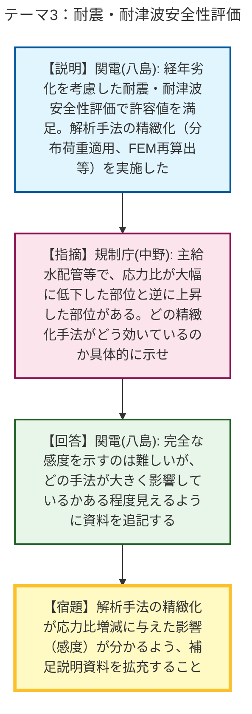
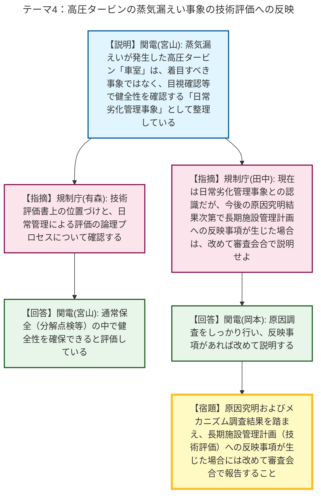

# 第30回実用発電用原子炉の長期施設管理計画等に係る審査会合（令和8年5月18日）
> 出典 : https://youtube.com/live/vkiOiAepp_8?si=Ij3o64z6gpNN8V3N

# 会合の概要
* **高経年化対策に係る技術評価の妥当性の確認:** 美浜3号炉の50年目の長期施設管理計画認可申請に関し、電気・計装設備の絶縁低下や気密性低下、低サイクル疲労、2相ステンレス鋼の熱時効、中性子照射脆化、IASCC（照射誘起型応力腐食割れ）といった主要な経年劣化事象、ならびに耐震・耐津波安全性評価について、事業者の評価手法と結果の妥当性が確認されました。40年目評価や高浜2号炉の先行評価との相違点（評価期間の70年化、EQ管理手法の導入等）についても適切に反映されていることが了承され、審査の技術的な確認は概ね完了の方向へ進みました。
* **解析手法の精緻化に対する説明の充実要求:** 耐震安全性評価において、応力比が従来評価に比べ大幅に低下した部位（主給水系統配管等）と逆に上昇した部位が存在することについて、解析手法の精緻化（分布荷重の適用、サポート剛性の考慮等）がどのように効いているのか、補足説明資料で具体的に感度が見えるよう資料の拡充が求められました。
* **高圧タービンの蒸気漏えい事象（法令報告）と長期施設管理計画への反映:** 先般発生した美浜3号機高圧タービン車室からの蒸気漏えい事象に関し、現在は通常保全（分解点検時の目視確認）で対応する「日常劣化管理事象」として整理されていることが確認されました。規制側より、今後の原因究明やメカニズム調査の結果次第では、高経年化対策上着目すべき事象への格上げなど、長期施設管理計画に反映すべき事項が整理された場合には改めて審査会合で説明するよう厳格に要求され、事業者もこれに合意しました。

---

# 議題ごとの詳細整理

## 【議題1】関西電力（株）美浜発電所3号炉の長期施設管理計画認可申請に係る審査について

### テーマ1：電気・計装設備の絶縁低下及び気密性低下
* **議論の背景と論点:** 美浜3号炉（50年目）の長期施設管理計画において、電気・計装設備を対象とした絶縁低下および気密性低下の技術評価結果が報告されました。EQ（環境認定）管理手法の導入に伴う使用環境条件の見直しや、先行する高浜2号炉との評価結果の差異が論点となりました。
* **質疑応答（詳細）:**
    * 【説明者側】関西電力（温田）より、絶縁材料に有機物を使用する機器（難燃PHケーブルやモジュラー型電気ペネトレーション等）に対し、環境認定試験や点検検査結果から70年の評価期間中に有意な絶縁低下や気密性低下が生じないことを確認した旨が説明されました。また、2018年のEQ管理手法の導入により環境条件を精緻化したことで、既存の40年目評価と使用条件に差異が生じたこと、および高浜2号炉に比べて周囲温度が低いため、ピグテール型電気ペネトレーションの取り替え（追加保全策）は不要と判断したことが報告されました。
    * 【規制側】規制庁（茂垣）から、EQ管理における環境条件の確認頻度と、重大事故等の環境条件を踏まえた確認が行われているか質問がありました。
    * 【説明者側】関西電力（温田）は、環境条件は10年ごとの定期検査時に1年を通して測定し確認していること、また重大事故等の環境も考慮して評価を行っていることを回答しました。
* **結論と宿題事項（アクションアイテム）:**
    * 絶縁低下および気密性低下の評価については妥当性が確認され、特段の追加指摘はありませんでした。補足として、難燃性耐熱高周波同軸ケーブルを技術評価書に追記する補正が行われることが合意されました。

### テーマ2：低サイクル疲労、熱時効、中性子照射脆化、IASCCの技術評価
* **議論の背景と論点:** 主要な経年劣化事象に対する評価期間70年を想定した健全性評価結果が報告されました。各事象の評価手法の妥当性や、運転実績を反映した過渡回数の設定、実測データに基づく評価（K1c曲線の設定等）が論点となりました。
* **質疑応答（詳細）:**
    * 【説明者側】関西電力（大内、松浦、川合、柴垣）より、低サイクル疲労については1.5倍の余裕を考慮した70年時点の評価用過渡回数を設定し疲労累積係数が1.0を下回ること、2相ステンレス鋼の熱時効についてはJ-R曲線を用いて不安定破壊しないこと、中性子照射脆化についてはPTS評価でK1c曲線がK1曲線を上回ること、IASCCについてはバッフルフォーマーボルトの応力履歴が割れ発生応力線を超えず損傷本数がゼロであることが順次説明されました。
    * 【規制側】本テーマに関する質疑では、規制庁から各事象の評価結果に対して特段の異論や追加の指摘は出されず、事業者の評価手法と結論が概ね受け入れられました。
* **結論と宿題事項（アクションアイテム）:**
    * 各技術評価結果について、運転開始後70年時点においても技術基準規則に適合することが確認され、現状の施設管理および第6回監視試験等の追加保全策が妥当と判断されました。

### テーマ3：耐震・耐津波安全性評価
* **議論の背景と論点:** 経年劣化事象（減肉や熱時効等）を考慮した耐震・耐津波安全性評価について説明されました。評価手法の精緻化により、既存の40年目評価と比べて発生応力比に大きな変動が生じている点の根拠説明が論点となりました。
* **質疑応答（詳細）:**
    * 【説明者側】関西電力（八島）より、抽出された経年劣化事象を考慮し、SS1〜24の地震波を用いた耐震安全性評価を実施し許容値を満足したこと、また耐津波安全性評価においてもコンクリート構造物の劣化等は軽微であり適合することを確認した旨が説明されました。また、40年目評価との差異として、地震繰返し回数、分布荷重やサポート剛性の適用、FEMによる応力係数の再算出などの解析手法の精緻化を行ったことが報告されました。
    * 【規制側】規制庁（中野）から、40年目評価と比較して、主給水系統配管の地震時応力比が大幅に低下（0.725→0.041）した一方で、流れ加速型腐食の応力比が上昇（0.575→0.866）している点について、どの精緻化手法がどのように効いているのか、補足説明資料で具体的に分かるように説明を充実させるよう要求されました。
    * 【説明者側】関西電力（八島）は、感度を明確に示すことは難しい部分もあるが、どの手法が大きく影響しているかある程度見えるように資料を追記すると回答しました。
* **結論と宿題事項（アクションアイテム）:**
    * 【宿題】耐震安全性評価において、解析手法の精緻化（分布荷重適用等）が応力比の増減に与えた影響（感度）が具体的に分かるよう、補足説明資料を拡充すること。

### テーマ4：高圧タービンの蒸気漏えい事象の技術評価への反映
* **議論の背景と論点:** 5月8日に発生した美浜3号機高圧タービン車室からの蒸気漏えい（法令報告事象）に関し、当該部位が長期施設管理計画の技術評価においてどのように位置づけられているか、また今後の原因究明結果を受けた反映方針が論点となりました。
* **質疑応答（詳細）:**
    * 【説明者側】関西電力（宮山）より、損傷が確認された高圧タービン「車室」は、高経年化対策上着目すべき事象としては抽出されておらず、内外面の腐食や疲労割れ等を想定した上で、分解点検時の目視確認等により健全性を確認する「日常劣化管理事象」として整理していると説明されました。
    * 【規制側】規制庁（有森）から、技術評価書上での「車室」の位置づけと、日常管理による評価の過程について確認が行われ、説明者（宮山）の回答により、通常保全の中で健全性を確保すると判断されていることが確認されました。
    * 【規制側】規制庁（田中）は、今回の蒸気漏えい事象について、現在は日常劣化管理事象として整理されていると認識した上で、今後の原因究明やメカニズムの調査結果次第では、長期施設管理計画に反映すべき事項（着目すべき事象への格上げ等）が生じる可能性があるため、その場合は改めて審査会合で説明を行うよう厳格に要求しました。
    * 【説明者側】関西電力（岡本）は、原因調査と再発防止対策をしっかり行った上で、長期施設管理計画への反映事項の有無を確認し、必要な内容については改めて説明すると合意しました。
* **結論と宿題事項（アクションアイテム）:**
    * 【宿題】高圧タービンの蒸気漏えい事象の原因究明およびメカニズム調査を実施し、その結果を踏まえて長期施設管理計画（技術評価）への反映事項が整理された場合には、改めて審査会合にて説明すること。
    * 本日の審査会合にて、長期施設管理計画に係る主要な技術評価の説明は一通り完了したと総括され、今後の補足説明資料への反映事項等については事務局のヒアリングで事実確認を継続していく方針が確認されました。

---

# 論理構造の可視化（Mermaid）

以下に各テーマの議論のフローをMermaid形式で記述します。

