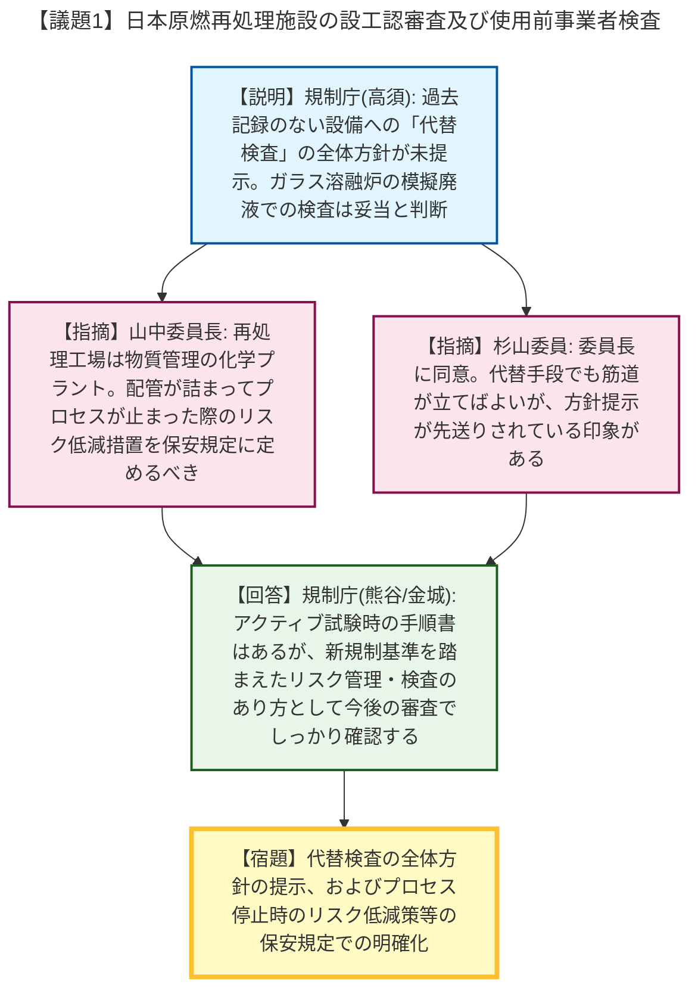
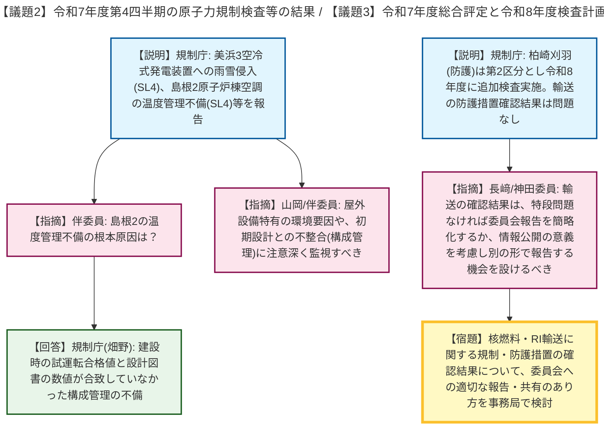
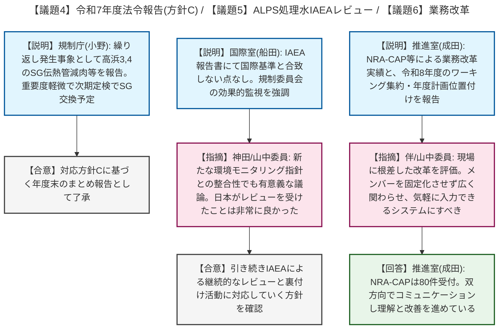

# 第10回原子力規制委員会（令和8年5月20日）
> 出典 : https://youtube.com/live/o7aQPYPo3ng?si=tD6uvHT-5L4fXhk_

# 会合の概要
* **再処理施設特有のリスクへの対応と検査方針:** 日本原燃再処理施設の設工認・使用前検査に関して、山中委員長より「再処理工場はエネルギー管理ではなく大量の放射性物質を扱う化学プラント（物質管理）である」との認識が示され、ガラス溶融炉が詰まった場合の対応など、プロセス停止時のリスク低減策を保安規定に明記するよう強く求められました。
* **原子力規制検査等の結果と今後の計画:** 令和7年度第4四半期の検査結果として、美浜3号機の空冷式発電装置への水分混入事象や、島根2号機の空調温度の構成管理不備などが報告され、屋外環境の盲点や初期設計との不整合に注意を払うよう委員から指摘がありました。また、令和7年度の総合評定と令和8年度検査計画が了承されました。
* **IAEAレビューの成果と業務改革の推進:** ALPS処理水に係るIAEAレビューミッションにおいて、日本の対応が国際基準に合致していることが再確認されました。また、規制庁内の業務改革（NRA-CAP等）について、やらされ感のない現場に根差した取り組みが評価され、今後もメンバーを固定化せず広く参画させる方針が確認されました。

---

# 議題ごとの詳細整理

## 【議題1】日本原燃株式会社再処理施設の設計及び工事の計画の認可に係る審査の状況並びに使用前事業者検査に係る検討状況
* **議論の背景と論点:** 日本原燃の再処理施設について、ガラス溶融炉の検査に模擬廃液を用いた実検査を導入する方針や、過去記録のない設備に対する「代替検査」の考え方、および再処理施設特有のリスク（プロセス停止時の対応等）を保安規定でどう担保するかが論点となりました。
* **質疑応答（詳細）:**
    * 【説明者側】規制庁（高須）より、ガラス溶融炉の漏えい確認には実廃液より浸透しやすい模擬廃液を用いる事業者の判断は妥当とする一方、記録が存在しない設備に対する「代替検査」の全体方針が未提示であるため、引き続き確認していくと報告されました。
    * 【規制側】長﨑委員は、模擬廃液での検査成立は理解しつつも、実廃液での検査など施設全体のリスクを下げる現実的な検査のあり方を検討してほしいと述べました。
    * 【規制側】山中委員長より、再処理工場はエネルギー管理システムではなく物質管理を行う化学プラントであり、漏れがなくても「配管が詰まってプロセスが止まった場合」にどうリスクを低減するのか、その対応を保安規定に定めておく必要があると指摘しました。
    * 【規制側】杉山委員は、山中委員長に同意し、代替手段であっても筋道が立っていれば問題ないが、方針の提示が先送りされている印象があるため早期に示すよう求めました。
* **結論と宿題事項（アクションアイテム）:**
    * 模擬廃液を用いたガラス溶融炉の検査方針は妥当とされました。
    * 【宿題】日本原燃は、代替検査の全体方針を早急に提示すること。また、ガラス溶融炉が詰まった場合のリスク低減措置を含め、保安規定における管理方針を明確化し、今後の審査で確認すること。

## 【議題2】令和7年度第4四半期の原子力規制検査等の結果
* **議論の背景と論点:** 第4四半期の検査において、指摘事項1件（美浜3号機）、深刻度評価のみ1件（島根2号機）、検査継続案件2件が報告され、その根本原因や規制庁の監視のあり方が議論されました。
* **質疑応答（詳細）:**
    * 【説明者側】規制庁（杉立）より、美浜3号機で空冷式非常用発電装置の通気口から雨雪が侵入し自動停止した事象（SL4）、および島根2号機で原子炉棟空調が設計温度（40℃）を超えて管理（50℃）されていた事象（SL4）が報告されました。
    * 【規制側】山岡委員は、屋外環境では想定外の事象（虫の侵入等）が起こり得るため、美浜に限らず屋外設備への注意喚起を要望しました。
    * 【規制側】伴委員は、島根2号機の空調管理不備の根本原因を質問しました。
    * 【説明者側】規制庁（畑野）は、建設当初の試運転時の合格値（50℃）と設計図書（40℃）が合致していなかった「構成管理の不備」であると回答しました。
    * 【規制側】長﨑委員より、大飯3号機の継続案件（CCW冷却器のSA評価漏れ）の状況について質問があり、規制庁（畑野）は、現在SA環境下で当該部位が機能するか評価中であると回答しました。
* **結論と宿題事項（アクションアイテム）:**
    * 報告内容が了承されました。屋外設備特有の環境要因や、初期設計と現場運用の乖離（構成管理不備）について、検査部門として注意深く監視していくことが確認されました。

## 【議題3】令和7年度の原子力規制検査等の結果及び総合的な評定並びに令和8年度の検査計画
* **議論の背景と論点:** 令和7年度の総合評定結果（柏崎刈羽の安全活動は第1区分へ復帰、核物質防護は第2区分）と、それに基づく令和8年度の検査計画、および核燃料物質輸送の防護措置確認結果が報告されました。
* **質疑応答（詳細）:**
    * 【説明者側】規制庁（平野）より、大半が第1区分であること、柏崎刈羽の核物質防護（第2区分）に対しては令和8年度に追加検査を実施すること、福島第一の実施計画検査を見直し「施設管理」の観点を追加したことが報告されました。
    * 【規制側】長﨑委員は、輸送の防護措置確認結果は過去問題がないため、特段問題がなければ事務局で情報管理し、問題発生時のみ委員会へ報告する簡略化を提案しました。
    * 【規制側】神田委員は、輸送の件を規制検査の報告に含めるのは座りが悪いとしつつも、情報公開の意義はあるため、別の形で委員会に取り上げる機会を検討してほしいと要望しました。
* **結論と宿題事項（アクションアイテム）:**
    * 令和7年度の総合評定結果が確認され、令和8年度の検査計画が了承されました。
    * 【宿題】核燃料物質やRIの輸送に関する規制・防護措置の確認結果について、委員会での適切な報告・共有のあり方を事務局で検討すること。

## 【議題4】原子炉等規制法に基づく令和7年度の法令報告（対応マニュアルにより対応方針Cとしたもの）の評価結果
* **議論の背景と論点:** 繰り返し発生し評価済みの事象（対応方針C）として、高浜3,4号機の蒸気発生器（SG）伝熱管の減肉・損傷等の年度まとめが報告されました。
* **質疑応答（詳細）:**
    * 【説明者側】規制庁（小野）より、高浜3,4号機においてスケール（異物）挟み込みによる外面からの減肉や管板拡管部の応力腐食割れが発生したが、重要度は軽微（INES 0）であり、両機とも次期定検でSG交換予定であることが報告されました。
* **結論と宿題事項（アクションアイテム）:**
    * 本件は対応方針Cに基づく年度末のまとめ報告として了承されました。

## 【議題5】ALPS処理水の海洋放出に関するIAEAレビューミッションの報告書（海洋放出後第5回）
* **議論の背景と論点:** 4月に公表されたIAEAタスクフォースによるALPS処理水海洋放出の第5回レビューミッション報告書の概要が報告されました。
* **質疑応答（詳細）:**
    * 【説明者側】国際室（船田）より、国際安全基準と合致しない点はいかなる点も確認されず、規制委員会の効果的な監視が強調されたことが報告されました。
    * 【規制側】神田委員は、2025年に更新されたIAEAの環境モニタリング安全指針など、新たな枠組みとの整合性という観点でも有意義な議論がなされたと補足しました。
    * 【規制側】山中委員長は、グロッシー事務局長とも面会し、日本がこのレビューを受けたことは非常に良かったとのコメントを得たことを紹介しました。
* **結論と宿題事項（アクションアイテム）:**
    * 報告内容が了承され、引き続きIAEAによる継続的なレビューと裏付け活動に対応していく方針が確認されました。

## 【議題6】原子力規制庁における業務改革の取組状況
* **議論の背景と論点:** 規制庁職員の働きやすさや業務効率化を目指す業務改革の令和7年度の活動実績と、令和8年度の方向性が報告されました。
* **質疑応答（詳細）:**
    * 【説明者側】業務改革推進室（成田）より、フリーアドレス拡大、NRA-CAP（意見投稿制度）、生成AI利用、国会業務効率化などの実績と、令和8年度はワーキングを3つに集約し年度業務計画に位置付けて推進することが報告されました。
    * 【規制側】伴委員は、他組織の真似ではない現場に根差した改革を評価し、メンバーが固定化して疲弊したり周囲とギャップが生じないよう、広く関わらせるべきと助言しました。
    * 【規制側】山中委員長より、NRA-CAPの機能状況について質問があり、成田室長は累計80件程度を受け付け、制約がある場合も双方向でコミュニケーションをとり理解と改善を進めていると回答しました。
* **結論と宿題事項（アクションアイテム）:**
    * 報告内容が了承され、引き続き現場の声を反映した業務改革を推進し、気軽に入力できるシステムへの改善を図ることが確認されました。

---

# 論理構造の可視化（Mermaid）

以下に各議題の議論のフローをMermaid形式で記述します。

