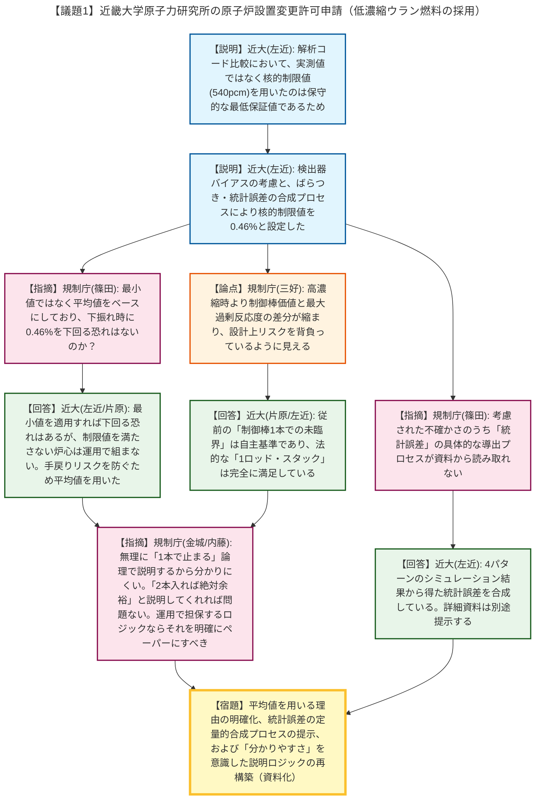

# 第582回核燃料施設等の新規制基準適合性に係る審査会合（令和8年5月20日）
> 出典 : https://youtube.com/live/rVUsePai1mA?si=VuD7kAqFdMvsC9-d

# 会合の概要
* **核的制限値の決定プロセスにおける説明の論理構成の再構築要求:** 規制庁側は、近畿大学が低濃縮ウラン炉心の核的制限値（制御棒反応度価値など）を設定する際、実測データにおける下振れ（最小値）ではなく平均値をベースにしている点について、「安全裕度を証明する許認可のフェーズ」において保守的な最小値を用いない理由が資料から読み取れないと厳しく指摘しました。これに対し近畿大学は、「平均値をベースに設定した上で、それを満たさない炉心は組まないよう運用で担保する」との方針を口頭で説明しましたが、規制庁は、その考え方を申請書や補足説明資料に論理立てて明記し、誰が読んでも納得できる「分かりやすさ」を確保するよう強く求めました。
* **解析の不確かさ（統計誤差等）の定量的根拠の提示要求:** 制御棒反応度価値の評価に用いられたMCNP等の解析結果に関し、測定値のばらつきと新たに導入された「統計誤差」の合成プロセスについて、定量的な導出根拠（低濃縮炉心における具体的な統計誤差の値など）が資料に示されていないことが問題視されました。規制庁は、この不確かさの合成プロセスを明確に記した資料を提出し、事実確認を受けるよう指示しました。
* **今後の審査方針の確認:** 次回以降の審査会合では、竜巻影響評価（第6条）などの主要条文に焦点を当てる一方、それ以外の条文については提出済みの申請書や資料に基づく事務局（規制庁）の事実確認を基本とし、必要に応じてヒアリングを実施して効率的に審査を進める方針が再確認されました。

---

# 議題ごとの詳細整理

## 【議題1】近畿大学原子力研究所の原子炉設置変更許可申請について

* **議論の背景と論点:** 前回（第2回）の審査会合での指摘事項19件に対する回答が議論されました。特に、高濃縮ウラン炉心から低濃縮ウラン炉心への移行に伴う「核的制限値（制御棒反応度価値、過剰反応度、停止余裕等）の設定の考え方」と、それに伴う「解析の不確かさ（バイアス、統計誤差の合成）の取り扱い」が主要な論点となりました。

* **質疑応答（詳細）:**
  * **＜第13条第1項（解析コード比較のパラメータ妥当性）＞**
    * 【説明者側】近畿大学（左近）より、2つの解析モデルの比較において、実測値ではなく核的制限値（540pcm）を用いた理由が説明されました。「保守的な最低保証値であること」に加え、実測値を用いた場合との感度解析で最大差異が0.6%と十分に小さいことから妥当であると回答しました。

  * **＜第15条第2項（不確かさの合成と核的制限値の設定プロセス）＞**
    * 【説明者側】近畿大学（片原・左近）より、検出器バイアス（位置による測定差異約4%）の考慮方法と、方向性のある誤差（単純加算）と広がりのある誤差（統計誤差等）の合成プロセスについて説明されました。
    * 【規制側】規制庁（篠田）は、核的制限値（0.46%）を設定する際、実測値の最小値ではなく平均値を用いている点に疑問を呈し、「下振れした際に0.46%を下回る（460pcmを下回る）可能性がないか」と質問しました。
    * 【説明者側】近畿大学（左近）は、「最小値をそのまま適用すれば下回る恐れはある」と認めた上で、特定の制御棒の価値が下がれば相対的に別の制御棒の価値が上がるバランスの変動であるため、0.46%を満たさない炉心は組まない（運用で制限する）方針であると回答しました。
    * 【規制側】規制庁（篠田）は、運用の考え方は理解できるが、許可段階の炉心評価としては、実測値のばらつきを考慮しても制限値を満足するという結果を設計（解析）として示すべきではないかと指摘しました。
    * 【説明者側】近畿大学（片原）は、小規模な研究炉であり実用炉のような豊富な燃焼履歴データがないため、許可や設工認の段階で極端に厳しい機械的な制限（最小値ベース）をかけると、いざ実機を組んだ際に「未臨界実験装置」となってしまい許可からやり直す手戻りリスクを最も恐れており、そのため平均値を用いていると本音を語りました。
    * 【規制側】規制庁（金城）は、研究炉の特性と「運用で担保する」という論理は理解できるが、口頭だけでは難しいため、なぜ最小値ではなく平均値を用いるのか、紙に整理して論理構築するよう求めました。
    * 【規制側】規制庁（内藤）は、さらに踏み込んで、「臨界させる炉心を組む前提で設定値を作り、設計上の話ではなく運用上の制限として担保する」というロジックなのであれば、その考え方を明確にペーパーにすべきだと指摘しました。
    * 【規制側】規制庁（三好）は、高濃縮時は「制御棒1本の価値（0.54%）＞最大過剰反応度（0.5%）」と余裕があったが、低濃縮時は「制御棒価値（0.46%）≒最大過剰反応度（0.45%）」と差分が縮まっており、設計上リスクを背負っているように見えると懸念を示しました。
    * 【説明者側】近畿大学（片原・左近）は、自主的基準として「制御棒1本での未臨界（ワンロッド・スタック・マージン以上の厳しさ）」を担保してきたが、低濃縮炉心でも法的な「1ロッド・スタック（最大反応度制御棒1本固着時の停止余裕）」は完全に満足しており、停止能力が不十分になったわけではないと反論・説明しました。
    * 【規制側】規制庁（金城）は、安全上の要求である「1ロッド・スタック」を満たしていれば規制上問題ないとした上で、無理に「1本で止まる」という自主基準で説明しきろうとするから分かりにくくなっている。「最悪の組み合わせでも2本入れば絶対余裕です」と明確に言ってもらえれば規制側は何の問題もないとし、世間に対する分かりやすさを含めて説明ロジックを再検討するよう強く指導しました。

  * **＜統計誤差の導出と合成の根拠＞**
    * 【規制側】規制庁（篠田）は、考慮された不確かさのうち「統計誤差」について、具体的な導出プロセス（低濃縮炉心の具体的な統計誤差の値など）が資料から読み取れないため、詳細な説明を求めました。
    * 【説明者側】近畿大学（左近）は、低濃縮炉心における4パターンのシミュレーション計算結果から得られた統計誤差と、高濃縮炉心の統計誤差を合成していると口頭で説明し、詳細な資料は別途準備しているため今後提示すると回答しました。

* **結論と宿題事項（アクションアイテム）:**
  * 【宿題】核的制限値の決定プロセスにおいて、最小値ではなく平均値を用いる理由と、不確かさ（統計誤差等）の定量的な合成プロセスを明確に整理し、申請書および補足説明資料に論理立てて記載すること（事務局ヒアリングにて事実確認を実施）。
  * 【宿題】次回審査会合に向けて、第6条（竜巻影響評価）などの主要条文の準備を進めること。それ以外の条文については提出資料に基づく事務局確認を基本とする。

---

# 論理構造の可視化（Mermaid）

以下に本議題の議論のフローをMermaid形式で記述します。

