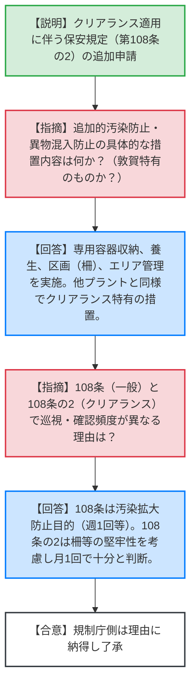
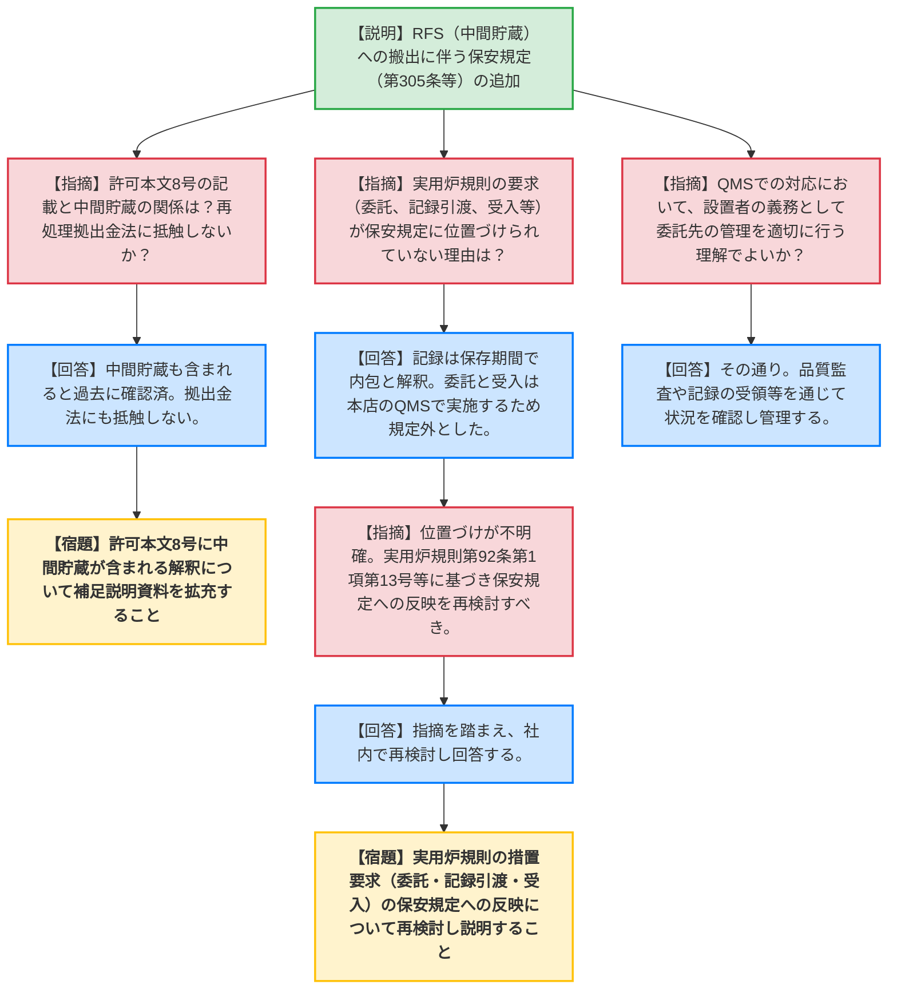
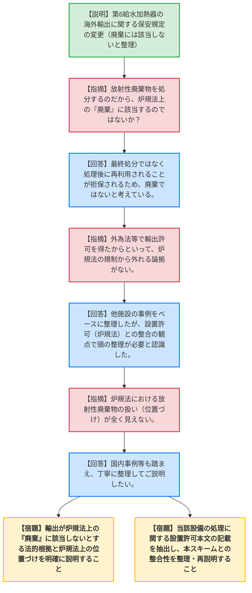

# 第1409回原子力発電所の新規制基準適合性に係る審査会合（令和8年5月21日）
> 出典 : https://youtube.com/live/h7ud_oeb16Y?si=64kK7-WHOA1S2LMl

# 会合の概要
* **最大の争点:** 東海第二発電所の第6給水加熱器（放射性廃棄物）の海外輸出に伴う炉規法上の位置づけ。「輸出により再利用されるため炉規法上の『廃棄』に該当しない」とする事業者側の主張に対し、規制庁側は「他法令（外為法等）で許可を得ても炉規法の規制から外れる理由にはならない」と強く反発し、根本的な法解釈の乖離が露呈した。
* **審査の進捗状況:** 敦賀1号炉のクリアランス制度適用に伴う保安規定変更については、措置内容の妥当性が確認され、概ね了承された。一方、使用済燃料のRFS（リサイクル燃料貯蔵株式会社）への搬出および第6給水加熱器の輸出については、法令要求の保安規定への取り込み不足や許可との整合性において複数の疑義が呈され、次回以降へ持ち越しとなった。
* **特筆すべき決定事項:** 第6給水加熱器の輸出スキームについて、事業者は「軽水炉として初の試み」として他施設の事例をベースに説明を試みたが、規制庁からは「国境を越えるからといってリスクは変わらず、炉規法上の扱いが不明確」と厳しく指摘され、設置許可要件を含めた抜本的な整理・再構築が命じられた。

---

# 議題ごとの詳細整理

## 【議題1】敦賀1号炉のクリアランス制度適用に伴う変更
* **議論の背景と論点:**
  敦賀1号炉におけるクリアランス制度適用の第一段階認可に伴い、水圧制御ユニットアキュムレータ（36体）の測定評価・保管管理に必要な措置（追加的汚染防止、異物混入防止等）を保安規定（第108条の2）に新設するにあたり、その具体的な運用方法と妥当性が論点となった。

* **質疑応答（詳細）:**
    * **【説明者側】（原電 浜松）:** クリアランス対象物の適切な取り扱いを定めた認可方法を満足するよう、保安規定に第108条の2（測定評価・保管管理等）を追加する。
    * **【規制側】（規制庁 中野）:** 108条の2で規定される「追加的な汚染を防止する措置」「異物の混入を防止する措置」とは具体的にどのようなものか。敦賀特有の措置はあるか。また、これらはクリアランス対象物特有の措置か。
    * **【説明者側】（原電 浜松）:** 異物混入防止は専用保管容器への収納や柵による区画を実施する。追加汚染防止は対象物の養生や専用運搬容器の使用、エリア管理を徹底する。他プラントと同様であり、クリアランス特有の措置である。
    * **【規制側】（規制庁 中野）:** 108条（一般の固体廃棄物）では巡視頻度が「週1回」、保管量確認が「3ヶ月に1回」となっているが、108条の2（クリアランス）では保管状況確認が「1ヶ月に1回」と異なる。この理由とタイミングの違いはなぜか。
    * **【説明者側】（原電 浜松）:** 108条は汚染拡大防止の観点から頻度を設定している。一方、108条の2は異物混入・追加汚染防止の観点であり、区画用の柵などは直ちに破損するものではないため「1ヶ月に1回」で十分と判断した。保管量も被ばく線量評価の観点から要領を設定している。
    * **【規制側】（規制庁 中野）:** （理由について納得し）了解した。

* **結論と宿題事項（アクションアイテム）:**
    * クリアランス制度適用に伴う保安規定変更（第108条の2の追加等）については、規制庁の懸念が払拭され、その内容で妥当と了承された。宿題事項はなし。

---

## 【議題2】敦賀2号炉及び東海第二発電所の使用済燃料のRFSにおける貯蔵に伴う変更
* **議論の背景と論点:**
  2027年度に予定されている使用済燃料の中間貯蔵施設（RFS）への搬出に向けて、保安規定に「発電所外における貯蔵」の規定を追加するにあたり、既存の設置許可本文の記載との整合性や、実用炉規則が求める措置要求（委託、記録の引き渡し、受入等）の保安規定への位置づけ不足が論点となった。

* **質疑応答（詳細）:**
    * **【説明者側】（原電 杉原）:** RFSへの使用済燃料の搬出に伴い、保安規定第305条に発電所外における貯蔵の項目を追加し、第341条にRFSへ引き渡す記録の項目を追記する。
    * **【規制側】（規制庁 小野）:** 許可本文8号の「再処理事業者に引き渡されるまでの間、適切に貯蔵管理する」との記載について、中間貯蔵はどう解釈されるか。また、再処理等拠出金法に抵触しないか。
    * **【説明者側】（原電 杉原/中西）:** 過去の使用済燃料再処理機構設立に伴う変更申請時に、本文8号の貯蔵管理には「中間貯蔵も含まれる」と確認されている。再処理等拠出金法にも抵触しない。
    * **【規制側】（規制庁 小野）:** その経緯や解釈について、補足説明資料の記載を拡充してほしい。
    * **【規制側】（規制庁 小野）:** 実用炉規則第89条第2項の要求のうち、第1号（委託）、第4号（記録の引き渡し）、第5号（貯蔵終了後の受入）が保安規定に位置づけられていない理由は何か。中間貯蔵施設から再処理施設以外への搬出は想定されるか。
    * **【説明者側】（原電 杉原）:** 第4号は第341条（記録の保存期間）に含まれると解釈している。第1号と第5号は本店の品質マネジメントシステム（QMS）に基づき実施するため、発電所の保安規定（第305条）には追加しない方針である。搬出先は再処理施設を前提としており、それ以外は想定していない（異常時は関係者と協議する）。
    * **【規制側】（規制庁 小野）:** 第341条は保存期間を規定しているだけで「引き渡し」自体が明文化されておらず、第1号・第4号・第5号の保安規定上の位置づけが不明確である。実用炉規則第92条第1項第13号（事業所の外における貯蔵等）に該当するものとして、保安規定への反映を再検討すべきではないか。
    * **【説明者側】（原電 中西）:** 指摘を踏まえ、再度社内で検討の上、回答する。
    * **【規制側】（規制庁 西崎）:** 「QMSに基づき委託する」というが、設置者の義務（許可本文8号）として、委託先（RFS）での適切な貯蔵管理を設置者側が管理していく（品質監査や記録の確認を行う）という理解でよいか。
    * **【説明者側】（原電 中西）:** その通り。すべて任せるのではなく、RFSの品質保証活動を品質監査で確認し、定期的に記録を受領して状況を確認する。

* **結論と宿題事項（アクションアイテム）:**
    * **【宿題】** 許可本文8号（使用済燃料の適切な貯蔵管理）に「中間貯蔵」が含まれる旨の解釈について、補足説明資料の記載を拡充すること。
    * **【宿題】** 実用炉規則に基づく措置要求（第1号：貯蔵の委託、第4号：記録の引き渡し、第5号：貯蔵終了後の確実な受入）について、QMS等に委ねるのではなく保安規定に明確に位置づけるよう再検討し、次回会合で説明すること。

---

## 【議題3】東海第二発電所の第6給水加熱器の輸出に係る変更
* **議論の背景と論点:**
  東海第二発電所の第6給水加熱器（放射性廃棄物）を海外（アメリカ）へ輸出・処理・再利用するにあたり、事業者が「外為法等の新制度に基づく輸出であり、炉規法上の『廃棄』には該当しない」と整理したことに対し、規制庁が「他法令の許可と炉規法上のリスク管理は別次元である」として整合性を厳しく問いただした。

* **質疑応答（詳細）:**
    * **【説明者側】（原電 中野）:** 放射性廃棄物に対する輸出が制度化されたことを受け、第6給水加熱器を海外処理・再利用のために輸出する。これは「事業所の外における廃棄」に該当しないため、保安規定に輸出に関するプロセス（第14項）を新設する。
    * **【規制側】（規制庁 片桐）:** 放射性廃棄物を処理して処分しようとしているのだから、炉規法上は明らかに「廃棄」に該当するのではないか。「廃棄に該当しない」とするのは一貫性がない。
    * **【説明者側】（原電 中野）:** 最終処分を目的とした輸出承認はない。相手国で処理後、再利用されることが担保されているため、「廃棄ではない」と考えている。
    * **【規制側】（規制庁 片桐）:** 処理する行為自体が廃棄に該当する懸念がある。設置許可本文にある「必要に応じて廃棄事業者の廃棄施設へ廃棄する」等の記載の考え方を含め、論理を丁寧に整理して資料化すること。
    * **【規制側】（規制庁 西崎）:** 外為法（輸出貿易管理令）で輸出許可を得たからといって、炉規法上の規制から外れるルールはない。国境を越えようとリスクは変わらず、炉規法上の「廃棄」に当たらないとする論拠が不明である。明確に説明せよ。
    * **【説明者側】（原電 大平）:** 今回のスキームは軽水炉では初だが、他施設での実績や審査状況をベースに構築した。指摘の通り、設置許可（炉規法）との整合の観点で頭の整理が必要と受け止めた。
    * **【規制側】（規制庁 近城・西崎）:** 炉規法上の位置づけ（どの規定を適用して動かすのか）が全く見えない。国内でのリサイクル事業でも「廃棄の事業許可」が必要である。他のプラントや他施設の議論もよく研究し、共通認識を持てるよう整理すること。

* **結論と宿題事項（アクションアイテム）:**
    * **【宿題】** 海外輸出に伴う取り扱いが、炉規法上の「廃棄」に該当しないとする法的な根拠を明確にし、事業所外への搬出に関する炉規法上の位置づけを論理的に説明すること。
    * **【宿題】** 当該設備の処理に関する「設置許可本文」の記載内容を網羅的に抽出し、本スキームとの整合性や解釈を整理したうえで、次回会合にて再説明すること。

---

# 論理構造の可視化（Mermaid）

## 【議題1】敦賀1号炉のクリアランス制度適用に伴う変更

## 【議題2】敦賀2号炉及び東海第二発電所の使用済燃料のRFSにおける貯蔵に伴う変更

## 【議題3】東海第二発電所の第6給水加熱器の輸出に係る変更

