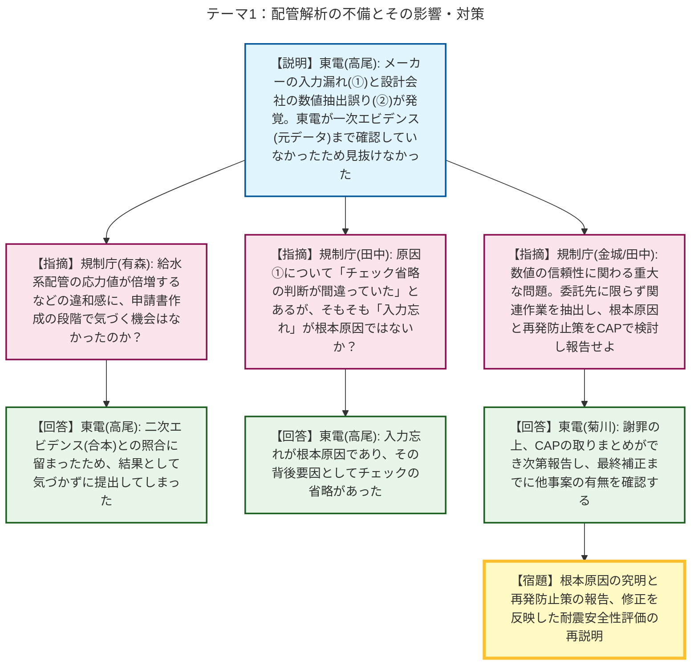
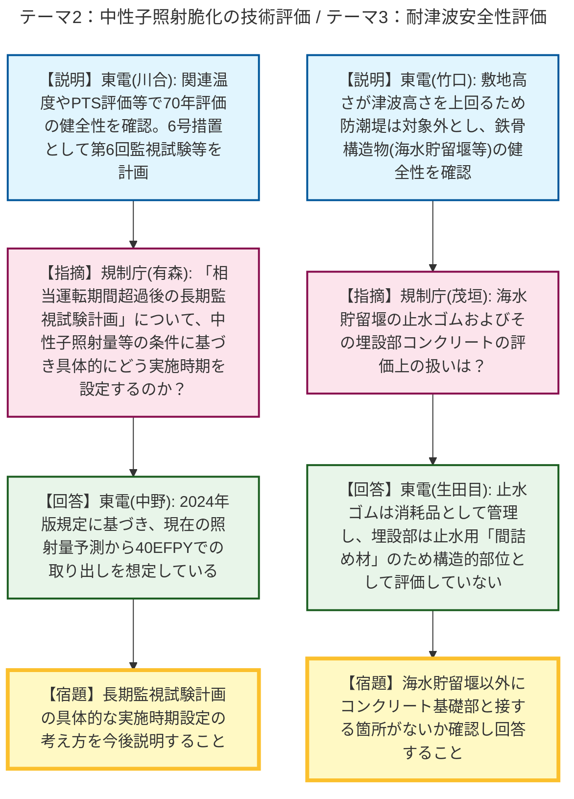
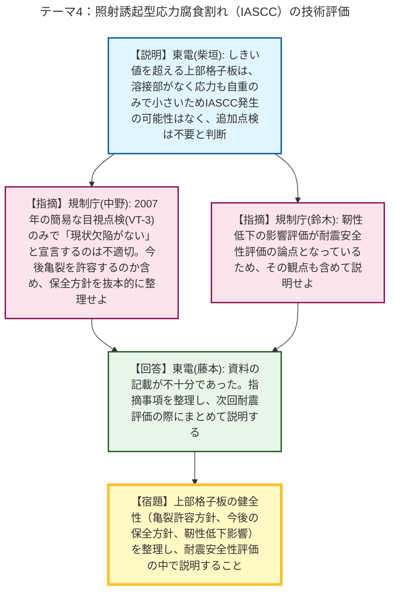

# 第31回実用発電用原子炉の長期施設管理計画等に係る審査会合（令和8年5月21日）
> 出典 : https://youtube.com/live/ywIxaMkjgWM?si=Bq3RrP7gQMEim0ll

# 会合の概要
* **配管解析における初歩的ミスと品質管理の不備の露呈:** 柏崎刈羽6号炉の耐震安全性評価において、メーカーへの入力条件（配管減肉条件）の伝達漏れや、設計会社による数値の抽出誤りといった複数の初歩的なミスが発覚し、申請書の修正を余儀なくされました。東京電力が一次エビデンス（元データ）まで踏み込んだ確認を省略していたことが根本原因であり、規制側から「数値の信頼性に関わる重大な問題」として、委託先管理を含めた再発防止策と原因究明を厳しく要求されました。
* **IASCC評価における上部格子板の健全性確認への懸念:** 照射誘起型応力腐食割れ（IASCC）の評価において、上部格子板に対し20年近く前の不十分な目視点検（VT-3）のみで「発生の可能性がない」と結論づけている点に規制側が強く懸念を示しました。耐震評価（靭性低下）とも関連する重要な部位であるため、亀裂を許容するのか否かを含め、今後の保全方針を抜本的に再整理するよう宿題が課されました。
* **各事象の技術評価の進捗と耐震・耐津波評価への接続:** 中性子照射脆化に関する監視試験の時期設定（長期監視試験計画への移行）や、耐津波評価における止水ゴム（まづめ材）の取り扱いなどについて、詳細な確認が行われました。これらの確認事項と配管解析の不備修正を踏まえ、次回以降の「耐震安全性評価」本審査へ向けた準備を整えることが確認されました。

---

# 議題ごとの詳細整理

## 【議題1】東京電力ホールディングス（株）柏崎刈羽原子力発電所6号炉の長期施設管理計画認可申請に係る審査について

### テーマ1：配管解析の不備とその影響・対策
* **議論の背景と論点:** 長期施設管理計画認可申請書の耐震安全性評価において、メーカーによる入力条件の誤りと、設計会社による数値抽出の誤りという2件の不備が発覚し、申請書の修正が必要となりました。東京電力の委託先管理とチェック体制（一次エビデンスの確認省略）が主な論点となりました。
* **質疑応答（詳細）:**
    * 【説明者側】東京電力（高尾）より、事象①（メーカーの入力誤り：配管減肉条件の反映漏れ等）および事象②（設計会社による1次+2次応力の抽出誤り）について報告されました。事象①は、新規制基準モデルを流用したため部品形状の変更がないと誤認し、図面との照合を省略したことが原因。事象②は、複数結果の合本作業中のチェック漏れであり、東京電力が一次エビデンスまで遡って確認していなかったため見抜けなかったと説明されました。いずれも再解析の結果、許容応力を下回り評価結果自体に変更はないと報告されました。
    * 【規制側】規制庁（有森）から、事象①について、そもそも入力の段階で図面との照合を省略していたのか確認がありました。
    * 【説明者側】東京電力（高尾）は、入力時も照合を省略していたと回答しました。
    * 【規制側】規制庁（有森）から、事象②に関して、東京電力自身が設計会社と同じように複数評価を取りまとめる合本作業を行っており、そこに同様の不備はないか確認がありました。
    * 【説明者側】東京電力（高尾）は、合本は設計会社が行っており、東京電力はその結果（二次エビデンス）を申請書に転記する際の照合のみを行っていたため、事象②のようなエラーが発生したと回答しました。
    * 【規制側】規制庁（有森）は、他の事象（コンクリートや熱時効等）の評価書において「解析がなく影響なし」としている部分について、事象②のような合本作業に伴う類似の不備がないことは一次エビデンスまで戻って確認したのか問いました。
    * 【説明者側】東京電力（高尾）は、他の評価書については図面等の一次エビデンスまで確認して作成しているため影響はないと回答しました。
    * 【規制側】規制庁（有森）は、修正箇所のうち給水系配管の応力値が倍増（218→436）しているが、申請書提出時にこの数値の違和感に気づく機会はなかったのか確認しました。
    * 【説明者側】東京電力（高尾）は、二次エビデンスとの照合に留まったため、結果として気付かず提出してしまったと認めました。
    * 【規制側】規制庁（田中）から、事象①の原因について「省略する判断が間違っていた」とされているが、そもそも「数値を入れ忘れた（入力漏れ）」ことが根本原因ではないかと厳しく指摘されました。
    * 【説明者側】東京電力（高尾）は、入力忘れが根本原因であり、その背後要因としてチェックの省略があったと回答しました。
    * 【規制側】規制庁（田中、金城）は、数値の信頼性に関わる重大な問題であるとし、委託先に限らず関連作業を抽出し、根本原因と再発防止対策をCAP（是正処置プログラム）で検討し、まとまり次第報告するよう強く要求しました。
    * 【説明者側】東京電力（菊川）は、深く謝罪した上で、CAP活動の取りまとめができ次第報告し、最終補正までに他事案の有無を確認すると合意しました。

### テーマ2：中性子照射脆化の技術評価
* **議論の背景と論点:** 評価期間70年を想定した原子炉圧力容器の中性子照射脆化について、監視試験結果や関連温度、上部棚吸収エネルギー、PTS評価結果の妥当性が議論されました。特に、運転開始後60年以降（相当運転期間超過後）の監視試験の扱い（長期監視試験計画への移行）が論点となりました。
* **質疑応答（詳細）:**
    * 【説明者側】東京電力（川合）より、円筒胴等を対象とした評価で、関連温度移行量が国内脆化予測法の範囲内にあること、上部棚吸収エネルギーが68J以上であること、PTS評価（K1c>K1）を満足すること等から、技術基準に適合している旨が説明されました。
    * 【規制側】規制庁（有森）から、6号措置の中で「相当運転期間（32EFPY）を超えて運転する場合は長期監視試験計画へ移行する」とあるが、中性子照射量等の条件に基づいて具体的にどのように実施時期を設定するのか説明を求められました。
    * 【説明者側】東京電力（中野）は、JEAC4201の2024年版規定に基づき、現在の照射量予測からすると40EFPYで取り出す想定であると回答しました。
    * 【規制側】規制庁（有森）は、照射量がどの値を上回った場合にどの時期に実施するのか等、「長期監視試験計画」の具体的な内容について今後説明するよう求めました。
    * 【説明者側】東京電力（中野）は承知したと回答しました。

### テーマ3：耐津波安全性評価
* **議論の背景と論点:** 基準津波（TMSL+8.3m）を踏まえた浸水防護施設の健全性評価について、経年劣化事象（鉄骨の腐食等）を考慮した評価が行われました。海水貯留堰における止水ゴムの扱いが論点となりました。
* **質疑応答（詳細）:**
    * 【説明者側】東京電力（竹口）より、敷地高さ（TMSL+12m）が津波高さを上回るため防潮堤は評価対象外とし、鉄骨構造物（海水貯留堰等）の腐食等について評価し健全性を確認したことが説明されました。
    * 【規制側】規制庁（茂垣）から、海水貯留堰の「止水ゴム」について、抽出フローの中でどのように評価しているか質問がありました。
    * 【説明者側】東京電力（生田目）は、止水ゴムは消耗品として施設管理（交換等）を行っている状態であり、構造的な評価対象からは除外していると回答しました。
    * 【規制側】規制庁（茂垣）から、止水ゴムの埋設部のコンクリートについて、評価対象となるコンクリート構造物がないとされているが、どのように評価しているか質問がありました。
    * 【説明者側】東京電力（生田目）は、止水のための「間詰め材」であるため構造的な部位とは認識していないと回答しました。
    * 【規制側】規制庁（茂垣）は、間詰め材としての評価であると理解した上で、海水貯留堰の他にコンクリート基礎部と接している箇所がないか、ある場合は評価の必要性を後日確認して回答するよう求めました。
    * 【説明者側】東京電力（生田目）は、後日確認して回答すると合意しました。

### テーマ4：照射誘起型応力腐食割れ（IASCC）の技術評価
* **議論の背景と論点:** 炉内構造物に対するIASCCの発生可能性と健全性評価が議論されました。特に、IASCCのしきい値を超えると予測された「上部格子板」に対する現状の保全内容（20年近く前のVT-3のみ）の妥当性が厳しく問われました。
* **質疑応答（詳細）:**
    * 【説明者側】東京電力（柴垣）より、炉心シュラウドと上部格子板がIASCC発生しきい値を超えるが、シュラウドは溶接部の応力改善（ピーニング等）を実施済であり、上部格子板（グリッドプレート）は溶接部がなく応力も自重のみで小さいため、発生の可能性はないと判断し、追加のMVT-1（目視点検）等は計画していないと説明されました。
    * 【規制側】規制庁（中野）は、上部格子板の現状保全が2007年のVT-3（欠陥が詳細に見える検査ではない）のみであり、「現状で欠陥がない」と宣言できる状態ではないと厳しく指摘しました。その上で、今後の耐震評価等も含め、上部格子板に対して「亀裂を許容するのかしないのか」、今後の保全方針をどうするのか抜本的に整理して説明するよう強く要求しました。
    * 【規制側】規制庁（鈴木）も、靭性低下の影響評価が耐震安全性評価の論点となっているため、その観点も含めて次回説明するよう念押ししました。
    * 【説明者側】東京電力（藤本）は、本日の資料に詳細な記載がなかったことを認め、指摘事項を整理して次回耐震評価の際にまとめて説明すると回答しました。

* **結論と宿題事項（アクションアイテム）:**
    * 【宿題】配管解析の不備について、委託先に限らず関連作業を抽出し、根本原因と再発防止対策をCAP（是正処置プログラム）で検討し、まとまり次第報告すること。本日の修正を反映した資料で耐震安全性評価の再説明を行うこと。
    * 【宿題】中性子照射脆化について、相当運転期間超過後の「長期監視試験計画」の具体的な実施時期設定の考え方を今後説明すること。
    * 【宿題】耐津波評価について、海水貯留堰以外にコンクリート基礎部と接する箇所がないか確認し、回答すること。
    * 【宿題】IASCC評価について、上部格子板の健全性（現状の点検結果の妥当性、亀裂の許容方針、今後の保全方針）および靭性低下の影響を整理し、耐震安全性評価の議論の中で説明すること。

---

# 論理構造の可視化（Mermaid）

以下に各テーマの議論のフローをMermaid形式で記述します。

