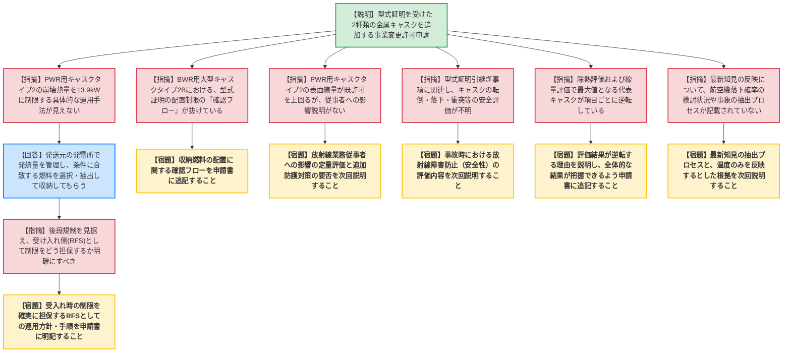

# 第583回核燃料施設等の新規制基準適合性に係る審査会合（令和8年5月22日）
> 出典 : https://youtube.com/live/LHqxSDEYH5I?si=NV8U_SBQRA9RZUdr

# 会合の概要
* **最大の争点:** 追加する金属キャスクに対して、RFS側が「型式証明の条件よりもさらに厳しい制限（最大崩壊熱量など）」を課して受け入れるとしている点について、搬出元の発電所側の管理に依存するだけでなく、「受け入れ側（RFS）としてその制限をどのように確実に担保・確認するのか」という運用管理の仕組みの明確化が求められた。
* **審査の進捗状況:** 型式証明を受けた2種類の金属キャスクを追加する事業変更許可申請についてRFSから説明がなされたが、具体的な運用方法の記載不足や、一部の評価結果における説明不足が多数指摘された。実質的な議論は次回会合へ持ち越しとなった。
* **特筆すべき決定事項:** RFSに対し、各種評価（除熱、遮蔽、敷地境界線量）において代表となるキャスクが項目ごとに逆転する理由の提示、表面線量率の増加に伴う放射線業務従事者への影響評価、落下・転倒等の事故時評価、および最新知見（航空機落下確率など）の反映プロセスについて、申請書への追記と次回会合での詳細な説明が命じられた。

---

# 議題ごとの詳細整理

## 【議題】リサイクル燃料備蓄センター使用済燃料貯蔵施設の事業変更許可申請について
* **議論の背景と論点:**
  型式証明を受けた2種類の金属キャスク（PWR用キャスクタイプ2、BWR用大型キャスクタイプ2B）を追加するにあたり、建屋の除熱・遮蔽・敷地境界線量等の評価への影響が論点となった。また、受入れ時に付加する独自の制限値（崩壊熱量等）を管理・担保する運用プロセスや、最新知見の反映状況の妥当性が問われた。

* **質疑応答（詳細）:**
    * **【説明者側】（RFS 清浦）:** 型式証明を受けた2種類のキャスクを追加する。PWR用キャスクタイプ2については、型式証明の条件（15.8kW）にさらに制限をかけ、最大崩壊熱量を13.9kW、収納燃料を17×17燃料のみに限定する。これらの制限下での除熱・遮蔽評価等は設計基準値を満たしており、既許可の設計方針から変更はない。
    * **【規制側】（規制庁 沖原）:** 最大崩壊熱量を13.9kWに制限するというが、その具体的な手法や作業が申請書上見えない。どのような運用を見込んでいるか。
    * **【説明者側】（RFS 清浦）:** 発送元の発電所において燃焼度等に基づき発熱量が管理されているため、制限に合致する燃料を発送元で抽出・選択して収納し、受け入れることで達成できると想定している。
    * **【規制側】（規制庁 沖原・金城）:** 後段規制（保安規定など）を見据え、受け入れ時に13.9kW以下であることをRFSとして確実にするための運用方針や手順が分かるよう、申請書に明記すること。また、BWR用大型キャスクタイプ2Bについて、型式証明で設定されている配置制限の「確認フロー」が申請書の記載から抜けているため追記すること。
    * **【説明者側】（RFS 清浦）:** 指摘を踏まえ、申請書に反映する。

    * **【規制側】（規制庁 尾崎）:** PWR用キャスクタイプ2の表面1m線量当量率が既許可の値を上回っているが、貯蔵区域で作業する放射線業務従事者への影響が申請書に記載されていない。定量的評価と追加防護対策の要否を説明してほしい。また、型式証明の引継ぎ事項である「事故時放射線障害の防止」に関連し、キャスクの転倒、落下、衝突等に対して安全上問題がないか説明してほしい。
    * **【説明者側】（RFS 清浦）:** 評価した内容があるため、次回会合にてまとめて説明する。

    * **【規制側】（規制庁 益子）:** 除熱評価において、PWR用キャスクタイプ2の「床面温度」が最大になる一方で、それ以外の温度はPWR用大型キャスクタイプ2B（※発言ママ）の方が高くなる。全体的な解析結果が把握できるよう申請書に追記し、この傾向の理由を説明してほしい。また、敷地境界線量評価においても、表面1m線量はPWR用キャスクタイプ2が最大にもかかわらず、敷地境界ではBWR用中型キャスクタイプ2が最大となる逆転状態が発生している。この理由と基準値を下回る根拠を説明してほしい。
    * **【説明者側】（RFS 清浦）:** 記載を検討し、評価傾向が逆転する理由について次回会合で説明する。

    * **【規制側】（規制庁 熊谷）:** 炉規法等に基づく最新知見の反映について、申請書には吸気温度の反映しか記載がない。ATENA（原子力エネルギー協議会）がまとめた航空機落下確率の調査結果等について検討した形跡がない。どのような事象を検討し、どのようなプロセスを経て「温度のみ反映する」という結論に至ったのか説明してほしい。
    * **【説明者側】（RFS 清浦）:** 指摘事項をまとめ、抽出プロセスを含めて次回会合で説明する。

* **結論と宿題事項（アクションアイテム）:**
    * 金属キャスクの追加申請に伴う複数の論点について、RFS側の説明および申請書の記載不足が指摘され、次回会合への持ち越しとなった。
    * **【宿題】** キャスク受け入れ時に、独自の制限値（最大崩壊熱量13.9kW等）を確実に担保するためのRFSとしての運用管理方針・手順を申請書に明記すること。
    * **【宿題】** BWR用大型キャスクタイプ2Bについて、型式証明で要求される燃料配置の「確認フロー」を申請書に追記すること。
    * **【宿題】** 表面線量当量率の増加に伴う放射線業務従事者への影響の定量的評価と、追加防護対策の要否について説明すること。
    - **【宿題】** 金属キャスクの転倒・落下・衝突等の事故時における安全性の評価結果について説明すること。
    - **【宿題】** 除熱評価および敷地境界線量評価において、キャスク間で評価値の最大項目が逆転する理由について説明し、全体像が把握できるよう申請書に追記すること。
    - **【宿題】** 航空機落下確率等の最新知見に関する抽出プロセスと、反映内容の妥当性について説明すること。

---

# 論理構造の可視化（Mermaid）

## 【議題】リサイクル燃料備蓄センター使用済燃料貯蔵施設の事業変更許可申請について

