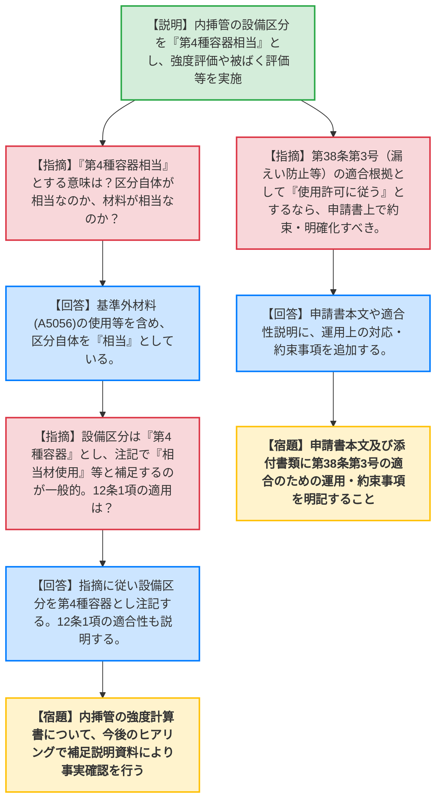
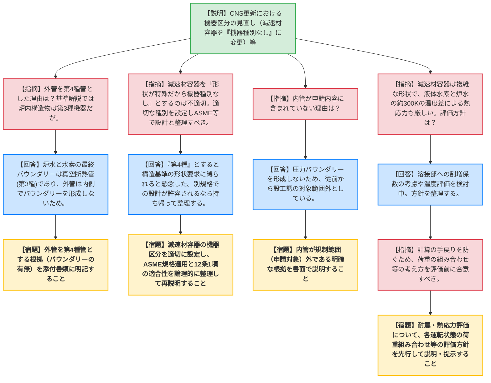

# 第584回核燃料施設等の新規制基準適合性に係る審査会合（令和8年5月22日）
> 出典 : https://youtube.com/live/eyAmEPAi17o?si=FVvaoaozczX5PG2p

# 会合の概要
* **最大の争点:** JRR-3の冷中性子源装置（CNS）更新において、特殊な形状を持つ「減速材容器」の設備区分（機器種別）の取り扱い。事業者（機構）が「形状が特殊なため機器種別なし」と整理したのに対し、規制庁は「機器種別を定めた上で、ASME等の別規格を適用して設計するという整理にすべき」と強く指摘し、根本的な法解釈・適用論理の乖離が議論の焦点となった。
* **審査の進捗状況:** 議題1（STACY）については、内挿管の機器区分や強度評価、被ばく評価等について機構から説明が行われ、申請書への追記や補足説明資料の確認という条件付きで概ね了承の方向へ進んだ。議題2（JRR-3）については、設備区分の整理のほか、複雑な形状の減速材容器に対する耐震評価・熱応力評価の手戻りを防ぐための事前方針のすり合わせが求められ、大幅な再整理と次回会合への持ち越しとなった。
* **特筆すべき決定事項:** JRR-3の耐震評価において、温度差が約300Kに達するクライオスタット特有の熱応力と地震荷重の組み合わせについて、詳細な計算を行う前に「荷重の組み合わせの考え方」を規制側と合意することが決定され、手戻り防止の措置が講じられた。

---

# 議題ごとの詳細整理

## 【議題1】STACY（定常臨界実験装置）施設の変更に係る設計及び工事の計画の認可申請について
* **議論の背景と論点:**
  STACYの格子板及び実験用装荷物（内挿管）の製作にあたり、内挿管の設備区分（第4種容器としての位置づけ）、強度評価の妥当性、技術基準第38条第3号に基づく被ばく評価、核計装検出器の配置方針などが論点となった。

* **質疑応答（詳細）:**
    * **【説明者側】（機構 長谷川・石井）:** 内挿管は「第4種容器相当」に区分する。材料として基準にないA5056を使用するが、強度計算により要求事項を満足することを確認した。また、公衆や従事者の被ばく評価は限度内であり、密封線源の損傷による漏えいの恐れもない。核計装検出器は臨界実験への影響を考慮して適切な位置に配置する。
    * **【規制側】（規制庁 日野田）:** 設備区分を「第4種容器"相当"」とする意味は何か？材料が基準にないため相当と言っているのか、それとも区分自体が第4種容器なのか。
    * **【説明者側】（機構 石井）:** 基準にない材料を用いることなどを含めて、区分自体を「第4種容器相当」としている。
    * **【規制側】（規制庁 加藤）:** 設備区分としては「第4種容器」と明記し、注記等で「相当材を使用する」等と補足する方が一般的ではないか。また、「安全を確保する上で重要なもの」に該当するなら、第12条第1項の適用対象となるか。
    * **【説明者側】（機構 石井）:** 指摘を踏まえ、設備区分は第4種容器とし、注記で相当であることを記載する。第12条第1項についても適用対象として適合性を説明する。
    * **【規制側】（規制庁 加藤）:** 内挿管の強度評価そのものは今回初めて説明を受けるため、今後提示される補足説明資料にて事実確認を行う。
    * **【規制側】（規制庁 伊藤）:** 第38条第3号の適合根拠として「使用許可に従う」としているが、そうであれば申請書本文でその対応（約束事項）を明確化すべきである。
    * **【説明者側】（機構 石井）:** 申請書本文に当該内容を追記し、適合性説明に追加する。

* **結論と宿題事項（アクションアイテム）:**
    * 内挿管の設備区分の整理について、区分を「第4種容器」とした上で注記による説明とすることで合意。第12条第1項の適用対象として適合性を説明することとなった。
    * **【宿題/条件】** 申請書本文および添付書類に、第38条第3号（漏えい防止・被ばく低減）に適合するための運用上の約束事項を明記すること。
    * **【宿題】** 内挿管の強度計算書について、補足説明資料を用いて今後のヒアリングで詳細な事実確認を行うこと。

---

## 【議題2】JRR-3原子炉施設の変更に係る設計及び工事の計画の認可申請（冷中性子源装置（クライオスタット）の更新）の審査について
* **議論の背景と論点:**
  冷中性子源装置（CNS）の更新において、外管や減速材容器などの設備区分の考え方（特に「機器種別なし」という整理の妥当性）が最大の論点となった。また、複雑な船底状の形状を持つ減速材容器に対する耐震評価および熱応力評価の手法についても質疑が交わされた。

* **質疑応答（詳細）:**
    * **【説明者側】（機構 徳永・車田・川村・菊地）:** CNS真空槽損傷時も冠水維持機能は損なわれない。設備区分について、真空断熱管1及び4は第3種管、外管は第4種管とするが、減速材容器は特殊形状で基準によれないため「機器種別なし」と整理し、ASME規格を準用して設計する。第6条（耐震）についてはスペクトルモーダル解析を実施し板厚変更等を行う。
    * **【規制側】（規制庁 石原）:** 構造等の技術基準の解説では炉内構造物は「第3種機器」とされているが、外管を第4種管としている理由は？
    * **【説明者側】（機構 川村）:** 炉水と水素の最終的なバウンダリーとなるのは真空断熱管1及び4であり、これを第3種に位置づけた。外管はその内側にありバウンダリーを形成しないため第4種と整理した。
    * **【規制側】（規制庁 加藤）:** バウンダリーの有無による区分であることは理解した。その根拠を添付書類等に明記してほしい。一方、減速材容器について「形状が特殊だから機器種別なし」とするのは理解に苦しむ。適切な機器種別（第4種等）を定義した上で、設計にはASME規格を用いると整理すべきではないか。
    * **【説明者側】（機構 川村・荒木）:** 機構としては機器種別が形状や寸法を規定するものと捉えており、「第4種」と言うと構造基準の形状に従えと言われることを懸念したため「なし」とした。しかし、第4種とした上でASMEで設計してよいのであれば、持ち帰って第12条の適用も含めて整理し直す。
    * **【規制側】（規制庁 加藤）:** クライオスタットを構成する「内管」が申請内容に含まれていないが、その理由は？
    * **【説明者側】（機構 徳永・川村）:** 圧力バウンダリーを形成しないため、従前から設工認の対象範囲外と整理している。
    * **【規制側】（規制庁 加藤）:** 規制範囲に入っていない明確な根拠を別途書面で説明すること。また、12条2項や38条の非該当項目についても適用しない理由を説明すること。
    * **【規制側】（規制庁 小牧・内藤管理官）:** 耐震評価について、減速材容器は複雑な形状で応力集中部がある。また液体水素（約20K）と炉水（約300K）の温度差による熱応力も厳しくなる。手戻りを防ぐため、計算を実施する前に、どのような荷重の組み合わせを考えているか等の評価方針を早期に説明してほしい。
    * **【説明者側】（機構 川村・車田）:** 溶接部に対する割増係数の考慮や温度評価を含め、方針を整理して事前に説明する。

* **結論と宿題事項（アクションアイテム）:**
    * 減速材容器等の設備区分の論理構成について規制庁からの強い指導が入り、事業者側が持ち帰って再整理することとなった。
    * **【宿題】** 外管を第4種管とする根拠（バウンダリーの有無）を添付書類に追記すること。
    * **【宿題】** 減速材容器の設備区分について、「機器種別なし」とするのではなく、適切な機器区分を設定した上でASME等の別規格を適用するという整理に見直し、第12条第1項の適合性とともに説明すること。
    * **【宿題】** 「内管」が設工認の申請対象外である根拠を明確にし、書面で説明すること。
    * **【宿題】** 第12条第2項や第38条の非該当項目について、適用しない理由を説明すること。
    * **【宿題】** 減速材容器等の耐震評価・熱応力評価において、計算の手戻りを防ぐため、各運転状態における荷重の組み合わせ等の評価方針を先行して説明し、合意形成を図ること。

---

# 論理構造の可視化（Mermaid）

## 【議題1】STACY施設の変更に係る設工認（格子板及び実験用装荷物の製作）

## 【議題2】JRR-3原子炉施設の変更に係る設工認（CNSの更新）

