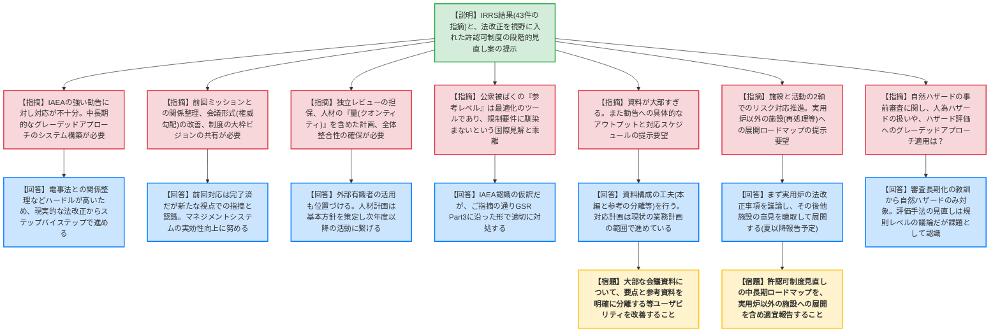
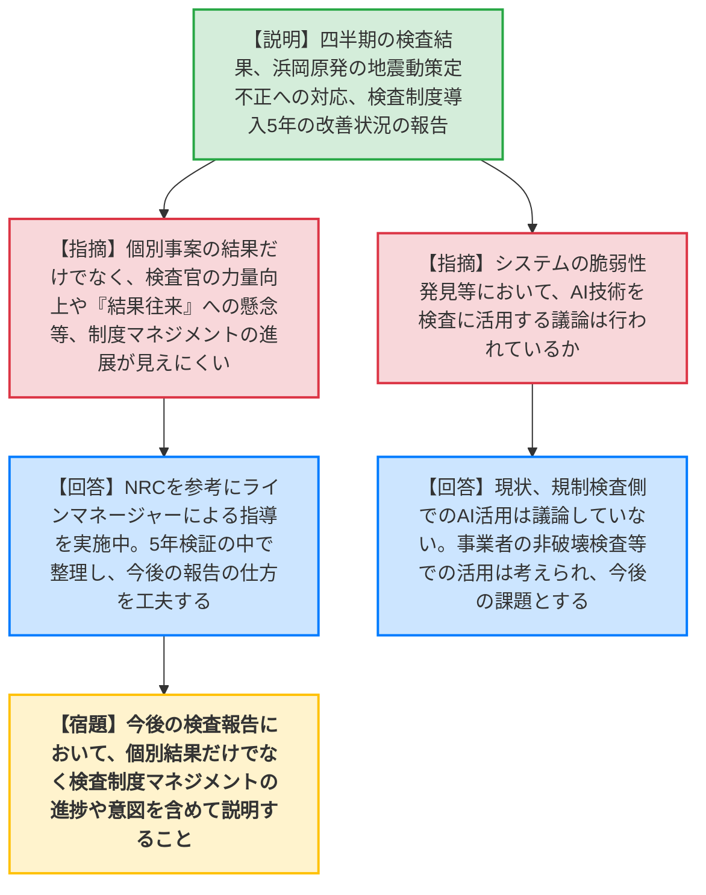
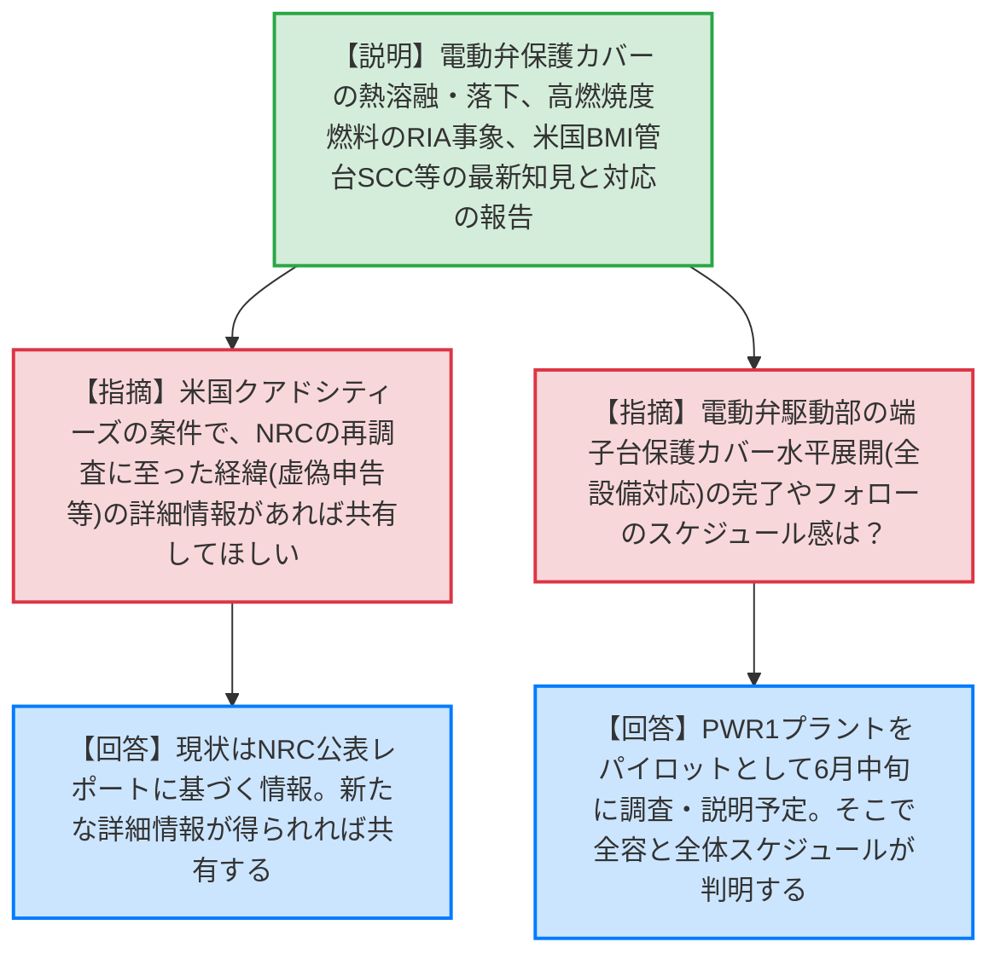
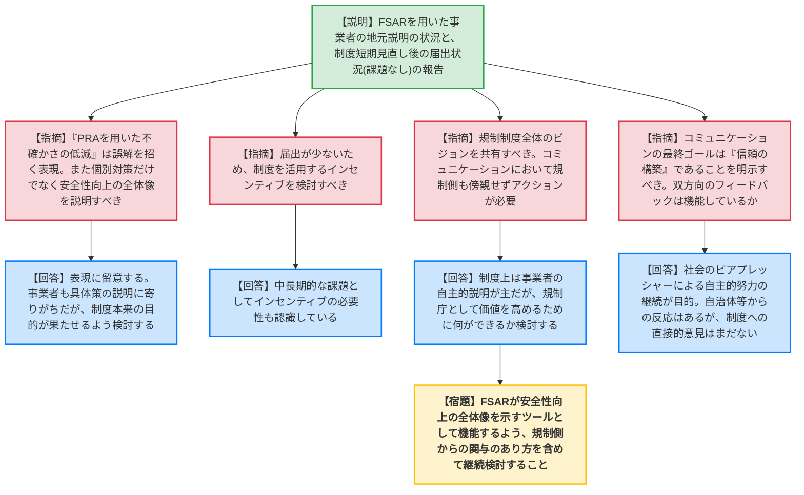
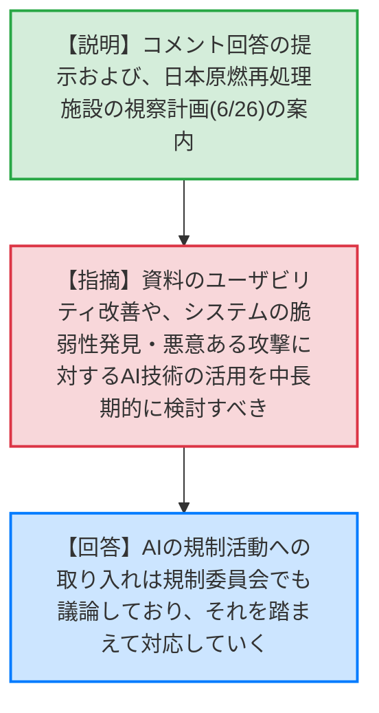

# 第21回原子炉安全基本部会・第15回核燃料安全基本部会（令和8年5月26日）
> 出典 : https://youtube.com/live/RKJzVg5n3mU?si=PJjE21lkANcH_or_

# 会合の概要
* **最大の争点:** IRRS（IAEA総合規制評価サービス）のミッション結果を受けた許認可制度の抜本的見直し。IAEAからの「グレーデッドアプローチ（リスクに応じた規制の強弱）の適用」という強い勧告に対し、委員からは「現状の運用改善だけでは限界があり、より踏み込んだ法改正や中長期的なビジョンの共有が必要」との指摘が相次いだ。
* **審査の進捗状況:** 制度見直しの第一歩として、自然ハザードの事前審査化や電気事業法との二重規制の整理などが議論されている。しかし、他法令（電気事業法等）との切り分けのハードルが高く、段階的なアプローチ（ステップバイステップ）を採らざるを得ない規制庁の苦悩が浮き彫りとなった。
* **特筆すべき決定事項:** 中部電力浜岡原発における「基準地震動策定の不正事案（意図的な波の選択や記録の隠滅）」について、現在も厳格な追加検査・報告徴収が継続中であることが報告され、QMS（品質マネジメントシステム）の形骸化に対する強い緊張感が共有された。また、安全研究により判明した「電動弁駆動部の事故時環境下における動作不良（保護カバーの熱溶融・落下）」について、速やかな設備対策（水平展開）の実行が確認された。

---

# 議題ごとの詳細整理

## 【議題1】IRRSミッションの結果及び許認可制度等の見直しに関する検討状況の報告
* **議論の背景と論点:**
  IAEAのIRRSミッションで示された43件の指摘（勧告・提言）への対応方針と、それを踏まえた許認可制度の法改正を視野に入れた見直し（自然ハザード審査の先行実施、電気事業法との重複排除など）について、規制庁の対応の深度や中長期的なビジョンが技術的な争点となった。

* **質疑応答（詳細）:**
    * **【説明者側】（規制庁 成田・田口）:** IRRSの指摘を業務計画に位置づけ順次対応する。また、許認可制度の見直しとして、自然ハザードの事前審査・認定化、工事着手規制の緩和、廃止措置の届出化等の法改正に関わる議論を事業者と始めている。
    * **【規制側】（大井川委員）:** IAEAの「significantly strengthen」という強い表現に対し、現状の対応案では不十分。安全目標の設定とリスクの共有など、中長期的なグレーデッドアプローチのシステム構築が必要ではないか。
    * **【説明者側】（規制庁 田口）:** 抜本的見直しには電気事業法など他法令との関係整理という高いハードルがあり、即座の根本改正は困難。まずは現実的な整理からステップバイステップで進める。
    * **【規制側】（山本部会長）:** 前回ミッションとの関係整理が必要。また、規制・被規制間の権威勾配の改善や、規制制度の大枠（FSAR型かPSR型か等）のビジョンを事業者と共有すべき。
    * **【説明者側】（規制庁 成田）:** 前回ミッションへの対応はクローズしているが、新たな視点からの指摘として受け止める。マネジメントシステムの実効性向上にも努める。
    * **【規制側】（芳原委員）:** グレーデッドアプローチのポリシーステートメント設定、内部監査による独立レビューの担保、人材のクオリティだけでなく量（クオンティティ）の確保計画が必要。
    * **【説明者側】（規制庁 田口・成田）:** 人材の総数不足の認識はないが、計画の明文化が求められているため基本方針を策定する。独立レビューには外部有識者の活用も位置づける。
    * **【規制側】（吉田委員）:** 公衆被ばくの「参考レベル」は最適化のツールであり、規制要件（線量制限）には馴染まないという国際的見解（ICRP）と表現が乖離している。
    * **【説明者側】（規制庁 成田）:** IAEAの認識の仮訳による表現だが、GSR Part3に沿った形で適切に対処する。
    * **【規制側】（黒崎委員）:** 資料が大部すぎる。また、勧告に対して「いつまでにどういうアウトプットを出すか」という具体的な対応計画を示すべき。
    * **【説明者側】（規制庁 田口）:** 資料構成（本編と参考の分離など）の工夫を行う。対応計画は現状の業務計画の範囲内で進めている。
    * **【規制側】（宇根崎委員）:** 施設と活動の2軸でのグレーデッドアプローチを早急に進めるべき。実用炉以外の施設（再処理施設等）への展開ロードマップを示してほしい。
    * **【説明者側】（規制庁 田口）:** まず実用炉を対象に法改正すべき事項を議論し、その後他施設の意見を聴取して展開する（夏以降に報告予定）。
    * **【規制側】（伊藤委員）:** 自然ハザードの事前審査に関連し、IAEAの立地要求の観点から人為ハザードも対象にすべきではないか。また自然ハザード評価自体にグレーデッドアプローチを導入すべき。
    * **【説明者側】（規制庁 田口）:** 過去の審査長期化の教訓から自然ハザードを対象としている。評価へのグレーデッドアプローチ導入は規則レベルの議論であり今回の法改正の俎上にはないが、課題として認識する。

* **結論と宿題事項（アクションアイテム）:**
    * 許認可制度の抜本的見直しについては、電気事業法との調整等を進めつつ、段階的に法制化の議論を進めることで合意。
    * **【宿題】** 大部な会議資料について、要点と参考資料を明確に分離する等、ユーザビリティを改善すること。
    * **【宿題】** 検査制度や許認可制度の見直しにおける中長期的なビジョン（ロードマップ）について、実用炉以外の施設への展開を含め、適宜委員会へ報告すること。

---

## 【議題2】原子力規制検査の実施状況
* **議論の背景と論点:**
  第3・第4四半期の検査結果（消防設備や非常用設備の不備）に加え、中部電力浜岡原発における基準地震動策定の不正事案の対応、および検査制度導入から5年が経過したことによる制度マネジメント（検査官の力量向上、リソース配分）の実効性が論点となった。

* **質疑応答（詳細）:**
    * **【説明者側】（規制庁 竹内）:** 泊3号機の消火ポンプ代替手段喪失、美浜3号機の非常用発電機停止（雨水混入）などの違反を指摘。浜岡原発の不正事案（意図的な地震波の選択、記録不備）については報告徴収と追加検査を継続中。
    * **【規制側】（近藤委員）:** 個別の指摘事項の報告だけでなく、検査官の力量のばらつき改善や「結果往来（パフォーマンスベースの誤解）」に対する懸念など、制度マネジメントの進展状況が見えにくい。
    * **【説明者側】（規制庁 竹内）:** NRCのやり方を参考にラインマネージャーを派遣した指導を実施中。結果往来の懸念についても5年の検証の中で整理し、今後の報告の仕方を工夫する。
    * **【規制側】（山地委員）:** 女川2号機のようなシステム脆弱性の発見において、AI等の新しい技術を検査に取り入れる議論はあるか。
    * **【説明者側】（規制庁 竹内）:** 現状、規制検査でのAI活用は議論していない。事業者の非破壊検査等での活用は考えられるが、検査側での活用は今後の課題である。

* **結論と宿題事項（アクションアイテム）:**
    * 浜岡原発の不正事案については、事実関係が固まり次第、規制上の措置を委員会に諮ることが確認された。
    * **【宿題】** 今後の検査状況の報告において、個別の違反事案の結果だけでなく、検査制度の改善（力量向上、リソース配分等のマネジメント）の進捗や背景・意図を含めて説明すること。

---

## 【議題3】事故・トラブル及び海外の規制動向に係る情報の収集・分析を踏まえた対応
* **議論の背景と論点:**
  安全研究により判明した「電動弁駆動部の事故時環境下における動作不良（アクリル製保護カバーの熱溶融・落下）」や、高燃焼度燃料のRIA（反応度投入事象）模擬実験で確認された機械的エネルギーの増大等、最新の安全知見に対する規制側および事業者の水平展開のスピードと確実性が論点となった。

* **質疑応答（詳細）:**
    * **【説明者側】（規制庁 塚部・佐々木）:** 電動弁駆動部の保護カバーについて、事業者が速やかな取り外しを計画中。また高燃焼度燃料のRIA実験による機械的エネルギー増大については、現状の圧力容器の吸収限界を超えないため直ちに影響はないが、事業者へ影響確認を求めている。米国キャラウェイ1号機のBMI管台SCC漏えい（WJP施工済み）についても国内への影響調査を継続中。
    * **【規制側】（山本委員）:** 米国クアドシティーズの案件について、NRCの再調査に至った経緯（虚偽申告等）の詳細情報があれば共有してほしい。
    * **【説明者側】（規制庁 塚部）:** NRCの公表レポートに基づく情報であり、新たな詳細情報が得られれば共有する。
    * **【規制側】（芳原委員）:** 電動弁駆動部の端子台保護カバーの水平展開（全設備への対応）の完了やウォッチのスケジュール感は？
    * **【説明者側】（規制庁 佐々木）:** PWRの1プラントをパイロットとして6月中旬を目処に調査を実施し、規制庁へ説明を受ける予定。そこで全容と全体スケジュールが把握される見込み。

* **結論と宿題事項（アクションアイテム）:**
    * 最新知見に基づく事象について、いずれも「要対応技術情報」等として事業者へのヒアリングと対応状況のフォローを継続することで合意。宿題事項は特になし。

---

## 【議題4】安全性向上評価制度を活用した事業者によるコミュニケーションの取組み
* **議論の背景と論点:**
  安全性向上評価制度（FSAR）の届出内容を事業者がどのように地域社会等へ説明しているか、また制度の短期的な見直し後の事業者の受け止めについて報告された。制度本来の目的（リスクの不確かさの把握と継続的改善の全体像の提示）と、実際のコミュニケーション内容（個別対策の説明への偏重）とのギャップが論点となった。

* **質疑応答（詳細）:**
    * **【説明者側】（規制庁 田口）:** 事業者はFSARのサマリー版を用いて自治体等へ説明を行っている。制度見直し後の届出においても特段の課題は抽出されていない。
    * **【規制側】（伊藤委員）:** 資料中の「PRAを用いた不確かさの低減」という表現は、PRAの本来の目的（不確かさの把握とマネジメント）から見て誤解を招く。また、個別対策の説明に終始せず、安全性向上の全体像を説明すべき。
    * **【説明者側】（規制庁 田口）:** 表現には留意する。事業者も分かりやすさから個別対策の説明に寄りがちであるが、制度本来の目的が果たせるよう検討する。
    * **【規制側】（斎藤委員）:** 届出が少ないため、事業者が制度を活用するインセンティブを考えるべき。
    * **【説明者側】（規制庁 田口）:** 中長期的な課題としてインセンティブの必要性を認識している。
    * **【規制側】（山本委員）:** 規制制度全体のビジョンを事業者と共有すべき。コミュニケーションのプロセスにおいて、規制側も傍観者とならず何らかのアクションを考えるべき。
    * **【説明者側】（規制庁 田口）:** 制度上は事業者の自主的説明が主だが、規制庁として価値を高めるために何ができるか検討する。設計の古さ（オブソレッセンス）への対応も広く議論していく。
    * **【規制側】（吉田委員）:** コミュニケーションの最終ゴールは「信頼の構築」であることを明示すべき。
    * **【規制側】（秋山委員）:** コミュニケーションは双方向のフィードバックが必要だが、機能しているか。
    * **【説明者側】（規制庁 田口）:** 社会からのピアプレッシャーによる自主的努力の継続が目的。自治体会議等で反応は得ているが、制度のあり方に関するフィードバックはまだないと聞いている。

* **結論と宿題事項（アクションアイテム）:**
    * **【宿題】** 安全性向上評価制度（FSAR）が、個別対策の羅列ではなく、PRAを活用した「安全性向上の全体像」を示すコミュニケーションツールとして機能するよう、規制側からの関与のあり方を含めて継続検討すること。

---

## 【議題5】その他
* **議論の背景と論点:**
  コメントへの回答および、委員による日本原燃再処理施設の視察計画（6月26日予定）について説明が行われた。

* **質疑応答（詳細）:**
    * **【説明者側】（規制庁 田口）:** 日本原燃再処理施設の視察計画の提示。
    * **【規制側】（石川委員）:** 大部な資料のユーザビリティ改善や、システムの脆弱性発見へのAI技術の活用、さらには悪意あるAI攻撃への備えなどについて、中長期的に検討すべき。
    * **【説明者側】（規制庁 田口/市村）:** AIの規制活動への取り入れは規制委員会でも議論しており、それを踏まえて対応する。

* **結論と宿題事項（アクションアイテム）:**
    * 日本原燃再処理施設の視察計画について了承された。AI技術の規制への活用・脅威への備えについては中長期的な検討課題とされた。

---

# 論理構造の可視化（Mermaid）

## 【議題1】IRRSミッションの結果及び許認可制度等の見直しに関する検討状況の報告

## 【議題2】原子力規制検査の実施状況

## 【議題3】事故・トラブル及び海外の規制動向に係る情報の収集・分析を踏まえた対応

## 【議題4】安全性向上評価制度(FSAR)を活用したコミュニケーション

## 【議題5】その他

