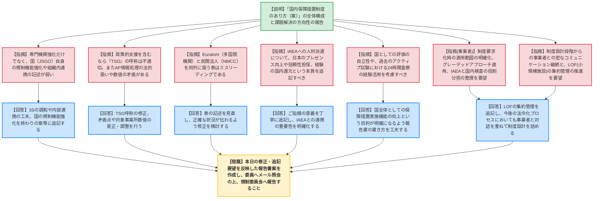

# 第4回国内保障措置制度のあり方検討会（令和8年5月26日）
> 出典 : https://youtube.com/live/NRTaOnStAjo?si=L7kRytPMvzkRYaWF

# 会合の概要
* **最大の争点:** 報告書（案）の取りまとめに向け、指定機関から「専門機関」へと役割が変化する中でのTSO（技術支援機関）という呼称の妥当性や、国（JSGO：保障措置室）自身の体制・規制機能強化の道筋、さらには六ヶ所再処理工場等の「バルク施設」本格稼働に向けたIAEAとの役割分担と国内の自立性の確保が大きな論点となった。
* **審査の進捗状況:** 第1回から第3回までの議論を踏まえた「国内保障措置制度のあり方（案）」について規制庁から報告され、外部有識者および事業者からの最終的な意見聴取が行われた。報告書の字句修正から、今後の法制化・運用に向けたコミュニケーションのあり方まで多岐にわたる要望が出され、それらを反映した上で原子力規制委員会へ報告されることとなった。
* **特筆すべき決定事項:** LOF（施設外の場所）等の小規模事業者における核物質の集約管理の推進、IAEAへの人材派遣を通じたプレゼンス向上と経験の国内還元、およびEuratom（多国間機関）と国内民間法人の権限の違いを踏まえた記述の適正化など、報告書に追記・修正すべき具体的なポイントが合意された。また、制度化（法令化）のプロセスにおいても、事業者との密なコミュニケーションを継続して最適化を図ることが確認された。

---

# 議題ごとの詳細整理

## 【議題1】国内保障措置制度のあり方検討会取りまとめ（案）について
* **議論の背景と論点:**
  六ヶ所再処理施設やJ-MOXの本格稼働を控え、国内保障措置制度の継続的改善が不可欠となっている。本検討会での議論を取りまとめた報告書（案）に対し、表現の適正化、国（JSGO）の規制機能強化の明記、IAEAとの連携・人材派遣の意義、および事業者への制度要求（CAP活動の義務化やグレーデッドアプローチの適用等）の具体化プロセスが論点となった。

* **質疑応答（詳細）:**
    * **【説明者側】（規制庁 中崎）:** 報告書（案）について、第1章（現状と課題）から第5章（終わりに）までの構成と内容を説明。専門機関の機能強化、事業者の役割の明確化、IAEAとのコミュニケーション強化等の方向性を示した。
    * **【規制側】（宇根崎委員）:** 専門機関の強化は書かれているが、規制庁（JSGO）自身を組織的・総合的にどうサポートし強化していくかという「国の規制機能の強化」の記述が弱い。
    * **【説明者側】（規制庁 中崎）:** 3S（セーフティ、セキュリティ、セーフガーズ）の調和を含め、組織全体として内部連携を図る工夫を追記することを検討する。
    * **【規制側】（堀委員）:** プルトニウムの本格利用が始まる中、長期的に対応できる専門機関が重要。また、事業者が単に検査を受けるだけでなく、保障措置のやり方そのものを国やIAEAと協力して作り上げていく自律性が不可欠である。
    * **【規制側】（坪井委員）:** 政策的支援も含むのであれば「TSO」という呼称は技術的支援に限定されるイメージを与え、浮いている。また、AP（追加議定書）情報処理の法的扱いの矛盾、脚注の「国と機関」の署名主体の誤り、対象事業所数（2000事業所）の数値の曖昧さなど、複数の細かな矛盾点・誤りを修正すべき。
    * **【説明者側】（規制庁 中崎）:** TSOの呼称については再検討し、ご指摘の矛盾点や数値の丸め方の相違については修正を行う。
    * **【規制側】（村上委員）:** 指定機関のJSGOへの移行や独立法人化など、踏み込んだ議論が反映されていないのが心残り。終わりの章に「国の規制機能の強化」を最終目的として追記すべき。また、12ページの表で絶対的権限を持つ多国間機関であるEuratomと、一民間法人であるNMCCを同列に並べるのはミスリーディングである。
    * **【説明者側】（規制庁 小金谷・中崎）:** 表の修正や終わりの章への「規制機能の強化」の追記を検討する。今後の具体化にあたっては、法律、政省令、規則、ガイド、予算などあらゆる手段を用い、一定の準備期間を考慮しつつ速やかに進める。
    * **【規制側】（秋山委員）:** IAEAへの人材派遣について、単なるコミュニケーションだけでなく、日本のプレゼンスを高め、より信頼性が高く効率的な保障措置の実施につなげ、その経験を国内へ還元するという本質的な目的を追記すべき。人員増等の手当は待ったなしである。
    * **【説明者側】（規制庁 中桐）:** プレゼンスの向上や経験の還元といった意義を丁寧に追記する。
    * **【規制側】（堀委員・坪井委員）:** IAEAに頼るだけでなく、国として核物質が転用されていないと評価・報告する自立性が重要。また、六ヶ所での24時間査察はアクティブ試験（2006〜2008年）で既に実績があり、その経験をどう活かすか、IAEA側の人材不足を補うための日本からの情報提供も重要である。
    * **【説明者側】（規制庁 中桐）:** 国として保障措置の実施機能を高めるという本来の目的が明確になるよう、報告書の書き方を工夫する。
    * **【事業者】（関電 石田・原燃 中村）:** 制度要求化を進める際は、審査ガイド等で要求事項や適用範囲を明確にし、グレーデッドアプローチを適用して過度な負担を避けてほしい。IAEA査察と国内検査の役割分担の整理や、バルク施設におけるIAEAへの人材派遣の継続、適時な判断力の確保をお願いしたい。
    * **【規制側】（宇根崎委員・事業者 古田）:** IAEA、事業者、JSGOの3者一体の連携が不可欠。LOF（施設外の場所）等の小規模事業者の集約管理は安全上も重要であり追記すべき。制度化の段階でも早い時期から事業者と密にコミュニケーションをとり、最適化を図ってほしい。
    * **【説明者側】（規制庁 中崎）:** LOFの集約管理の追記を検討する。法令化の過程においても、事業者とコミュニケーションを重ねながら制度設計の細部を詰めていく。

* **結論と宿題事項（アクションアイテム）:**
    * 報告書（案）について、委員からの多数の修正・追記要望（TSO呼称の見直し、国の規制機能強化の明記、IAEAへの人材派遣の意義の深化、Euratomとの同列記載の是正、LOFの集約管理の追記等）を反映することで合意した。
    * **【宿題】** 事務局（規制庁）は、本日の指摘事項を反映した修正案を作成し、委員にメールで確認・合意を得た上で、原子力規制委員会へ報告すること。

---

# 論理構造の可視化（Mermaid）

## 【議題1】国内保障措置制度のあり方検討会取りまとめ（案）について

