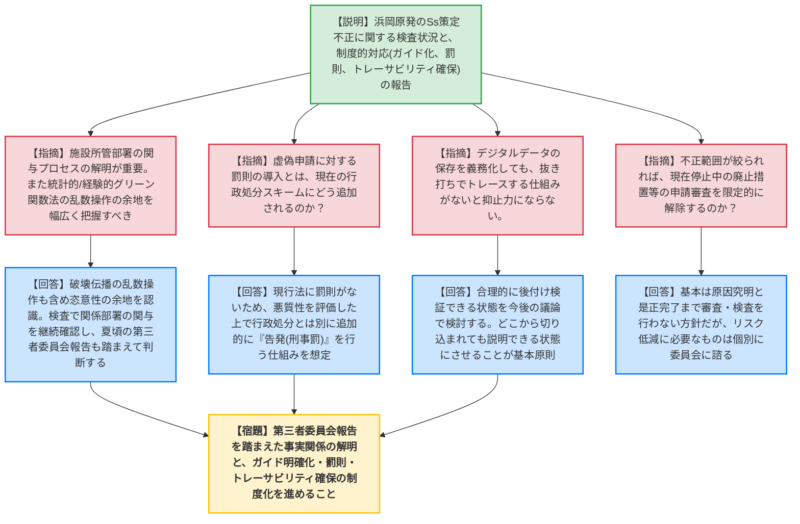
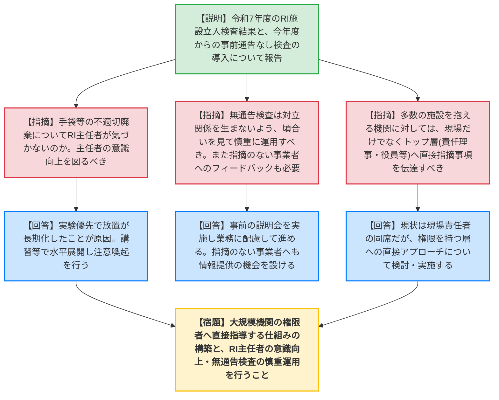

# 第11回原子力規制委員会（令和8年5月27日）
> 出典 : https://youtube.com/live/378X2giEN2A?si=VIDfa_TzgDEYMirw

# 会合の概要
* **最大の争点:** 中部電力浜岡原発における基準地震動（Ss）策定の不正事案。統計的/経験的グリーン関数法における恣意的な乱数操作（要素波・破壊伝播）や、施設所管部署の不当な関与が明らかになりつつあり、これに対する再発防止策として、評価プロセスの明確化（ガイド化）、虚偽申請に対する罰則（告発等）の導入、およびデジタルデータの保存義務化によるトレーサビリティの確保をどう制度化するかが焦点となった。
* **審査の進捗状況:** 放射性同位元素等規制法（RI規制法）に基づく立入検査結果が報告され、セーフティ・セキュリティ両面での指摘事項の傾向が示された。今年度から導入される「事前通告なしの立入検査」については、対立関係を生まないよう慎重な運用が求められた。
* **特筆すべき決定事項:** 令和7年度の実施施策に係る事後評価、および原子力規制委員会年次報告（国会報告用）がそれぞれ原案通り決定された。また、RI施設の立入検査において、多数の施設を抱える機関に対しては、現場の責任者だけでなく、機関のトップ層（責任理事や担当役員等）へも直接指摘事項を伝達し、組織的な改善を促す方針が合意された。

---

# 議題ごとの詳細整理

## 【議題1】中部電力株式会社の不正行為に係る検査状況及び制度面における対応の検討状況
* **議論の背景と論点:**
  中部電力浜岡原発の基準地震動策定において、委託先に対して恣意的な代表波の選定を指示していた不正事案。現在の立入検査での事実確認状況（施設所管部署の関与等）と、今後の不正を抑止するための制度的対応（ガイド明確化、罰則導入、トレーサビリティ確保）のあり方が論点となった。

* **質疑応答（詳細）:**
    * **【説明者側】（規制庁 忠内）:** 報告徴収及び立入検査の状況を報告。225ケース中、少なくとも105ケースで「方法①」、3ケースで「方法②」の不正を確認。代表波の選定において、施設所管部署の意見が一つの要素となり、Ssを大幅に超過しない波を抽出していた。制度面では、統計的グリーン関数法の評価プロセス明確化、虚偽申請への罰則導入、トレーサビリティ確保（記録の保管）の検討を進める。
    * **【規制側】（山岡委員）:** 施設所管部署の関与が判明したのは重要であり、事実関係のプロセスを明らかにすべき。また、統計的グリーン関数法だけでなく、経験的グリーン関数法における破壊伝播の乱数設定など、恣意的操作の余地がある部分を幅広く把握すべき。トレーサビリティ確保にはデジタルデータの保存が必須である。
    * **【説明者側】（規制庁 忠内）:** 破壊伝播の部分も乱数を振っており、恣意的な選択の余地があると同列に認識している。
    * **【規制側】（杉山委員）:** トレーサビリティ確保において、どのレベルの情報を残させるか、またそれを定期的に抜き打ちでトレースする仕組みがないと抑止力にならない（形骸化の懸念）。また、中部電力の廃止措置やクリアランス等の申請が止まっているが、不正の範囲が絞られれば部分的に解除するのか。
    * **【説明者側】（規制庁 三田・竹内）:** 後付けで検証できる状態を今後の議論で検討する。許認可申請の対応方針としては、原因究明と是正措置の完了が確認できるまで審査・検査を行わない方針だが、リスク低減に必要なものは個別に委員会に諮る。
    * **【規制側】（長﨑委員）:** 虚偽申請に対する罰則の導入について、現在の行政処分のスキームにどう追加されるイメージか。
    * **【説明者側】（規制庁 三田・金子長官）:** 現行法には罰則がないため、申請書類や根拠資料の虚偽の程度（悪質性）を評価した上で、行政処分とは別に追加的に「告発（刑事罰）」を行う仕組みの導入を想定している。
    * **【規制側】（神田委員）:** 不正対応のみに意識が向き、事業者現場の安全文化や核セキュリティ文化が劣化しないようフォローが必要。
    * **【規制側】（山中委員長）:** 事実関係の解明（施設所管部署との関係等）はまだこれからという認識でよいか。第三者委員会の報告（夏頃）を待って判断するのか。制度面については、ガイドへの明確な落とし込み、罰則、デジタルデータの保存によるトレーサビリティ確保が強力な抑止力になる。
    * **【説明者側】（規制庁 忠内・佐藤）:** 施設所管部署との関係は現在検査で確認中。第三者委員会の報告が出れば事実関係が明らかになるため、その時期に対応の方向性を決められると考えている。ガイドの明確化については、アテナ（ATENA）の検討を待ちつつ公開会合で議論していく。

* **結論と宿題事項（アクションアイテム）:**
    * 立入検査を通じた事実関係（施設所管部署の関与プロセス等）の確認を継続し、第三者委員会の報告（夏頃）を踏まえて規制上の対応方針を決定する。
    * **【宿題】** 制度面の見直しとして、①評価プロセス（乱数操作の範囲等）のガイド明確化、②虚偽申請に対する罰則（告発）導入、③デジタルデータ保存の義務化によるトレーサビリティ確保と抜き打ち検査の仕組みについて、具体化の検討を進めること。

---

## 【議題2】令和7年度放射性同位元素等規制法に基づく立入検査結果
* **議論の背景と論点:**
  令和7年度に実施されたRI施設等への立入検査結果の報告。セーフティおよびセキュリティ面での指摘事項の傾向と、今年度から導入する「事前通告なしの立入検査」の運用方針、および多数の施設を抱える大規模機関に対する実効性のある指導のあり方が論点となった。

* **質疑応答（詳細）:**
    * **【説明者側】（規制庁 野村）:** 許可届出使用者等に対する立入検査（セーフティ200件、セキュリティ99件）、登録認証機関等（9件）の結果を報告。重大な事故報告事象はなし。セーフティでは記帳・手続き違反が多いが、不適切な廃棄などの指摘もあり。セキュリティでは防護措置（鍵の管理等）の指摘が多い。今年度から事前通告なしの立入検査も実施する。
    * **【規制側】（山中委員長）:** 手袋やウエスの不適切廃棄について、RI主任者が定期巡回等で気づくシステムになっていないのか。
    * **【説明者側】（規制庁 斉藤）:** 実験を優先して適切な保管廃棄設備へ持っていくことを後回しにし、そのまま放置される状態が長期化しているのが原因と見られる。
    * **【規制側】（神田委員）:** 事業者の規模や業種が多様なため、指摘の受け止め方（納得感）に注意してほしい。指摘を受けていない事業者へのフィードバック機会も設けるべき。
    * **【説明者側】（規制庁 野村）:** 講習の場や検査後の改善状況確認等を通じて、きめ細かい情報提供に努める。
    * **【規制側】（杉山委員）:** 事前通告なしの立入検査について、無用な対立関係を生まないよう、まずは「頃合い」を把握する認識で慎重に始めてほしい。
    * **【説明者側】（規制庁 野村）:** 事前に説明会を実施し、先方の業務に配慮しながら進め、次年度以降のやり方を検討する。
    * **【規制側】（山中委員長）:** 多数の施設を抱える機関に対しては、現場の責任者だけでなく、予算や人員の権限を持つ「機関のトップ層（責任理事や担当役員等）」にも指摘事項の連絡が行くようにすべき。
    * **【説明者側】（規制庁 野村）:** 現状は現場責任者の同席を求めているが、権限のある方への直接のアプローチについて検討・実施する。

* **結論と宿題事項（アクションアイテム）:**
    * 令和7年度の立入検査結果を了承。
    * **【宿題】** RI主任者の意識向上を図る水平展開を実施し、指摘事項のない事業者へのフィードバック機会を充実させること。
    * **【宿題】** 無通告検査の実施にあたっては、事業者の業務に配慮し慎重に運用すること。
    * **【宿題】** 大規模機関において指摘事項があった場合、現場責任者だけでなく、機関の権限者（担当役員等）へ直接連絡・指導を行う仕組みを構築すること。

---

## 【議題3】令和7年度放射性同位元素等取扱事業所における事故・故障等に係る評価
* **議論の背景と論点:**
  令和6年度に発生し、原因と対策の報告を受けた5件の事故・故障の評価と、現在調査中の事案3件の進捗状況についての報告。

* **質疑応答（詳細）:**
    * **【説明者側】（規制庁 野村・斉藤）:** 報告を受けた5件（日本ドレッサー柏崎事業所：線源露出状態での被ばく[INES 1]、PDRファーマ：配管接続不備による汚染・被ばく[INES 1]、富山大：退職者自宅での汚染管発見[INES 0]、東海分析科学研究所：予備機のガスクロマトグラフ所在不明[INES 1]、日本メジフィジックス：排気停止中の扉開放による漏えい[INES 0]）は、事業者の原因分析・是正措置が妥当と評価。継続調査中3件（海保航空機炎上による線源所在不明、日本製紙の厚さ計からの漏えい、福島県立医大のAt-211汚染）。
    * **【規制側】（山中委員長）:** 積み残し（調査中）の3件は、事業者の原因分析や是正措置の提案が遅れているのが主な理由か。
    * **【説明者側】（規制庁 斉藤）:** 海保の件は運輸安全委員会の報告待ち、日本製紙は海外メーカー製で調査に時間を要しており、福島県立医大は原因分析を継続中であるため。

* **結論と宿題事項（アクションアイテム）:**
    * 報告を受けた5件の評価結果を了承。継続調査中の3件については、引き続き原因究明と是正措置の報告を待つ。

---

## 【議題4】令和7年度実施施策に係る事後評価
* **議論の背景と論点:**
  行政機関が行う政策の評価に関する法律に基づく、令和7年度実施施策の事後評価（マネジメントレビュー後の評価変更含む）の決定。
  ※議事進行時、委員長が誤って「年次報告を決定してよろしいか」と発言したが、事務局より訂正が入り、事後評価の決定として扱うことが確認された。

* **質疑応答（詳細）:**
    * **【説明者側】（規制庁 新田）:** 1月末時点からの評価変更を説明。人材育成基本方針に関する項目は進捗良好としてBからAへ。法令報告の改善に関する項目は次年度への先延ばしによりAからBへ。米国原子力艦寄港時の初動対応遅れ（2時間以内未着手）によりAからBへ。被ばく線量推定の優先順位判断についてはBからAへ。これに伴い、評価単位2の全体評価をBに変更した。
    * **【規制側】（委員全員）:** 特段の意見なし。

* **結論と宿題事項（アクションアイテム）:**
    * 別紙1および別紙2の通り、令和7年度実施施策に係る事後評価を決定。

---

## 【議題5】令和7年度原子力規制委員会年次報告
* **議論の背景と論点:**
  原子力規制委員会設置法に基づく、国会への年次報告およびその概要、参考資料の決定。

* **質疑応答（詳細）:**
    * **【説明者側】（規制庁 新田）:** 要約（3.11報告等と同様の内容）と本文、概要（別紙2）、参考資料（別紙3、昨年度の資料編）で構成。参考資料の誤字等は公表までに修正する。
    * **【規制側】（杉山委員）:** 紙の冊子体として作成するのはどの範囲か。
    * **【説明者側】（規制庁 新田）:** 別紙1（年次報告本体、3〜141ページ）を冊子として作成し国会報告に活用する。概要はPDFでホームページに掲載する。
    * **【規制側】（山中委員長）:** 昨年は誤りが多かったため、間違いがないようしっかりまとめてほしい。
    * **【説明者側】（規制庁 新田）:** 複数人での確認、チェックリストの活用、生成AI（音声読み上げ等）を活用した誤字脱字・表記揺れの確認を行い、誤りがないよう作成している。

* **結論と宿題事項（アクションアイテム）:**
    * 別紙1、別紙2の通り、令和7年度原子力規制委員会年次報告およびその概要を決定。

---

## 【その他】配布資料の一部修正について
* **議論の背景と論点:**
  第10回規制委員会議題3の資料（原子力規制検査等の結果及び総合評定）に記載された実績数に誤りがあったため、その原因と対策が報告された。

* **質疑応答（詳細）:**
    * **【説明者側】（規制庁 杉田）:** 日常検査およびチーム検査の実績数に誤りがあった。原因は、担当者の数え上げミス、部門内の確認不足、および規制事務所との事前共有不足。HPの資料を差し替え、今後は事務所との共有と複数人確認を徹底する。
    * **【規制側】（山中委員長）:** 次年度以降、事務所との情報共有や本庁内での確認をしっかり行い、是正すること。

* **結論と宿題事項（アクションアイテム）:**
    * 資料の差し替えを了承し、再発防止策（複数人確認と事務所との情報共有）の徹底を指示。

---

# 論理構造の可視化（Mermaid）

## 【議題1】中部電力株式会社の不正行為に係る検査状況及び制度面における対応の検討状況

## 【議題2】令和7年度放射性同位元素等規制法に基づく立入検査結果

