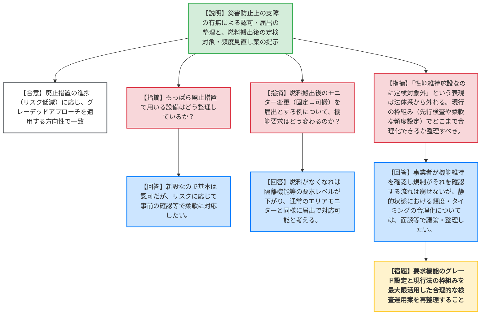

# 第4回実用発電用原子炉の許認可制度等の見直しに関する意見交換会合（令和8年5月27日）
> 出典 : https://youtube.com/live/ov4IBdfy9tI?si=n6_z9kxTX3rpDoaK

# 会合の概要
* **最大の争点:** 許認可制度の見直しにおいて、「工事着手前の規制（認可）」に対する緩和要望（早期着工）と、「廃止措置段階」における定期事業者検査等の制度合理化の2点。特に工事着手条件については、事業者が「猶予期間のない即時適用のバックフィット工事」に限定して要望したものの、規制側は「法律の根幹に関わる問題であり、絶対に必要な具体例の提示が不足している」として、法的難易度と必要性のギャップが浮き彫りとなった。
* **審査の進捗状況:** 工事着手の条件については対象が極めて限定的になったものの、必要性を裏付ける具体例の提示が次回以降の面談へ持ち越しとなった。廃止措置分野については、災害防止上の支障の有無に基づく認可・届出の整理方針そのものは概ね合意が得られた。定期事業者検査についても、廃止措置におけるリスク低下（静的状態）を踏まえた頻度・タイミングの合理化を図る方向で一致し、現行法の枠組みでどこまで対応可能か引き続き検討することとなった。
* **特筆すべき決定事項:** 本検討をベースに、規制庁が6月末までに「許認可制度見直しの素案」を原子力規制委員会に提示することが決定された。また、中部電力浜岡原発の不正事案に関連し、基準地震動等のトレーサビリティ確保についても今後本会合等で議論していく方針が共有された。

---

# 議題ごとの詳細整理

## 【議題1】実用発電用原子炉の許認可制度等の見直しに関する事業者意見（工事着手の条件）
* **議論の背景と論点:**
  事業者は手戻りの社会的コストを避けるため、認可前の早期着工を認めるよう要望している。前回の議論を踏まえ、対象範囲をどこまで絞り込むか、そしてその例外を法的に許容するだけの「緊急性・必要性」を事業者が具体的に提示できるかが論点となった。

* **質疑応答（詳細）:**
    * **【説明者側】（ATENA 田中）:** 前回「バックフィット工事すべて」とした対象範囲を、緊急性を要する「経過措置（猶予期間）がつかない即時適用のバックフィット工事」のみに限定する。また、電事法側の縛りについても手当てをお願いしたい。
    * **【規制側】（規制庁 市川）:** 猶予期間を設けられないバックフィット工事とは、特重施設や第三電源の工事は含まれず、かつ原子炉が停止している状態で行われるものという理解でよいか。
    * **【説明者側】（ATENA 田中）:** おっしゃるとおり。現在は新規制基準対応工事を想定しているが、将来、新知見（自然ハザード等）が出た場合の緊急対応も想定している。
    * **【規制側】（規制庁 三田）:** 電事法の認可対象になるものもあり得るという点は共通認識である。しかし、「認可を前提とした着手前規制」という現行の法構造において、着手前規制だけを例外とするのは法制的に非常に難しい議論である。
    * **【規制側】（規制庁 田口）:** 対象が即時適用のみに絞られたことで主張は分かりやすくなったが、「なぜその制度がないと将来まずいことが起こるのか」という具体例が不足している。法的な難易度が高く、現状では「絶対に必要だ」というインパクトを規制側として受け止められていない。他の組織（法制局等）へ説明するための材料として、考え得る具体例をいくつか出してほしい。
    * **【説明者側】（ATENA 田中）:** 例示を含めて、引き続き面談等で議論させていただきたい。

* **結論と宿題事項（アクションアイテム）:**
    * 早期着工の対象範囲を「猶予期間のない即時適用バックフィット工事」に限定すること自体は確認されたが、法改正のハードルを越えるだけの必要性の立証には至らなかった。
    * **【宿題】** 事業者（ATENA）は、早期着工が認められない場合に安全上・運用上で重大な支障が生じ得る「具体的なシナリオ・事例」を整理し、面談等で規制庁に提示すること。

---

## 【議題2】実用発電用原子炉の許認可制度等の見直しに関する事業者意見（廃止措置分野）
* **議論の背景と論点:**
  リスクが段階的に低下する廃止措置段階において、施設の変更（認可・届出の整理）や定期事業者検査（定検）の対象・頻度をどのように合理化（グレーデッドアプローチの適用）するかが論点となった。

* **質疑応答（詳細）:**
    * **【説明者側】（中部電力 堀）:** 災害防止上の支障の有無で整理した。基本方針や性能維持施設の機能・性能等の基本的事項は「認可（支障あり）」とし、添付書類の記載事項や、機能維持を前提とした設備更新（位置・構造・設備の変更）は「届出（支障なし）」とする方向で整理したい。また、燃料搬出以降はリスクが低減するため、当該設備を「定検対象外」とし、日常の保全活動での維持管理に留めたい。定検の時期も13ヶ月等の枠にとらわれず、点検周期に合わせて実施したい。
    * **【規制側】（規制庁 市川）:** もっぱら廃止措置で用いる設備（もっぱら設備）についてはどう整理しているか。
    * **【説明者側】（中部電力 堀）:** 新設となるため基本は認可と考えているが、リスクに応じて個別に確認・相談したい。
    * **【規制側】（規制庁 三田）:** 燃料搬出後のモニター変更（固定式→可搬式）を届出に見直す例について、燃料搬出の前後でモニターに期待する機能が安全上どう変わるのか。
    * **【説明者側】（中部電力 堀）:** 燃料がなくなれば、原子炉建屋を隔離するようなインターロック等の要求レベルが下がり、通常のエリアモニターと同様の扱いになるため、届出に見直せるのではないか。
    * **【規制側】（規制庁 田口）:** p.6の基本方針（支障の有無による整理）には異論はないが、それをどう具体的な資料に具現化し、合理的に規制できるかは引き続き議論したい。
    * **【規制側】（規制庁 小作）:** 「性能維持施設なのに定検対象外とする」という表現は法体系から外れる。廃止措置計画の中で「設備にどこまでの機能を要求するか」のグレードを整理し、それに応じて検査の程度を変えるべき。定検の頻度についても、現行の炉規法では必ずしも13ヶ月ではなく、保全計画に応じた運用が可能であり、先行検査の規定も活用できる。まずは現行の枠組みでどこまで合理的な運用ができるか整理してほしい。
    * **【規制側】（規制庁 大島部長）:** 廃止措置段階で「何を性能維持施設とするか（何を機能維持すべきか）」にグレーデッドアプローチを適用し、重点的に見るべきところを見るという方向性は一致している。機能が維持されていることを事業者が確認し、規制側が検査するという流れは崩せないが、静的な状態の廃止措置において13ヶ月の縛りには意味が薄い。どの程度の頻度で確認するのが合理的か、実績を重ねながら面談等で議論していきたい。

* **結論と宿題事項（アクションアイテム）:**
    * 災害防止上の支障の有無に基づく認可と届出の仕分け方針、および廃止措置のリスク低下に応じたグレーデッドアプローチの適用方針については、方向性で一致（合意）した。
    * **【宿題】** 事業者は、「定検対象外とする」という法体系に合わない表現を見直し、要求機能のグレード設定と現行法の枠組み（先行検査や保全計画に基づく柔軟な頻度設定）を最大限活用した合理的な検査運用の案を再整理し、面談で提示すること。

---

## 【その他】今後の予定等
* **結論と宿題事項（アクションアイテム）:**
    * 規制庁はこれまでの議論を踏まえ、6月末までに「許認可制度見直しの素案」を原子力規制委員会に提示する。
    * 中部電力浜岡原発の基準地震動策定の不正事案に関連し、重要な設計条件のトレーサビリティ確保等についても、今後の制度見直しの枠組みの中で必要に応じて事業者と意見交換を行う。

---

# 論理構造の可視化（Mermaid）

## 【議題1】工事着手の条件

```mermaid
graph TD
    classDef desc fill:#d4edda,stroke:#28a745,stroke-width:2px;
    classDef point fill:#f8d7da,stroke:#dc3545,stroke-width:2px;
    classDef issue fill:#e2e3e5,stroke:#6c757d,stroke-width:2px;
    classDef ans fill:#cce5ff,stroke:#007bff,stroke-width:2px;
    classDef task fill:#fff3cd,stroke:#ffc107,stroke-width:2px,font-weight:bold;
    classDef agree fill:#ffffff,stroke:#343a40,stroke-width:2px;

    E1["【説明】認可前の着工対象を「猶予期間のない即時適用のバックフィット工事」に限定して要望"]:::desc

    P1_1["【指摘】即時適用のものとは、特重や第3電源は含まれず、原子炉停止状態で行う工事という理解でよいか？"]:::point
    A1_1["【回答】おっしゃるとおり。現在は新基準対応のみだが、将来の新知見等の緊急対応も想定している。"]:::ans

    P1_2["【指摘】「着手前規制」という法の構造上、例外を設けるのは法制的に非常に難しい。"]:::point
    A1_2["【回答】電事法側の縛りも含めて対応を検討してほしい。"]:::ans

    P1_3["【指摘】対象は絞られたが、「なぜ早期着手できないと将来まずいことが起きるのか」の絶対的な具体例が不足しており、他部署を説得できない。"]:::point
    A1_3["【回答】例示を含めて、引き続き面談等で議論させていただきたい。"]:::ans
    T1_1["【宿題】早期着工不可により重大な支障が生じる具体的なシナリオ・事例を整理し、提示すること"]:::task

    E1 --> P1_1
    P1_1 --> A1_1
    E1 --> P1_2
    P1_2 --> A1_2
    E1 --> P1_3
    P1_3 --> A1_3
    A1_3 --> T1_1
```

## 【議題2】廃止措置分野

