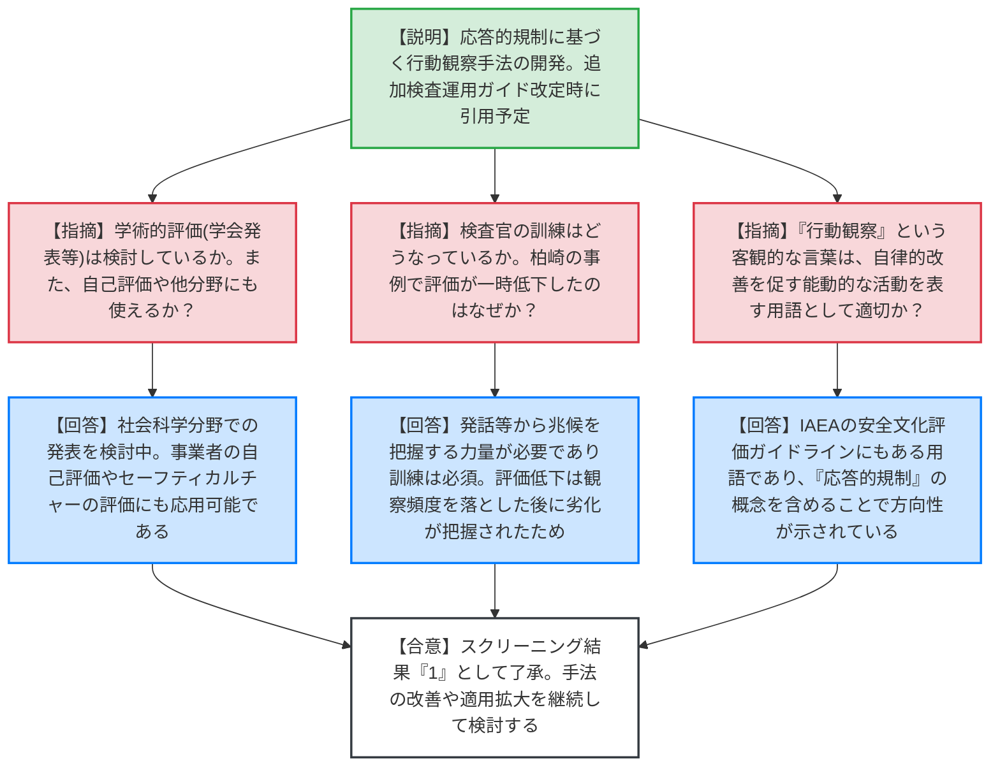
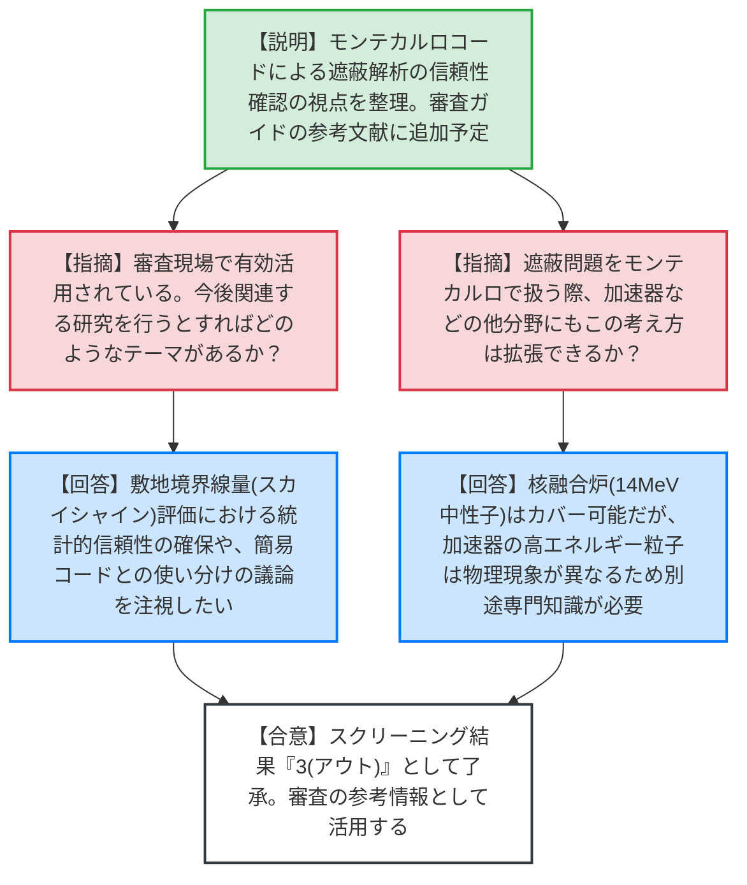
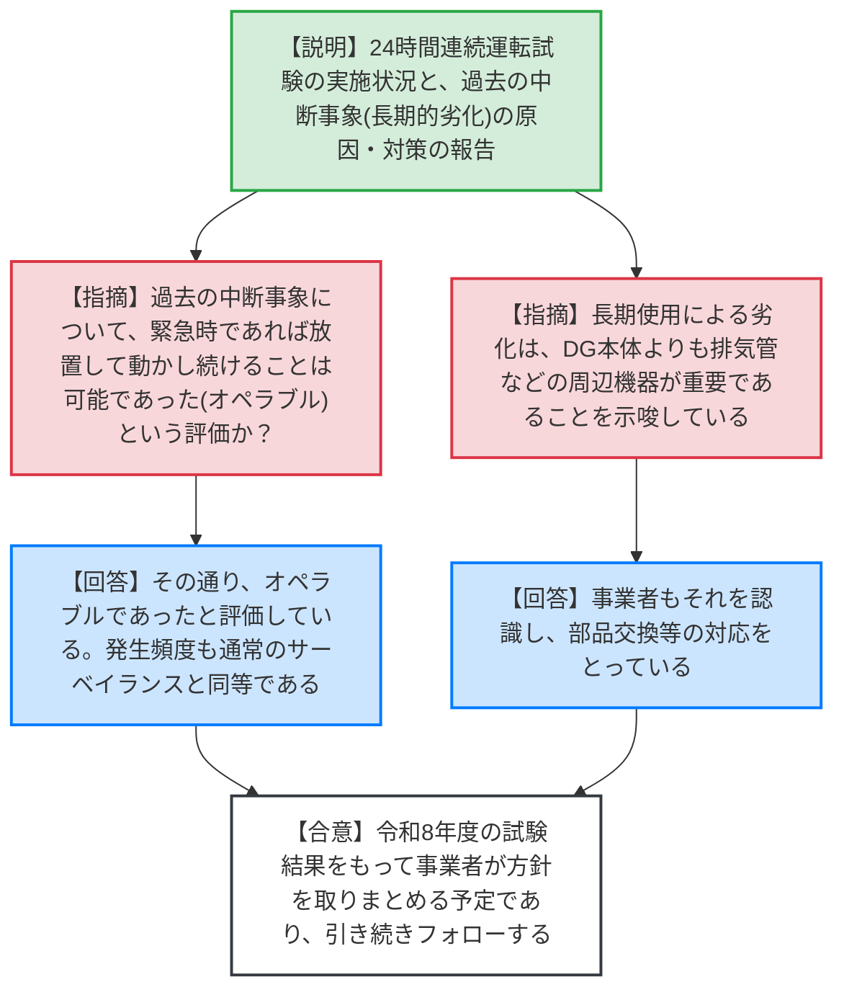
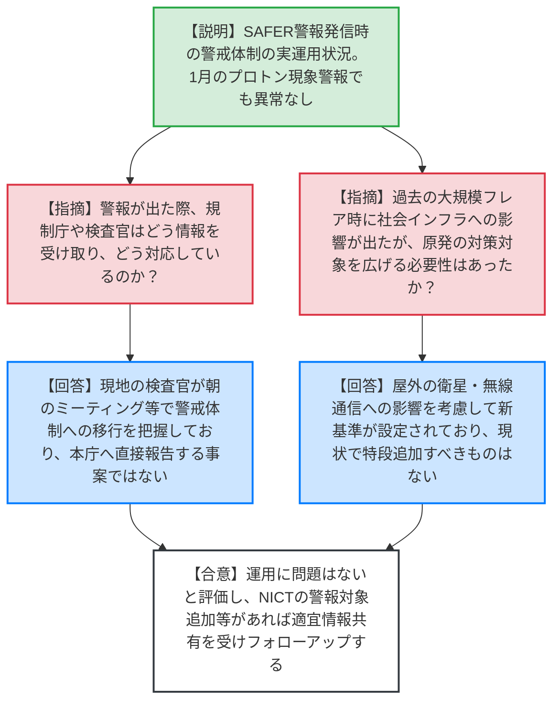

# 第79回技術情報検討会（令和8年5月28日）
> 出典 : https://youtube.com/live/ov4IBdfy9tI?si=n6_z9kxTX3rpDoaK

# 会合の概要
* **最大の争点:** 今回の技術情報検討会では、規制庁内部で開発された「行動観察手法」と「モンテカルロコードによる遮蔽評価の信頼性確認手法」の実用性と汎用性が焦点となった。特に組織文化の評価という定性的な課題を、応答的規制の概念を取り入れて体系化したことに対し、規制側全体から高い評価と今後の活用への期待が寄せられた。
* **審査の進捗状況:** 太陽フレア（宇宙天気イベント）に対する事業者の警戒体制が実運用に入っており、実際に本年1月に発報されたプロトン現象の警報においても、現場の検査官と事業者の間で適切に情報共有がなされ、異常なく対応が完了したことが確認された。
* **特筆すべき決定事項:** 新たに策定された2つのNRA技術報告について、行動観察手法は「追加検査運用ガイド」に反映される要対応情報として位置づけられ、遮蔽評価の確認手法は審査の参考情報として「審査ガイド」の参考文献に追加されることが決定した。

---

# 議題ごとの詳細整理

## 【議題1】NRA 技術報告「応答的規制の考え方に基づく行動観察手法：実践と理論」
* **議論の背景と論点:**
  柏崎刈羽原発の核セキュリティ事案に関する追加検査において、事業者の組織文化の改善を確認するために新たに開発・適用された「行動観察手法」のNRA技術報告化。手法の汎用性や、検査官が客観的かつ適切に評価するための力量確保（訓練）が論点となった。

* **質疑応答（詳細）:**
    * **【説明者側】（規制庁 髙田）:** 組織文化の成熟度に応じて規制当局の参加タイプを柔軟に変える「応答的規制」の考え方を組み込んだ行動観察手法を開発した。追加検査運用ガイドの改定時に本技術報告を引用する方針。
    * **【規制側】（山岡委員）:** 定量化が難しい組織文化の評価手法として良い結果が得られた。学術的な評価（学会発表や論文化）は検討しているか。
    * **【説明者側】（規制庁 髙田）:** 学協会への説明や論文化について現在検討中。社会学・社会科学の側面が強いと考えている。
    * **【規制側】（杉山委員）:** 事業者が自己評価する際にも使えるか。また、核セキュリティ以外の分野（セーフティカルチャー等）にも適用可能か。
    * **【説明者側】（規制庁 髙田）:** 柏崎の事例でも事業者が自ら行動観察を取り入れており適用可能。セーフティカルチャーの評価や意思決定プロセスの観察等にも応用できると技法にまとめている。
    * **【規制側】（長﨑委員）:** 検査官が現場で実施する際の訓練はどうなっているか。また、柏崎の事例で一時的に評価が下がった時期があるが何かあったのか。
    * **【説明者側】（規制庁 髙田）:** 発話等から兆候を把握するには力量が必要であり訓練は必須。評価低下については、パフォーマンス向上を受け観察頻度を落とした後に劣化が把握されたため。ただし、1つでも気づきがあれば評価が下がる厳しい基準であり、組織としてのパフォーマンスが劣化したと判断したわけではない。
    * **【規制側】（小金谷審議官）:** 追加検査チームとして、専門家のアドバイスを受けつつ検査官同士で共有しながら試行錯誤で作った経緯がある。浜岡の事案（基準地震動不正）でも大きな劣化が見られるため、将来的に本手法の導入も考えられる。
    * **【規制側】（市村技監）:** 「行動観察」という客観的な言葉が、自律的改善を促す能動的な活動を表す用語として一般的か。
    * **【説明者側】（規制庁 髙田）:** IAEAの安全文化評価ガイドラインでも「観察」が挙げられており違和感はない。

* **結論と宿題事項（アクションアイテム）:**
    * 本技術報告はスクリーニング結果「1（要対応情報）」とされ、追加検査運用ガイドの改定時に引用されることが了承された。
    * 検査知見の蓄積に応じた手法の継続的な改善と、他の検査・評価分野への適用拡大を今後検討する。

---

## 【議題2】NRA 技術報告「使用済燃料等の輸送・貯蔵の分野におけるモンテカルロコードによる遮蔽評価結果の信頼性確認手法」
* **議論の背景と論点:**
  過去の許認可で旧手法（離散座標Snコード等）による過小評価が問題となったことを契機に、今後主流となるモンテカルロコードによる遮蔽解析の信頼性を審査側がどう確認するかを整理したもの。他分野への拡張性や今後の課題が論点となった。

* **質疑応答（詳細）:**
    * **【説明者側】（規制庁 後神）:** 審査側がモンテカルロコードによる評価結果の妥当性を判断する際の視点（金属キャスク体系、統計的信頼性など）をまとめた。審査の直接の判断根拠ではなく参考情報であるためスクリーニングアウトとする。
    * **【規制側】（金城審議官）:** 実際の審査現場で審査官がチェックリスト等として有効活用していることを確認している。今後関連する研究を行うとすればどのようなテーマがあるか。
    * **【説明者側】（規制庁 後神）:** 現状の課題は、敷地境界線量（スカイシャイン）評価における統計的信頼性の確保。線源から評価点まで遠く解析の再現性が難しいため、モンテカルロコードと簡易コードの使い分けを含め学会動向を注視して対応したい。
    * **【規制側】（杉山委員）:** 遮蔽問題をモンテカルロで扱う際、加速器などの他分野にもこの考え方は拡張できるか。
    * **【説明者側】（規制庁 後神）:** 遮蔽解析はミクロの現象なので汎用性は高い。核融合炉（14MeV中性子）はカバーできるが、二次的影響の広がり方が複雑になる。一方、加速器施設の高エネルギー粒子は物理現象が異なるため、別途の専門知識と核データが必要になる。

* **結論と宿題事項（アクションアイテム）:**
    * スクリーニング結果は「3（スクリーニングアウト）」とし、審査ガイドの参考文献に本報告を追加することが了承された。

---

## 【議題3】非常用ディーゼル発電機の 24 時間連続運転試験に関する事業者の試験結果に関する状況報告
* **議論の背景と論点:**
  非常用ディーゼル発電機（DG）の長時間連続運転試験の実施状況と、過去に発生した試験中の中断事象（長期利用による劣化）の原因と対策について。長時間運転が機器に与える影響の評価が論点となった。

* **質疑応答（詳細）:**
    * **【説明者側】（規制庁 塚部）:** 令和7年度は22台の試験を実施し、柏崎6C（一過性の自動停止）を除き全て良好。過去5年で発生した3件の中断（排気管継手破損、潤滑油漏れ等）はいずれも長期的利用による劣化であり、連続運転性能そのものには影響しないと評価。事業者は令和8年度までの結果をもって実施方針を取りまとめる予定。
    * **【規制側】（小金谷審議官）:** 柏崎6Cの事象について、緊急時であればトラブルを放置して動かし続けることは可能であった（オペラブルであった）という評価か。
    * **【説明者側】（規制庁 塚部）:** その通り、オペラブルであったと評価している。
    * **【規制側】（森下対策官）:** 長期使用による劣化は、DG本体よりも周辺機器（排気管など）が重要であることを示唆している。電力には周辺機器を含めて気を付けてほしい。
    * **【説明者側（補足）】（規制庁 塚部）:** 事業者の分析によると、今回の長時間運転での不具合発生頻度は、これまでの全運転時間から算出した頻度と同等（通常のサーベイランスで起こり得る頻度）であると評価されている。

* **結論と宿題事項（アクションアイテム）:**
    * 事業者が令和8年度の試験結果をもって長時間連続運転の実施方針を取りまとめる予定であるため、規制庁は引き続きその取り組みをフォローし、適宜報告を受ける。

---

## 【議題4】太陽フレアが原子力発電所に及ぼす影響に関して（第５報）（原子力事業者による対応のフォローアップ）
* **議論の背景と論点:**
  NICTの新警報基準（宇宙天気イベント通報：SAFER）に基づく、原子力事業者の警戒体制の実運用状況。実際に警報が発報された際の、事業者と現地検査官の情報共有のあり方が論点となった。

* **質疑応答（詳細）:**
    * **【説明者側】（規制庁 皆川）:** 2026年1月20日にプロトン現象の警報が発信された際、事業者は警戒体制をとり通信設備の健全性を確認し、異常はなかった。
    * **【規制側】（杉山委員・長﨑委員）:** 警報が出た際、規制庁や検査官はどう情報を受け取り、どう対応しているのか。
    * **【説明者側】（規制庁 皆川・島・渡辺）:** 多くは現地の検査官が朝の事業者ミーティングやCR（是正措置プログラム）を通じて警戒体制への移行を把握している。本庁へ直接報告するような事案ではなく、事業者が方針に則り適切に対応しているかを現場で確認する運用である。
    * **【規制側】（市村技監）:** 2024年5月の大規模フレア時に通信設備等に影響が出たが、原発の対策対象を広げる必要性はあったか。
    * **【説明者側】（規制庁 皆川）:** 社会インフラへの影響は把握しているが、屋外の衛星・無線通信への影響を考慮して新警報基準が設定されているため、現状で原発の対策に特段追加すべきものはないと評価している。

* **結論と宿題事項（アクションアイテム）:**
    * 警戒体制の運用は問題なく機能していると評価。今後、NICTによる警報対象の追加等の運用変更があればATENAから情報共有を受け、引き続きフォローアップを行う。

---

# 論理構造の可視化（Mermaid）

## 【議題1】NRA 技術報告「応答的規制の考え方に基づく行動観察手法：実践と理論」

## 【議題2】NRA 技術報告「モンテカルロコードによる遮蔽評価結果の信頼性確認手法」

## 【議題3】非常用ディーゼル発電機の 24 時間連続運転試験に関する状況報告

## 【議題4】太陽フレアが原子力発電所に及ぼす影響に関して（第５報）

