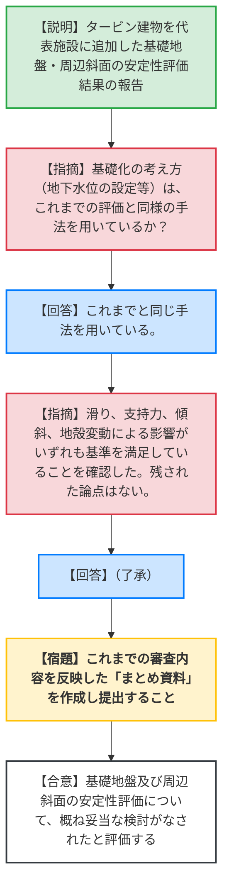
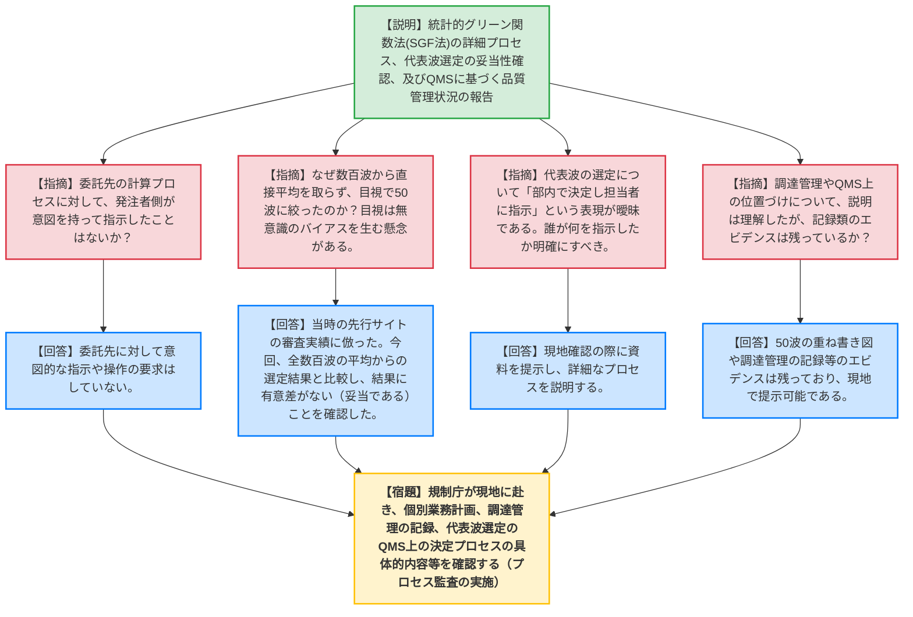

# 第1410回原子力発電所の新規制基準適合性に係る審査会合（令和8年5月29日）
> 出典 : https://youtube.com/live/hnC_HJCCgHk?si=iYORX2_t2AqWJBCg

# 会合の概要
* **最大の争点:** 中部電力の不正事案を受けた、島根原子力発電所3号炉の基準地震動策定（統計的グリーン関数法）における品質管理の実態。委託先に対する意図的な指示の有無や、代表波選定プロセス（目視による50波への絞り込み）において無意識のバイアスが介在していないかが厳しく問われた。
* **審査の進捗状況:** 議題1（基礎地盤及び周辺斜面の安定性評価）については、新たにタービン建物を評価対象に加えた結果が示され、基準を満足しているとして「概ね妥当」との評価を得て審査が実質的に完了した。議題2（地震動評価の品質管理）については、中国電力の自主的な説明により不正操作がないことが一定程度確認されたが、最終的な判断は規制庁による現地での記録類確認（プロセス監査）に委ねられた。
* **特筆すべき決定事項:** 統計的グリーン関数法による代表波選定において、当時の「目視による50波への絞り込み」という手法に対し、新たに「全波（数百波）の平均からの選定」による妥当性確認（クロスチェック）が行われ、結果に有意な差がないことが示された。これにより、規制側は当時の選定結果の妥当性について一定の納得を示した。

---

# 議題ごとの詳細整理

## 【議題1】中国電力（株）島根原子力発電所3号炉の基礎地盤及び周辺斜面の安定性評価について
* **議論の背景と論点:**
  前回の審査会合（3月27日）における指摘を受け、新たに代表施設として選定された「タービン建物」の安定性評価（滑り、支持力、傾斜、地殻変動による影響）を実施し、グループA'全体の安定性が確保されているかの確認が論点となった。

* **質疑応答（詳細）:**
    * **【説明者側】（中国電力 西村）:** グループA'としてタービン建物を追加し、動的FEM解析及び地殻変動解析を実施した。滑り安全率は最小2.12（ばらつき考慮で1.89）で基準値1.5を上回る。支持力（地震時最大接地圧3.67）、基礎底面の傾斜（1/27000）、地殻変動と地震動を考慮した最大傾斜（1/9000）のいずれも評価基準値を満足しており、十分な安全性を有している。
    * **【規制側】（規制庁 大井）:** 基礎化の考え方（地下水位の設定等）は、これまでの評価と同様の手法を用いているか。
    * **【説明者側】（中国電力 清木）:** これまでと同じ手法を用いている。
    * **【規制側】（規制庁 大井）:** タービン建物の各評価結果（滑り、支持力、傾斜、地殻変動）が基準値を満足していることを確認した。本日のコメント回答をもって残された論点はないため、これまでの審査内容を反映したまとめ資料を作成してほしい。
    * **【説明者側】（中国電力 清木）:** 承知した。

* **結論と宿題事項（アクションアイテム）:**
    * 基礎地盤及び周辺斜面の安定性評価については、すべての論点が解消され、概ね妥当な検討がなされたと評価された。
    * **【宿題】** これまでの審査内容を反映した「まとめ資料」を作成し、提出すること。

---

## 【議題2】中国電力（株）島根原子力発電所3号炉の地震動評価について（統計的グリーン関数法の詳細及び品質管理について）
* **議論の背景と論点:**
  中部電力の不正事案に関連し、中国電力が自主的に実施した統計的グリーン関数法（SGF法）の詳細プロセスと品質管理の検証結果の報告。乱数操作による恣意的な波形作成が行われていないか、代表波選定時の目視の絞り込みにバイアスがないか、またQMS（品質マネジメントシステム）が有効に機能していたかが論点となった。

* **質疑応答（詳細）:**
    * **【説明者側】（中国電力 井上・吉村）:** SGF法のプロセスにおいて、パラメータ設定と代表波選定は自社で、要素地震波作成から波形合成（①〜⑧）は委託先で実施した。乱数は位相と破壊伝播の揺らぎに使用している。代表波の選定は、数百波から目視で極端なピークを除いて50波に絞り、その平均との残差が最小となる1波を選定した。今回、全数百波の平均から選定した波と比較し、当時の選定が妥当であることを確認した。QMSについても、調達管理や社内承認プロセスが適切に実施されていたことを品質保証グループが確認した。
    * **【規制側】（規制庁 海田）:** SGF法の手順や乱数使用箇所、数百波の計算を行ったことは確認した。また、QMSに基づく社内プロセスが行われていたことも説明としては理解した。ただし、当時の耐震建築グループの取り組みと品質保証グループのプロセス確認の実態について、今後事務局が現地で記録類（個別業務計画、調達管理の委託・報告・自主検査記録等）を直接確認する。
    * **【説明者側】（中国電力 阿比留）:** 資料を準備し、現地確認時にしっかりと説明する。
    * **【規制側】（規制庁 名倉）:** 代表波選定時の50波の重ね書き図等は当時の記録として残っており、閲覧可能か。
    * **【説明者側】（中国電力 阿比留）:** 基本ケースや不確かさケースのエビデンスは残っており、現地で提示可能である。
    * **【規制側】（規制庁 大島部長）:** 委託先の作業（①〜⑧）に対して、発注者側（中国電力）が意図を持って指示していることはないか。また、50波の絞り込みで意図的に下（小さい波）だけを選ぶようなことはしていないか。
    * **【説明者側】（中国電力 阿比留）:** 委託先に対して意図的な指示はしていない。また、意図的に下を選ぶような操作もしていない。
    * **【規制側】（規制庁 大島部長）:** 代表波選定において「部内で決定し担当者に指示している」との表現があるが、部内のどこで決定し、何を指示したのかが曖昧である。現地確認で明確にしてほしい。
    * **【規制側】（山岡委員）:** なぜ数百波から直接平均を取らず、目視で50波を選んだのか。目視は無意識のバイアスを生む懸念がある。
    * **【説明者側】（中国電力 阿比留）:** 当時の先行サイトの審査実績に倣い、50波を選定する手順を採った。
    * **【規制側】（山岡委員）:** 今回、全波（数百波）からの選定と比較し、結果に差がないこと（妥当性）が確認できたのは重要である。

* **結論と宿題事項（アクションアイテム）:**
    * 統計的グリーン関数法による地震動評価のプロセスにおいて、一般的な手法が用いられ、意図的な不正操作の兆候は見られないことが自主報告により一定程度確認された。
    * **【宿題】** 今後、規制庁が中国電力へ赴き、現地で記録類（個別業務計画、調達管理の委託仕様書・中間報告・自主検査記録、代表波選定のQMS上の位置づけ、部内決定・指示の具体的内容等）のプロセス監査（事実確認）を実施すること。事業者はこれに対応する資料を準備すること。

---

# 論理構造の可視化（Mermaid）

## 【議題1】基礎地盤及び周辺斜面の安定性評価について

## 【議題2】地震動評価について（統計的グリーン関数法の詳細及び品質管理）

