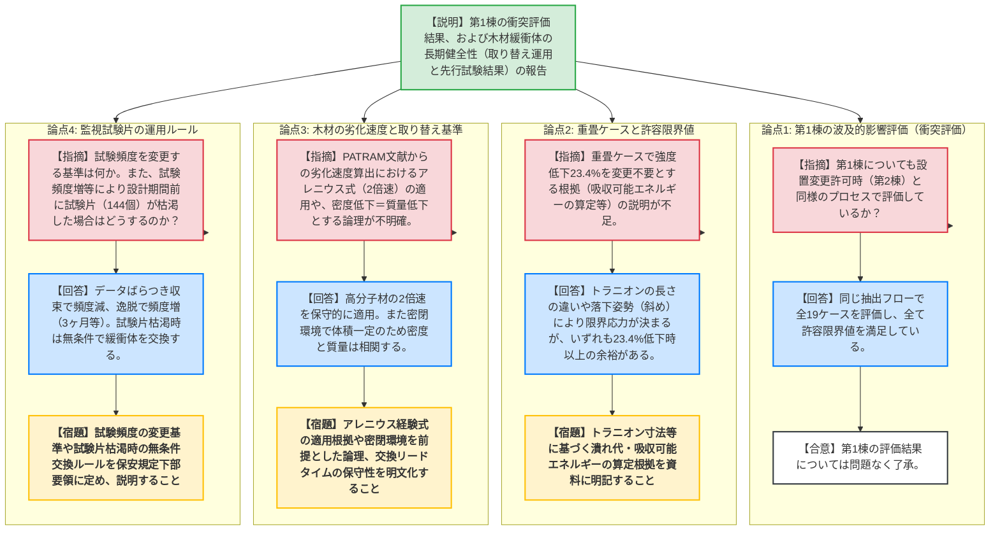

# 第1411回原子力発電所の新規制基準適合性に係る審査会合（令和8年6月2日）
> 出典 : https://youtube.com/live/1cJjrACNghE?si=kM_8FaH_guMLLYq6

# 会合の概要
* **最大の争点:** 使用済燃料乾式貯蔵施設で用いる「木材緩衝体」の長期健全性（熱的劣化による吸収エネルギー低下）の評価。未検証な部分が多い木材の経年変化に対し、事業者が提案した「取り替えを前提とした運用」および「監視試験片による先行確認」の妥当性と、その取り替え基準・頻度の保守性が焦点となった。
* **審査の進捗状況:** 第1棟の波及的影響評価（衝突評価）については、先行の第2棟と同様のプロセスで評価され、基準を満足していることが確認され概ね了承された。一方、木材緩衝体の長期健全性については、PATRAM文献等の最新知見とアレニウスの経験式を用いた劣化速度の算出過程、および監視試験片が枯渇した場合の対応等について説明不足が指摘され、次回以降へ持ち越しとなった。
* **特筆すべき決定事項:** 木材の長期健全性評価において、密度・質量の低下率と吸収エネルギーの相関関係を用いて取り替えを判断する運用方針の大枠は理解されたが、「最悪ケース（試験片が尽きた場合は無条件で交換する等）」の運用ルールを保安規定の下部要領（手順書）に明記し、次回会合でその詳細を説明することが決定した。

---

# 議題ごとの詳細整理

## 【議題1】東北電力（株）女川原子力発電所第2号機の使用済燃料乾式貯蔵施設の設置の工事に係る設計及び工事計画認可申請の審査について

* **議論の背景と論点:**
  前回の審査会合での指摘に基づき、①今回設工認申請範囲である「第1棟」の衝突評価が、設置変更許可時（第2棟を代表）と同様のプロセスで行われているか、②木材を内包する貯蔵用緩衝体の熱的劣化（経年変化）を考慮した長期健全性をどのように担保・管理するか、の2点が論点となった。

* **質疑応答（詳細）:**

  **① 第1棟の波及的影響評価（衝突評価）について**
    * **【説明者側】（東北電力 藤田）:** 第1棟についても第2棟と同様の事象抽出フローに基づき、転倒・衝突・除熱阻害の全19ケースを評価した。施設との衝突（ケース10, 13, 14）については今回新たに評価し、最も厳しいケース10を含め全て許容限界値を満足している。
    * **【規制側】（規制庁 藤川）:** 第1棟の評価が設置変更許可と同様のプロセスで行われ、判断基準を満足していることを確認した。これについて追加の指摘はない。

  **② 重畳ケースにおける緩衝体の許容限界値について**
    * **【規制側】（規制庁 藤川）:** 重畳ケース（ケース1：キャスク横転＋上部からの落下、ケース2：キャスク斜め落下＋上部からの落下）の評価で、緩衝体の強度低下23.4%を考慮した場合でも許容限界値を下回るとしているが、その説明（トラニオンの変形量や吸収可能エネルギーの算定等）が不足している。
    * **【説明者側】（東北電力 佐藤）:** ケース1はトラニオン（左右が上下より60mm長い）が架台に当たるまでの潰れ代で限界が決まる。ケース2は斜め（24度）のためトラニオンに当たらず65Gの応力限界で決まる。いずれのケースも、23.4%以上の強度低下があってもエネルギーを吸収できる余裕があるため、23.4%を限界値として適用することに問題はない。
    * **【規制側】（規制庁 藤川）:** 事実関係は理解したが、資料にその論理（トラニオンの長さの違い等）が書かれていないため、資料を充実させて再説明してほしい。

  **③ 木材緩衝体の長期健全性（取り替え判断基準と劣化速度）について**
    * **【説明者側】（東北電力 藤田）:** 先行確認試験（70℃・80℃での加速試験）の結果、1年間での有意な経年変化はなかった。これとPATRAM文献（140℃での質量低下率から算出した吸収エネルギー低下速度0.3）を用い、取り替え基準値に達するまで「13年」かかると評価した。交換に必要なリードタイムに対して十分な余裕がある。
    * **【規制側】（規制庁 島田）:** アレニウスの経験式（10℃2倍速）の適用や、PATRAM文献の「密度低下」を「質量低下」に置き換える妥当性、また2基同時の交換リードタイムを含め、保守的に見積もられていることの導出過程・根拠の説明が不十分である。密閉環境での体積一定という前提も含め、資料に明文化してほしい。
    * **【説明者側】（東北電力 佐藤）:** 木材は3.5倍速程度のデータもあるが保守的に高分子材の2倍速を適用した。また、密閉環境（カバープレート内）であるため体積膨張がなく、密度低下と質量低下は相関すると考えている。交換期間も1.5倍相当で対応可能。これらを含め資料にしっかり記載する。

  **④ 定期確認試験（監視試験片）の設置個数と頻度について**
    * **【規制側】（規制庁 皆川）:** 定期確認試験の頻度について、初期5年間は毎年実施し、その後は「最長3年間隔」としているが、頻度を変更する（あるいは高める）判断基準は何か。また、最大設置可能数（144個）をどう計画的に使っていくのか。
    * **【説明者側】（東北電力 佐藤・藤田）:** 初期はばらつきが大きいため毎年実施し、データが安定してくれば頻度を落とす。逆に片方のパラメータ（質量低下または吸収エネルギー）のみが連続して逸脱した場合などは、慎重に3ヶ月間隔等で継続確認する。
    * **【規制側】（規制庁 皆川・金城審議官）:** 試験頻度を高めた結果、設計貯蔵期間（60年）の途中で試験片（144個）が枯渇した場合はどうするのか。
    * **【説明者側】（東北電力 佐藤）:** その場合は、無条件で緩衝体本体の交換（取り替え）を行う。
    * **【規制側】（金城審議官）:** そのような最悪ケースの運用ルール（交換の決断）について、保安規定の下部要領等にしっかり明記し、次回資料でも説明すること。
    * **【説明者側】（東北電力 佐藤）:** 承知した。手順書等に運用詳細を記載する。

* **結論と宿題事項（アクションアイテム）:**
    * 第1棟の波及的影響評価については了承されたが、緩衝体の長期健全性評価に関する記述不足が多数指摘され、次回以降の面談・審査会合へ持ち越しとなった。
    * **【宿題】** 重畳ケースにおいて、トラニオンの寸法差や落下姿勢に基づく潰れ代・吸収可能エネルギーの算定根拠（23.4%低下の妥当性）を資料に明記すること。
    * **【宿題】** PATRAM文献からの劣化速度算出におけるアレニウス経験式（10℃2倍速）の適用根拠、および密閉環境を前提とした密度低下＝質量低下とする論理を明文化すること。
    * **【宿題】** 監視試験片の定期確認頻度を変更する判断基準、および試験片が枯渇した場合の「無条件交換」等の運用ルールを保安規定下部要領に定め、資料で説明すること。

---

# 論理構造の可視化（Mermaid）

## 【議題1】女川原子力発電所第2号機 使用済燃料乾式貯蔵施設の設置工事（波及的影響・緩衝体健全性）

