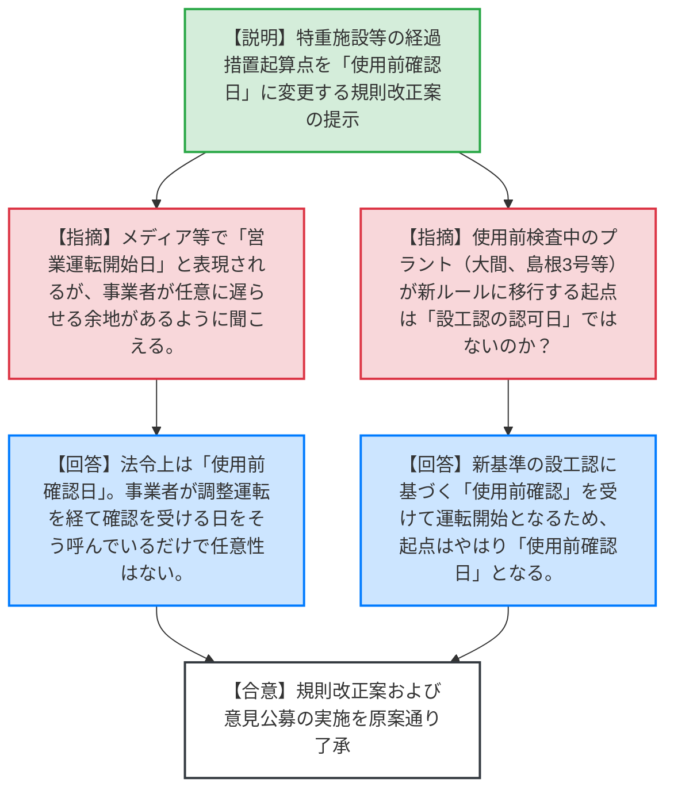
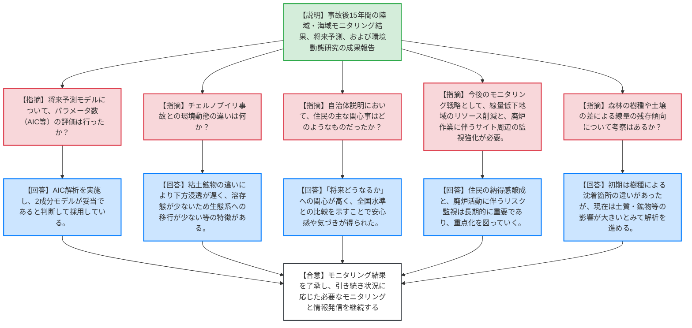
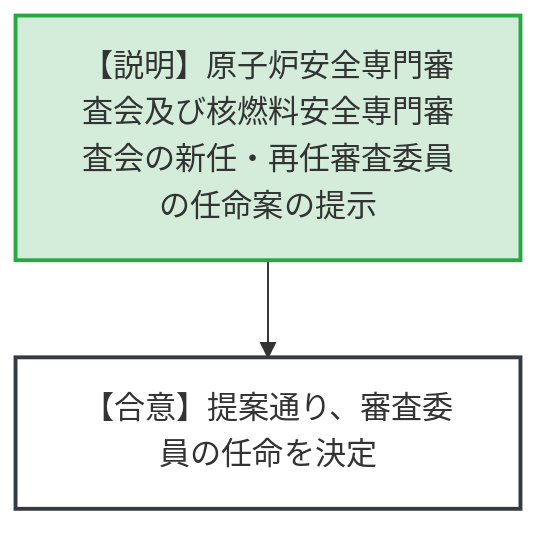

# 第12回原子力規制委員会（令和8年6月3日）
> 出典 : https://youtube.com/live/g_G1DY97UGE?si=aZdo67t6aRhWC2Lx

# 会合の概要
* **最大の争点:** 議題1における「特重施設等の経過措置期間の起算点の変更」に関して、メディア等で用いられる「営業運転開始日」という表現が、事業者に任意で起算点を遅らせることができるような誤解を与えないか、また、使用前検査中のプラントに対する新ルールの適用タイミングが技術的な確認事項となった。
* **審査の進捗状況:** 議題2において、福島第一原発事故後15年間の環境放射線モニタリングの包括的な結果が報告された。空間線量率の低下傾向が定量的に示され、チェルノブイリ事故との環境動態の違い（生態系移行の少なさ等）など科学的知見の蓄積が確認された。
* **特筆すべき決定事項:** 特重施設および第三電源の経過措置規定の起算点を「本体施設の使用前確認日」に変更する規則改正案、およびこれに対する意見公募の実施が了承された。また、今後のモニタリング戦略として、リソースの重点化と廃炉作業進展に伴う飛散監視の重要性が共有された。

---

# 議題ごとの詳細整理

## 【議題1】実用発電用原子炉及びその附属施設の位置、構造及び設備の基準に関する規則及び実用発電用原子炉及びその附属施設の技術基準に関する規則の改正案及び意見公募の実施
* **議論の背景と論点:**
  特重施設及び第三電源の設置猶予期間（経過措置期間）の起算点を、従来の「経過措置計画の認可の日」から「本体施設の使用前確認日」へ変更する規則改正案の審議。起算点となる日の法的な位置づけや、現在「使用前検査中」のプラントに対する新ルールの適用タイミングが論点となった。

* **質疑応答（詳細）:**
    * **【説明者側】（規制庁 田口）:** 特重施設等の経過措置規定の起算点を「使用前確認日」に変更する規則改正案を作成した。事業者とは、経過措置期間が見直されても特重施設の設置を速やかに進める方針であることを面談で確認済みである。
    * **【規制側】（山岡委員）:** メディア等で起算点を「営業運転開始日」と表現しているが、これは正確か。事業者の都合で起算点を任意に遅らせることができるような印象を与える。
    * **【説明者側】（規制庁 田口）:** 法令上はあくまで「使用前確認日」である。事業者が調整運転を経て最終的に使用前確認を受ける日を実務上「営業運転開始日」と呼んでいるだけであり、事業者が任意に時期をずらせるわけではない。
    * **【規制側】（山中委員長）:** 大間、東通1号、島根3号など現在「使用前検査中」の施設が新しいルールに乗り換わる起点は「設工認の認可日」ではないのか。
    * **【説明者側】（規制庁 片野）:** 現在の使用前検査は過去の工事計画に基づくもの。今後、新規制基準に基づく設工認が出され、それに対する「使用前確認」を受けて運転開始となるため、起点はやはり「使用前確認日」となる。

* **結論と宿題事項（アクションアイテム）:**
    * 規則改正案および意見公募（パブリックコメント）の実施について、原案通り了承された。宿題事項はなし。

---

## 【議題2】東京電力福島第一原子力発電所事故後15年間の福島県における環境放射線モニタリングの状況
* **議論の背景と論点:**
  事故後15年の節目として、陸域・海域の環境放射線モニタリング結果とJAEAによる環境動態研究の成果が報告された。将来予測モデルの妥当性、チェルノブイリ事故との環境動態の違い、および今後のモニタリング戦略（リソースの最適化）が論点となった。

* **質疑応答（詳細）:**
    * **【説明者側】（規制庁 川口・古川、JAEA 吉村）:** 空間線量率は物理減衰、ウェザリング、除染により時間とともに低下している。将来予測（2041年）でもさらに低線量エリアが拡大する。海域のセシウム濃度も減少し、ALPS処理水放出による一時的なトリチウム濃度上昇も基準を大幅に下回っている。
    * **【規制側】（山岡委員）:** 空間線量率の将来予測モデルについて、パラメータを増やして精度を評価するAIC（赤池情報量規準）のような手法は試したか。
    * **【説明者側】（JAEA 吉村）:** モニタリングポストのデータに対してAIC解析を行い、結果として2成分モデルが妥当であるとの判断に至っている。
    * **【規制側】（長﨑委員）:** 福島のセシウムの環境動態は、チェルノブイリ事故と比べてどのような違いがあるか。
    * **【説明者側】（JAEA 吉村）:** 土壌鉱物（粘土鉱物）の違いにより、福島では土壌下方への浸透が遅い。また、水系での溶存態セシウムの割合が低いため生態系への移行が少なく、河川での濃度低下が早いという特徴がある。
    * **【規制側】（神田委員）:** 自治体への説明において、地元住民からの強い要望や知りたい情報はどのようなものだったか。
    * **【説明者側】（規制庁 古川）:** 「今後どうなっていくのか」という将来への関心が最も高かった。また、全国の放射線量水準と比較して示すことで、「全国範囲内に入っている」という新たな気づき・安心感を持ってもらえた。
    * **【規制側】（杉山委員）:** 今後も現在のリソースを投入し続けるのか。線量が低下した地域ではモニタリングポストの廃止やサーベイ頻度を減らし、重要な箇所にリソースを回す戦略が必要。また、今後の廃炉作業（高線量域での作業）によるダスト飛散監視が重要になる。
    * **【説明者側】（規制庁 川口）:** 住民の納得感を得るためにも情報発信は継続が必要。廃炉活動に伴うサイト周辺のモニタリングは長期的にも継続すべき重要な項目であると認識している。
    * **【規制側】（山中委員長）:** 森林の種類（針葉樹・広葉樹）や土壌の差による線量の残り具合の違いについて考察はあるか。
    * **【説明者側】（JAEA 吉村）:** 事故初期は葉の有無等で沈着箇所に違いがあったが、現在は土質・鉱物・地質の影響が大きいと考えており、今後さらにデータ解析を進める。

* **結論と宿題事項（アクションアイテム）:**
    * 報告内容を了承。
    * **【合意】** 今後も廃炉作業の進展に伴う飛散リスク等に備え、重点化を図りつつ必要な環境モニタリングと国内外への情報発信を継続していく。

---

## 【議題3】原子炉安全専門審査会及び核燃料安全専門審査会の審査委員の任命
* **議論の背景と論点:**
  両審査会の新任および再任の審査委員の任命について。

* **質疑応答（詳細）:**
    * **【説明者側】（規制庁 坂本）:** 両審査会の新任候補者および再任候補者への就任打診が完了し、別紙の通り10月1日以降の任命案を提示する。
    * **【規制側】（委員全員）:** 特段の意見なし。

* **結論と宿題事項（アクションアイテム）:**
    * 別紙の通り、審査委員の任命を決定した。

---

# 論理構造の可視化（Mermaid）

## 【議題1】規則改正案及び意見公募の実施

## 【議題2】福島県における環境放射線モニタリングの状況

## 【議題3】審査委員の任命

