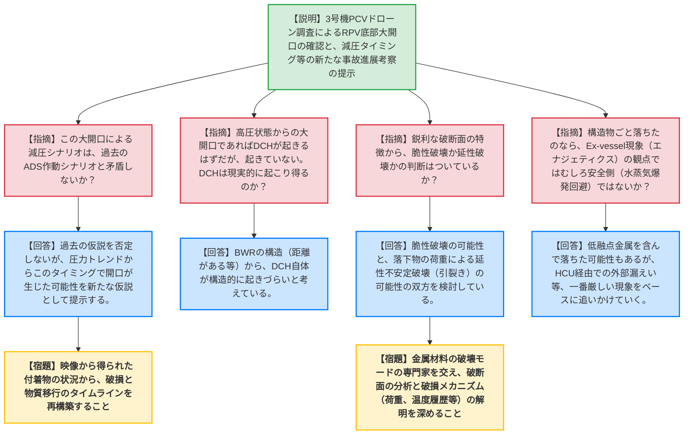
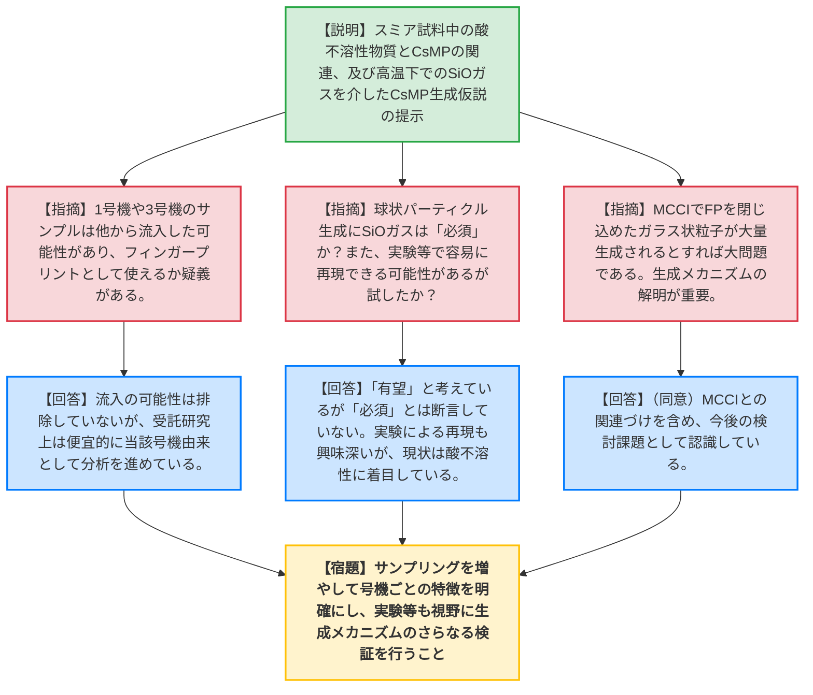
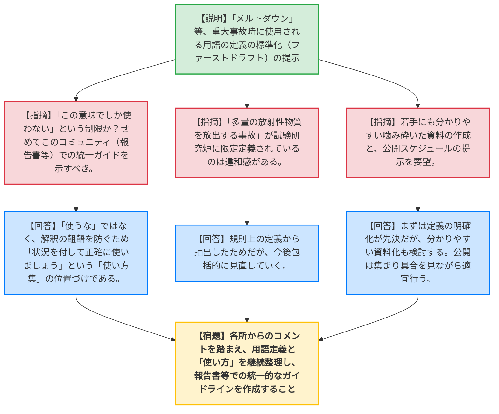

# 第55回東京電力福島第一原子力発電所における事故の分析に係る検討会（令和8年6月5日）
> 出典 : https://youtube.com/live/uUwpvpHBtjI?si=jj_kIqI28oMFHuNW

# 会合の概要
* **最大の争点:** 3号機ペデスタル内のドローン調査で新たに確認された「RPV（原子炉圧力容器）底部の鋭利かつ広範囲な大開口」の成因および破損タイミング。従来有力視されていたADS（自動減圧系）作動による減圧シナリオに加え、ドローン映像と圧力トレンドから「溶融物や構造物（CRガイドチューブ等）の落下による荷重で、下鏡が延性・脆性破壊を起こして大きく抜け落ちた」という新たな仮説が提示され、DCH（格納容器直接加熱）やEx-vessel（炉外）現象のリスク評価を含めた激しい議論が交わされた。
* **審査の進捗状況:** 議題1〜3では、東電によるPCV内部気中部ドローン調査の鮮明な画像・映像をもとに、規制庁が独自に破断面やHCU（水圧制御ユニット）への逆流メカニズムを考察し、新たな事故進展シナリオの可能性が提示された。議題4ではJAEAよりスミア試料中の酸不溶性物質とCsMP（セシウムマイクロパーティクル）の関連、およびSiOガスを介した生成仮説が示された。議題5の重大事故時の用語定義については、コミュニケーションの齟齬を防ぐ「使い方集」としての方向性が確認された。
* **特筆すべき決定事項:** 新たなドローン映像の分析により、3号機のRPV底部は「小さな穴からの徐々なる拡大」ではなく、「構造物の落下に伴う急激な崩落」であった可能性が高まり、これが事故進展解析の前提条件を大きく変え得る（抜本的な見直しが必要となる）という認識が全体で共有された。

---

# 議題ごとの詳細整理

## 【議題1〜3】3号機PCV内部気中部調査(マイクロドローン調査)について、同調査結果を踏まえた考察等、及びHCUに係る調査状況
* **議論の背景と論点:**
  手のひらサイズのマイクロドローンを用いて3号機PCV内のペデスタル内部やRPV底部周辺の調査が行われた。この鮮明な映像から、RPV底部の破損形態（鋭利な破断面、大開口）やCRD（制御棒駆動機構）ハウジングサポートの傾斜、HCU配管への溶融物・汚染水の逆流状況が明らかとなり、これらが従来の事故進展シナリオ（減圧タイミングやDCH発生の有無等）にどう影響するかが論点となった。

* **質疑応答（詳細）:**
    * **【説明者側】（東電 溝上）:** ドローン調査の結果、X53ペネ近傍の線量（0.6Gy/h）やPLR配管の鉛遮蔽溶融を確認。ペデスタル内では、CRDプラットフォームの急激な傾斜、透明度の高い水面と堆積物、多数のCRガイドチューブ（CRGT）の落下、さらに上部ではRPV底部の半円状の穴（CRD貫通部）や断面が直接確認でき、RPV下部に大きな穴が開いていることが判明した。
    * **【説明者側】（規制庁 宮本）:** 映像の考察として、RPV下鏡のセントラルディスク境界付近が鋭利に破断している。3号機には下端を拘束するレストレントビームが無く、落下物や水素爆発の振動でサポートが損傷・傾斜し、RPV下鏡の大きな損傷に繋がった可能性がある。また、3月13日9時頃の減圧トレンド（1MPaで推移）は、ADS作動だけでなくRPV損傷発生を示唆している可能性がある。
    * **【有識者】（原電 宮田）:** 減圧タイミングについて、従来はADS作動として納得感があったが、このタイミングでRPVが大開口するほどリロケーションが進展していたのか？
    * **【説明者側】（規制庁 宮本・岩永）:** 従来のADSやSRV作動の仮説を否定するものではないが、圧力の全体トレンド（減圧後に再上昇していない点）から、この時点で開口が生じた可能性を新たなサジェッションとして提示している。
    * **【有識者】（山地委員）:** 破損は単一ではなく複数回のイベントがあり、上部から下部へという順番だったのではないか。堆積物や付着物からヒストリーが追えないか。
    * **【説明者側】（規制庁 岩永）:** ハウジングの付着物の状況等から時間的な順番を追える可能性があり、今後検討したい。
    * **【有識者】（星委員）:** これほどの大開口で高圧状態から破損したとすれば、DCH（高圧溶融物噴出による格納容器直接加熱）が起きるはずだが、実際には起きていない。DCHは現実的に起こり得るのか。
    * **【説明者側】（規制庁 丸山）:** DCHは高圧で噴出してバラバラになるというより、ブローダウンの不安定性で生じる。BWRの場合は距離があるため、構造的にDCHは起きづらいと考えている。
    * **【有識者】（福田委員）:** CRDやRPV構造物と一緒に溶融物が落ちてきているなら、Ex-vessel phenomena（炉外現象：エナジェティクス）の観点では、むしろ有利な（激しい水蒸気爆発等を避けた）事象ではないか。
    * **【説明者側】（規制庁 岩永）:** 一部は低融点金属を含んでおり、ごっそり落ちたことで厳しい現象を避けられた可能性もあるが、まずは一番厳しい現象（HCU経由での外部への漏えい等）を追いかけていく方針。
    * **【有識者】（山中委員長）:** 鋭利な破断面の特徴から、破損モード（脆性破壊か延性破壊か）の考察はどうなっているか。
    * **【説明者側】（規制庁 宮本）:** 鋭利な面は脆性破壊の可能性がある一方、周辺が引っ張られたような延性不安定破壊（引裂き）の痕跡もある。小さな開口から落下物の荷重で一気に引き裂かれた可能性等、複合的な要因を検討している。
    * **【有識者】（三菱重工 浦田）:** HCU配管への逆流について、出口側（サージタンク等）が詰まると圧力が抜けないため、HCUのさらに向こう側に高汚染エリアがあるのではないか。
    * **【説明者側】（規制庁 宮本・東電 溝上）:** スクラム排出ヘッダーが行き止まりとなるが、まだそこへのアクセス・線量測定はできていない。逆止弁の信頼性や、系統内のきれいな水がどう押し出されたかを含めてメカニズムを検討中。

* **結論と宿題事項（アクションアイテム）:**
    * ドローンによる鮮明な映像は、RPV下部の大開口という新たな事実を提示しており、これを今後の事故進展解析の前提条件として反映させることが合意された。
    * **【宿題】** 金属材料の破壊モード（脆性・延性破壊）の専門家をチームに招き入れ、破断面の分析と破損メカニズムの解明を深めること。
    * **【宿題】** 映像から得られた付着物や構造物の落下状況から、破損と物質移行のタイムライン（履歴）を再構築すること。

---

## 【議題4】1～3号機の原子炉建屋内スミア試料の分析結果に基づく号機ごとの事故進展及び核種放出挙動に係る調査：高温環境下における粒子状Csの成因
* **議論の背景と論点:**
  1F建屋内で採取されたスミア試料の逐次溶解法による分析から、酸不溶性物質（HF溶解分）の存在が確認された。これが環境中で見つかっているセシウムマイクロパーティクル（CsMP）と関連があるか、また、CsMPがどのような高温環境下（特にSiOガスの関与）で生成されたかという成因仮説が論点となった。

* **質疑応答（詳細）:**
    * **【説明者側】（JAEA 木戸）:** スミア試料の分析で全サンプルから酸不溶性物質が確認され、Csとケイ酸塩の共存が示唆された。環境中の球状CsMPはケイ酸塩ガラスが主成分であり、MCCI（溶融炉心・コンクリート相互作用）等の高温下でジルコニウム等の還元によりSiOガスが生成し、それが急冷・凝縮（核生成）して微粒子となる過程で金属酸化物や揮発性FPを取り込み、球状CsMPに成長したという仮説を提案する。
    * **【有識者】（東電 溝上）:** 1号機や3号機は建屋が破損しており、採取されたサンプルが本当にその号機由来のものか（フィンガープリントとして使えるか）疑義があるのではないか。
    * **【説明者側】（JAEA 木戸）:** 他からの流入の可能性は排除していないが、受託研究上は便宜的に当該号機由来として分析している。2号機は建屋が健全なため2号機由来と考えている。
    * **【有識者】（山中委員長）:** 号機特有のものかを判断するには、さらにサンプルを増やして検証すべき。また、球状パーティクル生成にSiOガスが「必須」なのか。MgOとSiOを混ぜた実験等で容易に再現できる可能性もあるので検討してはどうか。
    * **【説明者側】（JAEA 木戸）:** SiOガスが「有望」と考えているが「必須」とまでは詰めていない。実験による再現も興味深いが、現状は酸不溶性という点に着目しており、パーティクル生成にどこまでこだわるかは今後の課題。
    * **【有識者】（山中委員長）:** MCCIが起こるとFPを閉じ込めたガラス状粒子（CsMP）が大量に生成されるとすれば、それは大問題である。MCCIとCsMP生成の関連づけは非常に重要である。
    * **【規制側】（委員等）:** （木戸への質問）SEM像で見せた3μmの粒子が、なぜそれ以上（10μm等）に成長しなかったのか。
    * **【説明者側】（JAEA 木戸）:** SiOガスが足りなかったか、温度差などの条件によるものと考えられるが、複雑な要因が絡むため結論は難しい。

* **結論と宿題事項（アクションアイテム）:**
    * スミア試料の分析とCsMPの成因仮説について、一定の方向性が共有された。
    * **【宿題】** 号機ごとの特徴（フィンガープリント）をより明確にするため、スミア試料のサンプリングと分析を継続し、実験等も視野に入れた生成メカニズムのさらなる検証を行うこと。

---

## 【議題5】重大事故時関連の用語の定義について
* **議論の背景と論点:**
  1F事故時に「メルトダウン」などの用語が一人歩きし、コミュニケーションの齟齬が生じた反省から、重大事故関連の専門用語の定義を標準化する取り組み。用語の使用を制限するのか、あるいは正確な使用を促すためのガイドとするのか、その位置づけが論点となった。

* **質疑応答（詳細）:**
    * **【説明者側】（規制庁 栃尾）:** IAEAやNRC等の定義を調査し、共通定義があるものは採用、曖昧なもの（例：メルトダウン）については、状況（圧力容器内か、格納容器内か等）を付記して使用するよう整理したファーストドラフトを提示した。
    * **【有識者】（杉山委員・三菱重工 浦田）:** 「この意味でしか使わない」あるいは「使わない方がいい用語集」なのか。せめてこのコミュニティ（報告書等）では統一したガイドラインとして示すべきではないか。
    * **【規制側】（規制庁 川崎・栃尾）:** 「使うな」ではなく、解釈が分かれるため「状況を付して正確に使いましょう」という「使い方集」としての位置づけである。
    * **【有識者】（山中委員長）:** これまでの報告書を整理し、我々の語句の使い方が一定してくるとありがたい。
    * **【有識者】（原電 宮田）:** 「多量の放射性物質を放出する事故」という一般的な表現が、試験研究炉に限定して定義されているのは違和感がある。
    * **【説明者側】（規制庁 栃尾）:** 規則上の定義から抽出したためそうなっているが、今後包括的に見直していく。
    * **【有識者】（東電 今井）:** 「重大事故に関連する用語」ではなく「重大事故時に使用される用語」としているのは、事故発生時のコミュニケーションエラー防止が主眼ということか。
    * **【説明者側】（規制庁 栃尾）:** その通り。緊急時に使われるワードを見据え、放射線分野等にも広げて整備していきたい。
    * **【有識者】（1F室 石川）:** 若手などが業務で用語を調べる際の手間を省くため、噛み砕いた分かりやすい資料も作成してほしい。公開のスケジュール感はどうか。
    * **【説明者側】（規制庁 栃尾）:** まずは定義をはっきりさせることが先決だが、分かりやすい資料化も次のステップとして検討する。公開は集まり具合を見ながら適宜（技術ノート等で）行う予定。

* **結論と宿題事項（アクションアイテム）:**
    * 用語定義のファーストドラフトについて、方針が概ね了承された。
    * **【宿題】** 委員や事業者からのコメントを踏まえ、用語の定義と「使い方」を継続して整理し、報告書等での統一的な使用に向けたガイドライン（またはレポート）の作成を進めること。

---

## 【議題6】その他（令和7年度委託事業等報告資料）
* **議論の背景と論点:**
  昨年度実施した委託事業の報告書（スミア分析、水素燃焼試験、ペデスタルコンクリート関係等）が中間取りまとめの別添資料として提出された。

* **質疑応答（詳細）:**
    * **【説明者側】（規制庁 宮本）:** 昨年度の委託事業の成果物として報告書を添付した。内容は過去の検討会で報告済みのため詳細は割愛する。
    * **【有識者】（委員全員）:** 特段の質問・コメントなし。

* **結論と宿題事項（アクションアイテム）:**
    * 委託事業等報告資料の提出を受理し、特段の宿題事項なし。

---

# 論理構造の可視化（Mermaid）

## 【議題1〜3】3号機PCV・RPV内部のドローン調査結果と考察、HCUに係る調査状況

## 【議題4】1～3号機の原子炉建屋内スミア試料の分析結果...（高温環境下における粒子状Csの成因）

## 【議題5】重大事故時関連の用語の定義について

