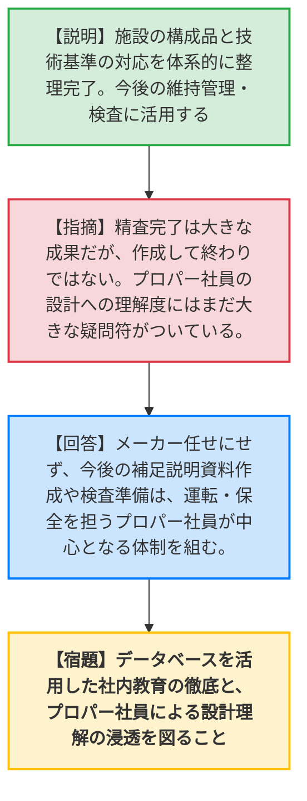
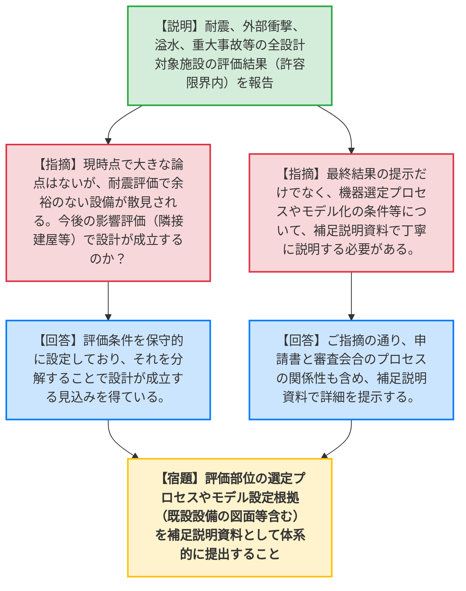
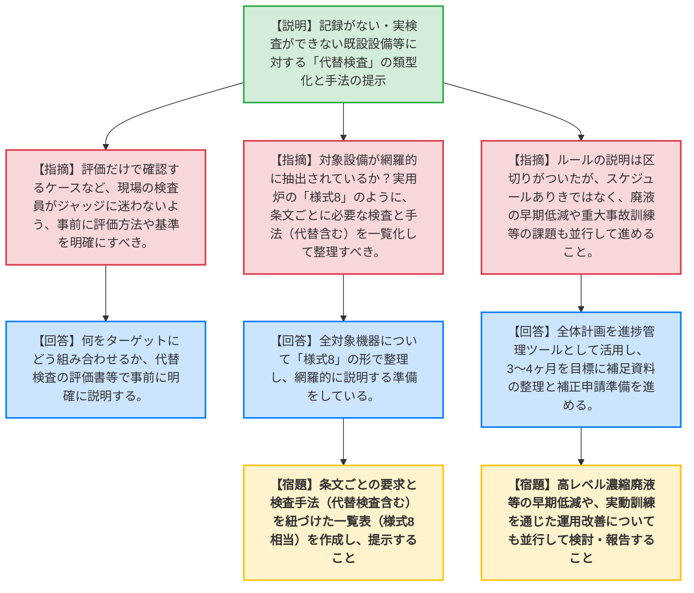

# 第585回核燃料施設等の新規制基準適合性に係る審査会合（令和8年6月8日）
> 出典 : https://youtube.com/live/2mSbo4oPWt4?si=YgeyLdq60nE-BROk

# 会合の概要
* **最大の争点:** 再処理施設等の設工認審査において、約1年間続いた設計ルールの説明が「一通り完了」した。しかし、規制庁からは「書類上の説明が終わっただけであり、本格的な技術的確認はこれから。特に現場のプロパー社員の設計への理解度にはまだ疑問符がつく」と厳しい指摘がなされ、今後の補正申請に向けた事業者側の設計理解の浸透と、根拠となる補足説明資料の充実が最大の課題となった。
* **審査の進捗状況:** 耐震設計、外部衝撃、溢水・化学薬品、重大事故等対処設備（保管・計装）などの全ての設計結果が示され、現時点で許容限界を超えるような致命的な技術的課題（NGの見通し）はないことが確認された。また、記録がない既設設備等のための「代替検査」の枠組み（類型化）が提示された。
* **特筆すべき決定事項:** 日本原燃は今後3〜4ヶ月程度をかけて、各種評価条件や代替検査の手法（実用炉の様式8相当の整理等）を補足説明資料として体系化し、並行して高レベル濃縮廃液の早期低減や重大事故訓練の取り組みを進めながら、補正申請書の作成準備を進めることで合意した。

---

# 議題ごとの詳細整理

## 【議題】日本原燃株式会社再処理事業所再処理施設及び廃棄物管理施設の設計及び工事の計画の認可申請について

### 1. 申請対象施設の精査状況と設計への理解
* **議論の背景と論点:**
  施設数や構成品すら正確に把握できていなかった状態から、1年以上をかけて対象施設を精査し、技術基準や図面と紐づける整理が完了した。この成果を単なる申請用の書類で終わらせず、現場の維持管理や検査にどう活用・浸透させるかが論点となった。
* **質疑応答（詳細）:**
    * **【説明者側】（日本原燃 田中）:** 施設の数や構成品を把握し、技術基準との対応関係を体系的に整理した。今後の検査や維持管理の入り口として社内に浸透させる。
    * **【規制側】（規制庁 長谷川、長﨑委員）:** 精査の完了は大きな成果だが、作成して終わりではない。今後、このデータベースを施設の管理や重大事故対応、教育へ確実に活用することが重要。また、日本原燃が一通り説明を終えたというが、メーカー等の支援に頼りきりであり、プロパー社員が設計をどこまで深く理解できているかには大きな疑問符がついている。規制側としてはようやく本格的な確認が始められる状態である。
    * **【説明者側】（日本原燃 大垣）:** 設計を理解する取り組みは続けていく。今後の補足説明資料の作成や検査・保安規定の準備には、運転・保全を担うプロパー社員が中心になって進められるよう体制を組んでいく。

### 2. 各種設計結果（耐震・外部衝撃・重大事故等）と補足説明の充実
* **議論の背景と論点:**
  耐震設計（質点系、はりモデル、FEM等）、外部衝撃（竜巻、火山、外部火災等）、溢水・化学薬品漏えい、重大事故等対処設備（保管・計装）のすべての評価結果が示され、許容限界内であることが説明された。今後の「影響評価（隣接建屋や水平2方向地震力等）」の段階で設計が成立する見通しや、評価プロセスの妥当性の証明が論点となった。
* **質疑応答（詳細）:**
    * **【説明者側】（日本原燃 各担当）:** すべての施設について評価を実施し、発生する応力等が許容限界内であることを確認した。可搬型設備の保管についても、ハザード防護や地震対策（固縛等）、制限時間内のアクセスを考慮して場所を選定している。
    * **【規制側】（規制庁 浜崎、宇都宮、安田）:** 現時点で大きな技術的論点（NGとなる見通し）はない。しかし、耐震評価において許容限界に近い余裕のない設備が散見される。今後の影響評価で本当に設計が成立するのか。また、最終結果だけでなく、機器選定のプロセスやモデル設定の根拠（既設設備の図面等含む）を補足説明資料で丁寧に説明すること。
    * **【説明者側】（日本原燃 星野・本）:** 条件を保守的に設定しており、それを分解することで設計が成立する見込みを得ている。ご指摘の通り、結果だけでなくプロセスも含めて補足説明資料でしっかり提示する。

### 3. 使用前事業者検査の対応方針（代替検査）
* **議論の背景と論点:**
  新規制基準の要求追加等により、建設当時の記録がない、あるいはセル内等で実検査ができない既設設備に対して、どのような手法（代替検査）で技術基準への適合性を確認するかが論点となった。
* **質疑応答（詳細）:**
    * **【説明者側】（日本原燃 白子）:** 代替検査を類型化（A:仕様表対象、B:既設溶接部、C:系統機能）した。記録がない場合でも、設計図書、品質管理監査記録、工場検査要領書と据付検査記録の組み合わせ、あるいは同様の施工条件の溶接部記録（RT記録）の類推や強度評価を組み合わせて適合性を確認する。
    * **【規制側】（規制庁 寒川、高瀬）:** 評価だけで確認するケースなど、ジャッジする基準が現場の検査員で迷わないよう、事前に評価方法を明確にすべき。対象設備が網羅的に抽出されていることを示し、実用炉の「様式8」のように、条文ごとに必要な検査と手法（代替検査含む）を一覧化して整理・説明すること。
    * **【説明者側】（日本原燃 建徳）:** ご指摘の通り、全対象機器について様式8の形で整理し、どの設備にどの検査手法を適用するか網羅的に説明する準備をしている。

### 4. 今後の進め方と補正申請に向けた課題
* **議論の背景と論点:**
  一通りの設計ルールの説明を終え、補正申請に向けた準備期間（3〜4ヶ月）のスケジュールの妥当性と、並行して進めるべき課題（廃液低減、重大事故訓練等）が論点となった。
* **質疑応答（詳細）:**
    * **【説明者側】（日本原燃 長谷川）:** 3〜4ヶ月程度で資料整理を行い、技術的確認を進めながら補正申請書の作成準備を進める。
    * **【規制側】（規制庁 平山、熊谷）:** スケジュールありきではなく、審査官の指摘に対して丁寧に対応し、施設への理解を深めること。「全体計画」の資料は進捗管理のコミュニケーションツールとして引き続き活用してほしい。また、高レベル濃縮廃液の早期低減や、重大事故訓練での実効性確認といった課題も同時並行で進めること。
    * **【説明者側】（日本原燃 長谷川）:** 補足説明資料の作成状況など進捗を示しつつ、オールジャパンで体制を強化して準備を進める。

---

# 論理構造の可視化（Mermaid）

## 1. 申請対象施設の精査状況と設計への理解

## 2. 各種設計結果と補足説明の充実（耐震・外部衝撃・重大事故等）

## 3. 使用前事業者検査の対応方針と今後の進め方

