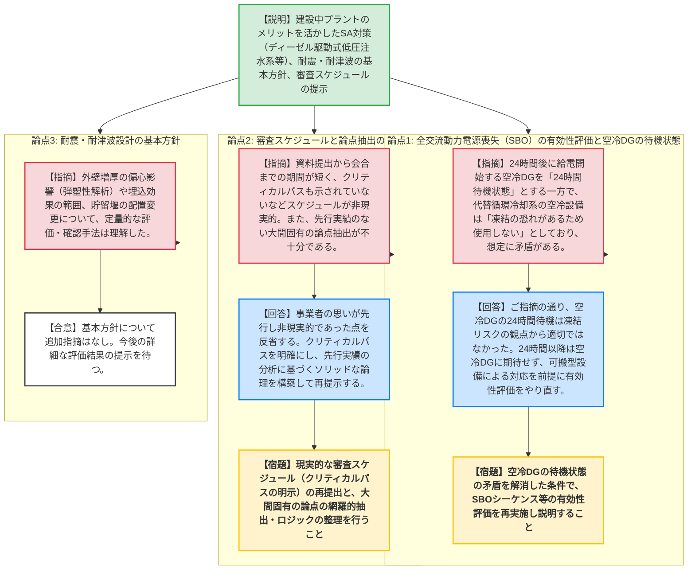
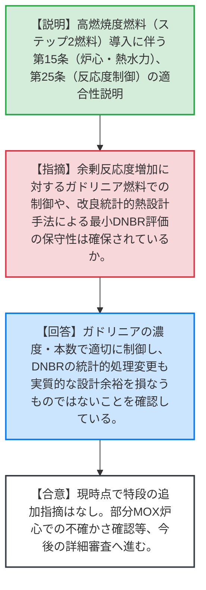
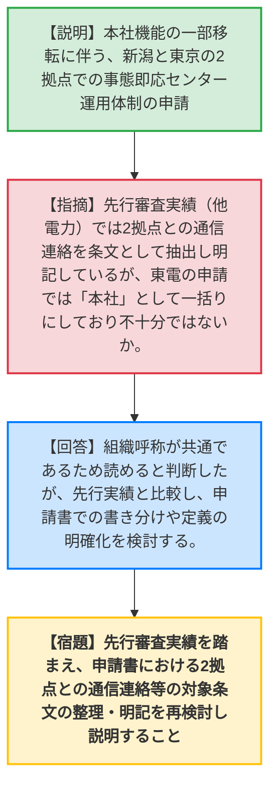

# 第1412回原子力発電所の新規制基準適合性に係る審査会合（令和8年6月9日）
> 出典 : https://youtube.com/live/n1aRs4GYA_M?si=fyEXXdweWNkmfhU8

# 会合の概要
* **最大の争点:** 大間原子力発電所の重大事故等対策（SA対策）において、建設中プラントのメリットを活かした「ディーゼル駆動式低圧注水系（FLSD）」の導入等の有効性。特に、全交流動力電源喪失（SBO）時の対応において、空冷式ディーゼル発電機（空冷DG）の待機状態の想定（エアフィンクーラーの凍結リスク等）に矛盾があることが指摘され、有効性評価の前提条件（シナリオ）の根本的な見直しが求められた。
* **審査の進捗状況:** 大間原発のSA対策の全体像、ディーゼル駆動式低圧注水系の有効性、技術的能力1.0（共通事項）、耐震・耐津波設計の基本方針について説明が行われた。耐震・耐津波設計の評価方針（外壁増厚の影響、埋込効果の範囲、貯留堰の配置変更等）については概ね合意されたが、SA対策の有効性評価と説明スケジュール（クリティカルパスの明示）については大幅な改善・再整理が命じられた。高浜3・4号炉の高燃焼度燃料導入（議題2）と、柏崎刈羽の新潟即応センター追加（議題3）については、特段の大きな追加指摘はなく、今後の詳細確認へ進むことが了承された。
* **特筆すべき決定事項:** 大間原発のSBOシーケンスの有効性評価において、空冷DGを「24時間待機状態」とする想定は凍結リスクの観点から非現実的であると事業者が認め、24時間以降も空冷DGからの電源供給に期待せず、可搬型設備に期待する条件で有効性評価をやり直すことが決定した。また、今後の審査スケジュールにおいて、クリティカルパスを明確にした現実的な工程表を再提出することが指示された。

---

# 議題ごとの詳細整理

## 【議題1】電源開発（株）大間原子力発電所の設計基準への適合性及び重大事故等対策について

* **議論の背景と論点:**
  大間原発の新規制基準適合性審査において、建設中プラントの利点を活かしたSA対策（ディーゼル駆動式低圧注水系、外壁増厚等）の有効性評価、技術的能力の共通事項、耐震・耐津波設計の基本方針が論点となった。特に、SBOシーケンスにおける空冷DGの待機状態の妥当性や、審査スケジュールの現実性が厳しく問われた。

* **質疑応答（詳細）:**

  **① SA対策の全体像とディーゼル駆動式低圧注水系（FLSD）、有効性評価**
    * **【説明者側】（電源開発 大島・浮須・久保田）:** DBA設備と多様性・独立性・位置的分散を図るため、常設SAとして電動駆動設備を主体としつつ、それを補完するFLSDを導入する。SBO時の有効性評価（長期TB、TBU、TBD等）において、炉心損傷防止と格納容器破損防止が達成できることを確認した。
    * **【規制側】（規制庁 吉川）:** 有効性評価において、交流電源喪失後24時間後に空冷DGで給電開始としているが、その空冷DGの冷却設備（エアフィンクーラー等）には「24時間前から電源供給し待機状態とする」としている。一方で代替循環冷却系のエアフィンクーラーは「凍結の恐れがあるため使用しない」としており、説明に矛盾がある。
    * **【説明者側】（電源開発 塩田）:** 指摘の通り、空冷DGを24時間停止させると冷却水凍結の恐れがあり、24時間以降の給電への期待は難しいと認識を改めた。24時間以降は空冷DGに期待せず、可搬型設備による対応を前提として有効性評価をやり直す。
    * **【規制側】（規制庁 小林）:** 除熱手段の優先順位（代替残留熱除去系→可搬型設備→フィルターベント）の移行判断基準は明確か。
    * **【説明者側】（電源開発 佐藤）:** 起動失敗や外気温・パラメータ等で判断し、ダメなら速やかに可搬へ移行する手順となっている。

  **② 技術的能力1.0（共通事項）**
    * **【説明者側】（電源開発 佐藤）:** 初回運転に起因する課題抽出は、個別手順の審査後に整理して説明する。実機検証が困難な手順の所要時間確認は、モックアップやシミュレーター等による模擬、または机上評価で行う。
    * **【規制側】（規制庁 反町）:** 机上確認の手順については、今後の個別審査でその妥当性を詳細に確認していく。

  **③ 耐震設計の基本方針（外壁増厚、埋込効果の範囲、弾塑性解析）**
    * **【説明者側】（電源開発 後藤・越智）:** 地下外壁の増厚による影響（剛性変化、偏心）は、3次元FEMモデルで定量的に評価し、必要に応じてねじれ補正係数（α）等に反映する。側面地盤の埋込効果は地下1階まで考慮する。基礎スラブの弾塑性解析における段差やピットは、高さ・深さに応じて適切にモデル化または補強配筋で対応する。
    * **【規制側】（規制庁 谷・青木）:** 評価方針の定量的な確認方法について共通認識を得た。今後、評価結果が整理され次第、詳細な妥当性を確認していく。

  **④ 耐津波設計（燃料等輸送船の漂流物化防止対策、貯留堰）**
    * **【説明者側】（電源開発 中山・坂田）:** 輸送船の漂流物化による波及的影響を防ぐため、貯留堰の設置位置を取水路漸縮部に変更し、取水可能水位をTP-6.2mに引き下げて十分な貯流量を確保する設計とした。
    * **【規制側】（規制庁 谷・神出）:** 貯留堰の位置変更による自然ハザード側への反映と、最新の津波水位評価を用いた影響確認を確実に行うこと。10月の全体説明に向けて計画的に準備を進めること。

  **⑤ 審査スケジュールと論点抽出**
    * **【説明者側】（電源開発 石倉）:** 審査実績を踏まえ、審査会合やヒアリングの時期を見直したスケジュールを提示した。
    * **【規制側】（規制庁 秋元）:** 資料提出から会合までの期間が不適切であり、クリティカルパスも示されていないなど、現実的なスケジュールになっていない。また、大間固有の論点が事業者から自発的に抽出されておらず、先行実績との差異や基準適合性の根拠が不明確である。
    * **【説明者側】（電源開発 宗野・石倉）:** 事業者の「思い」が先行し現実的でなかった点を反省し、クリティカルパスを明確にしたスケジュールに見直す。論点抽出についても、先行実績を十分に分析し、ソリッドな論理を構築して説明していく。

* **結論と宿題事項（アクションアイテム）:**
    * 【合意】耐震・耐津波設計の基本方針については、現時点で追加の指摘はなく、今後の詳細評価結果の確認へ進む。
    * **【宿題】（電源開発）** 全交流動力電源喪失（SBO）の有効性評価において、空冷DGの待機状態の矛盾（凍結リスク）を解消するため、24時間以降は空冷DGに期待せず可搬型設備を使用する条件で評価をやり直すこと。
    * **【宿題】（電源開発）** 審査スケジュールを現実的なもの（クリティカルパスの明示等）に見直すとともに、先行実績のない大間固有の論点を網羅的に抽出し、基準適合性のロジックを整理して説明すること。

---

## 【議題2】関西電力（株）高浜発電所3号炉及び4号炉の高燃焼度燃料導入に係る設置変更許可申請の審査について

* **議論の背景と論点:**
  高浜3・4号炉への高燃焼度燃料（ステップ2燃料）の導入に伴う、炉心設計・熱水力設計（第15条）および反応度制御系統等（第25条）の基準適合性。高燃焼度化に伴う余剰反応度増加への対策（ガドリニア燃料による制御）や、改良統計的熱設計手法の適用による最小DNBRの評価方法が論点となった。

* **質疑応答（詳細）:**
    * **【説明者側】（関西電力 発明・田嶋）:** ステップ2燃料導入により余剰反応度が増加するが、ガドリニア入り燃料の濃度・本数調整により制御する。改良統計的熱設計手法により、不確定性を許容限界値側に込み込みで評価するが、実質的な設計余裕が厳しくなるわけではない。
    * **【規制側】（規制庁 深堀・小林）:** トリップ時の反応度添加曲線は変更していないこと、および改良統計的手法によるDNBR評価が保守性を担保していることを確認した。部分MOX炉心での実績（炉心解析コードの不確かさ確認）については、今後の審査で引き続き確認していく。
    * **【説明者側】（関西電力 橋目）:** 2027年1月の許可取得を目指す審査スケジュールを提示した。

* **結論と宿題事項（アクションアイテム）:**
    * 今回説明された15条・25条への適合性について、現時点で特段の追加指摘はなし。今後の詳細審査へ進むことが了承された。

---

## 【議題3】東京電力ホールディングス（株）柏崎刈羽原子力発電所6号炉及び7号炉の設置変更許可申請（新潟の原子力施設事態即応センターの追加）に係る審査について

* **議論の背景と論点:**
  本社機能の一部を新潟（柏崎市）へ移転することに伴い、原子力災害時の「本社対策本部」を東京と新潟の2拠点体制（事態即応センターの追加）とする申請。2拠点化による通信連絡の確実性、人員配置の妥当性、および先行審査実績（申請書の記載方法）との差異が論点となった。

* **質疑応答（詳細）:**
    * **【説明者側】（東京電力 山田・高橋）:** 現地現物での対応強化のため、新潟駅前の新本社ビル（免震構造）に東京同等のインフラを持つ即応センターを追加する。プラント状況把握（環境連絡官等）は新潟、関係省庁対応は東京等と役割を分担し、社長（対策本部長）は発災時の所在に近い拠点で指揮を執る。
    * **【規制側】（規制庁 河合・吉川）:** 先行プラント（関電等）では2拠点との通信連絡を条文（35条・62条等）として抽出し本文に明記しているが、東電の申請では「本社」として一括りにしており抽出されていない。先行審査実績の分析が不十分ではないか。
    * **【説明者側】（東京電力 高橋）:** 組織の呼称が「本社」で共通であるため読めると判断したが、先行実績と比較し、書き分けや本社の定義の明記を検討する。
    * **【規制側】（規制庁 反町）:** 本社機能移転により重大事故等対策がどう向上するのか、1F事故の当事者として申請の経緯を丁寧に説明してほしい。
    * **【説明者側】（東京電力 高橋）:** 発電所の近傍に本社機能を持たせることで、平時からの連携強化と、発災時にプラントを最も理解している人員が直接対応できる体制を構築する目的がある。

* **結論と宿題事項（アクションアイテム）:**
    * 2拠点化の体制整備方針は概ね理解された。
    * **【宿題】** 東京電力は、先行審査実績を踏まえ、申請書における2拠点の書き分け（通信連絡等の対象条文の整理）を再検討し、改めて説明すること。

---

# 論理構造の可視化（Mermaid）

## 【議題1】大間原子力発電所の設計基準への適合性及び重大事故等対策について

## 【議題2】高浜発電所3号炉及び4号炉の高燃焼度燃料導入に係る審査

## 【議題3】柏崎刈羽原子力発電所6号炉及び7号炉の設置変更許可申請（新潟即応センターの追加）

