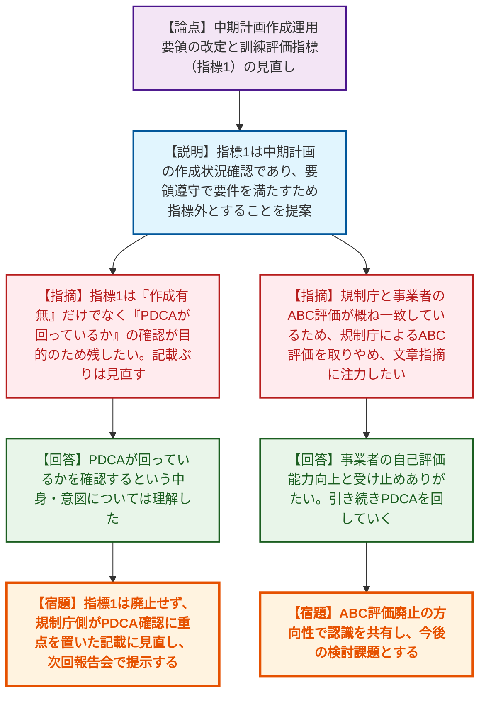
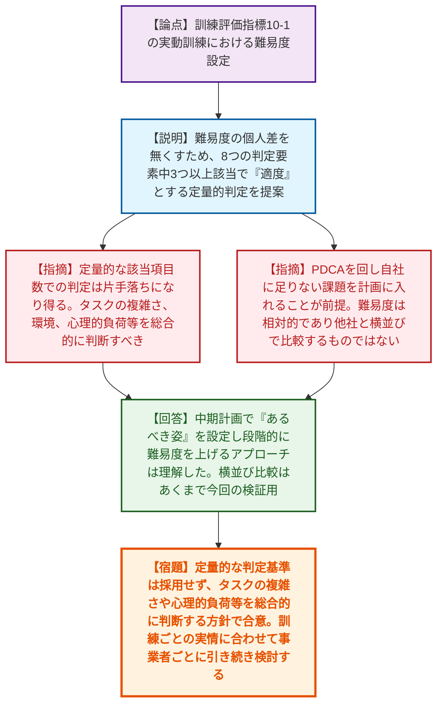
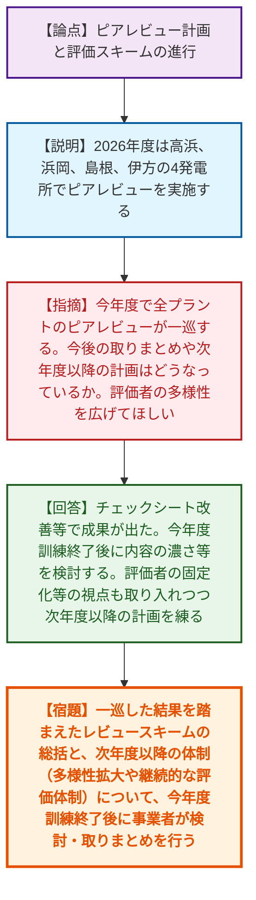
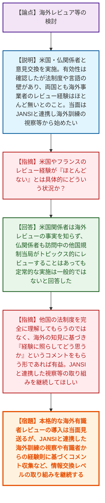
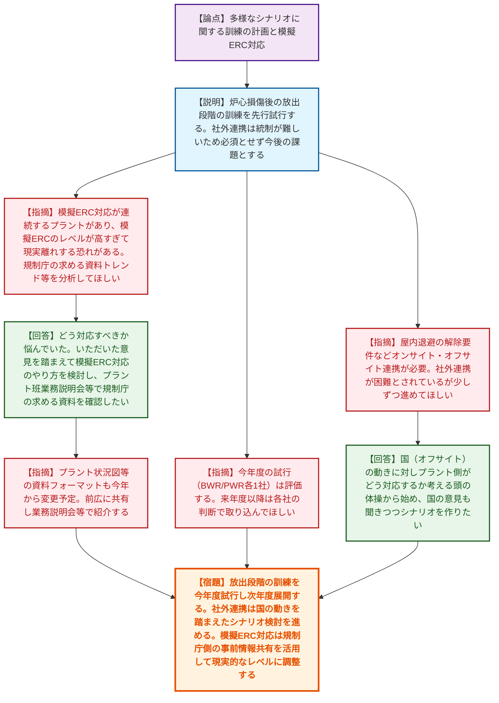
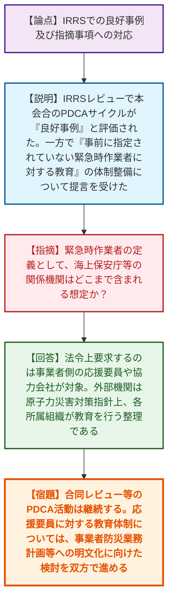
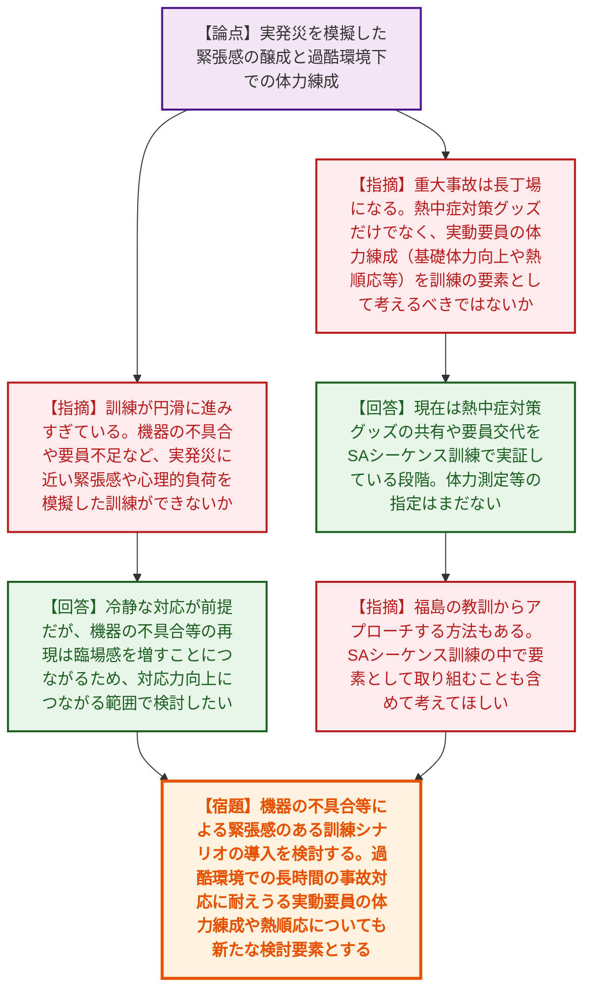

# 第14回原子力事業者の緊急時対応に係る訓練及び規制の関与のあり方に係る意見交換（令和8年6月9日）
> 出典 : https://youtube.com/live/cz00ptGOj2g?si=8k2NtmyZtrEZj3t8

# 会合の概要

*   **IAEA（IRRS）からの高評価と今後の継続:** 訓練のあり方に関する本会合での相互評価等のPDCAサイクルの取り組みが、IAEAのIRRSレビューにおいて世界的なモデルとなり得る「良好事例（Good Practice）」として高く評価され、官民双方で活動の意義が再確認された。
*   **規制庁による「ABC評価」の撤廃提案:** 事業者の自己評価能力が向上している現状を踏まえ、規制庁側から「規制庁によるABCの3段階評価を取りやめ、今後は具体的な改善点・気づきの文章指摘に特化する」という強い信頼に基づく提案がなされ、事業者がこれを受け入れた。
*   **「難易度」の定量的評価に対する疑義:** 事業者が提案した「該当項目数による定量的な難易度判定」に対し、規制庁は「タスクの複雑さ、環境、失敗時の心理的負荷等を総合的に判断すべき」「他社との横並び比較は馴染まない」と指摘。PDCAを回す上での本質的な難易度の捉え方について熱を帯びた議論が交わされた。
*   **実発災を見据えた「緊張感」と「体力練成」の要求:** 訓練が予定調和で円滑に進みすぎている現状に対し、規制庁から「機器の不具合や要員不足を模擬した心理的負荷のかかる訓練」や、猛暑等の過酷環境下における「実動要員の体力練成（熱順応等）」の必要性が強く提起され、訓練のリアリティ追求に向けた新たなフェーズへの移行が示唆された。

---

# 議題ごとの詳細整理

## 議題1: 中期計画作成運用要領の改定と訓練評価指標（指標1）の見直し、およびABC評価のあり方
*   **議論の背景と論点:** 事業者はATENAガイドラインを改定し、柔軟な運用を可能にした。これに伴い、指標1（中期計画の作成状況）は自ずと満たされるとして指標外とすることを提案。また、規制庁からこれまでの評価手法（ABC評価）のあり方について抜本的な見直し提案があった。
*   **質疑応答（詳細）:**
    *   【説明者側（九電 松村）】指標1について、中期計画はATENAガイドラインに基づき作成することで自ずと要求を満足するため、事前面談等での確認を前提として指標外とすることを提案する。
    *   【規制側（規制庁 佐津川）】指標1は「作成できているか」だけでなく「訓練を通じたフィードバック（PDCA）が回っているか」を確認するものであるため、指標外とはせず残しておきたい。現状の記載ぶりについては見直す余地があるため、規制庁側で検討し次回の報告会で提示する。
    *   【説明者側（九電 川津）】PDCAが回っているかを確認するという中身・意図については理解した。
    *   【規制側（規制庁 三木屋）】ここ数年、規制庁と事業者のABC評価が概ね一致してきており、事業者の主体性も高まっている。そのため、次回の報告会からは規制庁によるABC評価は行わず、良かった点・悪かった点の文章による指摘に注力してはどうか。
    *   【説明者側（東電 高橋）】事業者の自己評価能力が向上した結果と受け止めておりありがたい。襟を正してPDCAを回していく。
    *   【規制側（規制庁 三木屋）】認識の相違がないことを確認した。ABC評価をなくすかどうかは今後の検討課題とする。
*   **結論と宿題事項（アクションアイテム）:**
    *   指標1は廃止せず、規制庁側が「PDCAの確認」に重点を置いた記載に見直した分案を作成し、次回報告会で提示する。
    *   規制庁によるABC評価の廃止方向については双方で認識を合わせ、段階的な移行に向けた今後の検討課題として持ち越した。

## 議題2: 訓練評価指標等の運用結果・改善提案（指標10-1: 難易度設定）
*   **議論の背景と論点:** 実動訓練の難易度について、従来は「達成可能度が50%程度」と抽象的だったため、事業者が判定要素に基づく定量的な基準を提案したが、難易度の測り方そのものが技術的な争点となった。
*   **質疑応答（詳細）:**
    *   【説明者側（九電 松村）】指標10-1の難易度について、8つの判定要素を設定し、3つ以上該当で「適度」、2つ以下で「容易」とする定量的な判定方法を提案する。個人差を小さくすることが目的である。
    *   【規制側（規制庁 澤村）】定量的な「何個該当するか」というアプローチは片手落ちになり得る。タスクの絶対的難易度、リソース、環境、心理的負荷（失敗時のリスク）等を総合的に見て判断すべき。計画段階で要素を出し合って議論し、事後にも「実際どうだったか」を総合的に評価する要領として再提案したい。
    *   【規制側（規制庁 森下）】PDCAを回して自社に足りないところを次の計画に入れることが前提であり、その上で難易度を測る順番が正しい。また、難易度は各社ごとに相対的であるため、他社と横並びで比較・整理するものではない。
    *   【説明者側（九電 川津）】中期計画で「あるべき姿」を設定し、段階的に難易度を上げていくというPDCAのアプローチについては理解した。提示した横並び比較はあくまで今回の検証用であり、各社の実情に応じて難易度を検討していく。
*   **結論と宿題事項（アクションアイテム）:**
    *   「該当する項目数」による定量的な難易度判定は採用せず、タスクの複雑さや環境、心理的負荷等を総合的に判断する方針で合意した。
    *   規制庁側からの指摘を踏まえ、難易度の設定方法は他社との比較ではなく、訓練ごとの実情に合わせて自社のPDCAサイクルの中で事業者ごとに引き続き検討する。

## 議題3: ピアレビュー計画と評価スキームの進行
*   **議論の背景と論点:** 2025年度の訓練で全プラントのピアレビューが一巡する見込みであり、今後のレビュー計画のあり方や評価者の体制について議論された。
*   **質疑応答（詳細）:**
    *   【説明者側（北陸電 櫻井）】2026年度は高浜、浜岡、島根、伊方の4発電所でピアレビューを実施する計画である。
    *   【規制側（規制庁 三木屋）】今年度の訓練で一通り全プラントのピアレビューが一巡する。今年度終了時点での取りまとめや、来年度以降の計画はどうなっているか。評価者を固定せず多様性を広げて社内を活発化してほしい。
    *   【説明者側（九電 川津）】チェックシート改善等で成果が上がっている。今年度の訓練終了後に、内容の濃さや訓練への関わり方を検討する。来年度以降も継続検討するが、評価対象プラントに対する評価者をある程度固定する等の視点も取り入れつつ検討したい。
*   **結論と宿題事項（アクションアイテム）:**
    *   一巡した結果を踏まえたレビュースキームの総括と、次年度以降の体制（評価者の多様性拡大や継続的な評価体制の構築）について、今年度の訓練終了後に事業者が検討・取りまとめを行う。

## 議題4: 海外レビュア等の検討
*   **議論の背景と論点:** 第三者レビューの一環として、米国やフランスの海外有識者によるレビューの可能性を模索したが、その実現性とアプローチ手法が論点となった。
*   **質疑応答（詳細）:**
    *   【説明者側（中電 高橋）】米国およびフランスの関係者と意見交換を行った。新たな知見が得られる有効性は確認できたが、法制度や規制体系、言語の壁があり、契約実務上の課題も大きい。両国とも自国以外の海外事業者をレビューした経験は「ほとんどない」とのこと。当面はJANSIと連携し、海外事業者の訓練視察等から開始したい。
    *   【規制側（規制庁 川崎）】米国・フランスのレビュー経験が「ほとんどない」というのは具体的にどういうことか。
    *   【説明者側（中電 高橋）】米国関係者は海外レビューを行った事実を知らないと回答した。フランス関係者も、訪問中の他国規制当局がトピックス的にレビューすることはあっても、定常的な海外事業者レビューは一般的ではないと回答した。
    *   【規制側（規制庁 森下）】他国の法制度等を完全に理解してレビューしてもらうのではなく、海外の知見に基づき「自分の経験に照らしてどう思うか」というコメントをもらう形であれば有益である。JANSIと連携した視察等の取り組みを継続してほしい。
*   **結論と宿題事項（アクションアイテム）:**
    *   海外有識者による日本の枠組みに則った本格的なレビューの導入は、法制度や言語の壁から当面見送る。
    *   JANSIと連携した海外訓練の視察や、有識者からの経験則に基づくコメントの収集など、情報交換レベルからの取り組みを継続する。

## 議題5: 多様なシナリオに関する訓練の計画と模擬ERC対応
*   **議論の背景と論点:** 前回提案された「炉心損傷後の放射性物質放出や施設安定化段階の対応」に関する訓練計画と、模擬ERC（緊急時対応センター）のレベルが高すぎることに起因する「現実離れ」への懸念が争点となった。
*   **質疑応答（詳細）:**
    *   【説明者側（東北電 三浦）】放出時点の対応に焦点を当てた訓練を先行して試行し、発電所・本店・ERCへの情報連携を中心に実施する。広報対応や社外（オフサイト）連携については、現時点では統制が難しいため必須とせず、今後の検討課題とする。
    *   【規制側（規制庁 三木屋）】今年度の試行（BWR・PWRで1社ずつ）を前向きな取り組みとして評価する。来年度以降は各社の判断で訓練に取り込んでほしい。
    *   【規制側（規制庁 川崎）】安定化段階での情報共有について、屋内退避の解除要件（内閣府原子力防災等も絡む）など、オンサイト・オフサイト連携が必要。社外連携が困難とされているが、少しずつでも進めてほしい。
    *   【説明者側（九電 川津）】国（オフサイト）の動きに対してプラント側がどうなっているかを考える頭の体操から始め、国の意見も聞きながらシナリオ作りから始めたい。
    *   【規制側（規制庁 川崎）】模擬ERC対応が2年連続になるプラントがあり、模擬ERCのレベルが高すぎるため現実離れする恐れがある。過去の動向や規制庁が求める資料のトレンドを分析しておくこと。
    *   【説明者側（九電 川津）】どう対応すべきか悩んでいた部分もある。いただいた意見を踏まえて模擬ERC対応のやり方を検討する。
    *   【説明者側（ATENA）】プラント班業務説明会を引き続き開いていただき、規制庁が求める資料を確認していきたい。
    *   【規制側（規制庁 川崎）】プラント状況図等の資料も今年からドラスティックに変えようとしている。前広に共有し、業務説明会等で紹介したい。
*   **結論と宿題事項（アクションアイテム）:**
    *   炉心損傷後の放出段階の訓練を今年度BWR/PWRで各1社試行し、次年度以降に展開する。
    *   社外（オフサイト）連携については、国の動きを踏まえたシナリオ検討（年2回のオン・オフ連携訓練の活用含む）を進める。
    *   模擬ERC対応については、現実的な規制庁のレベルや最新の要求資料のトレンドを反映させるため、規制庁側からの事前情報共有（業務説明会等での新資料フォーマット提示）を活用して調整を図る。

## 議題6: IRRSでの良好事例及び指摘事項への対応
*   **議論の背景と論点:** IAEAのIRRSレビュー結果において、本会合の活動が世界的な「良好事例」として評価された一方、外部からの応援作業者に対する教育体制について提言を受けた。
*   **質疑応答（詳細）:**
    *   【規制側（規制庁 佐津川）】IRRSにおいて、本会合のような全事業者が参加する合同レビュー会議や透明性の高いPDCAサイクルが「良好事例（Good Practice）」として評価された。一方で「事前に指定されていない緊急時作業者に対するジャストインタイム訓練」の体制整備について提言を受けたため、事業者防災業務計画に記載を明記するよう検討している。
    *   【規制側（規制庁 森下）】通常出ないグッドプラクティスが事業者と規制庁のPDCA活動に対して与えられたことを共有したい。一方、応援要員に対する教育の明文化については対応を検討する。
    *   【説明者側（ATENA 角）】緊急時作業者の定義として、海上保安庁等の関係機関はどこまで含まれる想定か。
    *   【規制側（規制庁 三木屋）】法令上要求しようとしているのは、事業者側の応援要員（本店の人間等）や協力会社・請負会社が対象。外部機関については原子力災害対策指針上、各所属組織が教育を行う整理となっている。
    *   【規制側（規制庁 森下）】規制庁や他機関の人間は自組織で線量管理等を行うため、今回の指摘はあくまで事業者管理下で応援に入る人間が対象との認識である。
*   **結論と宿題事項（アクションアイテム）:**
    *   本会合を通じた相互レビューおよびPDCAサイクルは、国際的にも良好事例として継続していく。
    *   提言事項である「事前に指定されていない緊急時作業者への教育体制」については、事業者側の応援要員および協力会社を対象として、事業者防災業務計画等への明文化に向けた検討を双方で進める。

## 議題7: 実発災を模擬した緊張感のある訓練と過酷環境下での体力練成
*   **議論の背景と論点:** 訓練が予定調和で円滑に進みすぎる現状や、昨今の猛暑下での重大事故対応を見据え、規制庁側から訓練のあり方に関する本質的な問題提起がなされた。
*   **質疑応答（詳細）:**
    *   【規制側（規制庁 川崎）】訓練がお互いにスムーズになりすぎているため、機器の不具合や参集要員が揃わない状況など、実発災に近い緊張感や心理的負荷（罵声が飛ぶような状況等）を模擬した訓練ができないか。
    *   【説明者側（東電 高橋）】有事の際も冷静な対応が前提だが、機器の不具合（マルファンクション）や説明不足による厳しいやり取り等の再現は臨場感を増すことにつながるため、対応力向上につながる範囲で検討したい。
    *   【規制側（規制庁 川崎）】重大事故は長丁場になるため、熱中症対策のグッズ配備等のパッチ的な対応だけでなく、消防や自衛隊のように実動要員の体力練成（基礎体力向上や熱順応等）を訓練の要素として考えるべきではないか。
    *   【説明者側（東電 高橋）】現在は熱中症対策グッズの共有や要員交代の検討をSAシーケンス訓練等で実証している段階であり、体力測定等の指定はまだない。
    *   【規制側（規制庁 森下）】福島の教訓等からアプローチする方法もある。SAシーケンス訓練の中で要素として取り組むことも含め、考えてみるきっかけにしてほしい。
*   **結論と宿題事項（アクションアイテム）:**
    *   実発災のリアリティを追求するため、機器の不具合や要員不足を組み込んだ緊張感のある訓練シナリオの導入を検討する。
    *   過酷環境（猛暑等）での長時間の事故対応に耐えうる実動要員の体力練成や熱順応についても、今後の訓練のあり方における新たな検討要素として持ち帰る。

---

# 論理構造の可視化（Mermaid）

## 議題1: 中期計画作成運用要領の改定と訓練評価指標（指標1）の見直し、およびABC評価のあり方

## 議題2: 訓練評価指標等の運用結果・改善提案（指標10-1: 難易度設定）

## 議題3: ピアレビュー計画と評価スキームの進行

## 議題4: 海外レビュア等の検討

## 議題5: 多様なシナリオに関する訓練の計画と模擬ERC対応

## 議題6: IRRSでの良好事例及び指摘事項への対応

## 議題7: 実発災を模擬した緊張感の醸成と過酷環境下での体力練成

