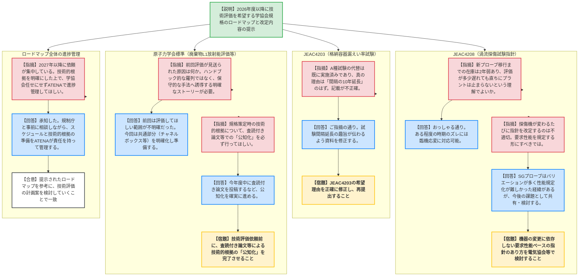

# 第28回新規制要件に関する事業者意見の聴取に係る会合（技術評価の優先順位）（令和8年6月9日）
> 出典 : https://youtube.com/live/UEemShvif40?si=7D0mlfWO76KRCSAP

# 会合の概要
* **最大の争点:** 原子力学会や日本電気協会等が策定する民間規格（標準）について、規制基準への取り込み（技術評価・エンドース）を希望する事業者のスケジュール感と、技術的根拠の十分性。特に、過去に見送られた規格（例：L1放射能評価）や廃止された規格（例：バスケット用アルミニウム）の二の舞を防ぐため、技術的根拠の公知化（査読付き論文等）と、規制要件に直結する明確なストーリー（フローや適用範囲）の構築が強く求められた。
* **審査の進捗状況:** 事業者（ATENA）から、2026年度に技術評価を希望する「原子炉格納容器の漏えい率試験規程（JEAC4203-2026）」をはじめ、2027年度以降に希望する維持規格等のロードマップが示された。規制庁は希望スケジュール自体は概ね理解しつつも、技術評価の前提となるエビデンスの蓄積と事前提示を要求した。
* **特筆すべき決定事項:** JEAC4203-2026（A種試験の10年に1回への頻度延長）については、技術評価の準備が整いつつあることが確認された。その他の規格についても、事業者・学協会は単に技術評価を申請するだけでなく、規制側が審査に利用しやすい形（選択肢の羅列ではなく、保守的な手法への誘導等）に整理し、事前の意見交換を通じて進捗管理を行う方針が合意された。

---

# 議題ごとの詳細整理

## 【議題1】事業者が技術評価を希望する学協会規格について
* **議論の背景と論点:**
  事業者は、最新の知見や効率化（ヒューマンエラー防止等）を反映した学協会規格が早期に技術評価（エンドース）され、審査・検査に活用できることを希望している。しかし、規格によっては技術的根拠が弱かったり、規定が曖昧で審査現場で使いにくかったりするケースがあり、技術評価の前提となるエビデンスの確保と規格のあり方が論点となった。

* **質疑応答（詳細）:**

  **① 技術評価ロードマップ全般とJEAC4203（格納容器漏えい率試験）について**
    * **【説明者側】（ATENA 織田・日本電気協会 馬場）:** 2026年度はJEAC4203の技術評価を希望する。PWRでの良好な実績と米国の動向を踏まえ、A種試験（全体漏えい率試験）の頻度を最大10年に1回に延長する改定を行った。A種試験の頻度削減により、多数の機器を防護する手数が減り、ヒューマンエラー等のリスクを回避できるため「同等以上の安全性が維持される」と判断している。
    * **【規制側】（規制庁 塚部）:** 資料の希望理由に「A種試験をB・C種で代替可能であることを示す」とあるが、PWRでは既に代替（3定検に1回）しており、今回の主眼は「試験間隔の10年への延長」のはず。理由の記載が不正確なので修正してほしい。
    * **【説明者側】（ATENA 織田）:** 承知した。修正して提出する。
    * **【規制側】（規制庁 佐々木）:** A種試験を減らすことで安全性が向上する面（ヒューマンエラー回避）は理解した。検査の合理化として受け止める。

  **② JEAC4208（渦流探傷試験指針）について**
    * **【説明者側】（ATENA 織田）:** SG伝熱管のECTプローブが2027年度に製造中止となるため、後継品を反映した改定版の技術評価を2029年度までに希望する。
    * **【規制側】（規制庁 森田・小島）:** 在庫で1〜2年程度は対応可能とのことで、他規格の技術評価を優先して本件が多少遅れても、直ちにプラントが止まるわけではない（臨機応変に対応可能）という理解でよいか。
    * **【説明者側】（ATENA 青木）:** おっしゃる通り。余裕を持って在庫を確保するため、多少の時期のズレには対応可能。
    * **【規制側】（規制庁 藤澤）:** 探傷機（プローブ）が変わるたびに指針を改定するのはおかしい。本来、要求性能を規定し、メーカーが実証して事業者が確認する形にすべきではないか。
    * **【説明者側】（ATENA 青木）:** SGのECTプローブは設計のバリエーションが多く、性能規定だけで実機に適用できる指針を作るのが難しかった歴史的経緯がある。現状の規定手法で問題ないと考えている。
    * **【規制側】（規制庁 藤澤）:** 今後、探傷機が変わっても耐えられる指針の作り方を検討してほしい。

  **③ 炉心槽の亀裂評価（維持規格）と破壊靭性の確認方法（JEAC4206）について**
    * **【規制側】（規制庁 佐々木）:** 炉心槽の検査について、事業者はEVT-1相当を行うとしているが、現在の維持規格はVT-3（変形等）であり種類が違う。また、亀裂の解釈（進展評価）との関係について、審査基準との整合を整理する必要がある。（コメントのみ）
    * **【規制側】（規制庁 佐々木）:** JEAC4206を優先度高く希望する具体的な理由（新しい試験の導入等）が資料に書かれていないが、なぜか。
    * **【説明者側】（ATENA 中崎）:** 2016年・2023年と過去2回技術評価を受けたが、指摘事項がありエンドースに至っていない。その指摘を踏まえた改定を早急に進めているため、改めて優先的に評価をお願いしたいという趣旨である。

  **④ 原子力学会標準（廃棄物のL1・L2・L3放射能評価・製作検査）について**
    * **【規制側】（規制庁 渋谷）:** 2019年にL1放射能評価の技術評価が見送られたが、その原因分析と対策はどうなっているか。学会標準は「A・B・Cの方法がある」というハンドブック的になりがちで、審査官は「事業者に一番都合の良い方法を選んだのでは」と疑ってしまう。どのフローを通ればどの手法になるか、客観的で保守的なストーリーが構築されていないと審査で使えない。
    * **【説明者側】（ATENA 鈴木）:** 前回は「技術評価してほしい規定範囲」が明確でなかったのが反省点。今回は事業者として評価してほしい部分を明確にし、データ数等の不足も拡充して準備を進める。
    * **【規制側】（規制庁 渋谷）:** チャネルボックスの濃度比法など、共通部分をしっかり規定化・ストーリー化してほしい。また、大型廃棄体の落下試験など、我々も実物や衝撃への関心が高いので、試験日程が決まれば教えてほしい。
    * **【規制側】（規制庁 佐々木）:** 規格作成時の技術的根拠について、学会発表だけでなく、査読付き論文等での「公知化」を必ず行ってほしい。
    * **【説明者側】（ATENA 青木・鈴木）:** 今年度中に査読付き論文を投稿する計画である。

  **⑤ コンクリート製格納容器（CCV）規格等、今後の進捗管理について**
    * **【規制側】（規制庁 森田）:** CCV規格について2022年版が既にあるのに2026年版の発刊を待つ理由は何か。現場としては、1次段階の検査規定など基準との関係が不明確な部分があるため、速やかに2022年版で評価を進めたいが支障はあるか。
    * **【説明者側】（ATENA 織田）:** 過去の他規格での指摘（本文と解釈の混在等）を踏まえた整理を行っているため新版を待ちたかったが、2022年版で評価してもらえるならありがたく、支障はない。
    * **【規制側】（規制庁 塚部・上谷）:** ロードマップを見ると2027年以降に技術評価依頼が大量に集中している。これらをすべて同時期に行うには相当な体制強化が必要になる。事業者・ATENA側で技術的根拠の明確化や公知化を事前に進め、スケジュールをしっかり管理してほしい。
    * **【説明者側】（ATENA 松本理事）:** 承知した。学協会任せにせずATENAで進捗を管理し、技術的根拠が明確になった段階で評価を依頼するよう、規制側とよく相談しながら進めたい。

* **結論と宿題事項（アクションアイテム）:**
    * 事業者が提示した技術評価のロードマップについて、技術的根拠の十分な蓄積と公知化、および審査に使いやすい規格構成にすることを前提として、今後の計画案を検討していくことで合意した。
    * **【宿題】** ATENAは、JEAC4203の技術評価希望理由について「試験間隔の見直し（10年への延長）」という趣旨が正確に伝わるよう資料を修正し提出すること。
    * **【宿題】** 学協会規格の技術評価依頼にあたっては、事前に査読付き論文等による技術的根拠の「公知化」を完了させておくこと。
    * **【宿題】** 検査技術（ECTプローブ等）の進歩に依存しすぎない、要求性能ベースの指針のあり方を日本電気協会等で検討すること。

---

# 論理構造の可視化（Mermaid）

## 【議題1】事業者が技術評価を希望する学協会規格について

