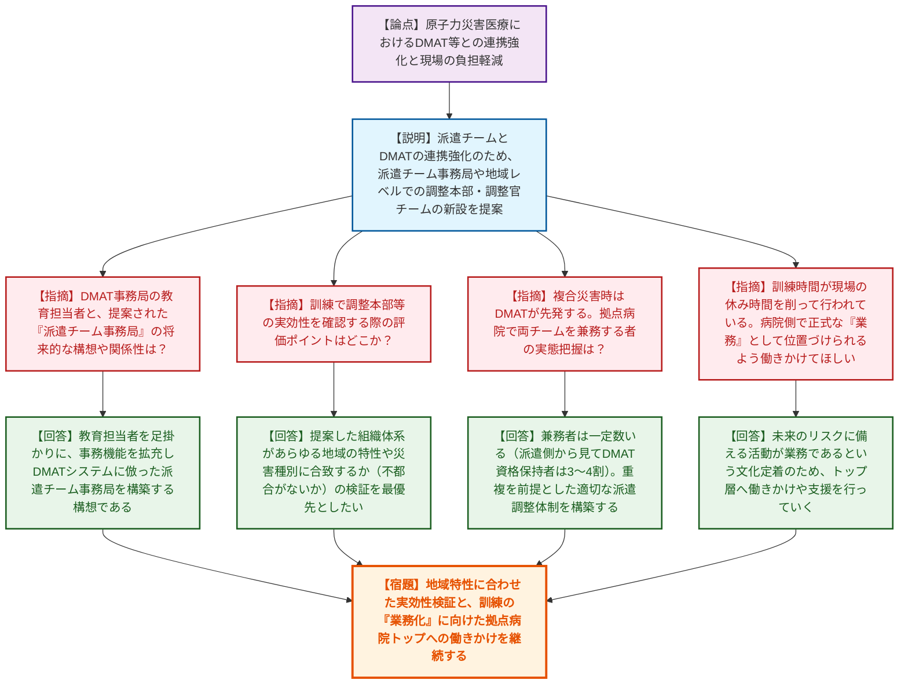
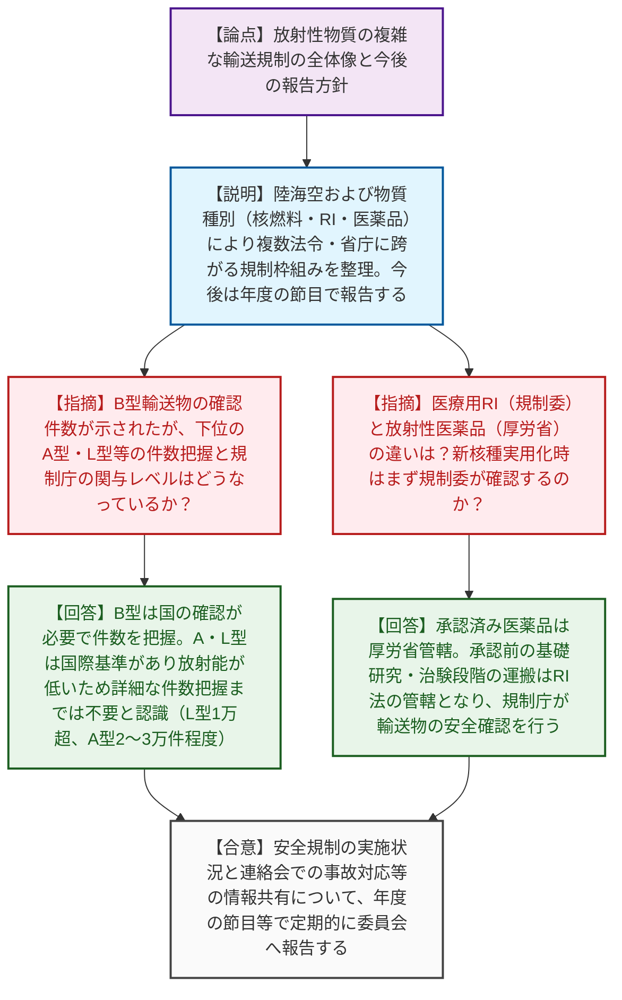
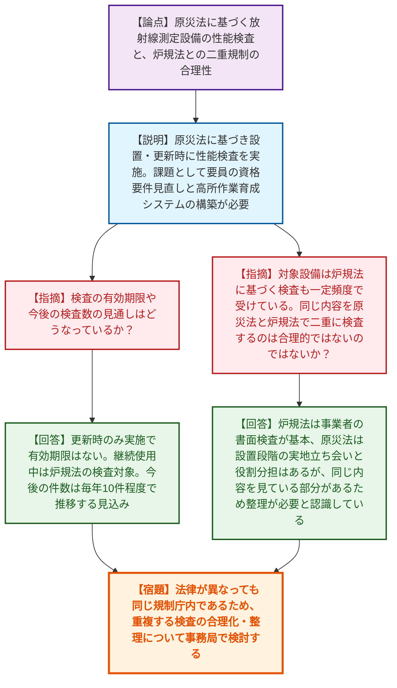
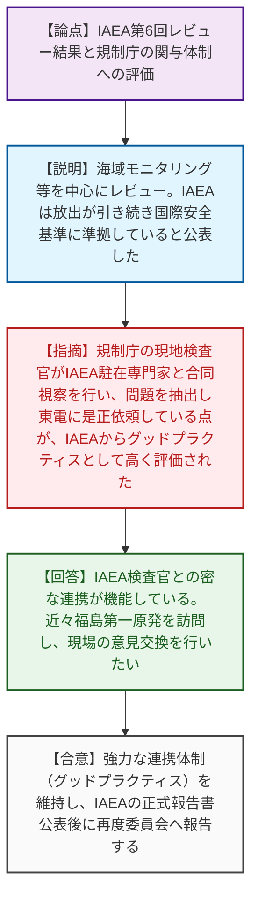

# 第13回原子力規制委員会（令和8年6月10日）
> 出典 : https://youtube.com/live/kJgWVCeHADs?si=QU2JUhM7m3z9NA62

# 会合の概要

*   **原子力災害医療の体制強化と現場の課題共有:** 原子力災害医療におけるDMAT（災害派遣医療チーム）等との連携強化に向けて、派遣調整本部や事務局の新設といった具体的な体制案が示された。一方で、現場の医療従事者が訓練や技能習得に自身の「休み時間」を削って参加しているという過酷な実態が提起され、訓練を「業務」として位置づける文化醸成への国からの強力な支援が求められた。
*   **複雑な輸送規制枠組みの可視化と定期報告化:** 陸海空および物質の種類（核燃料、RI、放射性医薬品）により複数省庁に跨がる複雑な放射性物質の輸送規制について、全体像と規制庁の担務が明確に整理され、今後は定期的に委員会へ報告・共有される方針が確認された。
*   **重複する規制要件（検査）の合理化指摘:** 事業者が設置する放射線測定設備に対する性能検査において、原災法と炉規法（原子炉等規制法）で類似の検査が二重に課されている現状に対し、委員から「同じ規制庁内であるため役割分担だけでなく合理的な整理・統合の検討が必要である」との鋭い指摘がなされた。
*   **ALPS処理水放出監視におけるIAEAからの高評価:** IAEA第6回レビューミッションにおいて、規制庁の現地検査官とIAEA駐在専門家が合同で視察を行い、問題を早期に抽出して事業者に是正を促している連携体制が、IAEA側から「グッドプラクティス」として極めて高く評価された。

---

# 議題ごとの詳細整理

## 【議題1】最近の原子力災害医療に係る取組 報告
*   **議論の背景と論点:** 東日本大震災の教訓を踏まえ、原子力災害医療（被ばく医療）と一般の救急・災害医療システムとの整合性を図ることが喫緊の課題となっている。特に、新たに設立された「原子力災害医療派遣チーム」とDMAT等の既存の保健医療福祉活動チームとの実効的な連携体制の構築、および現場の医療従事者の負担軽減（労働衛生観点）が大きな論点となった。
*   **質疑応答（詳細）:**
    *   【説明者側】（大平補佐）原子力災害医療の定義と体制整備について説明。高度被ばく医療支援センター等の研修・訓練実績と、DMAT事務局等への教育担当者の配置、保健医療福祉調整本部内への「派遣チーム調整本部」の設置など、DMAT連携の強化方針を報告した。
    *   【説明者側】（長谷川主任教授）委託事業の成果として、原子力災害医療派遣チームとDMATの連携強化のため、「派遣チーム事務局」による隊員の集中管理、および被災地の地域レベルにおける「調整本部・調整官チーム」の新設を提案した。
    *   【規制側】（神田委員）DMAT連携の前進を評価した上で、DMAT事務局に配置する教育担当者と、提案された「派遣チーム事務局」の将来的な構想・関係性について質問。また、訓練で調整本部や調整官チームの実効性を確認する際の「評価ポイント」はどこか。
    *   【説明者側】（大平補佐）教育担当者はまずDMAT研修での教育を行うが、ゆくゆくは事務的機能を拡充し、DMATのシステムに倣った派遣チーム事務局的な機能を構築したいという構想を持っている。
    *   【説明者側】（長谷川主任教授）提案した指揮命令系統が特定の地域でしか機能しない可能性もあるため、「あらゆる地域の特性や災害種別に合致するか（不都合がないか）」という実現性・実効性の検証を最も優先度の高い評価ポイントに置いてほしい。
    *   【規制側】（杉山委員）複合災害時は先にDMATが派遣され、後に派遣チームが出動する順序になる。拠点病院において両チームを兼務している人が少なからずいるはずだが、実態は把握しているか。
    *   【説明者側】（大平補佐）実数としては把握していないが、DMATと派遣チームを兼務している方は一定数いるという肌感覚を持っている。複合災害時に予定者がすでに出動している事態も想定し、今後の派遣チーム事務局と連携した適切な派遣調整体制を構築したい。
    *   【説明者側】（長谷川主任教授）肌感覚として、派遣チームのうちDMAT資格を持つ方は3〜4割、逆にDMAT隊員で派遣チーム資格を持つ方は2〜3割程度である。
    *   【規制側】（杉山委員）兼務は悪いことではないため、それを前提とした運用を考えてほしい。また、ある拠点病院で派遣チーム業務が辞令で明確に「業務」として位置づけられたという報道を見たが、他院では業務外扱いが多いことに愕然とした。各病院で正式な業務として位置づけられるよう働きかけてほしい。
    *   【説明者側】（大平補佐）当該報道は承知しており良い取り組みであると認識している。各支援センターと連携しながら拠点病院へのサポート・働きかけに繋げたい。
    *   【規制側】（山岡委員）階層図において、本部レベル（県庁等）と現場（病院等）の中間にある「地域レベル」のイメージを確認したい。県庁と現場は移動時間がかかるため、中間の地域レベルに派遣チームを加えるという提案は非常に重要である。
    *   【説明者側】（長谷川主任教授）その通りである。真ん中の地域レベルは、DMAT参集拠点病院など、現場へ出動する前に一堂に集合し、本部長の指示と情報管理を行って適切な配分をするための重要な拠点というイメージである。
    *   【規制側】（山中委員長）受講者の技能維持のため、どれくらいの方が繰り返し受講しているか、また受講を促す仕組みはあるか。
    *   【説明者側】（大平補佐）初回受講後、3年に1回の「技能維持研修」を受講する体系としている。実数は持ち合わせていないが、システムから受講時期のアラートを出して受講を促している。
    *   【規制側】（山中委員長）原子力災害医療調整官を担う人材を維持・育成していくための最大の課題は何か。現場からの希望があれば伺いたい。
    *   【説明者側】（長谷川主任教授）「次世代への意識の継承」が最も重要かつ困難な課題である。規制庁の力を借りて啓発し、仲間を増やしていくしかない。また現場の医療従事者は、訓練や技術習得の時間を「自身の休み時間」を削って確保している苦悩がある。「未来のリスクに備える訓練も業務の一つである」という文化が組織に定着するよう、トップ層への働きかけなど国のご助力をいただきたい。
    *   【説明者側】（大平補佐）病院の過酷な現状は承知しており、支援センターと連携しできるところから着手している。
*   **結論と宿題事項（アクションアイテム）:**
    *   DMAT事務局への教育担当者の配置を足掛かりに、将来的な「派遣チーム事務局」の機能拡充と連携体制の構築を進める。
    *   次回の訓練において、提案された調整本部・調整官チームの指揮命令系統が、各地域の特性や災害種別において実効性を持つかを重点的に検証する。
    *   現場の医療従事者の訓練参加を正式な「業務」として位置づけるための文化醸成について、規制庁および各支援センターが連携して各拠点病院のトップへ継続的な働きかけを行う。

## 【議題2】放射性物質の輸送に関する安全規制の枠組と今後の対応 報告
*   **議論の背景と論点:** 放射性物質の輸送規制は、陸海空の輸送手段や物質の種類（核燃料、RI、放射性医薬品）により、炉規法、RI法、薬機法等の複数法令と複数省庁（規制委、国交省、厚労省等）に跨がっている。この複雑な規制の全体像と規制庁の担務を可視化・整理し、今後の運用方針を確認することが論点となった。
*   **質疑応答（詳細）:**
    *   【説明者側】（木原調査官）輸送規制の全体像、国際基準を取り入れた輸送物の区分、規制庁（輸送物に対する保安措置）と国交省（輸送方法に対する保安措置）の役割分担、関係省庁間の放射性物質安全輸送連絡会による情報共有について説明。今後は年度の節目等で実施状況を委員会に報告する方針を示した。
    *   【規制側】（委員）B型輸送物（核燃料等約30件、RI等約400件）の確認件数が示されたが、それより下位のA型、L型などの総数はどの程度か。また、どのレベルから規制庁が把握・認識する必要があるのか。
    *   【説明者側】（宮本管理官補佐）B型は国または登録機関が確認を行うため件数を把握・管理する必要がある。L型やA型は国際的な技術基準があり、放射能量が圧倒的に低いため詳細な件数把握までは不要と考えている。規模感としてはL型が1万件以上、A型が2〜3万件の範囲内である。
    *   【規制側】（委員）医学診療治療用のRI（規制委確認）と放射性医薬品（厚労省確認）の違いは何か。今後、アスタチン等の新しい核種が実用化される場合、まずは輸送物として規制委が安全確認する立場になるのか。
    *   【説明者側】（宮本管理官補佐）「放射性医薬品」は薬機法で承認済みの医薬品であり厚労省管轄となる。一方、承認に至る前の基礎研究、臨床研究、治験の段階での運搬は「RI」としてRI法の管轄となり、規制庁が輸送物の安全確認を行う。
    *   【規制側】（委員）複雑な全容が理解できた。放射性物質安全輸送連絡会では、輸送中の事故対応等についても話題に上るのか。
    *   【説明者側】（木原調査官）連絡会には警察や消防もメンバーに入っており、現場での事故対応や必要な報告対応についても情報共有や検討課題として扱われている。
*   **結論と宿題事項（アクションアイテム）:**
    *   複数の法令・省庁に跨がる安全規制の枠組みと役割分担を了承。
    *   今後は本整理に基づき、輸送に関する安全規制の実施状況を年度の節目等で定期的に原子力規制委員会へ報告する。

## 【議題3】原災法第11条に基づき原子力事業者が設置する放射線測定設備に対する性能検査 報告
*   **議論の背景と論点:** 原子力事業者が設置する放射線測定設備（モニタリングポスト等）に対し、原災法第11条に基づく性能検査が実施されている。しかし、同設備は炉規法（原子炉等規制法）に基づく監視設備にも該当し、両法で類似の検査が行われていることの合理性が争点となった。
*   **質疑応答（詳細）:**
    *   【説明者側】（岡専門官）原災法に基づく放射線測定設備の性能検査（線源校正確認、警報レベル誤差確認、記録確認）の概要と、昨年度末までに109件の検査を完了した実績を報告。課題として、検査要員の資格要件と実務のズレ解消、および高所作業に対応できる職員育成システムの構築を挙げた。
    *   【規制側】（山岡委員）検査の有効期限はあるのか。また、今後の検査数の見通しはどうなっているか。
    *   【説明者側】（佐々木室長）本検査は設置・更新時に実施するもので有効期限は定めていない。継続使用中は炉規法に基づく「原子力規制検査」の対象となる。今後の検査数は、敷地や号機が大きく増えることはないため、年間10件程度の更新に伴う検査が継続すると見込んでいる。
    *   【規制側】（杉山委員）対象設備は炉規法の対象でもあるとのことだが、原災法に基づく検査には炉規法側の検査で行っていない項目が含まれているのか。一定頻度で炉規法の検査を行っているのに、原災法で別途検査を二重に行うのは合理的ではないように思える。
    *   【説明者側】（竹田上席専門官）基本的に検査内容は同じである。炉規法（使用前事業者検査等）は事業者が自主的に決定し基準が少し厳しい。原災法側は実地に基づいた検査を実施している。
    *   【説明者側】（佐々木室長）炉規法の検査は書面検査（抜き取りあり）が基本であり、原災法側は設置段階で立ち会い検査を行っているため役割分担は生じている。しかし、同じ内容を2つの法律で見ている部分があるため、今後の整理が必要と考えている。
    *   【規制側】（杉山委員）法律が違っても同じ規制庁内で実施しているわけであるから、合理化について検討していただきたい。
    *   【規制側】（山中委員長）事業者が設置した測定設備のデータについて、モニタリングシステムの表示等の統一化に向けた調整を少しずつ進めていただいているが、今後とも継続してお願いする。
*   **結論と宿題事項（アクションアイテム）:**
    *   原災法と炉規法の双方で課されている放射線測定設備の検査について、同じ規制庁内で二重規制となっている側面の合理化・整理を事務局にて検討する。
    *   検査要員の実務に即した資格要件の見直しと、高所作業を含めた育成システム構築を推進する。

## 【議題4】ALPS処理水の海洋放出に関するIAEAレビューミッションの概要（海洋放出後第6回） 報告
*   **議論の背景と論点:** 海洋放出開始後6回目となるIAEAレビューミッションが実施され、放出プロセスが国際安全基準に準拠しているかどうかの継続的な監視状況と、規制庁の関与・評価が共有された。
*   **質疑応答（詳細）:**
    *   【説明者側】（船田室長）5月に実施されたIAEAタスクフォースによる第6回レビューの概要を報告。海域モニタリングを中心に意見交換が行われ、IAEAは「放出が引き続き国際基準に準拠していることを確認した」と公表した。
    *   【規制側】（神田委員）現地検査について補足する。規制庁の検査官が、IAEAの駐在専門家と合同で視察を行い、問題をいち早くピックアップして東京電力に是正を依頼しているという実例を紹介した。この連携体制はIAEAの専門家から非常に高く評価され、広い意味での「グッドプラクティス」として認知していただけた。
    *   【規制側】（山中委員長）IAEA検査官が常駐し、現地の規制庁検査官との連絡が非常に密に行われていることを評価する。近々、福島第一原発の現場を訪問し、そうした現場の様々な意見を直接交換していきたい。
*   **結論と宿題事項（アクションアイテム）:**
    *   IAEAによる正式な報告書が公表され次第、改めて原子力規制委員会へ報告を行う。
    *   規制庁検査官とIAEA駐在専門家との合同視察等の強力な連携体制（グッドプラクティス）を今後も継続し、厳格な監視を維持する。

---

# 論理構造の可視化（Mermaid）

## 【議題1】最近の原子力災害医療に係る取組

## 【議題2】放射性物質の輸送に関する安全規制の枠組と今後の対応

## 【議題3】原災法第11条に基づき原子力事業者が設置する放射線測定設備に対する性能検査

## 【議題4】ALPS処理水の海洋放出に関するIAEAレビューミッションの概要

