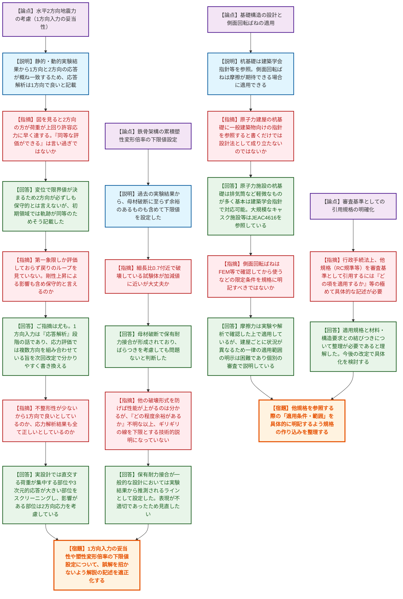
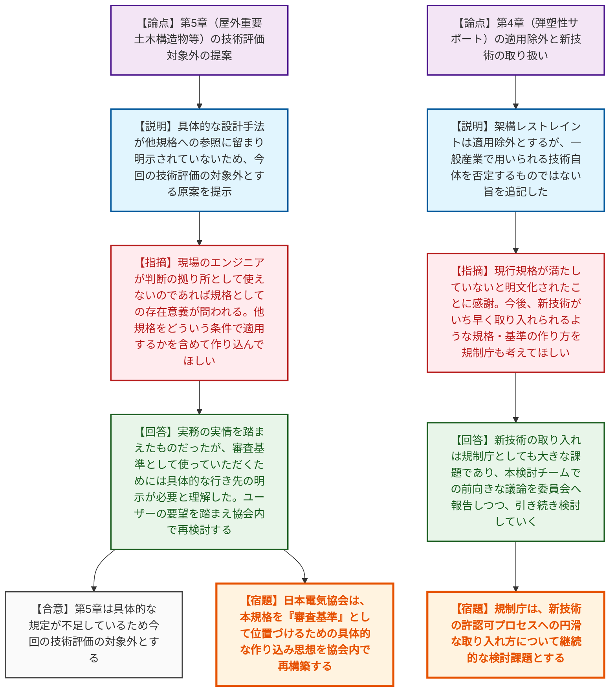

# 第5回耐震設計に係る日本電気協会の規格の技術評価に関する検討チーム（令和8年6月10日）
> 出典 : https://youtube.com/live/kkEHXy7I1Xs?si=_C416FtRHME9i3hD

# 会合の概要

*   **規格の「審査基準」としての具体性の欠如に対する厳しい指摘:** 第5章（屋外重要土木構造物等）について、具体的な設計手法が他規格への参照に留まっており、「現場のエンジニアが判断の拠り所として使えないのであれば規格としての存在意義が問われる」と規制側から厳しい指摘がなされ、今回の技術評価の対象外とする方針が示された。
*   **技術的根拠の妥当性を巡る白熱した議論:** 鉄筋コンクリート造の水平2方向入力の省略（1方向入力の妥当性）や、鉄骨架構（ブレース）の累積塑性変形倍率の下限値設定に対し、外部専門家から「弾塑性領域での応答が一致するとは言えない」「ギリギリの線を下限とする技術的説明が不足している」といった鋭い疑義が呈され、協会側は次回改定での記載適正化を約束した。
*   **審査実務を見据えた「引用規格」の明確化要求:** 行政手続法上、規格が審査基準として引用されるためには極めて具体的な記述が求められるため、他規格（RC規準等）を参照する際は「どの項の条件を適用するか」まで明確に書き込むよう、規制庁から協会へ仕様の作り込みに関する強い要望が出された。
*   **新技術（弾塑性サポート）の将来的な導入への含み:** 第4章の「架構レストレイント」について、現行の規格要求を満たさないため今回は適用除外とされたが、「一般産業で用いられている技術そのものを否定するものではない」旨が評価書案に明記され、今後の新技術取り入れのスキームについて前向きな認識が共有された。

---

# 議題ごとの詳細整理

## 【議題1】JEAC4601に関する説明依頼事項への回答（資料5-1）
*   **議論の背景と論点:** 事前に提示されたJEAC4601（原子力発電所耐震設計技術規程）の改定内容に関する質問事項について、日本電気協会から技術的根拠の説明が行われた。特に「水平2方向地震力の考慮（1方向入力の妥当性）」「鉄骨架構（ブレース）の累積塑性変形倍率の下限値」「基礎の側面回転ばね（Novakのばね）の適用」の3点が主な技術的争点となった。
*   **質疑応答（詳細）:**
    *   **＜論点：水平2方向地震力の考慮＞**
        *   【説明者側】（協会 小川）水平方向の地震応答解析は1方向の入力で良いとする根拠として、静的・動的実験結果から1方向と2方向の応答が概ね一致することを示した。また応力評価時には水平2方向及び鉛直方向を適切に組み合わせている。
        *   【規制側】（深澤専門家）実験結果の図を見ると2方向入力の方が荷重が上回っており、許容応力に早く達するはずである。「同等な評価ができる」という記載は学術的に言い過ぎではないか。
        *   【説明者側】（協会 矢渕）耐震壁の弾塑性評価は変位で限界値が決められるため、変位が大きく出る2方向入力が必ずしも保守的とは言えない。しかし線形を超えた初期領域までは軌跡が概ね同等であるためそのように記載した。
        *   【規制側】（深澤専門家）図は第一象限しか評価しておらず戻りのループを見ていない。剛性上昇による応答性状の変化も含め、本当に保守的と言えるのか疑問が残る。
        *   【説明者側】（協会 杉岡）ご指摘は尤もであり、1方向入力で良いのはあくまで「地震応答解析」の段階である。応力評価では複数方向を組み合わせている旨が伝わるよう、次回改定時に解説の記載を書き換える。
        *   【規制側】（豊川専門家）1方向で応答解析をする際、方向によって応答値が変わるはずだが、入力方向はどう設定しているのか。
        *   【説明者側】（協会 小川）NS、EW、UDの各方向を固定して入力し、それぞれの最大応答値を取り出して応力解析で組み合わせている。
        *   【規制側】（柏専門家）2方向入力による応力割増を考慮する必要がある。建物の不整形性が少ないから1方向で良いとしているのか、それとも応力解析結果も全て正しいとしているのか。
        *   【説明者側】（協会 小川）実設計では、直交する荷重が集中する部位（隅柱等）や3次元的応答が大きい部位をスクリーニングし、影響がある部位については2方向の応力を考慮して設計している。
    *   **＜論点：鉄骨架構の累積塑性変形倍率の下限値設定＞**
        *   【規制側】（庄司専門家）細長比0.7付近で母材破断に至っている試験体の変形倍率が、設定した下限値とほぼ近い状況だが、ばらつきが大きい中でこれを下限として大丈夫と判断した理由は何か。
        *   【説明者側】（協会 小川）母材破断で保有耐力接合が形成されている状態であり、ばらつきを考慮しても特に問題ないと考えて下限値を設定した。
        *   【規制側】（柏専門家）設計外力（要求性能）と応答値はセットで評価すべきものである。他の破壊形式を防げば性能が上がることは理解するが、「どの程度余裕があるか分からない」以上、ギリギリの線を下限値として良いという技術的説明にはなっていないのではないか。
        *   【説明者側】（協会 小川）当時の文献を精査したが考察はそこまでであった。ただ、保有耐力接合が一般的な設計においては、実験結果から推測されるラインとしてこの下限値を設定した。表現が不適切であったため見直したい。
    *   **＜論点：基礎構造と側面回転ばねの適用範囲＞**
        *   【規制側】（柏専門家）杭基礎の設計に一般建築物向けの「基礎構造設計指針」を参照するとあるが、原子力建屋のような特殊なものにどう適用するのか。外力設定も異なるため、単に参照すると書くだけでは設計法として成り立たない。
        *   【説明者側】（協会 矢渕）原子力施設における杭基礎は排気筒など軽微なものが多く、大規模なものは乾式キャスク中間貯蔵施設程度であるため、建築学会の指針やJEAC4616（動的効果等を考慮）を参照することで対応できると考えている。
        *   【規制側】（柏専門家）側面回転ばね（Novakのばね）について、「摩擦等が期待できる場合に適用できる」とあるが、実際はFEM等で確認してから使うなどの限定条件を規格に明記すべきではないか。
        *   【説明者側】（協会 杉岡）以前の規格では防水層の存在により摩擦を無視していたが、現在は摩擦力を実験や解析で確認できた場合等に適用している。ただし建屋ごとに状況が異なるため一律の適用範囲の明示は困難であり、個別の審査で説明しているのが実情である。
    *   **＜論点：審査基準としての引用規格の明確化＞**
        *   【規制側】（佐々木室長）RC規準等を引用しているが、原子力施設に適さない条項が含まれている可能性がある。行政手続法上、審査基準として用いるためには「第何章の第何項を満足すること」といった極めて具体的な記述が必要である。また、コンクリート製格納容器（CCV）は機器（規則17条）なのか建物（3章）なのか位置づけを整理してほしい。
        *   【説明者側】（協会 野本・小川）CCV規格は第3章の建物構築物の中で区別して適用している。適用規格と材料・構造要求との結びつきについて整理が必要であると理解した。今後の改定で具体化を検討する。
*   **結論と宿題事項（アクションアイテム）:**
    *   水平2方向入力の妥当性や累積塑性変形倍率の下限値設定の理由について、技術的な誤解を招かないよう解説の記述を適正化する。
    *   行政手続法に基づく審査基準への引用を見据え、RC規準やCCV規格など他規格を参照する際の「適用条件・範囲（どの項を適用するか）」を具体的に明記するよう、規格の作り込みを整理する。

## 【議題2】技術評価書案（資料5-2、5-3）に関する議論
*   **議論の背景と論点:** 規制庁から、これまでの議論を踏まえた技術評価書案（第5章 屋外重要土木構造物等、第4章 弾塑性サポート）が提示された。第5章は具体的な設計手法が欠如しているため評価対象外とする提案がなされ、規格の存在意義そのものが問われる議論となった。
*   **質疑応答（詳細）:**
    *   【説明者側】（規制庁 塚部企画官）第5章について、貯水や止水機能の設計において水道協会指針や土木学会マニュアルを参照するとしているが、具体的にどの規定をどう使うかが明示されていないため、効率的な審査に資する「技術評価」の対象外としたい。第4章の「架構レストレイント」は適用除外とするが、技術自体を否定するものではない旨を追記した。
    *   【説明者側】（大塚専門家 事前コメント代読）第4章における疲労破壊と疲労損傷の用語の使い分けを評価する。弾塑性サポートについて、3%の塑性歪みを許容する技術的根拠が示されておらず、鋼材の高延性に頼った定性的な評価は許容されない。適切な塑性歪みの制限を設計方法として求めるべき。
    *   【規制側】（森下）第5章について、実際の設計や審査で現場のエンジニアが判断の拠り所として使えないのであれば、規格としての存在意義が問われる。他の規格をどういう条件で適用するかを含めて作り込むなど、協会内で認識を合わせてから作業を進めてほしい。
    *   【説明者側】（協会 野本）第5章は実務者が他の基準を見ながら設計している実情を踏まえたものだったが、審査基準（使用規定）として使っていただくためには具体的な行き先の明示が必要であると理解した。どういう位置づけの規格とするか、ユーザー（規制庁含む）の要望を踏まえ協会内で再検討する。
    *   【説明者側】（協会 石田）ユーザーの利便性を図って作成したが、技術評価を受けるためには具体的な規定が必要であることがよく分かった。原子力安全の向上を目指し、改めて検討していく。
    *   【規制側】（深澤専門家）架構レストレイントの技術そのものが駄目なのではなく、現行の規格が満たしていないと明文化されたことに感謝する。今後、耐震に関する新技術がいち早く取り入れられるような規格・基準の作り方を規制庁も考えてほしい。
    *   【説明者側】（規制庁 塚部企画官）委員会への報告時にも、本検討チームで新技術に対する前向きな議論があったことをしっかり言及する。新技術の取り入れは規制庁としても大きな課題であり、引き続き検討していく。
*   **結論と宿題事項（アクションアイテム）:**
    *   第5章（屋外重要土木構造物等）は、具体的な設計手法の規定が不足しているため、今回の技術評価の対象外とする原案で了承された。
    *   日本電気協会は、本規格を「審査基準」として位置づけるための思想（他規格の具体的な適用条件の作り込み等）を協会内で再構築する。
    *   規制庁は、弾塑性サポートのような新技術の許認可プロセスへの円滑な取り入れ方について、継続的な検討課題とする。

---

# 論理構造の可視化（Mermaid）

## 【議題1】JEAC4601に関する説明依頼事項への回答（資料5-1）

## 【議題2】技術評価書案（資料5-2、5-3）に関する議論

