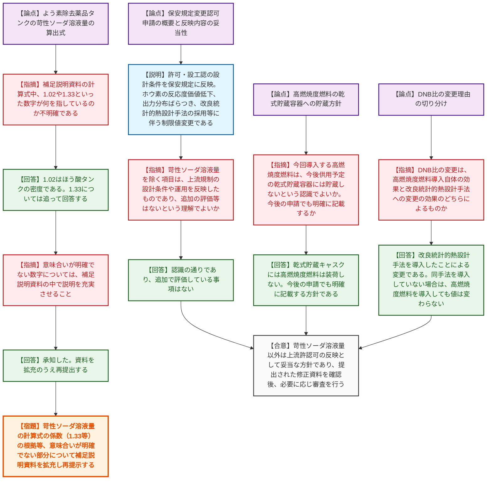

# 第1413回原子力発電所の新規制基準適合性に係る審査会合（令和8年6月11日）
> 出典 : https://youtube.com/live/32-ONe84lU4?si=gM_HtPNzaDvfuMfP

# 会合の概要

*   **上流規制（許可・設工認）の反映状況の確認:** 玄海4号炉の高燃焼度燃料導入に伴う保安規定変更について、よう素除去薬品タンクの苛性ソーダ溶液量を除く項目は、先行する設置変更許可および設工認の設計条件・運用を反映したものであり、追加の評価等はないことが確認され、おおむね妥当との感触が得られた。
*   **算出根拠の不明確さに対する厳しい指摘:** よう素除去薬品タンクの苛性ソーダ溶液量の計算式において、「1.33」等の意味合いが不明確な係数が用いられていることに対し、規制庁から説明を求める厳しい指摘がなされた。事業者が即答できない場面もあり、資料の充実と再提示が要求された。
*   **運用上の制限事項の明確化:** 4号炉に導入する高燃焼度燃料は乾式貯蔵容器（キャスク）には貯蔵しない方針であること、およびDNB比の変更が「改良統計的熱設計手法」の採用のみに起因することが確認され、今後の審査に向けた前提条件が明確になった。

---

# 議題ごとの詳細整理

## 【議題1】九州電力（株）玄海原子力発電所の4号炉における高燃焼度燃料の導入に伴う変更に係る保安規定変更認可申請の審査について

*   **議論の背景と論点:**
    玄海4号炉への高燃焼度燃料の導入に伴い、炉内の中性子スペクトル硬化によるホウ素の反応度価値の低下、出力分布のばらつき、改良統計的熱設計手法の採用、および事故時のpH低下等を踏まえ、ほう酸タンクの水量、DNB比、よう素除去薬品タンクの苛性ソーダ溶液量等の運転上の制限を変更する。本会合では、これらの変更が上流の許認可と整合しているか、また各パラメーターの算出根拠が妥当であるかが論点となった。

*   **質疑応答（詳細）:**
    *   【説明者側（九電 山内）】本申請の概要を説明。ホウ素の反応度価値低下に伴う各種ほう酸濃度の変更、出力分布平坦化の困難さを踏まえた核的エンタルピー上昇熱水路係数(FΔH^N)の変更、改良統計的熱設計手法の採用に伴うDNB比の変更、および使用済燃料ピット（3号炉）への高燃焼度燃料の保管禁止の追記等を行う。
    *   【規制側（規制庁 伊藤）】よう素除去薬品タンクの苛性ソーダ溶液量を除く項目については、許可や設工認申請書に記載された設計条件や運用を反映するものであり、上流規制で考慮していないことの追加評価等はないという理解でよいか。
    *   【説明者側（九電 山内）】認識のとおりであり、追加で評価しているものはない。
    *   【規制側（規制庁 伊藤）】補足説明資料に記載されているよう素除去薬品タンクの苛性ソーダ溶液量の計算式において、右側の「1.02」や、分子にある「1.33」という数字が何を指しているのか不明確である。
    *   【説明者側（九電 吉武）】「1.02」はほう酸タンクの密度である。「1.33」については追って回答させていただきたい。
    *   【規制側（規制庁 伊藤）】計算式の中で意味合いが明確でない数字については、補足説明資料の中で説明を充実させること。
    *   【説明者側（九電 吉武）】承知した。資料を拡充のうえ提出する。
    *   【規制側（規制庁 伊藤）】今回の申請からは逸れるが、今回導入する高燃焼度燃料は、今後供用開始される予定の乾式貯蔵施設の乾式貯蔵容器（キャスク）には貯蔵しないという認識でよいか。また、今後の乾式貯蔵施設の保安規定申請においても、貯蔵される燃料の種類を明確に記載する方針か。
    *   【説明者側（九電 吉武）】認識のとおり、乾式貯蔵キャスクには高燃焼度燃料は装荷しない。
    *   【説明者側（九電 山内）】今後の申請においても明確に記載する方針である。
    *   【規制側（杉山委員）】DNB比の変更について、資料には「高燃焼度燃料の導入に伴い、改良統計的熱設計手法を採用したため値が変わる」とあるが、これは高燃焼度燃料を導入した効果と手法を変更した効果の両方が含まれているのか、手法変更のみの効果なのか。
    *   【説明者側（九電 吉武）】改良統計的熱設計手法を導入したことによる変更である。同手法を導入していない場合は、高燃焼度燃料を導入しても値（1.17）は変わらない。
    *   【規制側（杉山委員）】あくまで手法の変更による値の変更であることを確認した。
    *   【規制側（規制庁 中川）】本日の指摘事項を含めて資料の作成・対応を行うこと。提出された資料を確認し、論点があれば再度審査会合で確認する。
    *   【説明者側（九電 大久保）】いただいたコメントにしっかり対応する。

*   **結論と宿題事項（アクションアイテム）:**
    *   **結論**: 苛性ソーダ溶液量を除く項目については、上流許認可の反映であり追加評価がないことが確認され、方針としておおむね了承された。また、高燃焼度燃料の乾式キャスクへの貯蔵を行わないこと、DNB比の変更が手法変更によるものであることが確認された。
    *   **宿題事項**: よう素除去薬品タンクの苛性ソーダ溶液量の算出式において、係数（1.33等）の技術的根拠・意味合いが不明確であるため、事業者は補足説明資料の記載を拡充し、改めて提示すること。

---

# 論理構造の可視化（Mermaid）

