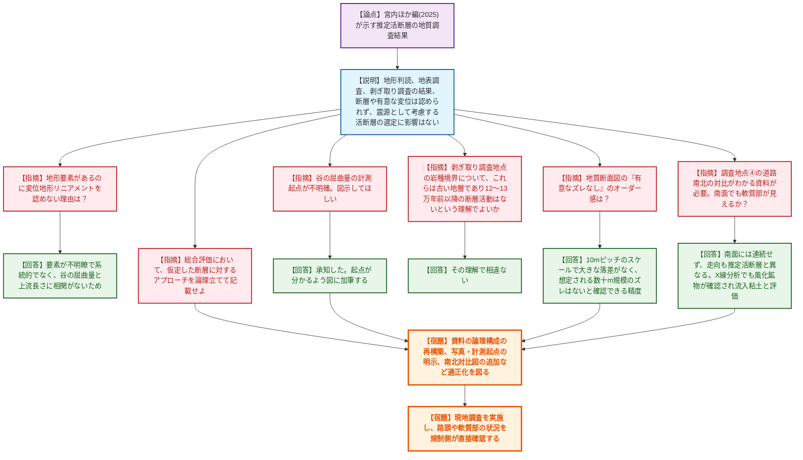
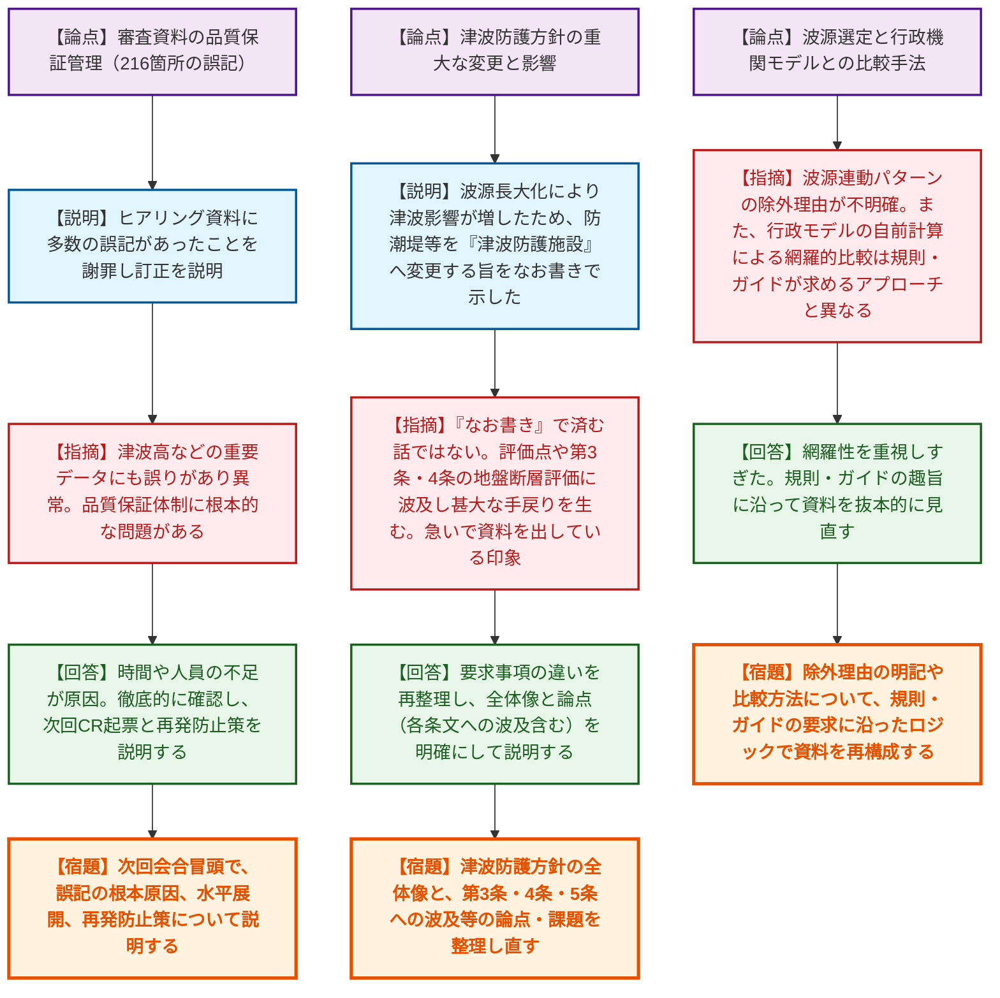

# 第1414回原子力発電所の新規制基準適合性に係る審査会合（令和8年6月12日）
> 出典 : https://youtube.com/live/VOZK253dxWs?si=ORPrRex9XqArhy4n

# 会合の概要

*   **審査資料の著しい品質欠如に対する強い遺憾の意:** 志賀2号炉の津波評価において、事前のヒアリング資料から216箇所もの誤記が発覚。さらに、津波高などの重要データにも誤りが含まれていたことから、規制側から「品質保証体制に根本的な問題がある」「審査を急ぐあまり確認が疎かになっているのではないか」と極めて厳しい苦言が呈され、次回会合にてCR（コンディションレポート）の起票結果と再発防止策の説明が義務付けられた。
*   **「なお書き」による重大な防護方針変更の指弾:** 志賀2号炉において、防潮堤を「津波防護施設」に変更する等の極めて重要な防護方針の転換が、資料の「なお書き」でさらりと扱われていた。規制側は「評価点や地盤の断層評価（第3条、4条、5条）に波及し、甚大な手戻りを生む。この資料の粒度では審査のスタート台にすら立てない」と強く非難し、全体像と論点の抜本的な再整理を命じた。
*   **島根3号炉の推定活断層に関する調査結果への一定の理解と論理再構築の要求:** 『日本の活断層総覧（宮内ほか編, 2025）』で示された推定活断層に対し、中国電力が実施した地形判読や剥ぎ取り調査等の結果、「活断層の存在を示唆する証拠は認められない」とする結論自体には一定の理解が示された。しかし、仮定した断層に対するアプローチの論理構成や、図表（計測起点や対比図）の明示性については改善が求められ、今後現地調査にて事実確認を行うこととなった。

---

# 議題ごとの詳細整理

## 【議題1】中国電力（株）島根原子力発電所3号炉の敷地周辺の地質・地質構造について

*   **議論の背景と論点:** 『日本の活断層総覧（宮内ほか編, 2025）』において、敷地周辺に新たな「推定活断層」が示されたことを受け、中国電力が追加の変動地形学的調査、地表地質調査、剥ぎ取り調査を実施した。本会合では、これらの調査結果に基づき「震源として考慮する活断層には該当しない」とする事業者の評価プロセスとその論理的妥当性が論点となった。
*   **質疑応答（詳細）:**
    *   【説明者側】（中国電力 関等）宮内ほか編で示された推定活断層の周辺を調査した結果、系統的な変位地形リニアメントは認められず、4箇所の剥ぎ取り調査でも岩種境界は固結密着しており、断層や有意な変位は認められなかった。宍道断層や美濃地川断層帯等の評価長さを一部見直したが、基準地震動策定に考慮する活断層の選定結果に影響はない。
    *   【規制側】（規制庁 大井）地形判読で鞍部などの地形要素が確認されているにもかかわらず、変位地形リニアメントを認めないとした理由は何か。
    *   【説明者側】（中国電力 関）地形要素が不明瞭で系統的でなく、谷の屈曲量と上流の長さに相関関係が認められないためである。
    *   【規制側】（規制庁 大井）補足資料の谷の屈曲量の計測起点が不明確である。図示して適正化してほしい。また、地質断面図において「有意なズレなし」としているが、どの程度のオーダー感を想定しているのか。
    *   【説明者側】（中国電力 藤原・関）計測起点が分かるよう図を加筆する。ズレのオーダー感については、10mピッチのスケールで見て大きな落差がなく、宮内ほか編が想定する数十m規模の地形ズレはないことを確認できる精度である。
    *   【規制側】（規制庁 大井）剥ぎ取り調査地点①や③において、岩種境界は密着しているというが割れ目も存在している。これらは新第三系中新統の古い地層であり、12〜13万年前以降の活断層の活動は認められないという理解でよいか。
    *   【説明者側】（中国電力 関）その理解で相違ない。
    *   【規制側】（規制庁 島田）調査地点④（道路南北の法尻）について、北側と南側の路頭を対比できる資料が欲しい。北側で見えた軟質部は南側でも見えているか。また、X線回折分析による評価はどうか。
    *   【説明者側】（中国電力 関・西川）軟質部は南側には連続しておらず、走向も推定活断層の方向（N50°E程度）と異なりN66°Eであるため、断層由来ではない。X線回折分析の結果、風化生成鉱物が認められたため割れ目への流入粘土と評価している。
    *   【規制側】（規制庁 野田）総合評価として、「どのような断層を仮定し」「何を根拠に存在しないと評価したか」を論理立てて記載すること。また、断層長さの変更を踏まえた地震ハザード評価への影響はまとめ資料で提示すること。
*   **結論と宿題事項（アクションアイテム）:**
    *   推定活断層の存在を示す証拠は認められないとする事業者の結論自体は理解された。
    *   ただし、資料の論理構成の再構築（仮定から結論に至るロジックの明確化）、および図表の適正化（計測起点の明示、路頭の全景写真追加、南北対比図の作成）を行うこと。
    *   現地調査を実施し、路頭や軟質部等の状況を規制側が直接確認する。

## 【議題2】北陸電力（株）志賀原子力発電所2号炉の津波評価について

*   **議論の背景と論点:** 津波評価に関する初回会合。事前に提示されたヒアリング資料に多数の誤記があったことの品質保証上の問題が第一の論点となった。また、波源モデルの変更に伴い、防潮堤を「津波防護施設」に変更するなどの重大な防護方針の変更が資料の「なお書き」で済まされており、審査プロセスや他の要求事項（第3条、4条、5条）への波及影響が第二の大きな論点となった。
*   **質疑応答（詳細）:**
    *   【説明者側】（北陸電力 小田・野原）ヒアリング資料において216箇所もの誤記・記載漏れがあったことを深く陳謝し、訂正箇所を説明した。連動評価の波源モデル設定やスケーリング則の適用範囲について説明し、一部施設の津波防護上の位置づけを変更した旨を報告した。
    *   【規制側】（規制庁 海田）誤記が216箇所というのは異常であり、津波高さの評価結果に直結する誤りも含まれていた。次回はまずCR（コンディションレポート）の起票結果、原因究明、水平展開、および再発防止策について説明せよ。
    *   【説明者側】（北陸電力 浜田）時間や人員の不足が原因と考えている。徹底的に確認し、次回会合でCR起票と再発防止策を説明する。
    *   【規制側】（規制庁 名倉）防潮堤を「津波防護施設」に変更するという方針転換が「なお書き」で済まされている。これは審査の前提を覆すものであり、耐震重要施設としての位置づけや、敷地全面の断層評価への影響についてどう考えているのか。
    *   【説明者側】（北陸電力 浜田）評価する海域活断層が長大化し津波影響が大きくなったため、安全確保の観点から防護施設へ変更した。活断層調査の必要性は理解しており、基礎掘削時のデータ等を用いて再度説明する。
    *   【規制側】（規制庁 島田）機能の期待値が変われば、基準津波の評価点や地盤の断層評価に波及し、甚大な審査の手戻りとなる。急いで資料を出している印象を受ける。どの施設に何の機能を求めるのか、総合的な設計方針の共有がなければ審査のスタート台にすら立てない。
    *   【説明者側】（北陸電力 吉田）要求事項の違いを再整理し、なぜその位置づけにするのか明確に説明する。
    *   【規制側】（規制庁 海田）波源モデルの連動パターンの選定において、区間内連動の検討などで除外したケースの理由が不明確である。また、行政機関のモデルを自前で計算して網羅的に比較するような手法は、規則・ガイドが求めているアプローチと異なる。
    *   【説明者側】（北陸電力 石田・二木）網羅性を重視しすぎた。規則やガイドの趣旨に沿って資料を抜本的に見直す。
*   **結論と宿題事項（アクションアイテム）:**
    *   次回審査会合の冒頭で、資料の品質保証管理（誤記の根本原因、水平展開、再発防止策）について明確に説明すること。
    *   津波防護方針の根本的な変更に伴う全体像と論点・課題（第3条、4条、5条への波及含む）を整理し直すこと。
    *   波源選定の除外理由の明記や、行政機関モデルとの比較方法について、規則・ガイドの要求に沿ったロジックで資料を抜本的に再構成すること。

---

# 論理構造の可視化（Mermaid）

## 【議題1】中国電力（株）島根原子力発電所3号炉の敷地周辺の地質・地質構造について

## 【議題2】北陸電力（株）志賀原子力発電所2号炉の津波評価について

