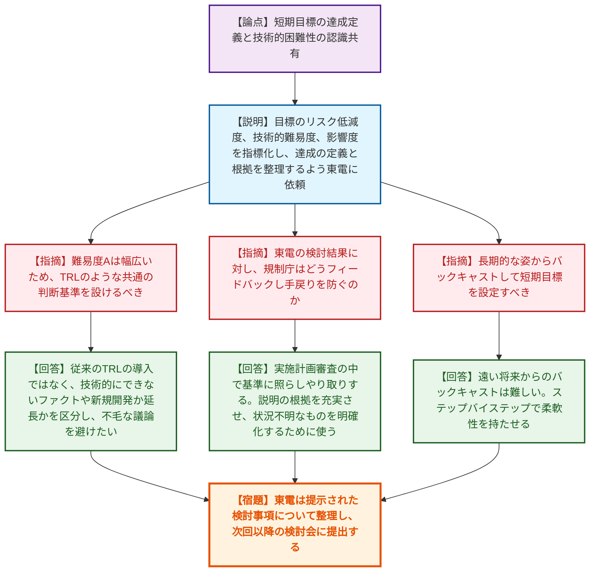
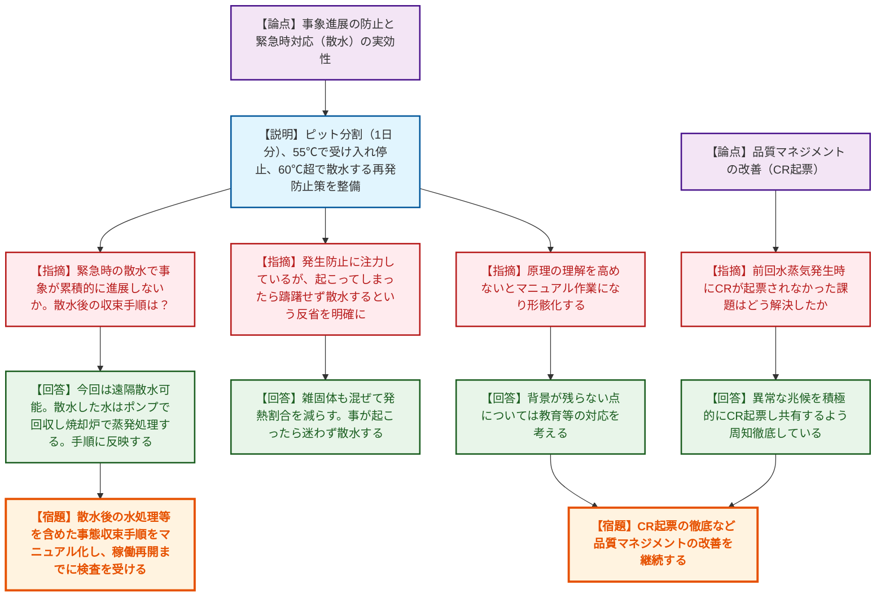
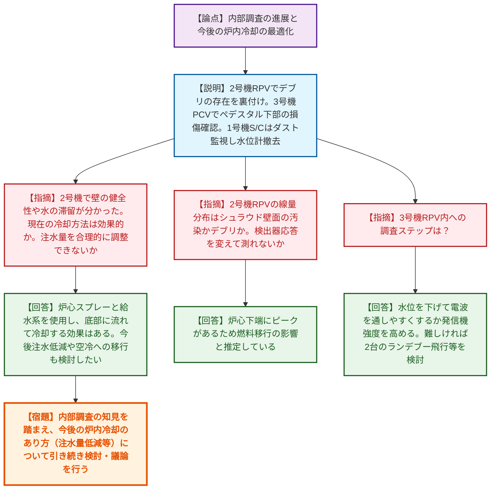
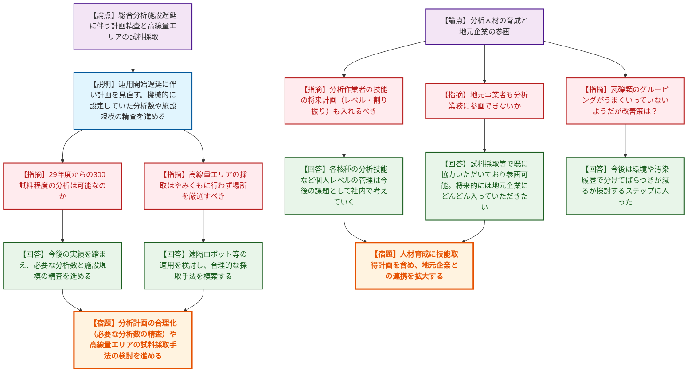
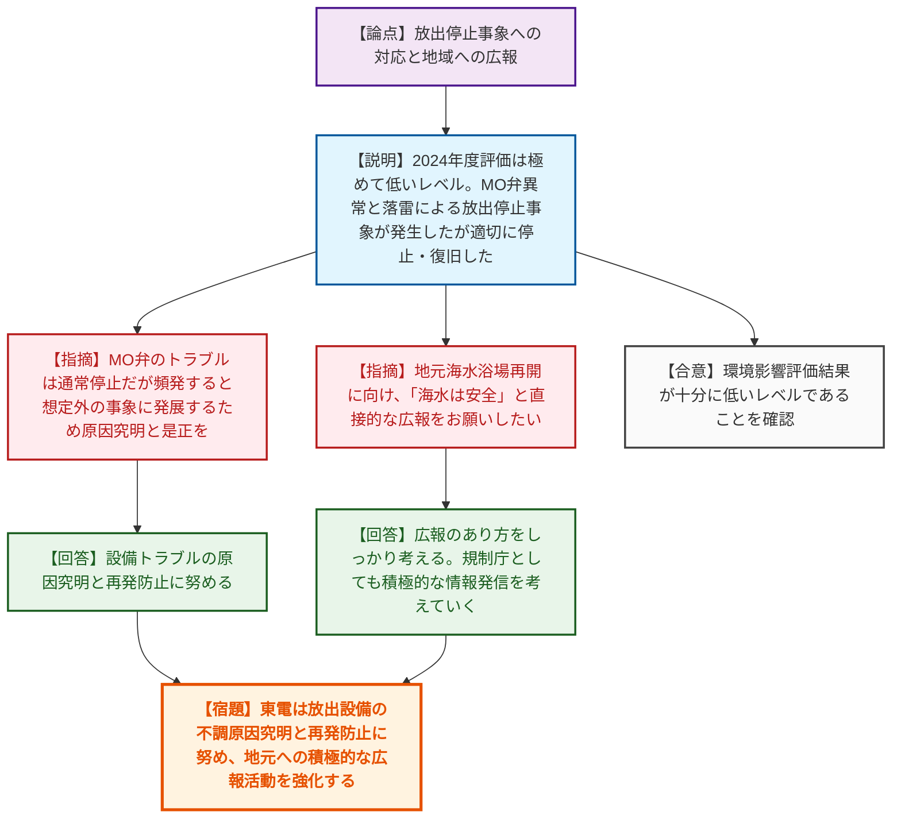
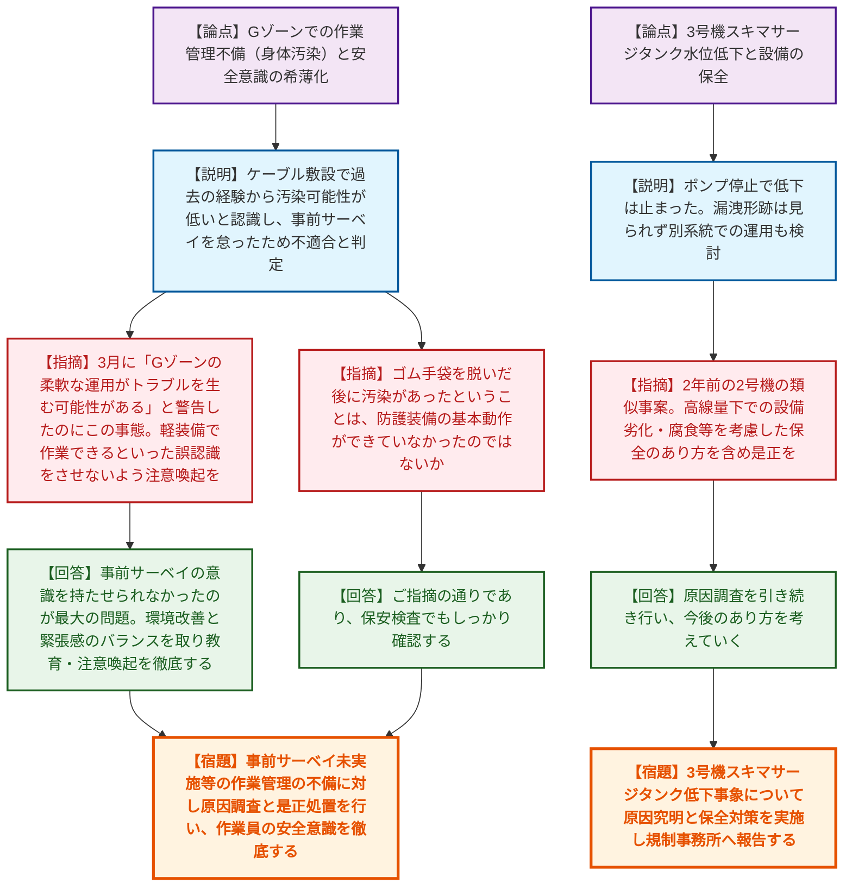

# 第122回特定原子力施設監視・評価検討会（令和8年6月15日）
> 出典 : https://youtube.com/live/brxTlAUQ2k0?si=pfpgBlbXcvXfC0V5

# 会合の概要

*   **リスクマップにおける目標と認識のすり合わせ:** 中期的リスクの低減目標マップ改定に向け、規制庁から東電に対し、各目標のリスク低減度・技術的難易度・影響度の指標化と定義の明確化を要求。技術的に困難な事実をファクトとして共有し、審査段階での手戻りや不毛な議論を防ぐための枠組み作りが議論された。
*   **焼却設備トラブルの再発防止と安全意識の徹底:** 増設雑固体廃棄物焼却設備の復旧と再発防止策（ピットの分割、温度監視、散水等）が報告された。一方、Gゾーンでの身体汚染事案（事前サーベイ未実施）など作業管理の不備も報告され、規制側から「柔軟な運用の裏で安全意識が希薄化しているのではないか」と極めて厳しい指摘がなされた。
*   **内部調査の進展と今後の冷却・分析計画の合理化:** 2号機RPV・3号機PCVの内部調査（マイクロドローン等）により、デブリの存在や構造物の状態が確認され、今後の冷却方法の最適化（注水量低減等）への期待が示された。また、固体廃棄物の分析計画について、総合分析施設の遅延を踏まえた分析数の精査や高線量エリアからのサンプリング手法の合理化が議論された。

---

# 議題ごとの詳細整理

## 【議題1】中期的リスクの低減目標マップの改定について
*   **議論の背景と論点:** リスクマップの短期目標において、達成の定義や技術的困難性に関して規制庁と東電の間で認識の乖離が生じている。これを解消するため、リスク、難易度（ABC）、影響度（123）の指標付けを行い、認識を共有した上で改定を進めることが論点となった。
*   **質疑応答（詳細）:**
    *   【説明者側（東電 白石）】指標付けの事例を含め、現場の状況を踏まえて検討・整理し、次回以降お示しする。
    *   【規制側（外部有識者 井口）】定性的なものを指標化するのは良いが、難易度「A」などは幅広いため、TRL（技術成熟度）のような共通の判断基準を設けるべき。未成熟なものが持ち込まれないようにしてほしい。
    *   【規制側（規制庁 岩永）】目標に関する認識の相違（例：S/C水位低下中の水素発見によるリスク増）を明確にしたい。従来のTRLをそのまま導入する意図はないが、ファクトとして「技術的にできないものはできない」と共有し、技術開発の延長か新規かといった区分をつけ、不毛なやり取りを避けたい。
    *   【規制側（外部有識者 山本）】リスク重要度に応じた方向性はよい。東電から出た結果に対して、規制庁は実施計画の審査段階でどのようにフィードバックし、手戻りを防ぐのか。
    *   【規制側（規制庁 岩永）】我々の持論を通すためではなく、説明の根拠を充実させ、状況が分からないものを明確化するためにこの仕組みを使う。過去にスラリー脱水等で不確かさを見極められなかった反省があるため、スタートラインを合わせたい。
    *   【規制側（オブザーバー 宮原）】不確実性が大きい中、長期的な姿（例：LCO解除）からバックキャストして短期目標を設定すべきではないか。
    *   【規制側（規制庁 岩永）】50年後からのバックキャストは地元との議論等もあり難しい。遠い目標に縛られるより、ステップバイステップで柔軟性を持たせたい。
    *   【規制側（規制庁 小金谷）】フォローアップの際に、高リスク・高難易度ならどう進めるか、高リスク・低難易度ならなぜできないか等、建設的な議論の切り口とするためである。
*   **結論と宿題事項（アクションアイテム）:**
    *   東京電力は、提示された検討事項（目標達成の根拠、リスク・難易度・影響度の指標付け）について整理し、次回以降の検討会に提出する。

## 【議題2】増設雑固体廃棄物焼却設備施設復旧に向けた進捗状況について
*   **議論の背景と論点:** 2024年2月に発生した伐採木チップの発熱・水蒸気発生事案について、復旧工事の完了と再発防止策（ピット容量制限、クレーン稼働範囲拡張、温度監視、異常時の散水等）が報告された。事象進展の防止と緊急時対応の実効性、および品質マネジメントの改善が論点となった。
*   **質疑応答（詳細）:**
    *   【説明者側（東電 高木/山岸）】復旧工事は完了。再発防止としてピットを分割し1日分に制限。55℃で受け入れ停止、60℃超または温度差10℃で散水する。長期停止時は表層を移動し内部温度を確認。8月運転再開見込み。
    *   【規制側（規制庁 本島）】高さ制限3mの根拠は何か。また、緊急時の散水で前回のように事象が累積的に進展しないか。事態収束の手順は定めているか。
    *   【説明者側（東電 山岸）】仮置き場の可燃性廃棄物の火災予防ガイドラインを参考にした。今回は遠隔で散水可能。溜めないのが大前提であり、手順への反映は運転再開までにしっかり行う。
    *   【規制側（規制庁 岩永）】ピットを使わない平場での焼却も検討したが、工事期間等を踏まえピットを使用したとのこと。発生防止に力を入れているが、起こってしまったら躊躇せず散水するという反省を明確にしてほしい。
    *   【説明者側（東電 高木）】伐採木だけでなく雑固体も混ぜて発熱割合を減らすオペレーションも考えている。事が起こったら迷わず散水する。
    *   【規制側（外部有識者 長崎）】「なぜ高く積むとダメか」等、原理の理解を高めないとマニュアル作業になり形骸化する。
    *   【説明者側（東電 高木）】背景が残らない点については対応を考える。
    *   【規制側（外部有識者 山本）】前回水蒸気発生時にCR（コンディションレポート）が起票されなかった品質マネジメント上の課題はどう解決したか。
    *   【説明者側（東電 山岸）】異常な兆候が共有されていなかったのが反省。積極的にCRを起票し共有するよう周知徹底している。
    *   【規制側（外部有識者 徳永）】散水後のリカバー（水処理や濡れたチップの処理）の基準や手続きはどうなっているか。
    *   【説明者側（東電 山岸/小野）】散水した水はポンプで回収し、焼却炉の二次燃焼器のノズルから吹いて蒸発処理する。放射性物質はバグフィルター等でトラップされる。手順に反映する。
    *   【規制側（外部有識者 八塚）】不燃物が混ざったらどうなるか。
    *   【説明者側（東電 高木）】不燃物は事前に分別し、段ボール等の可燃物を一緒に燃やす。
*   **結論と宿題事項（アクションアイテム）:**
    *   東京電力は、散水後の水処理等の事態収束手順を含めたマニュアルを整備し、稼働再開までに規制庁の検査を受ける。
    *   原理の理解促進やCR起票の徹底など、品質マネジメントの改善を継続する。

## 【議題3】中期的リスクの低減目標マップにおける取組の進捗状況について
*   **議論の背景と論点:** 2号機RPV内部調査、3号機PCV内部気中部調査（マイクロドローン）、1号機S/C水位低下に伴うダスト監視について報告。内部調査で得られた知見を今後の冷却方法の最適化や取り出し計画にどう生かすかが論点となった。
*   **質疑応答（詳細）:**
    *   【説明者側（東電 新井）】2号機RPVはファイバースコープ挿入で炉心域下部に線量ピークを確認しデブリの存在を裏付け。3号機PCVはマイクロドローンでペデスタル下部のCRDハウジング脱落等を確認。1号機S/Cは水位計を気相露出前に撤去し配管を閉止する。
    *   【規制側（規制庁 松田）】1号機S/Cの気相開口部の影響は？北東三角コーナーの養生は保たれているか。
    *   【説明者側（東電 新井）】気相パスは小さく、水没箇所は水のパス。ダストは三角コーナー等で監視する。人が行く場合は養生を取る可能性はある。
    *   【規制側（規制庁 岩永）】2号機の調査で壁の健全性や水の滞留が分かった。現在の冷却方法は効果的か。また、建屋水位低下の観点から注水量を合理的に調整できないか。
    *   【説明者側（東電 新井）】炉心スプレーと給水系を使用。給水系は炉心外に入るが、結果的に底部に流れて冷やしているデータがあり、効果があると考えている。今後注水低減や空冷への移行も検討したい。
    *   【規制側（外部有識者 井口）】2号機RPVの線量分布はシュラウド壁面の汚染かデブリか。検出器応答を変えてエネルギー情報が取れないか。
    *   【説明者側（東電 新井）】断定はできないが炉心下端にピークがあるため燃料の移行による影響と推定。
    *   【規制側（外部有識者 井口）】3号機ドローンの耐環境性（IP52）でトラブルはなかったか。点群化はどうやるのか。
    *   【説明者側（東電 新井）】注水を停止したため耐えられた。点群化は1つのカメラの動画からSfMで構築する。
    *   【規制側（外部有識者 山本）】2号機RPVでシュラウド外側に水位が形成されている理由は？
    *   【説明者側（東電 新井）】抜け場所が少なく安定している可能性。シュラウド自体に大きな穴があるわけではない。
    *   【規制側（オブザーバー 宮原）】3号機RPV内への調査ステップは？
    *   【説明者側（東電 新井）】水位を下げて電波を通しやすくするか、発信機強度を高める。難しければ2台のランデブー飛行等を検討する。
*   **結論と宿題事項（アクションアイテム）:**
    *   内部調査で得られたデブリの分布等の情報を踏まえ、今後の炉内冷却のあり方（注水量低減等）について引き続き検討・議論を行う。
    *   1号機S/C水位低下に伴うダスト監視を継続する。

## 【議題4】東京電力福島第一原子力発電所の廃止措置等に向けた固体廃棄物の分析計画の更新について（2026年度）
*   **議論の背景と論点:** 総合分析施設の運用開始が2031年度前半に遅延する見込みの中、向こう10年間の分析計画（分析数の精査）や高線量エリアからのサンプリング手法、分析人材の育成と地元企業の参画が論点となった。
*   **質疑応答（詳細）:**
    *   【説明者側（東電 高木/増田/松田）】総合分析施設遅延に伴い計画を見直す。29年度以降の分析数は機械的に設定していたため、今後の実績を踏まえ必要な分析数と施設規模の精査を進める。
    *   【規制側（規制庁 本島）】高線量エリアの試料採取など困難度の高い課題は見通しが立っているか。
    *   【説明者側（東電 増田）】コンクリートボーリング等は遠隔ロボット等を検討中。試料加工等はJAEA大熊1棟のパネルハウス利用を調整中。
    *   【規制側（規制庁 本島）】高線量エリアの採取はやみくもに行わず場所を厳選すべき。
    *   【規制側（外部有識者 山本）】F-REIでの分析人材育成研修プログラムはどうなっているか。
    *   【規制側（エネ庁 加賀）】学生をJAEAに案内するなどの協力をしている。
    *   【規制側（外部有識者 井口）】分析作業者の「技能」の将来計画（レベル・割り振り）も入れるべきではないか。
    *   【説明者側（東電 松田）】各核種の分析技能など個人レベルの管理は今後の課題として社内で考えていく。
    *   【規制側（外部有識者 八塚）】地元事業者も分析業務に参画できないか。
    *   【説明者側（東電 松田/小野）】試料採取等で既に協力いただいており参画は可能。将来的には地元企業にどんどん入っていただきたい。
    *   【規制側（オブザーバー 宮原）】瓦礫類の核種濃度比のグルーピングがうまくいっていないようだが改善策は？
    *   【説明者側（東電 増田/小野）】これまでは履歴不明なものも一括で評価しばらつきが大きかった。今後は環境や汚染履歴で分けてばらつきが減るか検討するステップに入った。
*   **結論と宿題事項（アクションアイテム）:**
    *   分析計画の合理化（必要な分析数の精査）や高線量エリアの試料採取手法の検討を進める。
    *   人材育成に技能取得の計画を含めることや、地元企業との連携拡大を引き続き推進する。

## 【議題5】ALPS処理水海洋放出に係る放射線環境影響評価について
*   **議論の背景と論点:** 2024年度の評価結果がこれまでの評価と同程度の極めて低いレベルであることが報告された。併せて、直近で発生した放出停止事象（MO弁異常、落雷による電源停止）の対応と再発防止が論点となった。
*   **質疑応答（詳細）:**
    *   【説明者側（東電 佐藤/山根）】2024年度の評価結果は極めて低いレベル。6/10のMO弁異常による停止（弁交換し復旧）と、6/13の落雷・電源停止による緊急遮断弁閉（慣性でポンプは回り希釈は維持）を報告。
    *   【規制側（規制庁 松田）】ソースタームの評価分析が適切に実施されることが重要。MO弁トラブルは通常停止だが頻発すると想定外の事象に発展するため原因究明と是正を。落雷時も適切に運用を。
    *   【規制側（外部有識者 八塚）】雷や竜巻の対策は1Fでもやっているか。地元海水浴場再開に向け「海水は安全」と直接的な広報をお願いしたい。
    *   【規制側（規制庁）】電源喪失時の遮断等、他プラントと遜色ない仕組みを作っている。
    *   【説明者側（東電 小野）】広報のあり方をしっかり考える。
    *   【規制側（規制庁 小金谷）】規制庁としても積極的な情報発信を考えていく。
*   **結論と宿題事項（アクションアイテム）:**
    *   環境影響評価結果が十分に低いレベルであることを確認。
    *   東京電力は設備トラブルの原因究明と再発防止に努め、規制事務所も監視を継続する。地元への積極的な広報活動を強化する。

## 【議題6】その他（通信ケーブル敷設作業時の汚染事案、3号機スキマサージタンク水位低下）
*   **議論の背景と論点:** Gゾーンでの通信ケーブル敷設作業後に作業員5名の身体汚染（付着）が確認された事案、および3号機スキマサージタンクの水位低下（SFP循環系の水がサンピットへ流入）について報告。作業管理の不備と安全意識の希薄化が厳しく問われた。
*   **質疑応答（詳細）:**
    *   【説明者側（東電 斎藤/遠藤）】ケーブル敷設で過去の経験から汚染可能性が低いと認識し事前サーベイを怠ったため不適合と判定。スキマサージタンク低下はポンプ停止で止まった。漏洩形跡は見られず別系統での運用も検討。
    *   【規制側（外部有識者 八塚）】職員の安全に対する共通認識を持ってほしい。
    *   【規制側（規制庁 松田）】3月に「Gゾーンの柔軟な運用がトラブルを生む可能性がある」と警告したのにこの事態。軽装備で作業できるといった誤った認識をさせないよう注意喚起を。スキマサージタンク低下は2年前の2号機の類似事案。設備の劣化・腐食等を考慮した保全のあり方を含め是正を。
    *   【説明者側（東電 小野/斎藤）】事前サーベイをしなきゃいけないという意識を持たせられなかったのが最大の問題。環境改善と緊張感のバランスを取り、教育・注意喚起を徹底する。
    *   【規制側（規制庁 山本・1F事務所）】なぜ事前サーベイをやらなかったのか、保安検査でしっかり確認する。
    *   【規制側（オブザーバー 宮原）】ゴム手袋を脱いだ後に汚染があったということは、防護装備の基本動作ができていなかったのではないか。
*   **結論と宿題事項（アクションアイテム）:**
    *   Gゾーンでの作業において、事前サーベイ未実施等の作業管理の不備に対し、原因調査と是正処置を行い、作業員の安全意識（リスク認識）を徹底する。事象が続発する場合は管理対象区域の運用方法も見直す。
    *   3号機スキマサージタンク低下事象について、原因究明と高線量下の設備劣化を考慮した保全対策を実施し、規制事務所へ報告する。

---

# 論理構造の可視化（Mermaid）

## 【議題1】中期的リスクの低減目標マップの改定について

## 【議題2】増設雑固体廃棄物焼却設備施設復旧に向けた進捗状況について

## 【議題3】中期的リスクの低減目標マップにおける取組の進捗状況について

## 【議題4】東京電力福島第一原子力発電所の廃止措置等に向けた固体廃棄物の分析計画の更新について（2026年度）

## 【議題5】ALPS処理水海洋放出に係る放射線環境影響評価について

## 【議題6】その他（通信ケーブル敷設作業時の汚染事案、3号機スキマサージタンク水位低下）

