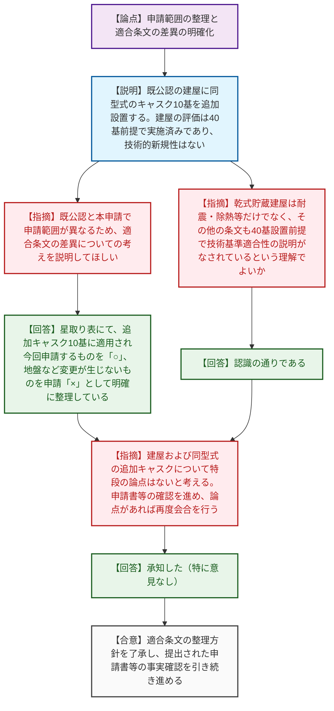

# 第1415回原子力発電所の新規制基準適合性に係る審査会合（令和8年6月16日）
> 出典 : https://youtube.com/live/Muu57liITWU?si=Qnh1iMiNg10vNzPC

# 会合の概要

*   **追加設置されるキャスクの技術的妥当性の確認:** 九州電力玄海原子力発電所4号機における、使用済燃料乾式貯蔵容器（キャスク）10基の追加設置に係る設計及び工事計画認可申請について概要が説明された。追加されるキャスクは既認可と同型式であり、技術的新規性はないことが共有された。
*   **既設建屋の40基設置前提の評価の確認:** キャスクを設置する既認可の乾式貯蔵建屋について、耐震・除熱・遮蔽をはじめとする各条文の評価が、当初から最大40基のキャスク設置を前提として技術基準適合性の説明がなされていることが確認され、建屋側に特段の論点はないとの認識が示された。
*   **適合条文の申請範囲の明確化:** 既公認の範囲（建屋＋キャスク10基等）と本申請の範囲（追加キャスク10基）の違いを踏まえ、条文ごとの適用と申請の有無を「星取り表」で明確に整理していることが確認された。規制庁はこれに基づき、引き続き申請書等の事実確認を進める方針を示した。

---

# 議題ごとの詳細整理

## 【議題1】九州電力（株）玄海原子力発電所第４号機の使用済燃料乾式貯蔵容器の追加設置の工事に係る設計及び工事計画認可申請の審査について

*   **議論の背景と論点:** 玄海原子力発電所における使用済燃料の貯蔵対策として、既認可の乾式貯蔵建屋（最大40基貯蔵可能）に対し、現在工事中のキャスク10基に加えて、同型式のキャスク10基を追加設置する設工認申請が行われた。本会合では、既公認と今回の追加申請における申請範囲の切り分けと、適合すべき技術基準の条文整理の妥当性が主な論点となった。
*   **質疑応答（詳細）:**
    *   【説明者側】（九州電力 菅中）使用済燃料乾式貯蔵容器設置工事に係る設工認申請の概要を説明。既認可の建屋内に、既公認と同型式のキャスク（タイプ2）を10基追加設置する。建屋の耐震・除熱・遮蔽等の評価は既公認の時点で40基貯蔵を条件に実施済みであり、今回の追加による建屋設計への影響はない。基本設計方針や技術基準への適合性についても既公認から変更はなく、技術的新規性はない。
    *   【規制側】（規制庁 島田）既公認の申請範囲（建屋およびキャスク10基）と、今回の申請範囲（追加キャスク10基）が異なっている。この申請範囲の違いに伴う適合条文の差異について、九州電力の考えを説明してほしい。
    *   【説明者側】（九州電力 木村）補足説明資料の「適合条文等の整理について」における星取り表で整理している。今回追加する10基のキャスクに対して適用され、かつ申請対象となるものを「○」としている。一方で、地盤の条文（第4条）のように、キャスク追加によって支持地盤に変更が生じないものについては適用「○」、申請「×」として整理している。
    *   【規制側】（規制庁 島田）今回の申請にかからない部分が「×」として整理されていることを認識した。この整理表に則って引き続き確認を進める。
    *   【規制側】（規制庁 藤川）資料の記載について確認する。既公認の乾式貯蔵建屋については、耐震・除熱・遮蔽だけでなくその他の条文についても、基本的には40基のキャスクを設置する前提で技術基準適合性の説明が既になされているという理解でよいか。
    *   【説明者側】（九州電力 西島）認識の通りである。
    *   【規制側】（規制庁 藤川）それであれば、貯蔵建屋について特段の論点はない。また、追設するキャスクも既公認と同タイプであるため、キャスクについても特段の論点はないと考えている。
    *   【規制側】（規制庁 皆川）全体を通して、申請範囲と既公認との差分を踏まえて適用条文が整理されていることを理解した。今後の審査は、本日の説明を踏まえて申請書や添付書類等の確認を進め、論点があれば改めて会合で確認したいがよいか。
    *   【説明者側】（九州電力 大久保）特に意見はない。
*   **結論と宿題事項（アクションアイテム）:**
    *   乾式貯蔵建屋および追加される同型式のキャスクについて、現時点で特段の技術的論点はないことが確認された。
    *   規制庁は、九州電力が整理した「星取り表」に基づき、提出された申請書や添付書類の事実確認を引き続き進める。新たな論点が抽出された場合には、再度審査会合にて確認を行う。

---

# 論理構造の可視化（Mermaid）

## 【議題1】九州電力（株）玄海原子力発電所第４号機の使用済燃料乾式貯蔵容器の追加設置の工事に係る設計及び工事計画認可申請の審査について

