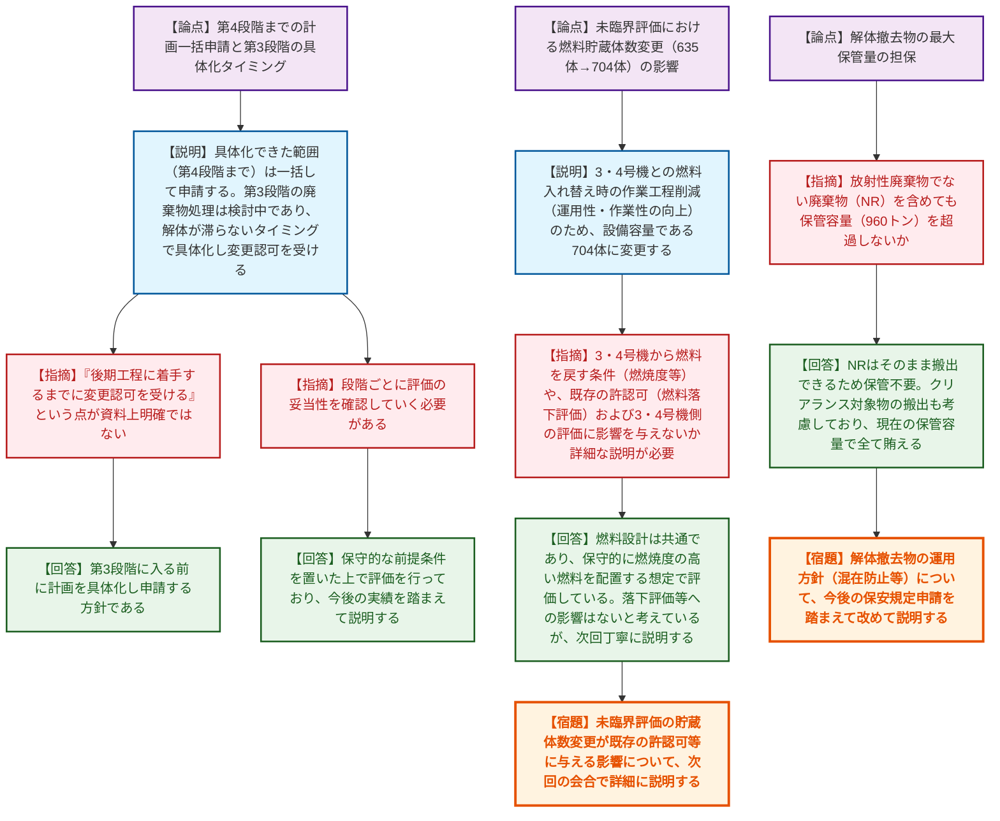
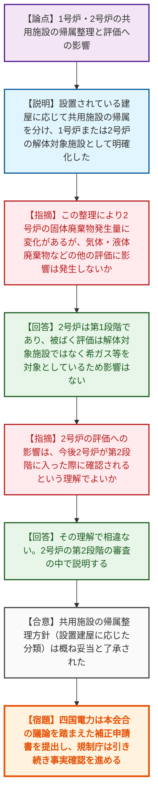

# 第48回実用発電用原子炉施設の廃止措置計画に係る審査会合（令和8年6月16日）
> 出典 : https://youtube.com/live/CusesBi4N9k?si=cykdSqB8ZCCDliKe

# 会合の概要

*   **大飯1・2号炉の第2段階以降の廃止措置計画の一括申請と審査プロセスの確認:** 関西電力から、大飯1・2号炉について第4段階までの計画を一括して申請する方針が示された。これに対し、規制庁は、特に第3段階（放射性廃棄物の処理・処分）の計画が未具体化である点を指摘し、後期工程に着手するまでに適切なタイミングで変更認可申請を行うよう指導した。
*   **使用済燃料ピットの冷却機能除外と未臨界評価条件の見直し:** 冷却停止試験の結果（最高水温53.7℃、基準65℃に対し余裕あり）を踏まえ、使用済燃料ピットの冷却設備等を性能維持施設から除外することが妥当とされた。また、未臨界評価における貯蔵体数を635体から704体へ変更する点について、他号炉（3・4号炉）との燃料のやり取りや許認可上の影響を含め、次回の会合で詳細な説明が求められた。
*   **伊方1・2号炉における共用施設の帰属の明確化:** 四国電力から、伊方1号炉と2号炉で共用している施設の「解体対象施設」としての帰属が曖昧であった点について、設置されている建屋に応じて帰属を明確に整理する方針が示された。これに伴う被ばく評価や廃棄物発生量への影響がないことが確認され、補正申請に向けた方向性が概ね了承された。

---

# 議題ごとの詳細整理

## 【議題1】関西電力（株）大飯発電所１号炉及び２号炉の廃止措置計画変更認可申請の審査について
*   **議論の背景と論点:** 大飯1・2号炉が第2段階の廃止措置に移行するにあたり、残存放射能調査の結果を踏まえた解体方法や被ばく評価の具体化、使用済燃料ピットの冷却停止に伴う性能維持施設の変更、および未臨界評価の貯蔵体数変更が申請された。特に、第4段階までの計画を先行して一括申請するプロセスの妥当性、解体撤去物の保管容量、および未臨界評価の条件変更に伴う他号炉（3・4号炉）への影響が論点となった。
*   **質疑応答（詳細）:**
    *   【規制側（規制庁 もがき）】第2段階に移行するタイミングで、第4段階までの廃止措置計画を一括して申請する考え方について説明してほしい。また、第3段階の放射性廃棄物の処理・処分について、「後期工程に着手するまでに変更認可を受ける」という点が明確ではない。
    *   【説明者側（関西電力 矢谷）】具体化できた範囲（第4段階まで）は全て計画に乗せて申請する方針である。第3段階の廃棄物処理については現在検討中であり、解体が滞ることのないしかるべきタイミング（第3段階に入る前）で計画を具体化し、変更認可を申請する。
    *   【規制側（規制庁 足田）】解体撤去物の最大保管量について、放射性廃棄物でない廃棄物（NR）の発生量を含めても、保管エリアの容量（960トン）を超過しない方針か確認したい。
    *   【説明者側（関西電力 原田・堀内）】NRは解体後そのまま搬出できるため保管の必要はない。クリアランス対象物も搬出計画（年間約100トン）を考慮しており、解体で発生する廃棄物は現在の保管容量（960トン）で全て賄えることを確認している。
    *   【規制側（規制庁 中野）】未臨界評価における燃料の貯蔵体数を635体から704体へ変更する目的である「運用性・作業性の向上」とは具体的に何か。
    *   【説明者側（関西電力 石田）】1・2号機ピットの燃料ラックには制御棒の挿入が条件となっている箇所があり、燃料移動の作業工程が多くなる。3・4号機との燃料入れ替え時の作業性向上のため、設備容量である704体に変更したい。
    *   【規制側（規制庁 金城・中野）】3・4号機から1・2号機へ燃料を戻す際の条件（供用関係、燃料の種類や燃焼度）や、この変更が既存の許認可（燃料落下評価など）や3・4号機側に影響を与えないか、次回の会合で詳しく説明してほしい。
    *   【説明者側（関西電力 石田・平野）】燃料の設計は共通であり、保守的に燃焼度の高い（40GWd/t以上）燃料を配置する想定で評価している。落下評価は1体あたりの評価であるため影響しないと考えているが、次回丁寧に説明する。
*   **結論と宿題事項（アクションアイテム）:**
    *   第4段階までの先行申請については、各段階に移行する際に評価の妥当性をその都度確認していく方針で了承された。
    *   未臨界評価の貯蔵体数変更（704体への増加）が、既存の許認可（燃料落下評価等）や他号炉（3・4号炉）の評価に与える影響について、関西電力は次回の審査会合で詳細に説明する。
    *   解体撤去物の管理・処理に関する運用方針（混在防止など）について、今後申請される保安規定の内容を踏まえ、関西電力が改めて説明する。

## 【議題2】四国電力（株）伊方発電所１号炉及び２号炉の廃止措置計画変更認可申請の審査について
*   **議論の背景と論点:** 伊方1号炉と2号炉は廃止措置の進捗状況が異なっており、放射線被ばく評価等を号炉ごとに独立して定めている。しかし、両号炉で共用している施設について、どちらの号炉の「解体対象施設」として扱うかが明確でなかったため、その帰属の整理とそれに伴う評価（廃棄物発生量など）への影響が論点となった。
*   **質疑応答（詳細）:**
    *   【説明者側（四国電力 曽根）】規制庁からの指摘を踏まえ、1・2号炉の共用施設について、1号炉の建屋に設置されているものは1号炉の解体対象施設、2号炉の建屋に設置されているものは2号炉の解体対象施設として明確に整理した。これにより、解体対象施設と汚染状況調査の対象施設が一致する。
    *   【規制側（規制庁 有森）】共用施設の帰属が明確になったことは理解した。この整理により、2号炉の計画において放射性固体廃棄物の発生量に変化があるとのことだが、気体・液体廃棄物などの他の評価に影響は発生しないか。
    *   【説明者側（四国電力 稲田）】2号炉は現在まだ第1段階であり、被ばく評価のもとになる放射能は解体対象施設の内包放射能ではなく希ガス等を対象としているため、今回の整理による影響はない。
    *   【規制側（規制庁 有森）】2号炉の評価への影響については、今後2号炉が第2段階に入った際に確認されるという理解でよいか。
    *   【説明者側（四国電力 稲田）】その理解で相違ない。2号炉の第2段階の審査の中で説明する。
*   **結論と宿題事項（アクションアイテム）:**
    *   共用施設の帰属（設置されている建屋に応じて解体対象施設を分ける）の整理方針について、規制庁は概ね妥当と了承した。
    *   四国電力は、本会合での議論を踏まえた補正申請書を提出し、規制庁は引き続き事実確認を進める。

---

# 論理構造の可視化（Mermaid）

## 【議題1】関西電力（株）大飯発電所１号炉及び２号炉の廃止措置計画変更認可申請の審査について

## 【議題2】四国電力（株）伊方発電所１号炉及び２号炉の廃止措置計画変更認可申請の審査について

