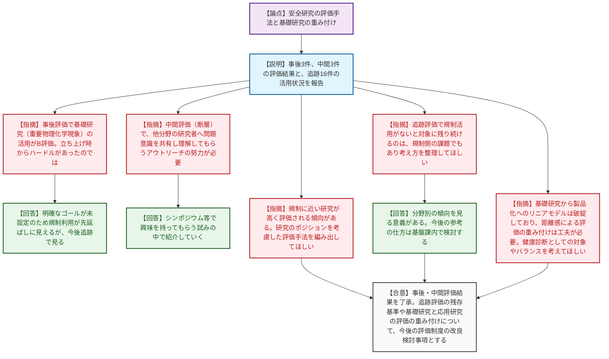
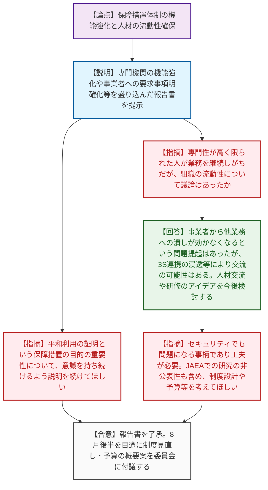
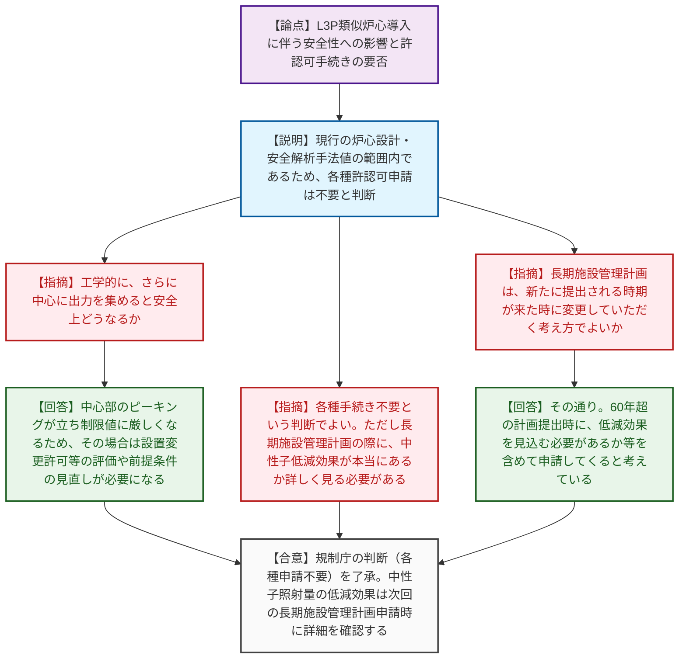

# 第15回原子力規制委員会（令和8年6月17日）
> 出典 : https://youtube.com/live/shMGtwJkSv0?si=gRbwPCG-jNJCbcMS

# 会合の概要

*   **安全研究の評価手法における「距離感」の課題:** 安全研究の事後・中間・追跡評価の報告において、基礎研究（現象理解）と応用研究（規制基準見直し等）で、規制への直接的な貢献度に基づく評価の差（S評価とA/B評価など）が生じる傾向が指摘されました。委員から、基礎研究から応用へのリニアモデルは破綻しているとの認識のもと、研究のポジションに応じた評価軸や重み付けの工夫が求められました。
*   **国内保障措置体制の機能強化と人材流動性の確保:** 今後の保障措置業務の増大を見据え、専門機関の機能強化や事業者に対する要件明確化（保障措置対応業務規程等）を盛り込んだ報告書が了承されました。非常に専門性が高く閉鎖的になりがちな分野であるため、国・専門機関・事業者間での人材交流や流動性の確保が、制度・予算を設計する上での重要課題として共有されました。
*   **関西電力のL3P類似炉心導入に対する規制上の手続き不要の判断:** 関西電力が計画する炉心燃料配置の柔軟性向上（L3P類似炉心の導入によるウラン資源有効活用・中性子漏えい抑制）について、現行の炉心設計や安全解析の制限値内に収まる運用であるため、設置変更許可や設工認等の新たな許認可手続きは不要とする事務局判断が示され、委員会として了承されました。

---

# 議題ごとの詳細整理

## 【議題1】令和8年度安全研究に係る事後評価、中間評価及び追跡評価
*   **議論の背景と論点:** 終了したプロジェクトの事後評価（3件）、進行中の中間評価（3件）、および過去プロジェクトの追跡評価（16件）の報告。基礎研究と規制への直接貢献が高い応用研究とで評価基準をどう重み付けするか、また、成果が規制に活用されないことを理由に追跡評価の対象に残り続けることの意義が論点となりました。
*   **質疑応答（詳細）:**
    *   【説明者側】（中島総括官）事後評価では「緊急時活動レベル」がS、「重要物理化学現象」がA、「再処理MOX加工」がB。中間評価では「地震動」「事故耐性燃料」は継続、「断層」は計画見直しの上で継続とした。
    *   【規制側】（山岡委員）事後評価の「重要物理化学現象」は基礎研究であり、立ち上げ時から成果活用にはハードルがあったのでは。種を蒔く意味でB評価でも今後に期待する。
    *   【説明者側】（中島総括官）明確なゴールが未設定のため規制利用が先延ばしに見えるが、今後の追跡評価で見ていく。
    *   【規制側】（山岡委員）中間評価の「断層」について、宇宙線生成核種などの研究は原子力応用を意識していない研究者もいるため、シンポジウム等で規制側の問題意識を理解してもらうアウトリーチの努力が必要。
    *   【説明者側】（中島総括官）補助金事業等でシンポジウムを開き、多くの方に興味を持ってもらう試みの中で紹介していく。
    *   【規制側】（杉山委員）事後評価で、現象理解の基礎研究と規制に近い研究でSとAの違いが出た。規制に近いものが高く評価される傾向があり、研究のポジションを考慮した評価手法を編み出してほしい。「再処理MOX」はB評価だが、事業者が参照するなど世の役には立っており、結果以上の成果が出ていると認識している。
    *   【規制側】（杉山委員）追跡評価について、規制への活用がないという理由で対象として残り続けるのは、当事者に圧をかけても仕方なく、規制側の課題への依存でもある。考え方を整理してほしい。
    *   【説明者側】（中島総括官）分野別の傾向を見る意義がある。規制部の担当部署と確認した上での評価だが、今後の参考の仕方については基盤課内で検討したい。
    *   【規制側】（山岡委員）TSOのモチベーション維持の観点など、評価対象としなくても情報を集めて実態を考えることもあってよい。
    *   【規制側】（山中委員長）基礎研究から製品化へのリニアモデルは破綻しており、距離感による評価の重み付けは工夫が必要。研究グループの健康診断としてどういうプロジェクトを対象としていくか、バランスを考えてほしい。
*   **結論と宿題事項（アクションアイテム）:**
    *   事後評価および中間評価の結果案について委員会として了承した。
    *   追跡評価における「規制への活用」の有無による残存基準や、基礎研究と応用研究の評価軸の重み付けのあり方について、次年度以降の評価制度の改良検討事項として持ち越された。

## 【議題2】国内保障措置制度のあり方に関する検討の取りまとめ結果（報告）
*   **議論の背景と論点:** 六ヶ所再処理施設の本格操業等を見据え、IAEAから求められる保障措置業務の質量増加に対応するための体制強化について。専門機関の機能強化、事業者への要求事項の明確化（保障措置対応業務管理者等）、および専門性が高いがゆえの人材の流動性確保が論点となりました。
*   **質疑応答（詳細）:**
    *   【説明者側】（中崎調査官）検討会の取りまとめ結果を報告。専門機関の一体化や人材育成のハブ機能強化、事業者の既存品質管理の仕組みを活用した業務規程の拡充・義務化などを検討・明確化すべきとした。
    *   【規制側】（委員）保障措置の目的（日本が核物質を平和利用以外の使途に使っていないとIAEAに認めてもらうこと）の重要性について、国を挙げての取り組みであるという意識を持ち続けるよう説明を続けてほしい。
    *   【規制側】（山中委員長）非常に専門性が高く限られた人が業務を継続しがちだが、組織の人材の流動性について議論はあったか。
    *   【説明者側】（中桐参事官）事業者からは、他業務への潰しが効かなくなるという問題提起はあった。しかし業務重要性の認識向上やセキュリティ等との3S連携の浸透により交流の可能性はある。国、専門機関、事業者間の人材交流や研修実施のアイデアをいただいており、今後検討したい。
    *   【規制側】（山中委員長）セキュリティでも問題になる事柄であり工夫が必要。JAEAでの研究開発は公表できない難しさもある。それを承知の上で、制度設計や予算・人の待遇を考えてほしい。
*   **結論と宿題事項（アクションアイテム）:**
    *   検討会の取りまとめ結果の報告が了承された。
    *   本報告書を踏まえ、8月後半を目途に制度見直しおよび予算の概要案を委員会に付議する。

## 【議題3】関西電力における炉心燃料配置の柔軟性向上の取組への対応
*   **議論の背景と論点:** 関西電力が計画するL3P（Low Leakage Loading Pattern）に類似した炉心燃料配置（外周部に燃焼の進んだ燃料を配置し中性子漏えいを抑制する手法）について、安全性への影響の有無と、それに伴う許認可手続きの要否が論点となりました。
*   **質疑応答（詳細）:**
    *   【説明者側】（岡本調査官）関西電力の取組を説明。現行の炉心設計の範囲内であり、安全解析手法値の変更も生じない範囲で実施されるため、設置変更許可、設工認、保安規定変更のいずれの申請手続きも不要と判断した。中性子照射量の低減効果については、今後の長期施設管理計画の申請時に確認する。
    *   【規制側】（杉山委員）工学的な質問として、さらに中心に出力を集めるような配置にした場合、安全上どういう問題になるか。
    *   【説明者側】（岡本調査官）外周部の出力が下がる分、中心部が上がりピーキングが立つため、熱的・核的制限値に厳しくなる。その場合は設置変更許可等の評価を行い、安全解析の前提条件を見直して判断基準を満足するか確認することになる。
    *   【規制側】（杉山委員）今回の変更は現行範囲内であり、各種手続き不要という事務局判断でよい。ただし長期施設管理計画の際に、中性子低減効果が本当に5割あるのか、平均値か局所的か詳しく見る必要がある。
    *   【規制側】（山中委員長）各種手続き不要の判断で結構。長期施設管理計画については、新たに提出される時期が来た時に変更していただくという考え方でよいか。
    *   【説明者側】（岡本調査官）その通り。現行の50〜60年の計画では低減効果を見込まずに評価し適合している。60年超の計画提出時に、低減効果を見込む必要があるか等を含めて申請してくると考えている。
*   **結論と宿題事項（アクションアイテム）:**
    *   関西電力の炉心燃料配置の変更は、現行の許認可範囲内であるため新たな申請手続きは不要とする規制庁の判断が了承された。
    *   中性子照射量の低減効果については、次回の長期施設管理計画の申請時（60年超運転等）に、その実効性を詳細に確認・審査する。

---

# 論理構造の可視化（Mermaid）

## 【議題1】令和8年度安全研究に係る事後評価、中間評価及び追跡評価

## 【議題2】国内保障措置制度のあり方に関する検討の取りまとめ結果（報告）

## 【議題3】関西電力における炉心燃料配置の柔軟性向上の取組への対応

