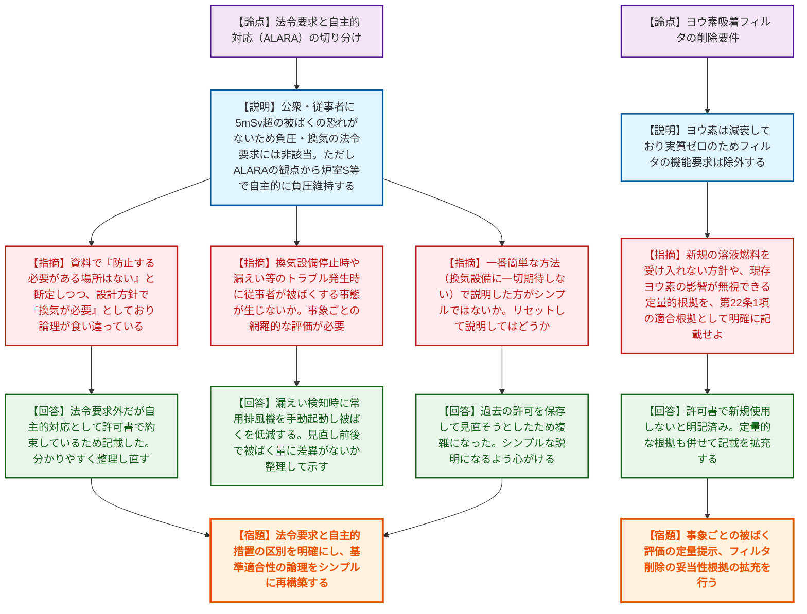
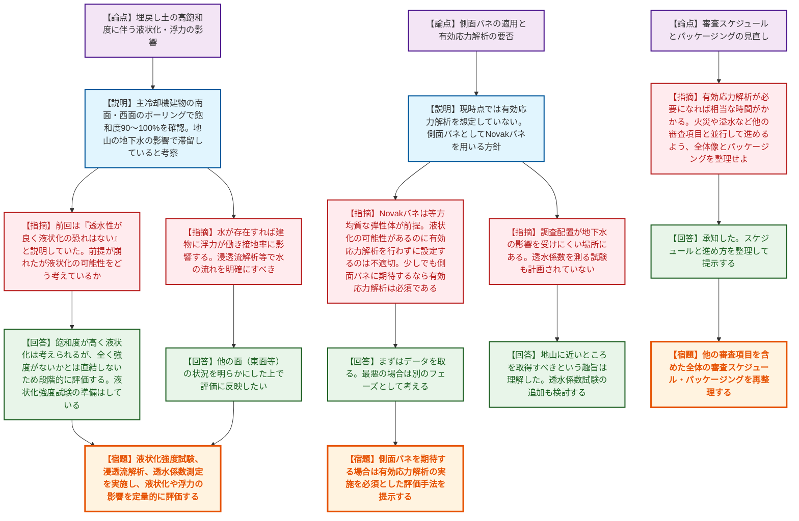

# 第586回核燃料施設等の新規制基準適合性に係る審査会合（令和8年6月17日）
> 出典 : https://youtube.com/live/Z3nxdjkW74I?si=LvysgVktR4pvMdkq

# 会合の概要

*   **STACYの運用見直しにおける規制要件と自主的対応の混同に対する指導:** 換気空調設備等の運用見直しに関し、事業者が「法令要求には該当しない」としながらも「ALARA（合理的に達成可能な限り低く）の観点で自主的に被ばく低減を図る」として許可申請書に記載している点について、規制側から「設計方針と説明のロジックが食い違っており分かりにくい。一から条件をリセットしてシンプルに説明し直すべき」と厳しい指導が入った。
*   **常陽の地盤調査結果による「前提の崩壊」と審査の巻き戻し:** 常陽の主冷却機建物周辺のボーリング調査の速報結果において、埋戻し土の飽和度が90〜100%と極めて高いことが判明した。これにより、これまで審査の前提としてきた「透水性が良く、地下水は滞留しない」という事業者の主張が根本から崩れ、規制側から「前提が成立しなくなった以上、液状化の可能性や浮力の影響を定量的に再評価せよ」と強く突き返される緊迫した展開となった。
*   **「側面バネ」期待時の有効応力解析の必須化とスケジュールの抜本的見直し:** 飽和度が高い状況下で建物の側面地盤バネ（Novakバネ等）をわずかでも期待するのであれば、有効応力解析の実施が必須であるとの規制側の見解が示された。これには液状化強度試験や浸透流解析などの膨大な追加調査・解析が必要となるため、規制側は「時間がかかることを念頭に置き、火災や溢水など他の審査項目と並行して進めるパッケージングと全体スケジュールを直ちに再整理せよ」と要求した。

---

# 議題ごとの詳細整理

## 【議題1】日本原子力研究開発機構原子力科学研究所の原子炉施設(STACY(定常臨界実験装置)施設)の設置変更許可申請について

*   **議論の背景と論点:**
    STACYは水溶液燃料から固体燃料へ更新され、FP（核分裂生成物）生成や崩壊熱が極めて少なく、公衆被ばくの恐れがない施設となった。これを踏まえJAEAは、①換気空調設備の運用見直し（常時負圧から必要時のみの負圧へ）、②気体廃棄物処理設備のヨウ素吸着フィルタの機能要求除外、③分析設備のグローブボックス等の許可対象からの除外、を申請した。論点は、これらの見直しが法令に適合しているか、および「自主的（ALARA）な取り組み」と「法令要求」の論理構成が破綻していないかという点である。

*   **質疑応答（詳細）:**
    *   【説明者側】（石井）STACYは公衆・従事者に5mSv超の被ばくを与える恐れがないため、負圧や換気の法令要求の適用外となる。ただしALARAの観点から、炉室S等では必要時に負圧を維持する。ヨウ素は減衰しており実質ゼロのためフィルタの機能要求は除外する。
    *   【規制側】（伊藤）資料では「放射線障害を防止する必要がある場所はない」と断定している一方で、適合性説明では「換気空調設備により被ばくを低減する」と記載しており、論理が食い違っている。
    *   【説明者側】（石井・荒木）法令の要求には該当しないが、ALARAの観点で自主的に被ばく低減を図る旨を許可書で約束しているため、そのような記載になった。
    *   【規制側】（伊藤）事実関係の背景と基準適合の考え方が混在している。また、換気空調停止時に漏えい等のトラブルが発生した場合、従事者が被ばくする事態が生じないか、事象ごとの網羅的な評価が必要である。
    *   【説明者側】（石井）漏えい検知時に手動で起動することで被ばくを低減できる。事象ごとに見直し前後で被ばく量に差異がないか整理して示す。
    *   【規制側】（石原）漏えい時に「常用排風機」を起動するとあるが、補助排風機運転時の切り替え運用はどうなるか。
    *   【説明者側】（石井）補助排風機では部屋の負圧を維持できないため、漏えい検知時に常用排風機に切り替える必要がある。資料に反映する。
    *   【規制側】（加藤）負圧維持の設計方針が「法令要求」か「自主的」かを明確にし、格納施設（原子炉建屋）と炉室Sの関係を書面で整理せよ。また負圧維持値の上限と下限の理由は何か。
    *   【説明者側】（石井）炉室Sの上限の理由は調べて回答する。関係性は整理して提示する。
    *   【規制側】（篠田）ヨウ素吸着フィルタ削除について、新規の溶液燃料を受け入れない等の条件が申請書本文で方針として示されているか。
    *   【説明者側】（石井）許可書で溶液燃料は使用済燃料と位置づけられ、新たに使用しないと明記されている。
    *   【規制側】（篠田）その該当記載を明示し、現存ヨウ素の影響が無視できる（160日経過等）という定量的根拠も併せて、第22条1項の適合根拠として明確に分かるよう記載を拡充せよ。
    *   【規制側】（杉山）25条など、バウンダリがなく建屋の障壁がなくても被ばくが低いということであれば、一番簡単な方法（換気設備に一切期待しない）で説明した方がシンプルではないか。従来の許可条件に引きずられて複雑になっているため、リセットして説明してはどうか。
    *   【説明者側】（石井）なるべく過去の許可を保存して見直そうとしたため複雑になった。シンプルな説明になるよう心がける。

*   **結論と宿題事項（アクションアイテム）:**
    *   法令の規制要求と自主的な措置（ALARA等）の区別を明確にし、基準適合性の論理を整理し直すこと。
    *   事象ごとに、換気設備停止時や漏えい時の従事者被ばく評価を網羅的・定量的に提示すること。
    *   新規の溶液燃料を使用しない方針や、現存ヨウ素が減衰していることによるフィルタ削除の妥当性を、申請書本文等に明確に紐づけて記載すること。
    *   補助排風機から常用排風機への切り替え運用や、負圧管理値の上限・下限の根拠を具体的に示すこと。

## 【議題2】日本原子力研究開発機構大洗原子力工学研究所（南地区）の原子炉施設（高速実験炉原子炉施設（常陽））の変更に係る設計及び工事の計画の認可申請について

*   **議論の背景と論点:**
    常陽の耐震評価において、設計用床応答スペクトル（FRS）を作成する際の建屋側面の地盤（側面バネ）の評価が論点となっている。これまでは「埋戻し土は透水性が良く、地下水は滞留しない」という前提であったが、今回のボーリング調査の速報結果により、主冷却機建物の南面・西面の埋戻し土で高い飽和度（90〜100%）が確認された。これにより、液状化の可能性や有効応力解析の要否、調査計画の妥当性が大きく問われる事態となった。

*   **質疑応答（詳細）:**
    *   【説明者側】（岡木・瀬下・中西）ボーリング調査の全体計画と、先行して実施した主冷却機建物周辺の結果を説明。南面・西面で飽和度の高いコアが確認され、地山の難透水層（MUC層）の影響で水が滞留していると考察。今後の評価フローとして、まずは「側面バネなし」で評価し、NGのものは「側面バネあり」で詳細評価を行う。
    *   【規制側】（加藤）埋戻し土に水が存在すれば、建物底面に水が流れ浮力が働き、接地率の評価に影響を与える可能性がある。浸透流解析等で水の流れを明確にし、影響を整理すべき。
    *   【説明者側】（中西）東面などの状況を明らかにした上で評価に反映したい。
    *   【規制側】（塩川）前回会合では「透水性が良く液状化の恐れはない」との説明だった。今回の結果を踏まえ、液状化の可能性をどう考えているか。
    *   【説明者側】（瀬下・高松）現時点で飽和度が高く液状化は考えられると認識しているが、全く強度がないかとは直結しないため、段階的に評価したい。液状化強度試験を行う準備はしている。
    *   【規制側】（小前）有効応力解析の実施を現時点で想定していないとある。側面バネとしてNovakバネを用いる場合、それは等方均質な弾性体が前提である。液状化の可能性があるのに、なぜ有効応力解析を行わずにNovakバネを設定できるのか。
    *   【説明者側】（高松）まずはデータを取り、必要性を考える。最悪の場合は別のフェーズとして考える。
    *   【規制側】（小前）少しでも側面バネに期待するなら有効応力解析は必須と考える。また、ボーリング配置について、地下水の影響を受けにくい場所に設定されている箇所がある。透水係数を測る試験も計画されていないがどう考えるか。
    *   【説明者側】（中西・瀬下）地山に近いところを取得すべきという趣旨は理解した。透水係数の試験についても調査への組み込みを検討する。
    *   【規制側】（荒川）飽和度が高いというデータが出た時点で、これまでの前提が崩れ、話が一定時点まで戻った状態である。これからの評価結果には、今回の指摘への回答を含めて提示してほしい。
    *   【規制側】（内藤）バネなしの解析と調査は並行して進めるというが、有効応力解析が必要になれば相当な時間がかかる。他の審査項目（火災、溢水等）と並行してどういうパッケージングで進めるのか、全体像を整理して示してほしい。
    *   【説明者側】（高松）承知した。スケジュールと進め方を整理して提示する。

*   **結論と宿題事項（アクションアイテム）:**
    *   埋戻し土の飽和度が高いという調査結果を受け、これまでの「透水性が良い」という前提を撤回し、液状化の可能性や浮力による接地率への影響を定量的に評価すること（液状化強度試験、浸透流解析、透水係数測定の実施検討）。
    *   わずかでも側面バネを期待する場合は、有効応力解析の実施を必須とした評価手法を提示すること（Novakバネの適用条件との整合性の説明）。
    *   ボーリング調査の配置見直しや試験項目の追加を含め、調査計画を再検討すること。
    *   解析に長期間を要することを見越し、他の審査項目（火災・溢水等）を含めた全体の審査スケジュール・パッケージングを再整理し提示すること。

---

# 論理構造の可視化（Mermaid）

## 【議題1】日本原子力研究開発機構原子力科学研究所の原子炉施設(STACY(定常臨界実験装置)施設)の設置変更許可申請について

## 【議題2】日本原子力研究開発機構大洗原子力工学研究所（南地区）の原子炉施設（高速実験炉原子炉施設（常陽））の変更に係る設計及び工事の計画の認可申請について

