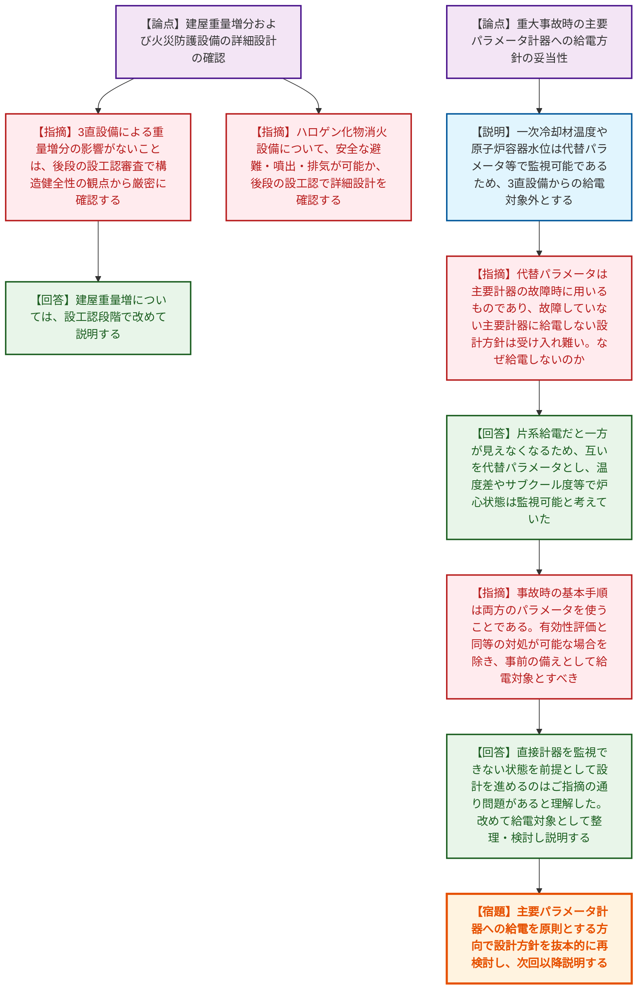
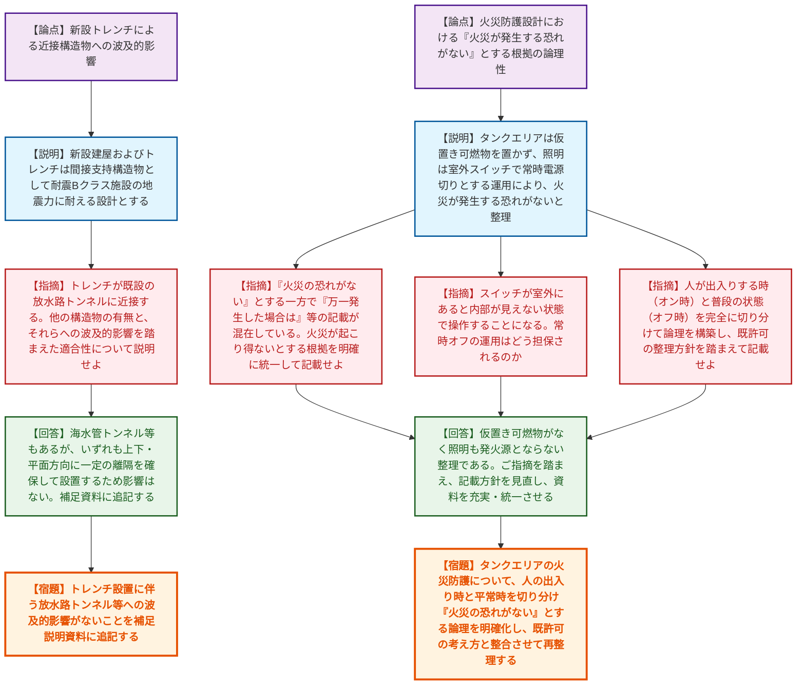

# 第1417回原子力発電所の新規制基準適合性に係る審査会合（令和8年6月18日）
> 出典 : https://youtube.com/live/cl5dwfHk_iM?si=OjK3StVJWar2cUXo

# 会合の概要

*   **主要パラメータへの給電方針に対する根本的な疑義:** 泊発電所3号炉の直流電源設備（3系統目）の設置において、重大事故等対処設備のうち「代替パラメータで監視可能」として主要な計装設備への給電を対象外とした事業者の設計方針に対し、規制側から「主要計器が健全であるにもかかわらず給電しない設計は、事故対処の基本原則を逸脱しており受け入れ難い」と極めて厳しい指摘がなされ、給電範囲の抜本的な再検討が求められた。
*   **火災防護設計におけるロジックの混在と整理の要求:** 大飯発電所3・4号炉の使用済樹脂処理設備の新設において、「火災が発生する恐れがない」とする根拠（照明スイッチの室外設置や常時オフの運用など）と、「万一火災が発生した場合」の対策が資料内で混在していることが指摘された。規制側は、既許可の設計思想との整合性を保ちつつ、人の出入り時と通常時の状態を切り分けて論理的に整理するよう強く求めた。
*   **詳細設計の妥当性は後段規制（設工認）で厳密に確認:** 泊発電所の建屋重量増分による構造健全性への影響や、新たに設置されるハロゲン化物消火設備の安全な噴出・排気設計、ならびに大飯発電所のトレンチ新設による近接構造物への波及的影響について、設置変更許可段階の確認にとどまらず、後段の設計及び工事の計画の認可（設工認）段階で詳細かつ厳密に審査する方針が双方で共有された。

---

# 議題ごとの詳細整理

## 【議題1】北海道電力（株）泊発電所３号炉の所内常設直流電源設備（３系統目）の設置に係る設置変更許可申請の審査について

*   **議論の背景と論点:** 泊発電所3号炉において、重大事故時の直流電源の信頼性向上のため「所内常設直流電源設備（3系統目：3直設備）」を追加設置する。本会合では、同設備による給電対象となる設備の選定方針（特に計装設備の主要パラメータを給電対象外とし、代替パラメータに依存する設計の妥当性）や、建屋への重量影響、火災防護設備（ハロゲン化物消火設備）の運用が主な論点となった。
*   **質疑応答（詳細）:**
    *   【説明者側】（北海道電力 東堂）3直設備の設備概要、設計基準（弾性状態にとどまる範囲の耐震設計、制御弁式鉛蓄電池の採用等）、および給電対象設備（一次冷却材温度等の一部は代替パラメータで対応可能として給電対象外とする方針）について説明した。
    *   【規制側】（規制庁 中村）第39条（地震による損傷の防止）に関して、重量増分が原子炉補助建屋の総重量に対しわずかであり影響はないとされているが、後段の設工認審査において構造健全性に問題がないことを厳密に確認する。
    *   【説明者側】（北海道電力 今村）建屋重量増については、設工認段階で改めて説明する。
    *   【規制側】（規制庁 鳥枝）第8条（火災防護）に関して、ハロゲン化物消火設備を設置するとのことだが、後段の設工認において、安全に避難・噴出できるか、噴出後の排気をどうするかといった詳細な設計を確認する。
    *   【規制側】（規制庁 岡村）3直設備の給電先について、一次冷却材温度や原子炉容器水位などを「代替パラメータで監視するため給電しない」としているが、有効性評価で電源供給が必要な設備には給電するのが原則である。代替パラメータは主要計器の故障時に用いるものであり、故障していない主要計器に給電しない設計方針は受け入れ難い。なぜ給電しないのか、あるいはできないのか。
    *   【説明者側】（北海道電力 荒川/伊沢）片系給電を想定した際、高温側か低温側のどちらかしか監視できなくなるため、これらを互いの代替パラメータとして設定した。温度差10℃を考慮すれば炉心損傷の判断は可能であり、加圧器水位やサブクール度を見れば冠水状態の確認も可能であると考えていた。
    *   【規制側】（規制庁 岡村）事故時の基本手順は両方のパラメータを使って対応することであり、代替パラメータに依存する前提はおかしい。電源供給できない理由があるのか。
    *   【説明者側】（北海道電力 林）直接計器を監視できない状態を前提として設計を進めるのはご指摘の通り問題があると理解した。指摘された計器について、改めて給電の対応を含めて整理し、再度説明させていただきたい。
    *   【規制側】（規制庁 岡本）有効性評価での想定と同等の事故対処が可能であることが明らかな場合を除き、事前の備えとして給電対象とするのが当然である。次回以降の会合で検討結果を確認する。
*   **結論と宿題事項（アクションアイテム）:**
    *   北海道電力は、重大事故時に監視が必要な主要パラメータ計器（一次冷却材温度、原子炉容器水位等）に対する3直設備からの給電について、代替パラメータに依存せず原則として給電対象に含める方向で設計方針を抜本的に再検討し、次回以降の会合で説明する。
    *   建屋構造への重量増分の影響およびハロゲン化物消火設備の詳細設計（避難・噴出・排気）については、後段の設工認審査にて規制庁が確認を行う。

## 【議題2】関西電力（株）大飯発電所３号炉及び４号炉の使用済樹脂処理設備の設置に係る設置変更許可申請の審査について

*   **議論の背景と論点:** 大飯発電所3・4号炉における使用済樹脂処理設備、およびそれに伴う新設建屋やトレンチの設置に関し、第3条（地盤）、第4条（地震）、第8条（火災）、第9条（溢水）、第12条（安全施設）の各許可基準への適合性が説明された。特に、新設トレンチによる近接構造物への波及的影響と、火災防護設計における「火災が発生する恐れがない」とする根拠の論理性・一貫性が問われた。
*   **質疑応答（詳細）:**
    *   【説明者側】（関西電力 川瀬/大寺/松原）新設建屋・トレンチの耐震設計（Cクラス、間接支持構造物としてBクラス評価）、火災防護対策、溢水伝播防止対策（止水処置等）について説明した。タンクエリアは可燃物を置かず照明を常時電源切りとすることで火災の恐れがないエリアとした。
    *   【規制側】（規制庁 足田）第3条・4条に関連し、新設するトレンチが既設の放水路トンネル等に近接する配置となっている。放水路トンネル以外の構造物の有無と、それら構造物による波及的影響を踏まえた適合性について説明せよ。
    *   【説明者側】（関西電力 川瀬）海水管トンネル等があるが、いずれも一定程度の離隔（上下方向含む）を確保して設置するため、影響がない設計となっている。その旨を補足説明資料に追記する。
    *   【規制側】（規制庁 鳥枝）第8条（火災）に関して、タンクエリアの資料記載において「可燃物がない、照明は室外スイッチで常時切りだから火災の恐れがない」とする一方で、「万一火災が発生した場合は」や「火災源になりうる機器が照明設備に限られる」といった記載が混在している。火災が起こり得ないと考えて設計しているのか、起こり得るが低減しているのか、考え方を明確に整理し統一せよ。
    *   【説明者側】（関西電力 大寺）仮置き可燃物を置かず、照明も発火源とならない整理のもと、「火災が発生する恐れがない」と整理している。記載を充実させ、統一する。
    *   【規制側】（規制庁 もがき）整理する際は、既許可の整理方針を踏まえた上で、申請書への記載方針を示すこと。
    *   【規制側】（杉山委員）照明のスイッチが室外にあると、室内でどうなっているか見えない状態でオンオフすることになる。「常時オフ」という運用はどのように担保されているのか疑問である。
    *   【規制側】（規制庁 鳥枝）人が出入りする際のオンオフの状態と、普段の（電気がない）状態を完全に切り分けて整理すると、ロジックがうまく構築できるのではないか。読んでいて混乱するため、整理した上で確認したい。
*   **結論と宿題事項（アクションアイテム）:**
    *   関西電力は、トレンチ設置に伴う放水路トンネルや海水管トンネル等への波及的影響がないこと（離隔確保等）を補足説明資料に追記する。
    *   関西電力は、火災防護エリア（タンクエリア）の設計方針について、既許可の考え方を踏まえつつ、「人が出入りする時」と「平常時」の状態を切り分け、「火災が発生する恐れがない」とする論理的根拠を申請書および補足説明資料内で明確に統一して再整理し、次回以降説明する。

---

# 論理構造の可視化（Mermaid）

## 【議題1】北海道電力（株）泊発電所３号炉の所内常設直流電源設備（３系統目）の設置に係る設置変更許可申請の審査について

## 【議題2】関西電力（株）大飯発電所３号炉及び４号炉の使用済樹脂処理設備の設置に係る設置変更許可申請の審査について

