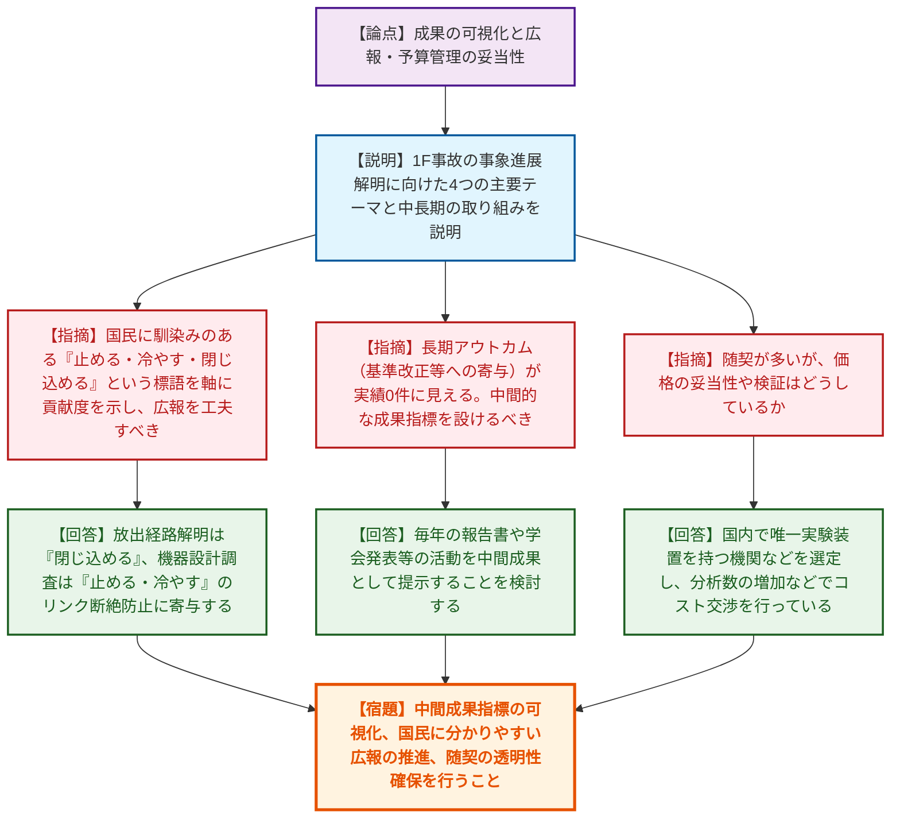
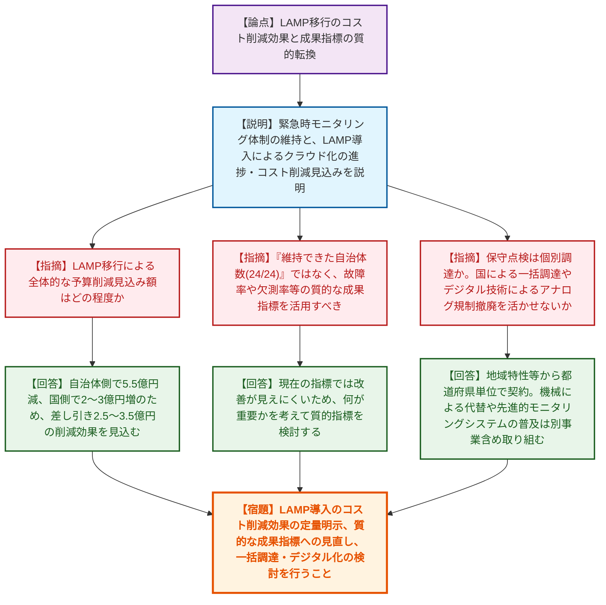
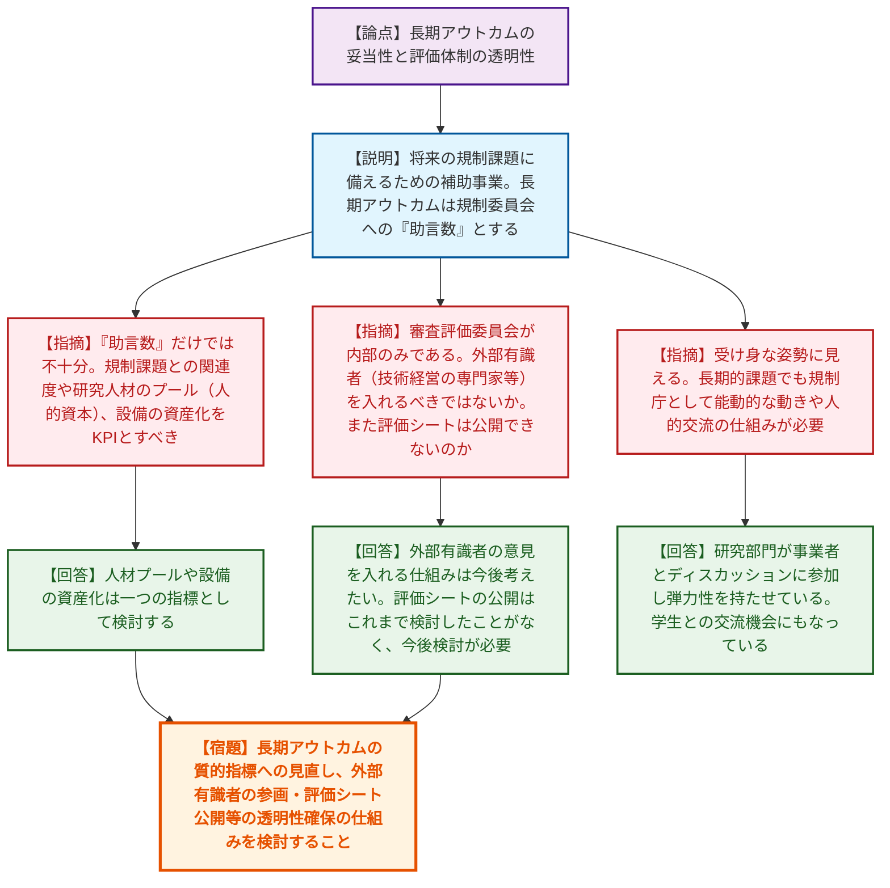

# 第1回令和8年度【公開プロセス】原子力規制委員会行政事業レビューに係る外部有識者会合（令和8年6月19日）
> 出典 : https://youtube.com/live/XbYZGx9vjvo?si=7Q7mGohkL5NmsScZ

# 会合の概要

*   **アウトカム（成果指標）の抜本的見直しの要求:** 各事業における「成果指標」の妥当性について、外部有識者から厳しい指摘が相次いだ。研究系事業では単なる「論文数」や「助言数」ではなく、規制基準への波及や人材プール形成の進捗を示す質的指標の導入が、また交付金事業では「維持できた自治体数（24/24）」ではなく、「機器の故障率」や「欠測率」といった実効性を示す質的指標への転換が強く求められた。
*   **透明性と客観性を担保する評価スキームの構築:** 専門性が高く随意契約が多くなりがちな研究事業において、価格妥当性の検証や、内部委員のみで構成される審査評価委員会への外部有識者（技術経営の専門家等）の参画、さらには評価シートの公開など、第三者が納得できる客観的なガバナンス体制の構築が強く推奨された。
*   **クラウド化（LAMP）によるコスト削減効果の明確化と調達の最適化:** 放射線監視等交付金について、システムをクラウド（LAMP）へ移行することによるネットでのコスト削減効果（2.5〜3.5億円）が確認された。有識者からは、クラウド化のメリットを活かした保守点検の「国による一括調達」への移行や、デジタル技術によるアナログ規制の撤廃（遠隔監視化）によるさらなる効率化が提案された。
*   **国民への分かりやすい広報・アウトリーチの重要性:** 1F事故調査事業において、専門的な技術成果をそのまま提示するのではなく、「止める・冷やす・閉じ込める」といった国民に馴染みのある言葉を用いた広報や、コンクリートの耐熱性研究など広く社会インフラに波及し得る成果の積極的な発信が必要であるとの認識が共有された。

---

# 議題ごとの詳細整理

## 【議題1】東京電力福島第一原子力発電所事故の事象進展の解明に係る調査事業
*   **議論の背景と論点:** 1F事故の事象進展解明調査において、長期的なアウトカム（規制基準改正等への寄与）に至るまでの中間指標の設定、優先順位に基づく予算配分、専門性が高いがゆえの随意契約の妥当性、および専門外の国民にも伝わる広報のあり方が論点となった。
*   **質疑応答（詳細）:**
    *   【説明者側】（規制庁 岩永）1F事故調査の目的、4つの主要テーマ（放出経路、水素爆発、機器設計、PCV内部調査）、短中長期の取り組み、OECD/NEA等との国際連携について説明した。
    *   【指摘】（有識者 名島）一般国民に馴染みのある「止める、冷やす、閉じ込める」という標語を軸に、この調査がどう貢献するのか。国民への伝えやすさを意識した広報をすべき。
    *   【回答】（規制庁 岩永）「閉じ込める」は放出経路の解明や水素爆発の知見が寄与する。「止める」「冷やす」は機器設計の調査が寄与し、特に事故時のリンクの断絶を防ぐ知見となる。
    *   【指摘】（有識者 飯島）技術専門家のまとめ方になっており、目的や用途別（廃炉作業への貢献、将来の要件等）に整理した方が予算付けなどの判断がしやすいのではないか。
    *   【回答】（規制庁 岩永）コンクリートの高温時の挙動など、原子力に限らず広く社会のインフラに貢献し得る知見も出始めている。そうしたベクトルを明示していきたい。
    *   【指摘】（有識者 滝）1Fの知見は今後の新しい原子炉（アイソレーションコンデンサー等）にどう適用されるか。また、長期アウトカム（基準改正等への寄与）へのトリガー条件や見通しは。
    *   【回答】（規制庁 岩永）事故対応で役に立たなかった静的機器の有用性や課題を抽出し、新設計に活かす動きがある。基準改正については、水素爆発対策などで既に反映した実績がある。
    *   【指摘】（有識者 吉田）長期アウトカムが実績0件に見えてしまうため、中間的な成果指標を設けるべき。また、優先順位の決定方法や随意契約（長岡技科大など）の価格妥当性の検証はどうしているか。
    *   【回答】（規制庁 岩永）毎年の報告書や学会発表などの活動を中間成果として提示することを検討する。優先順位は現場のアクセス性や廃炉の進捗に依存している。随意契約は国内で唯一実験装置を持つ大学などを選定しており、分析数の増加などでコスト交渉を行っている。
    *   【指摘】（有識者 滝沢）抽出課題はアカデミアの意見を取り入れたか（ウィッシュリスト）。外部有識者によるレビューはどう組み込まれているか。重複研究はないか。
    *   【回答】（規制庁 岩永）事故分析検討会という公開の場で外部有識者と議論し、OECD/NEAのウィッシュリストからも抽出している。重複研究は意外となく、マニアックな研究室の力を借りている。
*   **結論と宿題事項（アクションアイテム）:**
    *   長期アウトカムに至るまでの中間成果指標（学会発表数や人材プールなど）を可視化し、レビューシート等に反映させること。
    *   「止める・冷やす・閉じ込める」など、国民に分かりやすい言葉を用いた広報活動を推進すること。
    *   随意契約に関する価格妥当性など、第三者に説明可能な透明性を確保すること。

## 【議題2】放射線監視等交付金
*   **議論の背景と論点:** 放射線監視等交付金について、自治体のシステムを国管理のクラウド（LAMP）へ移行することによるコスト削減効果の明確化、自治体ごとの調達の非効率性、および単なる「設置台数」ではなく設備の「故障率」等を用いた質的な成果指標への転換が論点となった。
*   **質疑応答（詳細）:**
    *   【説明者側】（規制庁 川口/下口/山下）交付金の概要、緊急時モニタリング体制、LAMP導入によるクラウド化の進捗とコスト削減見込み（佐賀県の例）について説明した。
    *   【指摘】（有識者 名島）LAMP移行による全体的な予算削減見込み額はどの程度か。
    *   【回答】（規制庁 山下・川口）24道府県全てがLAMPに移行した場合、自治体側で5.5億円削減されるが、国側の運用経費が2〜3億円増えるため、差し引きで2.5〜3.5億円の削減効果を見込んでいる。
    *   【指摘】（有識者 吉田）単位コストから活動成果目標への変更による改善効果は。また、24/24という指標ではなく、故障率や欠測率等の質的な指標を活用すべき。要望額と交付額の差による監視体制への影響はどう確認しているか。
    *   【回答】（規制庁 下口・山下）現在の指標ではコスト改善等が見えにくいため、何が重要かを考えて質的指標を検討する。交付額については、自治体と密にコミュニケーションを取り、故障機器の更新を優先するなどして監視に支障がないよう調整している。
    *   【指摘】（有識者 飯島）LAMPを単なるデータ集約だけでなく、機器の設置年数や故障状況の一元管理に使い、自治体との更新計画の合意形成に活用できないか。
    *   【回答】（規制庁 川口・下口）現在のシステム機能にそれを追加するとコストがかかるため、監視情報課の業務としてのコミュニケーションで把握・調整していく。
    *   【指摘】（有識者 滝）ランニングコストの保守は各道府県で個別調達か。デジタル技術によるアナログ規制撤廃（目視から遠隔監視へ）を活かせないか。国による一括調達やナレッジ集約を検討すべき。
    *   【回答】（規制庁 下口・川口）地域特性や業者の対応可否があるため都道府県単位で契約している。機械による代替や先進的モニタリングシステムの普及は別事業含めて取り組む必要がある。
    *   【指摘】（有識者 滝沢）LAMPへの移行を急ぐべきだが、移行の障壁はシステム独自性か供給側（国側）の制約か。削減効果を交付額に反映するなどのインセンティブ設計はどうか。
    *   【回答】（規制庁 川口）自治体側はシステム更新に合わせて早く移行したい意向だが、移行費用や対応する技術者リソースの制約から、年間3〜4自治体の移行が精一杯の状況である。
*   **結論と宿題事項（アクションアイテム）:**
    *   LAMP導入によるコスト削減効果（ネットで2.5〜3.5億円）を定量的に明示し、今後の予算要求に適切に反映すること。
    *   「維持できた自治体数」だけでなく、設備故障率や欠測率などの質的な成果指標に見直すこと。
    *   保守点検の国による一括調達や、デジタル技術を活用した監視業務の効率化を検討すること。

## 【議題3】原子力規制研究の強化に向けた技術基盤構築事業
*   **議論の背景と論点:** 原子力規制研究の強化に向けた技術基盤構築事業について。長期アウトカム（原子力規制委員会への助言数）の具体性・妥当性、基礎研究と応用研究の評価基準の混在、評価シートの非公開性、および外部有識者のレビュー体制の欠如が論点となった。
*   **質疑応答（詳細）:**
    *   【説明者側】（規制庁 中島）将来の規制課題に備えるための研究機関への補助事業（5機関）。長期アウトカムは規制委員会への「助言数」とする。2025年度の点検結果と執行率未達への対応を説明した。
    *   【指摘】（有識者 名島）基礎研究と応用研究が混ざっており、とんがった研究が規制側の評価で丸くなって萎縮しないか。レベルに応じた評価の仕切りが必要。
    *   【回答】（規制庁 中島）バランスが課題。研究代表者に委ねる部分もあるが、今年度から研究部門と事業者がディスカッションする場を設け、成果を拾い上げる仕組みを作った。
    *   【指摘】（有識者 吉田）長期アウトカムが「助言数」だけでは不十分。規制課題との関連度や人材育成効果等の指標設定の余地はないか。補助事業の評価シートは公開できないのか。
    *   【回答】（規制庁 中島・辻）人材育成やどのような基盤ができたか等の多様な助言を評価したい。評価シートの公開はこれまで検討したことがなく、今後検討が必要。
    *   【指摘】（有識者 飯島）受け身な姿勢に見える。長期的課題でも規制庁として能動的な動きが必要。技術職の人材育成や人的交流の仕組みをどう考えているか。
    *   【回答】（規制庁 中島）規制庁は短中期課題に注力せざるを得ず設備もないため補助事業としているが、研究部門が事業者とディスカッションに参加し弾力性を持たせている。学生との交流を通じて規制庁への関心を高める機会にもなっている。
    *   【指摘】（有識者 滝）助言数ではなく、研究人材のプール（研究従事時間等）や設備の資産化をKPIとすべき。また、審査評価委員会は内部のみだが、外部有識者（技術経営の専門家等）を入れるべきではないか。
    *   【回答】（規制庁 中島）人材プールや設備の資産化は一つの指標として検討する。外部有識者の意見を入れる仕組みは今後考えたい。
    *   【指摘】（有識者 滝沢）中期アウトカムの論文・学会発表件数が目標5件に対し34件（達成率680%）と超過している。人的資本への投資額などを指標に加えてはどうか。
    *   【回答】（規制庁 中島）目標設定時は論文のみだったが、学会発表等も含めたため件数が増加した。指標の追加は検討する。
*   **結論と宿題事項（アクションアイテム）:**
    *   長期アウトカムを「助言数」のみならず、規制課題への活用度や人材育成効果等の質的指標に見直すこと。
    *   審査評価委員会への外部有識者の参画や、評価シートの公開など、評価の客観性と透明性を高める仕組みを検討すること。
    *   研究人材のプール形成や、整備された設備の資産化状況を測定する指標を導入すること。

---

# 論理構造の可視化（Mermaid）

## 【議題1】東京電力福島第一原子力発電所事故の事象進展の解明に係る調査事業

## 【議題2】放射線監視等交付金

## 【議題3】原子力規制研究の強化に向けた技術基盤構築事業

