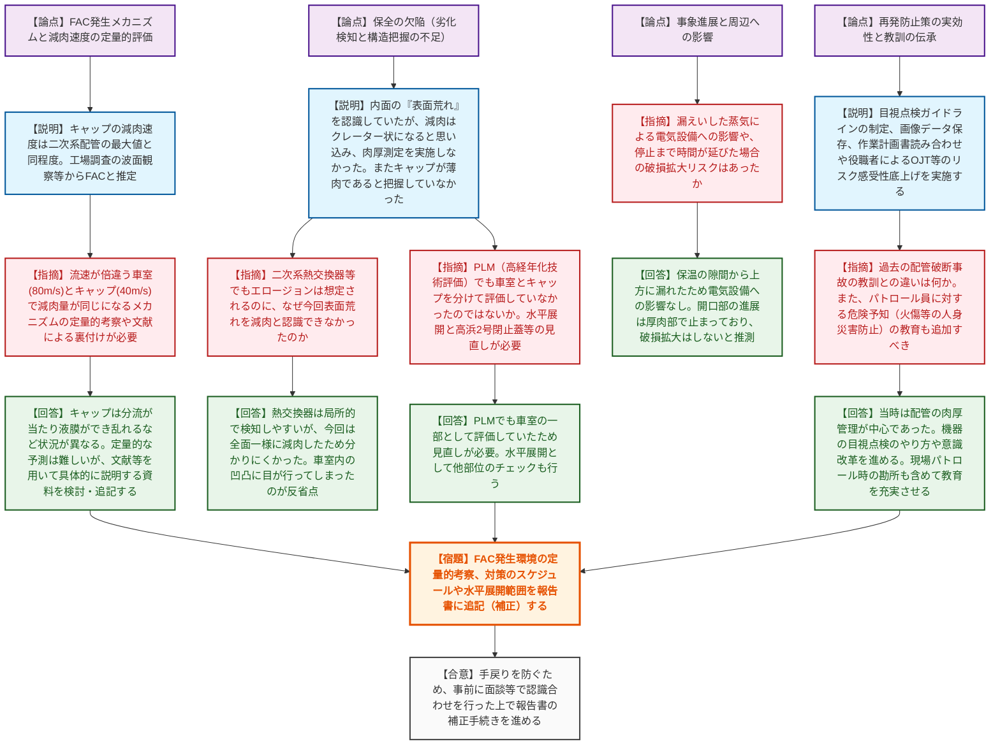

# 第21回原子力施設等における事故トラブル事象への対応に関する公開会合（令和8年6月22日）
> 出典 : https://youtube.com/live/MSyY68Dkngs?si=XidTzUOg8TntW0c-

# 会合の概要

*   **「表面荒れ」を減肉と認識できなかった保全の欠陥への厳しい追及:** 美浜発電所3号機の高圧タービン閉止キャップの蒸気漏えい事象について、過去の目視点検で「表面荒れ（鱗片状模様）」を認識していながら、「減肉はクレーター状になるはず」という思い込みから肉厚測定に至らなかった点に対し、規制側から「点検者の思い込みや構造的特徴（薄肉であること）の把握不足が根本原因である」と厳しく指摘された。
*   **FAC（流れ加速型腐食）の発生メカニズムの定量的説明の不足:** 流速が速い車室本体（80m/s）と、流速が遅い閉止キャップ（40m/s）で同程度（約20mm）の減肉が進行していたことについて、規制側から「腐食速度が同じになるメカニズム（液膜の形成や渦状の流れ等）の定量的な考察や文献による裏付けが不足している」との指摘がなされ、報告書の充実化が求められた。
*   **過去の教訓（美浜2次系配管破断事故）の風化への懸念と再発防止の徹底:** 20数年前の配管破断事故の教訓が、配管の肉厚管理には活かされたものの、タービン車室等の「機器」の目視点検の質的向上に十分反映されていなかった点が浮き彫りとなった。現場のパトロール員に対する危険予知教育や、役職者を巻き込んだリスク感受性向上の取り組みを「形骸化させず継続的に見直す」ことが強く要請された。
*   **今後の審査プロセスの合意:** 規制庁から事業者に対し、FACの定量的考察や対策の具体的スケジュール・水平展開の範囲を報告書に反映（補正）するよう指示が出された。手戻りを防ぐため、事前に面談等で認識合わせ（ラップアップ）を行った上で補正手続きを進めることで双方が合意した。

---

# 議題ごとの詳細整理

## 【議題1】関西電力株式会社美浜発電所３号機における原子炉手動停止事象について

*   **議論の背景と論点:**
    2026年5月8日、美浜発電所3号機において定格熱出力一定運転中に高圧タービン周辺から蒸気が漏えいし、原子炉を手動停止した。原因調査の結果、高圧タービンの調速機側「閉止キャップ」が流れ加速型腐食（FAC）により減肉し、内圧に耐えられず破損したことが判明。本会合では、FACが発生したメカニズムの妥当性、過去の定検で減肉を検知できなかった保全上の問題点、および再発防止策（水平展開や教育を含む）の実効性が主要な論点となった。

*   **質疑応答（詳細）:**
    *   **＜FAC発生メカニズムと定量評価の妥当性＞**
        *   【規制側（水野）】FACが原因とのことだが、運転時間（25万時間）や水質（pH）の履歴から見て、減肉速度は妥当か。パラメータを振った定量的な評価をしているか。
        *   【説明者側（関西電力 佐野/池田）】定量的なパラメータ評価はしていない。キャップ部の最小肉厚（0.8mm）から逆算した減肉速度（約0.8mm/10^4h）は、二次系配管規格の最大減肉速度と同程度である。また、工場調査での鱗片状模様や波状の減肉形状からFACと断定した。過去の低pH運転時に減肉が進み、近年の高pH運転で酸化被膜（マグネタイト）が付着したと推定している。
        *   【規制側（水野）】流速が倍違う車室（80m/s）とキャップ（40m/s）で減肉量（約20mm）が同程度になっている。流速の感度が違うのに腐食量が同じであることについて、定量的な考察や文献による裏付けが必要である。
        *   【説明者側（関西電力 坂口/岡本）】車室は壁に沿った流れだが、キャップは分流が当たって液膜ができ、乱れが生じるなど状況が異なる。機器内の減肉を正確に予測するソフトはないが、メカニズムについて文献等を用いて具体的に説明する資料を検討し、追記する。
    *   **＜保全の欠陥（劣化の検知不足と構造把握不足）＞**
        *   【規制側（小野）】二次系熱交換器等でもエロージョン等は想定されるのに、今回なぜ「表面荒れ」を減肉と認識できなかったのか。
        *   【説明者側（関西電力 佐野/坂口）】熱交換器は蒸気入口で局所的にFACが発生するため健全な部分と比較して検知しやすい。今回のキャップ部は全面一様に減肉したため、クレーター状の減肉しか想定していなかった点検者には気付けなかった。また、閉止キャップが薄肉構造であることを把握していなかった。
        *   【規制側（水野）】「劣化の検知不足」の主語は誰か。また、今回のような「見落とし」がないかを未然に防ぐ活動は対策に含まれるか。
        *   【説明者側（関西電力 越智/田中）】主語は点検者および管理者の両方である。対策として、目視点検ガイドラインを新規制定し、表面荒れがあれば肉厚測定を行うルールとする。また、今回の事例を題材とした教育の中で、自分たちの設備に置き換えて見落とし（抜け）がないかを探す活動を行う。
        *   【規制側（小野）】高経年化技術評価（PLM）でも高圧排気室と閉止キャップを分けて評価していなかったのではないか。水平展開として、製造法が異なるのに同じように評価している部位がないか、また高浜2号等の閉止蓋も分けて評価すべき。
        *   【説明者側（関西電力 長谷川）】PLMでも車室の一部として評価していたため、技術評価への反映も必要と考えている。他部位のチェック（水平展開）も行う。
    *   **＜事象の進展とその他の影響＞**
        *   【規制側（平田）】漏えいした2.6トンの蒸気による周辺の電気設備やモーターへの影響はなかったか。
        *   【説明者側（関西電力 越智）】保温の隙間から上に向かって蒸気が上がり、タービンフロアに水分は残っておらず、周辺電気設備への影響はない。
        *   【規制側（水本）】破壊評価で0.67mmが限界とのことだが、破損しなかった発電機側キャップの肉厚は？
        *   【説明者側（関西電力 池田）】3D計測での最小肉厚は0.8mmであり、ほぼ寿命がなかったと評価している。
        *   【規制側（渋谷）】漏えいから停止まで16分だったが、時間が伸びていたらどうなっていたか。
        *   【説明者側（関西電力 越智）】損傷開口部は厚さ2mm程度のところで進展が止まっているため、時間が倍になっても損傷面積が拡大したとは考えていない。蒸気の漏えい量が倍になっていた程度と推測する。
    *   **＜今後の保全の在り方と教訓の伝承＞**
        *   【規制側（水本）】20数年前の美浜配管破断事故の時のチェックとの違いは何か。当時の教訓を補完する計画になっているか説明が必要。
        *   【説明者側（関西電力 坂口）】当時は配管の肉厚管理が中心であり、機器については内部を開放して目視点検する方針だった。今回の教訓を踏まえ、目視点検のやり方や意識改革を進める。
        *   【規制側（平田）】現場をパトロールする運転員等に対して、薄肉部が人の方を向いていたら火傷するなどの危険性を認識してもらう教育（労働安全観点）を追加すべき。
        *   【説明者側（関西電力 越智）】点検のタイミングによっては危険であるため、勘所を含めて教育内容を充実させる。
*   **結論と宿題事項（アクションアイテム）:**
    *   関西電力は、FAC発生環境（流速の違いによる減肉速度の差異等）の定量的考察や文献による裏付けを報告書に追記する。
    *   対策の具体的なスケジュール、水平展開の対象範囲、およびリスク感受性向上教育の継続的見直しについて、詳細を明確化する。
    *   上記の修正（報告書の補正）にあたっては、手戻りを防ぐため、事前に規制庁と面談等で認識合わせ（ラップアップ）を行った上で提出することとし、双方が合意した。

---

# 論理構造の可視化（Mermaid）

## 【議題1】関西電力株式会社美浜発電所３号機における原子炉手動停止事象について

---
