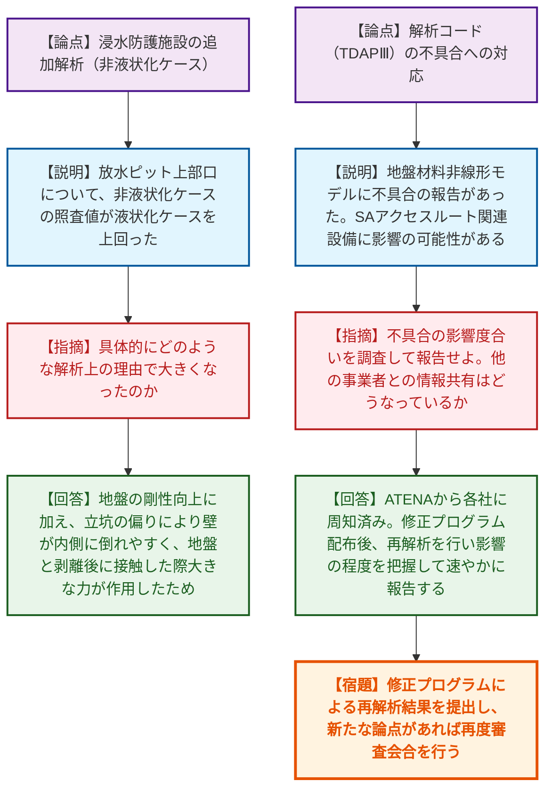
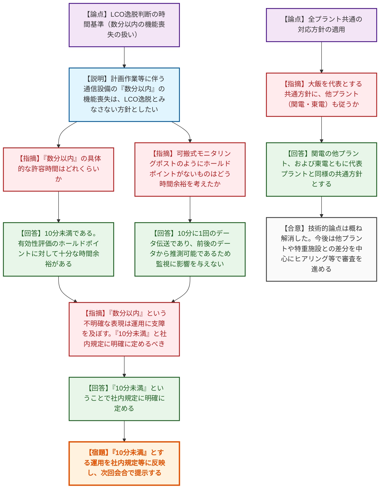

# 第1418回原子力発電所の新規制基準適合性に係る審査会合（令和8年6月23日）
> 出典 : https://youtube.com/live/QmU6GisDHSw?si=s8kSciF1fRsvz1EP

# 会合の概要

*   **解析コード（TDAPⅢ）の不具合発覚による審査への影響:** 泊発電所3号機の審査において、地震応答解析に用いているプログラム「TDAPⅢ」に不具合があることが発覚した。ATENAを通じて各社に周知されている状況であり、修正プログラムによる再解析結果次第では今後の審査工程に影響を及ぼす可能性があるとして、規制庁から影響度合いの早期報告が求められた。
*   **「数分以内」という曖昧な表現の排除とLCO逸脱基準の明確化:** 重大事故等対処設備におけるLCO（運転上の制限）逸脱の判断基準について、関西電力が提案した「通信設備の数分以内の機能喪失は逸脱とみなさない」という方針に対し、規制庁が「曖昧な表現は運用に支障をきたす」と厳しく指摘。「10分未満」という具体的な数値を社内規定に明記することで合意した。
*   **全プラント共通の対応方針の合意:** 大飯発電所を代表として議論されてきた通信連絡設備のLCO見直し等の方針について、関西電力の他プラント（美浜、高浜）および東京電力（柏崎刈羽）もこれに従うことが確認された。これにより主要な技術的論点は概ね解消し、今後は各プラントの差分や特重施設を中心に審査を進めるという道筋が明確になった。

---

# 議題ごとの詳細整理

## 【議題1】北海道電力（株）泊発電所３号機の設計及び工事の計画の審査について
*   **議論の背景と論点:** 泊発電所3号機の設工認申請（第5回・第6回補正）において、循環水ポンプ建屋の耐震評価や火災感知器の設置方針、浸水防護施設の追加解析（非液状化ケース）の評価結果が説明された。また、耐震評価に使用している解析コード「TDAPⅢ」の地盤材料非線形モデルに不具合が確認されたことが報告され、その影響度合いと他プラントへの共有状況が論点となった。
*   **質疑応答（詳細）:**
    *   **＜浸水防護施設の追加解析について＞**
        *   【規制側】（規制庁 藤原）放水ピット上部口について、非液状化ケースの方が液状化ケースよりも照査値が大きくなっている。具体的にどのような解析上の理由で大きくなったのか。
        *   【説明者側】（北海道電力 清水）非液状化により地盤の剛性が上がり変位しづらくなる一方、当該ピットは立坑が北側に偏っており壁が内側に倒れやすい構造である。地震時に地盤と構造物が剥離し、再度接触した際に一度に大きな力が作用したことで照査値が上昇したと考察している。
        *   【規制側】（規制庁 藤原）施設の形状等によって非液状化ケースの方が大きくなり得ることが理解できた。非液状化ケースを追加で確認するフローの考え方が適切であったと確認できた。
    *   **＜解析コード（TDAPⅢ）の不具合について＞**
        *   【規制側】（規制庁 熊谷）TDAPⅢの不具合はいつ頃報告があり、どのような調査を行っているか。また、他事業者との情報共有はどうなっているか。
        *   【説明者側】（北海道電力 星）6月16日に開発元から周知があり、委託先経由で報告を受けた。重大事故等対処設備のアクセスルート関連設備に影響の可能性がある。ATENAから各社に不具合の周知はなされている。6月25日頃に修正プログラムが配布される予定であり、再解析を実施して影響の程度を把握した上で速やかに報告する。
        *   【規制側】（規制庁 熊谷）不具合の影響度合いをきちんと調査した上で報告していただきたい。
    *   **＜今後の審査について＞**
        *   【規制側】（規制庁 小野）今後予定している補正はこれまでの議論の反映だと認識しているが、追加で説明したい内容はあるか。
        *   【説明者側】（北海道電力 岡田）現時点で追加で説明させていただきたい内容は考えていない。
*   **結論と宿題事項（アクションアイテム）:**
    *   循環水ポンプ建屋等の評価や追加解析結果については、評価手法および結果が概ね妥当であると確認された。
    *   解析コード（TDAPⅢ）の不具合については、北海道電力が修正プログラムによる再解析を実施し、その影響度合いを速やかに報告する。不具合による影響が大きい場合や新たな論点が生じた場合は、再度審査会合を実施する。

## 【議題2】関西電力（株）美浜・高浜・大飯、並びに東京電力（株）柏崎刈羽の保安規定変更認可申請の審査について
*   **議論の背景と論点:** 重大事故等対処設備におけるLCO（運転上の制限）逸脱の判断基準の見直しが論点となった。特に、通信連絡設備（衛星電話や可搬式モニタリングポスト）の計画的な点検・保守に伴う一時的な機能喪失を「LCO逸脱とみなさない」とするための方針と、その許容時間（数分以内）の明確化が求められた。
*   **質疑応答（詳細）:**
    *   **＜LCO逸脱判断の目安時間について＞**
        *   【規制側】（規制庁 保藤）代替措置が実施できない場合の「LCO逸脱を判断する時間基準」について、約2日ではなく、2日を1秒でも超えたら逸脱と判断するという理解でよいか。
        *   【説明者側】（関西電力 道見）2日以内に冗長設備の動作可否を確認できないと判断した時点で速やかに逸脱宣言をするため、2日を超えることはない。
    *   **＜通信設備の「数分以内」の機能喪失の扱い＞**
        *   【規制側】（規制庁 保藤）通信事業者の計画作業等に伴う「数分以内」の機能喪失はLCO逸脱とみなさないとのことだが、具体的な許容時間の範囲はどれくらいか。
        *   【説明者側】（関西電力 道見）10分未満である。有効性評価における最も厳しいシナリオ（過圧破損シナリオでの注水開始15.1時間以内など）に対しても、約10時間程度の時間余裕があるため、10分未満の喪失は事故対処に支障を与えない。
        *   【規制側】（規制庁 保藤）可搬式モニタリングポストのように、ホールドポイントが設定されていないものはどう時間余裕を考えたのか。
        *   【説明者側】（関西電力 道見）10分に1回のデータ伝送機能であり、その間の10分未満の機能喪失であれば、欠測前後のデータから推測可能であるため指示値の監視に影響を与えないと考えている。
        *   【規制側】（規制庁 岡村）LCO逸脱の判断基準として「数分以内」という不明確なものは運用に支障を及ぼす。「10分未満」と社内規定に明確に定めるべき。
        *   【説明者側】（関西電力 道見）「10分未満」ということで社内規定に明確に定める。
    *   **＜他プラントへの共通方針の適用＞**
        *   【規制側】（規制庁 岡村）今回、大飯を代表として全プラント共通の対応方針が固まったと理解する。他プラント（関電、東電）もこれに従うか。
        *   【説明者側】（関西電力 道見、東京電力 石川）両社とも代表プラントと同様の共通方針に基づき準備する。東電も可搬式モニタリングポスト等の屋外常駐等の申請は取り下げる。
        *   【規制側】（規制庁 岡本）代表プラントにおける技術的な論点は概ね解消した。今後は他プラントとの差分を中心に確認する。特重施設についても、共通方針がそのまま適用できるか、固有の技術的判断を要するものがないかを見極めるため、早めにヒアリングで方針を説明してほしい。
*   **結論と宿題事項（アクションアイテム）:**
    *   通信連絡設備の機能喪失について、「10分未満」であればLCO逸脱とみなさない旨を社内規定に明確に定め、次回会合で資料に反映したものを提示する。
    *   大飯を代表とする共通方針に全プラントが合意したため、今後は他プラント（美浜、高浜、柏崎刈羽）および特重施設との差分を中心にヒアリング等で審査を進める。

---

# 論理構造の可視化（Mermaid）

## 【議題1】北海道電力（株）泊発電所３号機の設計及び工事の計画の審査について

## 【議題2】保安規定変更認可申請（重大事故等対処設備等のLCO見直し）の審査について

---
