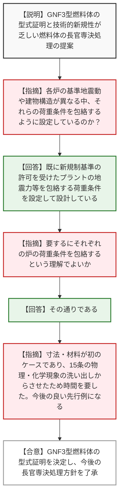
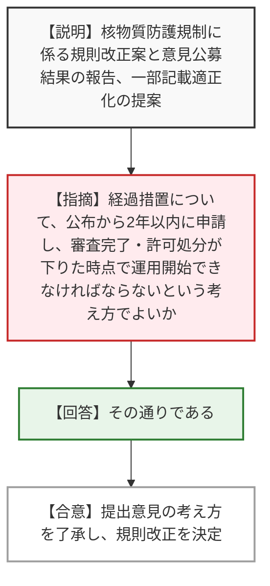
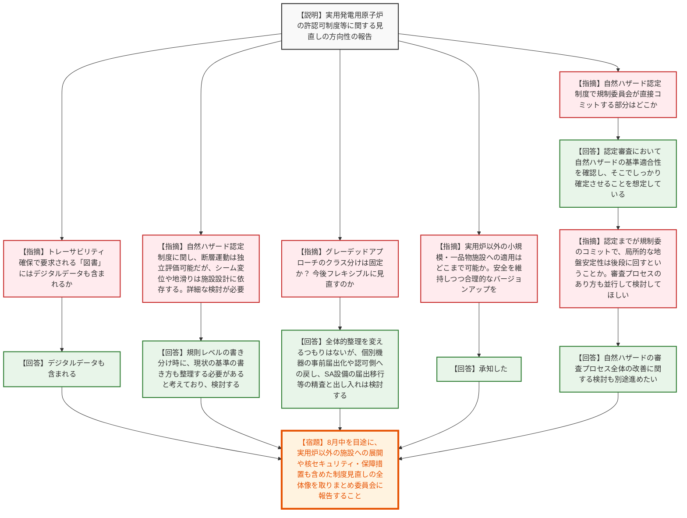
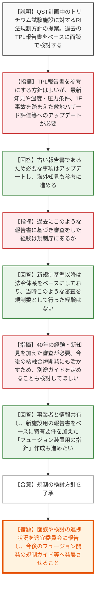
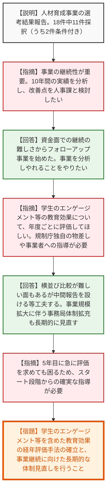
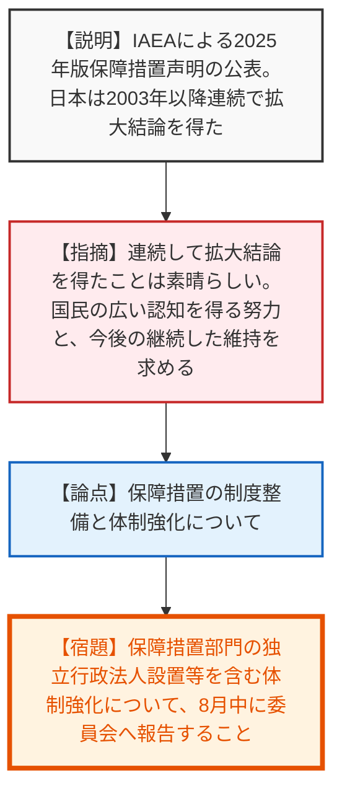

# 第16回原子力規制委員会（令和8年6月24日）
> 出典 : https://youtube.com/live/N1o2iKDDnn8?si=f1BTRunT6YWL1v-X

## 会合の概要作成
* **許認可制度の抜本的見直しと合理化の推進:** 実用発電用原子炉における許認可制度に「グレーデッドアプローチ（安全上の重要度に応じた規制の重み付け）」を導入し、事前届出や事後届出の拡充、および自然ハザードに関する早期認定制度を創設する方向性が示されました。事業者との協議も大詰めを迎えており、8月中に全体像を取りまとめるという具体的なマイルストーンが設定されました。
* **新規技術・未経験領域に対する規制アプローチの確立:** GNF3型燃料体の型式証明や、QSTが計画するトリチウムシステム安全試験施設（RI法適用）など、国内初あるいは長期間アップデートされていなかった領域の審査方針が議論されました。過去の知見をベースにしつつも、最新のハザード評価や1F事故の教訓を反映させるという規制側の厳格な姿勢が示されました。
* **IAEA保障措置における「拡大結論」の継続獲得と人材育成の重要性:** 2003年以降連続となるIAEAからの拡大結論の獲得が報告され、国際的信頼の維持が高く評価されました。また、原子力規制人材育成事業において、教育効果の長期的かつ定量的な評価（学生のエンゲージメント等）と、事業の安定的継続に向けた体制強化が強く要請されました。

---

## 議題ごとの詳細整理（テキスト）

**【議題1：発電用原子炉施設に係る特定機器の型式の設計の型式証明（GNF3 型燃料体）】**
* **議論の背景と論点:** GNF3型燃料体は従来の燃料と寸法や被覆管の材質が異なる新技術であり、国内初の燃料体型式証明申請となった。この新しい燃料体に対する荷重条件の設定の妥当性と、今後の類似案件の手続き合理化（長官専決）が論点となった。
* **質疑応答（詳細）:**
  * 【説明者側】（天野調査官・西内審査官）GNF3型燃料体について、新基準適合性審査を経て型式証明の審査書を取りまとめたため決定いただきたい。また、今後の技術的新規性が乏しい燃料体の型式証明は長官の専決処理で行う方針について了承いただきたい。
  * 【規制側】（山岡委員）各炉の基準地震動や建物構造が異なる中、それらの荷重条件を包絡するように設定しているとのことだが、それぞれの炉における基準地震動で燃料集合体にかかる荷重を求めて、それを包絡するという理解でよいか。
  * 【説明者側】（天野調査官）既に新規制基準の許可を受けたプラントの地震力等を包絡する荷重条件を設定して設計を行っていることを確認している。そのご理解の通りである。
  * 【規制側】（杉山委員）申請から3年以上かかったが、寸法・材料が異なる初のケースであり、過去の審査をなぞるのではなく、15条の要求に関する物理的・化学的現象を全て洗い出させて分析させたため時間がかかった。事業者もこれに応えており、今後の新しい燃料申請の際の良い先行例になる。
* **結論と宿題事項（アクションアイテム）:**
  * GNF3型燃料体の型式証明について妥当と認め、決定された。
  * 今後、技術的新規性が乏しい燃料体の型式証明については、原子力規制庁長官の専決処理で行う方針が了承された。

**【議題2：核物質防護規制のあり方の検討状況（４回目）】**
* **議論の背景と論点:** 試験研究用原子炉施設等に対する「小型無人機（ドローン）検知設備」の設置義務付けに係る規則改正案と、実施した意見公募（パブリックコメント）の結果への対応が論点。
* **質疑応答（詳細）:**
  * 【説明者側】（吉川管理官）意見公募の結果に対する考え方と、規則改正案（「装置を構成する装置」を「装置を構成するもの」と記載を適正化した点を含む）の決定について諮りたい。
  * 【規制側】（委員）経過措置の考え方について確認したい。公布から2年以内に核物質防護規定の申請を行い、審査が完了して許可の処分が下りた時点で運用が開始できなければならないという考え方でよいか。
  * 【説明者側】（吉川管理官）ご認識の通りである。
* **結論と宿題事項（アクションアイテム）:**
  * 提出された意見に対する考え方が了承され、記載の適正化を含めた規則の一部改正が決定された。

**【議題3：実用発電用原子炉の許認可制度等に関する見直しの方向性】**
* **議論の背景と論点:** 許認可手続きにおける「グレーデッドアプローチ（安全重要度に応じた手続きの簡素化）」の導入、自然ハザードの早期分割認定制度の創設、および中部電力の不正行為を踏まえた虚偽申請への罰則やトレーサビリティ確保の義務化をどのように制度設計するかが争点。
* **質疑応答（詳細）:**
  * 【説明者側】（田口課長）許可や設工認のグレーデッドアプローチ（事前届出・事後届出の拡充）、自然ハザード認定制度の創設、虚偽申請の罰則追加とトレーサビリティの確保義務付け、バックフィット着手前規制の緩和等の方向性について報告する。
  * 【規制側】（山岡委員）トレーサビリティ確保で検証・保存が要求される「図書」には、デジタルデータも含まれるか。
  * 【説明者側】（田口課長）デジタルデータも含まれるという理解でよい。
  * 【規制側】（山岡委員）自然ハザードの認定制度に関し、断層運動のように独立評価可能なものと、シームの風化（工学的対処が可能）や地滑り（土木工事で地形が変わる）のように施設設計・局所的要因に依存するものがある。それらをどう整理し区別するか詳細に検討してほしい。
  * 【説明者側】（田口課長）規則レベルで書き分ける際に、現在の基準の書き方自体も整理する必要があると考えており、頂いたコメントを踏まえて検討する。
  * 【規制側】（杉山委員）グレーデッドアプローチに関して、添付資料のクラス分けは固定で考えているのか。今後フレキシブルに見直す余地はあるか。
  * 【説明者側】（田口課長）全体的な整理を大きく変えるつもりはないが、現在30日前届出のものを事前届出にしてよいか、逆に認可側に戻すべきか、また可搬型SA設備のように認可から届出へ移す等の個別の出し入れは同時に精査・検討する。
  * 【規制側】（委員）実用炉以外の小規模・一品物の施設について、グレーデッドアプローチがどこまで可能なのか。進捗に応じて安全を維持しつつ合理的なものにバージョンアップしてほしい。
  * 【説明者側】（田口課長）承知した。
  * 【規制側】（委員）自然ハザード認定制度の図において、規制委員会が直接コミットする部分はどこになるのか。
  * 【説明者側】（田口課長）認定審査において自然ハザードの基準適合性を確認し、パブリックコメントも経てしっかり適合していると宣言・確定させる部分である。
  * 【規制側】（委員）認定までが規制委のコミットであり、局所的な地盤安定性などの問題は認定審査に入れず後段に回すということか。審査プロセスのあり方も並行して検討してほしい。
  * 【説明者側】（田口課長）自然ハザードの審査プロセス全体の改善に関する検討も別途並行して進める。
* **結論と宿題事項（アクションアイテム）:**
  * 報告内容の方向性でおおむね了承された。
  * 【宿題】8月中を目途に、実用炉以外の施設への展開や、核セキュリティ・保障措置も含めた制度見直しの全体像を取りまとめ、委員会に諮ること。

**【議題4：燃料（トリチウム）システム安全試験施設の RI 法における取扱い】**
* **議論の背景と論点:** QSTが計画する新たなトリチウムシステム試験施設（約100g使用）に対するRI法での規制方針。昭和62年のTPL（約60g使用）の安全指針報告書をベースに審査してよいか、また最新知見をどう反映させるかが論点。
* **質疑応答（詳細）:**
  * 【説明者側】（上谷補佐）QSTの新施設に対するRI法の要件は、過去のTPL報告書をベースに面談形式で検討を進めたい。またフュージョン開発事業者とも情報共有を行う。
  * 【規制側】（杉山委員）TPL報告書をベースにする方針は良いが、昭和62年から時間が経ち知見も増えている。運用温度・圧力条件の変化、敷地のハザード評価（1F事故の教訓等）を踏まえ、最新知見に基づきアップデートすべき。
  * 【説明者側】（上谷補佐）必要な事項についてはアップデートし、カナダ等の海外知見も参考にしながら進める。
  * 【規制側】（委員）過去にこのような報告書に基づいて審査をした経験は規制庁にあるのか。
  * 【説明者側】（上谷補佐）新規制基準以降は法令上の体系として明確にしたものをベースにしており、昭和60年代のような取り組みを規制委員会として行った経験はない。
  * 【規制側】（委員）40年間の経験や新知見を加えた審査が必要。今後の核融合炉開発に活かすため、別途ガイドのようなものを定めておくことも検討し、技術評価結果を後に活かせる形で残してほしい。
  * 【説明者側】（上谷補佐）フュージョン事業者と情報共有し、新施設用の報告書リバイス版をベースに、トリチウム増殖や熱・圧力等の核融合炉特有の要件を加えた「フュージョン装置用の指針」を作成することも進めたい。
* **結論と宿題事項（アクションアイテム）:**
  * QSTが計画中の新施設に係る規制の検討方針（TPL報告書ベースの検討、面談公開、フュージョン事業者との情報共有等）が了承された。
  * 【宿題】面談や検討の進捗状況を適宜委員会に報告し、得られた知見を今後のフュージョン開発の規制ガイド等に発展させること。

**【議題5：令和8年度原子力規制人材育成事業の選考結果】**
* **議論の背景と論点:** 人材育成事業の採択結果報告。事業が開始から10年を迎える中、採択機関の資金面での自立の難しさと、事業全体の長期的継続性、および教育効果の測定手法が論点。
* **質疑応答（詳細）:**
  * 【説明者側】（菅生補佐）応募18件のうち、新規9件、フォローアップ2件（うち2件は条件付き）の計11件を採択した。不採択者への面談も実施する。
  * 【規制側】（神田委員）双方向性が本事業の特徴だが、継続性も重要である。10年間の実績を分析し、改善すべき点について人事課と検討したい。
  * 【説明者側】（渡邉課長）自立が前提だが資金確保が難しいためフォローアップ事業を開始した経緯がある。事業を分析してやれることをやっていきたい。
  * 【規制側】（山中委員長）学生のエンゲージメント（卒業後の成長等）を含めた教育効果を、年度ごとにしっかり評価してほしい。規制庁独自の物差しによる評価や事業者への指導が必要。
  * 【説明者側】（渡邉課長）現状は横並びの比較がない等の課題があるため、中間報告を設けるなど工夫したい。また、採択が27件に達しており事務局体制が手薄なため、長期的な視点から体制拡充ややり方の見直しも工夫したい。
  * 【規制側】（山中委員長）5年目に急に評価を求めても対応が難しいため、スタート段階から評価を求める指導を各プロジェクトリーダーに行うべき。
* **結論と宿題事項（アクションアイテム）:**
  * 選考結果の報告を受理。条件付き採択の2機関については対応が確認でき次第、交付決定を行う。
  * 【宿題】学生のエンゲージメントを含めた教育効果の経年評価手法を確立し事業者に指導すること。事業規模拡大に伴う長期的な事務局体制の強化と事業改善を検討すること。

**【議題6：国際原子力機関（ＩＡＥＡ）による「２０２５年版保障措置声明」の公表】**
* **議論の背景と論点:** 2025年版のIAEA保障措置声明において、日本が引き続き「拡大結論（平和的活動からの転用の兆候なし）」を得たことの報告と、今後の保障措置体制の強化について。
* **質疑応答（詳細）:**
  * 【説明者側】（中桐参事官）IAEAよりレポートが公表され、日本は2003年以降連続で拡大結論を得た。引き続き確実に保障措置活動に取り組む。
  * 【規制側】（委員）連続での拡大結論獲得は素晴らしく、NPT体制下での国際的信頼維持に極めて重要。国民に広く認知されるよう努力してほしい。
  * 【規制側】（山中委員長）保障措置に関しては、新法人の設置を含めた制度整備と体制強化を検討しており、8月中に改めて委員会に報告される予定である。活動がより精緻化・強化されると理解している。
* **結論と宿題事項（アクションアイテム）:**
  * 報告を受理。
  * 【宿題】保障措置部門の独立行政法人設置等を含む体制強化について、8月中に全体像を委員会へ報告すること。

---

## 論理構造の可視化（Mermaid）

### 議題1：特定機器の型式証明（GNF3 型燃料体）

### 議題2：核物質防護規制のあり方の検討状況

### 議題3：実用発電用原子炉の許認可制度等に関する見直しの方向性

### 議題4：燃料（トリチウム）システム安全試験施設の RI 法における取扱い

### 議題5：令和8年度原子力規制人材育成事業の選考結果

### 議題6：国際原子力機関（ＩＡＥＡ）による「２０２５年版保障措置声明」の公表

