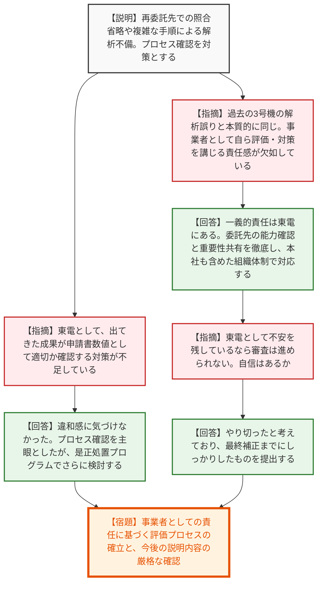
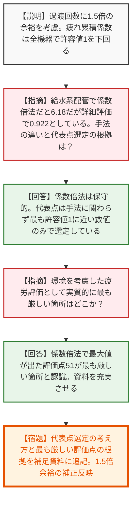
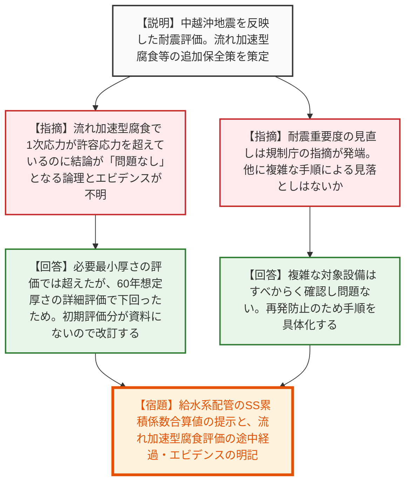
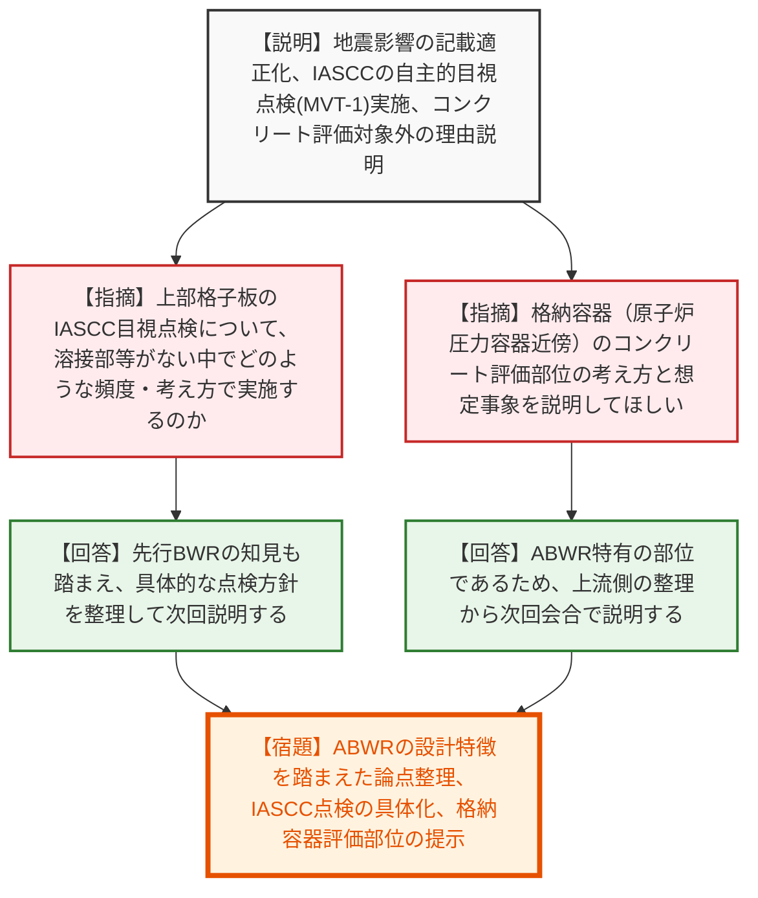

# 第32回実用発電用原子炉の長期施設管理計画等に係る審査会合（令和8年6月25日）
> 出典 : https://youtube.com/live/Gehme0wuoxg?si=K2cy70uN89poRB7S

## 会合の概要作成
* **事業者の当事者意識と品質保証体制への極めて厳しい叱責:** 配管解析の不備に関して、東京電力の委託先管理や成果物の妥当性確認プロセスに対する根本的な欠如が露呈しました。規制側からは「事業者・申請者としてのなすべきことの認識に疑問符を持っている」という異例の厳しい指摘が飛び交い、品質保証（調達管理）に対する強い懸念が示される非常に緊張感の高いやり取りとなりました。
* **評価プロセスの透明性と論理の飛躍に対する疑義:** 低サイクル疲労や流れ加速型腐食の評価において、簡易評価（係数倍法等）と詳細評価が混在した結果、資料上の数値（発生応力や累積疲労係数）と結論（許容限界を下回るため問題なし）が直接結びつかない箇所が複数指摘されました。規制側は、審査基準を満たすための「つじつま合わせ」ではないかという疑念を払拭するため、評価プロセスの丁寧な補足説明を強く要求しました。
* **ABWR特有の構造に基づく新規論点への対応指示:** 柏崎刈羽6号炉がABWR（改良型沸騰水型軽水炉）であることに起因する、従来型BWRとの設計の差異（原子炉冷却材再循環ポンプの内蔵、上部格子板の構造、格納容器の構造等）に着目した評価の必要性が改めて強調されました。次回会合に向け、ABWR特有の劣化事象の有無や評価方針を体系的に整理し直すことが宿題として課されました。

---

## 議題ごとの詳細整理（テキスト）

**【議題1：配管解析の不備についての原因と対策】**
* **議論の背景と論点:** 長期施設管理計画の耐震安全性評価において、東京電力が委託した配管解析の条件入力漏れや、複雑なデータ抽出作業に伴う転記ミスが発覚。これに対する原因究明と再発防止策が、単なる「委託先のミス」で片付けられず、東京電力自身の「事業者としての確認能力と当事者意識」の欠如として大きく問われた。
* **質疑応答（詳細）:**
  * 【説明者側】（東京電力：高尾氏）解析不備の原因として、再委託先における部品図との照合省略（プロセス変更の妥当性確認不足）と、複雑なデータ抽出手順による貼り付けミスがあった。再発防止策として、作業プロセスの確認を業務文書に反映し、関係者への周知・注意喚起を行う。
  * 【規制側】（規制庁：有森氏）東電は申請者として、提出された成果物が申請書に記載される数値として適切かどうかを確認する対策が不足している。違和感に気づけなかった点について、どう対策するのか。
  * 【説明者側】（東京電力：高尾氏）違和感に気づけずに申請したのが事実。今回はプロセスの確認を主眼とした対策としたが、ご指摘を踏まえ、さらに是正処置プログラムの中で対策を検討したい。
  * 【規制側】（規制庁：村田氏）全体のプロセス見直しフローの中に今回の対策が組み込まれていない。また、過去の柏崎刈羽3号機の解析誤りと本質的に同じエラーではないか。東電が自ら結果を評価できるところを見せる必要があり、事業者としての責任と認識に疑問符を持っている。
  * 【説明者側】（東京電力：菊川氏）一義的な責任は東電にある。自ら解析する能力までは求められていないと理解しているが、委託先の能力確認や業務の重要性の共有を徹底し、社内体制も本社を含めて強化している。これ以上追加で確認することはないという状態までやり切ったと考えている。
* **結論と宿題事項（アクションアイテム）:**
  * 【宿題】東京電力自身の責任に基づく評価プロセスの確立と、調達管理・品質保証体制の抜本的見直しを行うこと。今後の審査において、その体制が機能しているかを規制側が継続して確認する。

**【議題2：技術評価（低サイクル疲労）】**
* **議論の背景と論点:** プラントの起動・停止等に伴う温度・圧力変化による低サイクル疲労評価。過渡回数の算出方法見直し（実績に1.5倍の保守性を見込む）と、評価手法（係数倍法と詳細評価法）の違いによる「最大評価点（代表点）」の選定根拠の妥当性が論点となった。
* **質疑応答（詳細）:**
  * 【説明者側】（東京電力：竹口氏）ABWR特有の構成に基づく機器を選定し評価を実施。実績過渡回数と想定過渡回数（1.5倍の余裕を考慮）を合算し、60年時点の疲れ累積係数が全機器で許容値の1を下回ることを確認した。
  * 【規制側】（規制庁：茂垣氏）給水系配管で代表点としている数値（0.922）とは別に、係数倍法で1を大きく超える数値（6.18）が出ている箇所がある。詳細評価法との違いや、代表点の選定を「数値のみ」で行っていることの根拠を説明してほしい。
  * 【説明者側】（東京電力：竹口氏/藤本氏）係数倍法は非常に保守的な手法であり、1を超えた箇所については、より正確な詳細評価法を用いて1を下回ることを確認している。代表点の選定は、評価手法に関わらず「最も許容値の1に近いもの」を選んでいる。
  * 【規制側】（規制庁：茂垣氏/有森氏）手法によらず最大値を採用していることは理解したが、環境を考慮した疲労評価として「実際に最も厳しい箇所」はどこかを含め、代表点選定の考え方を補足説明資料に明確に追記すること。
* **結論と宿題事項（アクションアイテム）:**
  * 【宿題】代表点選定の考え方と、環境効果を考慮した上で実質的に最も厳しい評価点がどこであるかの説明を補足資料に追記すること。また、1.5倍の余裕を考慮した過渡回数について、補正へ適切に反映すること。

**【議題3：技術評価（耐震安全性評価）】**
* **議論の背景と論点:** 中性子照射脆化、流れ加速型腐食、全面腐食等と地震荷重を組み合わせた評価。特に「流れ加速型腐食」において、発生応力が許容応力を超えるという一時的な解析結果から、「耐震安全上問題なし」という最終結論に至るプロセスの論理的な繋がりと資料上のエビデンス不足が指摘された。
* **質疑応答（詳細）:**
  * 【説明者側】（東京電力：佐藤氏）中越沖地震の経験を反映した上で、各経年劣化事象に対する耐震安全性評価を実施。流れ加速型腐食については、原肉傾向の把握を継続し、必要に応じて配管取替等を実施する追加保全策を策定した。
  * 【規制側】（規制庁：鈴木氏）給水系配管等の流れ加速型腐食評価で、発生応力が許容応力を超える数値があるが、補足説明資料のエビデンスと1対1で対応していない。「問題なし」とする結論に至る根拠が不明瞭である。
  * 【説明者側】（東京電力：野谷氏）必要最小厚さを用いた評価では許容応力を超えたが、60年時点の想定厚さを用いた詳細評価では下回ったため問題なしとしている。資料には初期厚さの評価が示せていないため、経過がわかるよう改訂する。
  * 【規制側】（規制庁：芦田氏/有森氏）耐震重要度の見直しについて、規制庁の指摘から始まって見直された経緯がある。グルーピングの複雑さが原因とのことだが、他に見落としはないか。また、数値の事実関係と結論の結びつきを資料上で明確にすること。
* **結論と宿題事項（アクションアイテム）:**
  * 【宿題】給水系配管の疲れ累積係数に対する基準地震動SSの累積係数合算値の提示。
  * 【宿題】流れ加速型腐食の評価において、発生応力が許容応力を超える結果から「問題なし」に至る途中経過（初期肉厚と60年想定肉厚の違い等）とエビデンスを補足資料に明記すること。

**【議題4：これまでの審査会合における指摘事項の回答】**
* **議論の背景と論点:** 過去の会合での指摘（地震影響の考慮範囲、IASCCに対する自主保全、コンクリート構造物の評価等）に対する回答。特にABWR特有の構造に対する評価方針の整理が求められた。
* **質疑応答（詳細）:**
  * 【説明者側】（東京電力：藤本氏/中野氏）地震影響については、実際に考慮したものは中越沖地震のみであることを追記する。上部格子板のIASCC・靭性低下については、技術評価上は追加保全不要だが、自主的な施設管理としてMVT-1（目視点検）を実施する。コンクリート構造物は対象部材がないため除外した。
  * 【規制側】（規制庁：中野氏）上部格子板には溶接部や応力集中部がない中、現時点でMVT-1をどのような頻度や考え方で実施するのか詳細が不明。整理して説明すること。
  * 【規制側】（規制庁：有森氏）ヒアリングで格納容器の一部の評価部位を見直す方向と聞いた。原子炉圧力容器近傍のコンクリート評価部位の考え方、想定事象と対策について次回の審査会合で説明すること。
  * 【説明者側】（東京電力：藤本氏）ABWRの評価として、上流側の整理から次回審査会合で説明する。
* **結論と宿題事項（アクションアイテム）:**
  * 【宿題】上部格子板に対するIASCC目視点検（MVT-1）の具体的な実施方針（頻度・タイミング等）の整理。
  * 【宿題】格納容器（原子炉圧力容器近傍）のコンクリート評価部位の考え方と評価結果の提示。
  * 【宿題】ABWRとしての設計上の特徴を踏まえた劣化評価の論点（新たに考慮した内容の有無など）を改めて体系的に整理し、申請書への反映方針を説明すること。

---

## 論理構造の可視化（Mermaid）

### 議題1-1：配管解析の不備についての原因と対策

### 議題1-2：技術評価（低サイクル疲労）

### 議題1-3：技術評価（耐震安全性評価）

### 議題1-4：これまでの審査会合における指摘事項の回答

