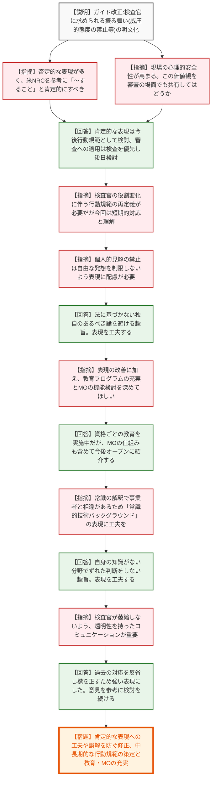
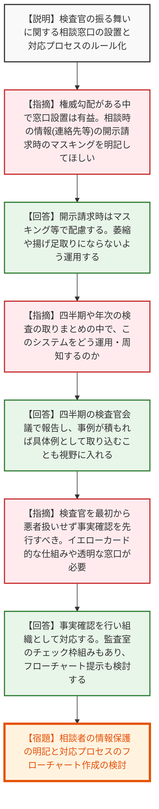
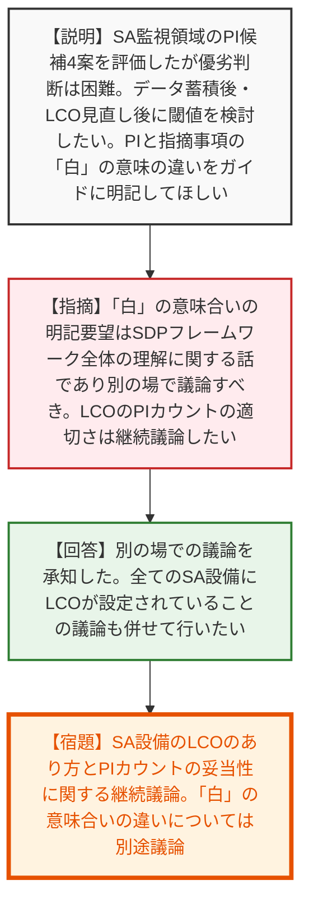
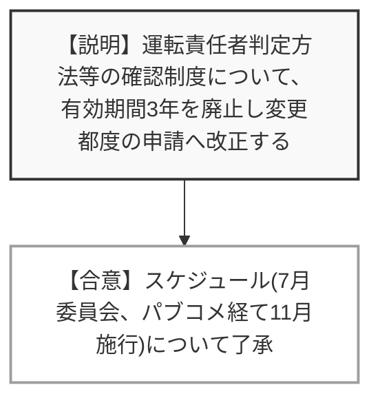

# 第20回検査制度に関する意見交換会合（令和8年6月26日）
> 出典 : https://youtube.com/live/prMN7YGG-kw?si=bqlRpJrjelxwqA8d

## 会合の概要作成
* **検査官の不適切な振る舞いに対する厳格な是正と行動規範の明文化:** 検査官による威圧的・恫喝的な態度や個人的見解の押し付けといった不適切事案を受け、規制庁はガイド改正による「検査官に求められる振る舞い」の明文化と、事業者からの「相談窓口」の設置を表明しました。規制側自らが襟を正す強い姿勢を示した一方、事業者や有識者からは、権威勾配の解消を歓迎しつつも、検査官が過度に萎縮しないための配慮や、組織としての透明性ある対応プロセスの構築を求める声が相次ぎました。
* **横断問題（安全文化）プログラムの日本導入に向けた現実的な模索:** 米国ROPのCCI（クロスカッティング）プログラムの導入について、日本の指摘事項の少なさや根本原因特定の難しさから、そのままの導入は困難であるとの中間報告がなされました。有識者からは、既存のPI&R（問題把握と解決）検査の成果をベースにしつつ、日本独自の安全文化の特性（OECD/NEAフォーラムの11特性など）を反映した制度設計へ深掘りするよう強い期待が寄せられました。
* **SA設備の安全実績指標（PI）見直しに関する継続協議:** 重大事故等対処設備のLCO（運転上の制限）逸脱をカウントするPIの見直しについて、アテナから4つの候補案が比較検討されたものの、現時点での優劣の判断は困難との見解が示されました。データ蓄積の不足とLCO設定見直しの過渡期であることが背景にあり、閾値の設定も含めて継続的な議論に持ち越されることとなりました。

---

## 議題ごとの詳細整理（テキスト）

**【議題1：令和7年度の原子力規制検査の運用実績等を踏まえた運用改善のためのガイドの改正案】**
* **議論の背景と論点:** 令和7年度に向けた検査ガイドの改正。過去の評価済み事案の追加検査判断からの除外、機密情報取扱いの明確化に加え、検査官の威圧的な態度等の不適切事案を受けた「検査官に求められる振る舞い（恫喝の禁止、個人的見解の排除等）」の明文化が大きな論点となった。
* **質疑応答（詳細）:**
  * 【説明者側】（大森）重要度評価の記載適正化、評価済み事案の追加検査除外、軽微事例集の追加等を実施する。また、共通事項ガイドにおいて、機密情報の取扱いや「検査官に求められる振る舞い」を明記し、威圧的態度や個人的見解に基づく指摘を慎むよう定めた。
  * 【指摘】（アテナ 織田）振る舞いについて「～してはならない」という否定的な記載が多く、米NRCのOEDO手順書を参考に「～すること」という肯定的な記載にすれば検査官も制約を受けずに対応できるのではないか。事業者側も権威勾配を感じずに意見し合えるよう、事業者のあるべき姿の制定を検討している。
  * 【指摘】（片岡）明確化は事業者にとっても規制庁の振る舞いを理解する上で役立ち、心理的安全性が高まり良好なコミュニケーションに繋がる。この価値観を審査の場面でも共有してほしい。
  * 【回答】（竹内）肯定的な書き方については杉山委員からもコメントがあったため今後行動規範的なものを検討する。審査については、まずは個人ベースで行う検査から優先したい。
  * 【指摘】（杉山委員）検査制度の移行に伴い検査官の役割も変わり、高いレベルから個々の行動規範を定義し直す必要があるが、時間がかかるため今回は短期的な対応とした。
  * 【指摘】（高橋先生）「個人的見解に基づく結論は慎むべき」という点について、検査官の自由な発想を制限しないよう配慮が必要ではないか。（※音声欠落部推測）
  * 【回答】（竹内）法に基づかない独自のあるべき論を避ける趣旨であり、表現を工夫する。
  * 【指摘】（関村先生）ネガティブな表現の改善に加え、検査官の質問力を高める教育プログラムの充実と、本庁からのマネジメント・オブザベーション（MO）の機能を深めてほしい。
  * 【回答】（竹内）教育は資格を3段階に分けて行っているが、今後はMOの仕組みも含めてオープンに紹介していきたい。
  * 【指摘】（米岡先生）「常識的な技術的バックグラウンドに従って判断し、個人的見解は慎む」という表現が分かりにくい。常識の解釈において事業者と相違が生まれるため、表現を工夫すべき。
  * 【回答】（竹内）自身の知識がない分野でずれた判断をしないよう、相場観を持つべきという趣旨。表現は工夫する。
  * 【指摘】（勝田先生）取り組みは重要だが、検査官が萎縮して自由な発想が低下するのを避けるべき。質問の趣旨を説明できるかなど、コミュニケーションと透明性を高めることが重要。
  * 【回答】（杉本審議官）規制側という強い立場にあり、過去の良くなかった対応に対して襟を正すため強い表現を用いた。意見を参考に今後の行動規範の検討を続ける。
* **結論と宿題事項（アクションアイテム）:**
  * ガイド改正案の方向性については了承された。
  * 【宿題】「検査官に求められる振る舞い」について、肯定的な表現への工夫や、「常識的・個人的見解」といった表現の誤解を防ぐ修正を行うこと。また、長期的な行動規範の策定と教育・MOの充実を図ること。

**【議題2：原子力規制検査の適正な実施に向けた取組】**
* **議論の背景と論点:** 検査官の不適切な振る舞いを是正し、事業者が権威勾配を感じずに意見を言える環境を作るため、新たな「相談窓口」の設置と対応プロセスのルール化が提案された。情報提供者の保護と、検査官の萎縮防止の両立が論点となった。
* **質疑応答（詳細）:**
  * 【説明者側】（平野）検査官の振る舞いに関する相談窓口を設置し、事業者からの気づきや改善要望を受け付ける。事実関係を確認し、必要に応じて是正措置や人事上の措置も検討する。報復的措置は禁止する。
  * 【指摘】（アテナ 織田）権威勾配が存在する実態があり、窓口設置は心理的安全性向上に資する。相談時の情報（連絡先等）が開示請求された場合の取り扱いをガイドに明記してほしい。
  * 【回答】（竹内）開示請求時はマスキング等で個人情報を保護する旨を記載する。通報の仕組みではなくより良くするためのフィードバックであり、検査官が萎縮したり揚げ足取りになったりしないよう運用する。
  * 【指摘】（関村先生）四半期や年次の検査の取りまとめの中で、このシステムをどのように運用・周知していくのか。
  * 【回答】（竹内）四半期の検査官会議等で報告し、事例が積もれば具体例として取り込むことも視野に入れる。
  * 【指摘】（勝田先生）最初から検査官を悪者扱いせず、事実確認で誤解を解くプロセスを前段階に置くべき。また、イエローカード的な注意書を出す仕組みや、個人だけでなく組織的な再発防止策、透明性を持った客観的な窓口（監査室など）の仕組みが必要。
  * 【回答】（竹内）事実確認を行い組織として対応する。制度的な問題であればこの意見交換会合で挙げてほしい。規制庁内でも監査室によるチェックの枠組みがある。フローチャートの提示も検討する。
* **結論と宿題事項（アクションアイテム）:**
  * 相談窓口の設置とプロセスルール化の取り組みは賛同を得た。
  * 【宿題】相談者の情報保護（開示請求時のマスキング等）を明記すること。対応プロセスのフローチャート作成を検討すること。

**【議題3：横断問題プログラムに関する課題整理及び対応方針案】**
* **議論の背景と論点:** 米国ROPにおけるCCI（クロスカッティング）プログラムの日本導入に向けた検討。過去の指摘事項に安全文化の10特性を暫定的に当てはめた結果、指摘件数の少なさから米国と同じ閾値方式の導入は困難であり、日本独自の実情に合わせた制度設計が必要であることが論点。
* **質疑応答（詳細）:**
  * 【説明者側】（大森）過去の指摘事項に安全文化の10特性を当てはめた結果、認識や業務プロセスに関する特性に集中した。しかし、日本の指摘件数では米国の閾値では問題特定に至らず、根本原因特定の限界も見えたため、そのままの導入ではなく、日本の実情を踏まえたCCIプログラムのあり方を引き続き検討する。
  * 【指摘】（アテナ 織田）引き続きの検討に賛同する。現在のPI&R検査で既に安全文化の確認（是正措置プログラムの機能確認など）が類似して行われているため、検査の重複がないよう無駄を排除して検討してほしい。
  * 【回答】（竹内）品証検査での安全文化の確認が有効に機能しているか、米国でのCCI縮小の動向も踏まえ、リソースの観点も含めて引き続き検討する。
  * 【指摘】（関村先生）本格運用から進捗がないことに懸念がある。日本のPI&R検査で何ができていて、指摘事項でない部分も含めてどう評価してきたかをまとめることが出発点である。
  * 【回答】（高須）PI&R検査後にはオブザベーションの記録を提出し改善を促している。パフォーマンスベースで大きな問題は見受けられないが、品証規則に則った活動についてのコメントは出している。
  * 【指摘】（関村先生）PI&R検査ガイドでは事業者と検査官の判断の違いを考察するよう求めており、そのベースを共有することで日本なりの横断領域が見えてくるはずである。
  * 【回答】（竹内）次回等でPI&Rの役割や重複について紹介しながら議論を深める。
  * 【指摘】（勝田先生）中間報告として興味深い。安全文化をどう見るかは手探り状態だが、不備が生じる以上、プログラムを通して安全文化の醸成を見ていく可能性がある。
  * 【回答】（竹内）何もない状態で問題点を特定するのは難しく、より深い分析ができるか議論が必要である。
  * 【指摘】（関村先生）日本独自の安全文化の特性（OECD/NEAフォーラムでの11の特性など）も踏まえ、ISO9001改訂などの全体を見ながら議論を進めてほしい。
  * 【回答】（竹内）日本独自の特質（集団優先など）の視点が反映できていなかったため、今後視野に入れて考える。
  * 【指摘】（米岡先生）QMSの中で技術的根拠を確立して指摘するのは困難であり、オーナーシップの問題が大きい。日本の文化に沿った「リーダーシップ」の定義（欧米とはニュアンスが違う）等も考慮してほしい。
  * 【回答】（竹内）リーダーシップの概念について個人ごとの認識の違いがあり、日本としての組織への当てはめを課題として考える。
* **結論と宿題事項（アクションアイテム）:**
  * 日本独自のCCIプログラムのあり方について、既存のPI&R検査の実績をベースに継続して検討していくことで一致した。
  * 【宿題】PI&R検査で得られた知見のまとめと、日本固有の安全文化の特性（11特性等）を反映した横断領域検査の仕組みを引き続き検討し、次回の会合等で提示すること。

**【議題4：重大事故等対処に係る安全実績指標の見直し】**
* **議論の背景と論点:** SA監視領域のPI（安全実績指標）見直しについて、規制庁から提示された4つの候補案（A-1, B-1, B-2, B-3）に対するアテナの検討結果の報告。LCO逸脱のカウント方法や閾値の設定、PIにおける「白」と検査指摘事項の「白」の意味合いの違いが論点。
* **質疑応答（詳細）:**
  * 【説明者側】（アテナ 織田）4つの指標案について、6つの観点から優劣を評価（20丸丸三角で分類）したが、観点間の重要度が不明であり現時点での優劣判断は困難。閾値設定についても、法令報告事象ベース（B-2）は実績ゼロであり、BWRプラントのデータ蓄積も不十分なため、データ蓄積後に検討すべき。また、SA設備のLCO見直しが進んでいるため推移を注視したい。加えて、PIの「白」と検査指摘事項の「白」の意味合いが異なるため、検査ガイドへ明記してほしい。
  * 【規制側】（笠川）「白」の意味合いのガイド明記要望はSDPフレームワーク全体の理解に関する話であり、SA監視領域のPI検討の論点からずれているため別の場で議論すべき。現在のLCO見直しが終わった段階で、LCOのPIカウントが実績を表すものとして適切かを引き続き議論したい。
  * 【説明者側】（アテナ 織田）別の場での議論について承知した。全てのSA設備にLCOが設定されていることの議論も併せてさせていただきたい。
* **結論と宿題事項（アクションアイテム）:**
  * PI候補案の決定や閾値の設定は、データの蓄積とLCO見直しの推移を待って引き続き継続検討することとなった。
  * 【宿題】SA設備のLCOのあり方とPIへのカウントの妥当性について、面談や意見交換会合で引き続き議論を行うこと。PIと検査指摘事項の「白」の意味合いの違いについては別途議論の場を設けること。

**【議題5：その他（運転責任者に係る基準等に関する規程の一部改正に向けた検討について）】**
* **議論の背景と論点:** 実用炉の運転責任者（当直長）判定方法等の確認制度における、手続きの合理化・効率化。
* **質疑応答（詳細）:**
  * 【説明者側】（島）運転責任者判定方法等の確認制度について、有効期間3年の更新制を廃止し、変更があった都度確認を申請する形に改正する。7月に委員会へ諮り、パブリックコメントを経て11月頃の施行を目指す。
  * 【規制側】（竹内）パブリックコメントの機会があるので、意見があれば寄せてほしい。
* **結論と宿題事項（アクションアイテム）:**
  * 制度改正のスケジュールが報告され、了承された（特段の異論なし）。

---

## 論理構造の可視化（Mermaid）

### 議題1：ガイドの改正案

### 議題2：適正な実施に向けた取組

### 議題3：横断問題プログラムに関する課題整理及び対応方針案

```mermaid
graph TD
classDef setumei fill:#f9f9f9,stroke:#333,stroke-width:2px;
classDef shiteki fill:#ffebee,stroke:#c62828,stroke-width:2px;
classDef ronten fill:#e3f2fd,stroke:#1565c0,stroke-width:2px;
classDef kaitou fill:#e8f5e9,stroke:#2e7d32,stroke-width:2px;
classDef shukudai fill:#fff3e0,stroke:#e65100,stroke-width:4px,color:#e65100;
classDef goui fill:#ffffff,stroke:#9e9e9e,stroke-width:2px;

C1["【説明】CCIプログラムの検討。過去の指摘に安全文化特性を当てはめたが米国の閾値導入は困難。日本独自の実情を踏まえた検討を継続"]:::setumei
C2["【指摘】現在のPI&R検査で既に安全文化を確認しているため、重複や無駄を排除して検討してほしい"]:::shiteki
C3["【回答】PI&R検査の有効性や米国でのCCI縮小動向、リソースの観点を含め引き続き検討する"]:::kaitou
C4["【指摘】本格運用から進捗がない。PI&R検査で指摘以外の部分も含めどう評価してきたかをまとめることが出発点"]:::shiteki
C5["【回答】PI&R検査後にはオブザベーション記録を提出し改善を促している。品証規則活動へのコメントも出している"]:::kaitou
C6["【指摘】事業者と検査官の判断の違いを考察するベースを共有することで日本なりの横断領域が見えてくるはず"]:::shiteki
C7["【回答】次回等でPI&Rの役割や重複について紹介し議論を深める"]:::kaitou
C8["【指摘】不備が生じる以上、プログラムを通して安全文化の醸成を見ていく可能性はある"]:::shiteki
C9["【回答】何もない状態での問題特定は難しく、より深い分析ができるか議論が必要"]:::kaitou
C10["【指摘】日本独自の安全文化特性(11特性)も踏まえ、ISO9001改訂等の全体を見ながら議論を"]:::shiteki
C11["【回答】日本独自の特質の視点が不足していた。今後視野に入れて考える"]:::kaitou
C12["【指摘】QMSの中で技術的根拠を確立し指摘するのは困難。日本の文化に沿ったリーダーシップの定義等も考慮を"]:::shiteki
C13["【回答】リーダーシップ概念の認識の違いがあり、日本組織への当てはめを課題として考える"]:::kaitou
C14["【宿題】PI&R検査の知見のまとめと日本固有の安全文化特性を反映した横断領域検査の継続検討"]:::shukudai

C1 --> C2
C2 --> C3
C3 --> C4
C4 --> C5
C5 --> C6
C6 --> C7
C7 --> C8
C8 --> C9
C9 --> C10
C10 --> C11
C11 --> C12
C12 --> C13
C13 --> C14
```

### 議題4：重大事故等対処に係る安全実績指標の見直し

### 議題5：その他

