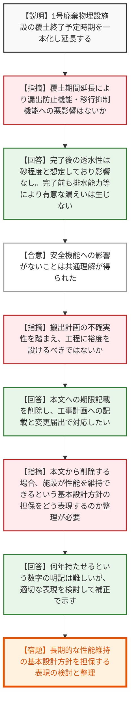
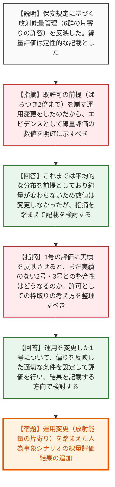
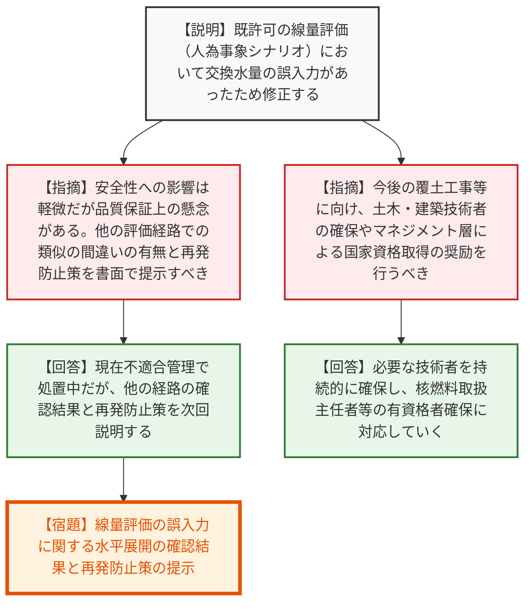

# 第587回核燃料施設等の新規制基準適合性に係る審査会合（令和8年6月29日）
> 出典 : https://youtube.com/live/nFhxYg1e6jg?si=w7oA3WQ_PX-tKic0

## 会合の概要作成
* **覆土完了時期の延長と安全機能への影響の確認:** 1号廃棄物埋設施設の覆土終了予定時期の延長について、覆土完了前の「漏出防止機能」および完了後の「移行抑制機能」への影響はないとの共通理解が得られました。一方で、天候等の外的要因を考慮した工程の余裕（裕度）の設定や、施設が長期的な性能を維持できる基本設計方針の宣言のあり方について、規制側から表現の工夫と再整理が求められました。
* **運用実態の許可への反映（エビデンスの要求）:** 保安規定で先行して認められた「放射能量の片寄りを許容する運用」を事業許可申請へ反映するにあたり、添付書類に定性的な記載しかしていなかった事業者に対し、規制側は「信じてくださいと言っているのと同じ」と厳しく指摘しました。エビデンスとして線量評価の数値をクリアカットに示すことが強く要求され、事業者はこれを受け入れました。
* **線量評価の誤入力に対する品質保証上の強い懸念:** 既許可の線量評価（人為事象シナリオの沢水交換水量）における誤入力が判明しました。安全性への影響は軽微であるものの、規制側は許可段階で見抜けなかった品質保証体制に強い懸念を示し、他の評価経路を含めた水平展開による確認と、抜本的な再発防止策の提示を求めました。

---

## 議題ごとの詳細整理（テキスト）

**【議題1：日本原燃(株)濃縮・埋設事業所の廃棄物埋設事業変更許可申請について】**

**■ 議論の背景と論点1：覆土終了予定時期の延長と漏出防止機能への影響**
* 廃棄体の受け入れ数量の減少等に伴い、1号廃棄物埋設施設において2段階に分けていた覆土終了予定時期を一本化し、延長する。この延長が、埋設施設の安全機能（覆土完了までの漏出防止機能、完了後の移行抑制機能）に悪影響を与えないか、また、搬出計画の不確実性を踏まえた期間設定が妥当であるかが論点となった。

* **質疑応答（詳細）:**
  * 【規制側】（真田）覆土完了までは漏出防止機能、完了後は移行抑制機能を担保する設計である。覆土期間を延長してクラックが発生したとしても、完了後は施設を「砂」として評価し吸着性のみを期待するため、移行抑制機能への影響はないという認識でよいか。
  * 【説明者側】（清水）その通り。覆土完了以降の透水性は保守的に砂程度と想定しているため、覆土時期の変更は評価に影響しない。
  * 【規制側】（真田）覆土完了前について、仮にポーラスコンクリートにクラックが入り放射性物質が漏えいする状況を想定しても、線量評価上は50μSv/年に対し十分に低く、工学的に有意な漏えいは生じないという認識でよいか。
  * 【説明者側】（清水）仮に排水に水中濃度限度相当の放射性物質が検出され環境へ放出されたとしても、線量は十分小さく影響はない。
  * 【規制側】（大塚）漏出防止機能への影響がないことは共通理解できた。次に、搬出計画に基づく覆土期間設定について、外的要因（冬季や大雨）での遅延リスクがあるため、裕度を設定すべきではないか。急ぐあまり施工不良や事故が起きることは避けるべき。
  * 【説明者側】（浜中）搬出計画には不確定要素がある。漏出防止機能等に影響がないと理解が得られたので、許可本文には期限を書かず、工事計画に記載して遅延時は変更届出で対応することを考えている。次回回答したい。
  * 【規制側】（内藤）本文から記載をなくす場合、施設がどの程度の期間、性能を維持できる設計なのかという前提（基本設計方針）をどう担保するのか整理が必要。
  * 【説明者側】（佐々木）通常数十年持つ設計にはしているが、何年持たせる設計にしていると具体的に説明するのは難しい。
  * 【規制側】（金城）表現の問題である。何年と書かなくても、機能維持の年数を確保できる施設であることを表現してほしい。
  * 【説明者側】（佐々木）検討し、適切な表現を補正で示す。

* **結論と宿題事項（アクションアイテム）:**
  * 覆土期間の延長が安全機能（漏出防止機能・移行抑制機能）に影響を与えないことについては合意（納得）が得られた。
  * 【宿題】搬出計画の不確実性を踏まえた覆土期間の記載方法について、安全機能の長期的な維持を担保する設計であることをどう表現するか整理し、次回説明すること。

**■ 議論の背景と論点2：保安規定の反映（放射能量の片寄りを考慮した線量評価）**
* 保安規定の認可において、1号廃棄物埋設施設の6群に限って放射能量の片寄り（濃度の高い廃棄体の定置）を許容した。この運用変更を事業許可申請へ反映するにあたり、添付書類の線量評価にどう反映させるかが論点となった。

* **質疑応答（詳細）:**
  * 【規制側】（大塚）保安規定認可時、片寄りを考慮した線量評価値が2.5倍になることが分かっており、次回の許可申請で添付書類を修正すると回答していた。しかし今回、人為事象シナリオの線量評価値自体を変更せず、「基準線量を超えない」という定性的な記載に留めているのはなぜか。
  * 【説明者側】（小澤）これまでは平均的に放射能量が分布しているという評価を行っており、総放射能量は変わらないため評価値は変更しなかった。
  * 【規制側】（大塚）既許可の前提（2倍までのばらつき）を崩し、明らかに濃度の高い場所を作る運用変更をしたのだから、エビデンスとして線量評価の数値をクリアカットに示すべき。
  * 【説明者側】（小澤）1号だけでなく2号、3号の偏りの可能性も含めて線量評価値を記載する方向で検討する。
  * 【規制側】（真田/大塚）1号は運用（前提）を変えたので線量評価に反映すべきだが、2号・3号は前提を変えていない。1号だけ実績を反映した評価をすると2号・3号との整合が取れなくなる。全体の枠取りとしての許可の考え方を整理すべき。
  * 【規制側】（内藤）事業許可の前提（トータル量）は変わっていない。実績に基づき1号でばらつきが大きくなったが安全上問題ないとして保安規定で確認された行為を、許可の添付書類に反映してほしいということ。2号・3号まで枠取りをしに行くのは違う。
  * 【説明者側】（清水）1号、2号、3号のどれを書くか議論はあるが、偏りの高い場所が代表的な評価ポイントになるため、1号を記載する形も含めて検討し、偏りを反映した評価結果を示す。

* **結論と宿題事項（アクションアイテム）:**
  * 定性的な記載では不十分であり、運用変更による影響を定量的なエビデンス（線量評価値）として示すべきであるという点で合意した。
  * 【宿題】保安規定での運用変更（放射能量の片寄り）を踏まえた人為事象シナリオの線量評価結果を追加・修正すること。

**■ 議論の背景と論点3：線量評価のパラメータ誤りと技術的能力**
* 既許可の線量評価において入力パラメータ（沢水の交換水量）の誤りが見つかった件に係る品質保証体制の懸念と、今後の大規模工事に向けた技術者・資格者の確保状況が論点となった。

* **質疑応答（詳細）:**
  * 【規制側】（大塚）線量評価における沢水の交換水量の誤入力について、最終的な線量評価結果への影響は軽微であると理解しているが、品質保証上の懸念がある。許可段階で見つからなかったことに対する再発防止策と、他の経路での類似の間違いの有無を説明してほしい。
  * 【説明者側】（小澤）現在不適合管理（CAP）の中で処置を実施中だが、改めて再発防止策を書面で説明する。他の経路への影響確認も併せて説明する。
  * 【規制側】（菅長）技術的能力に関して、土木・建築分野の人数が減少しているが、今後の2号・3号の覆土工事に向けて人員を維持するよう計画的な採用・教育を行うべき。また、国家資格取得者も減少気味であるため、マネジメント層は取得を奨励してほしい。
  * 【説明者側】（浜中）土木・建築等の技術者は引き続き確保できるよう対応する。資格者については、埋設事業に炉はないため、今後は核燃料取扱主任者や第1種放射線取扱主任者を必要な人数確保していく。

* **結論と宿題事項（アクションアイテム）:**
  * 【宿題】線量評価の誤入力に関する他の経路の水平展開結果の報告と、品質保証体制上の再発防止策を書面にて説明すること。技術者等の人員確保は継続して行うこと。

---

## 論理構造の可視化（Mermaid）

※論点ごとにノードを分割して記述します。

### 1. 覆土終了予定時期の延長と漏出防止機能への影響

### 2. 保安規定の反映（放射能量の片寄りを考慮した線量評価）

### 3. 線量評価のパラメータ誤りと技術的能力

