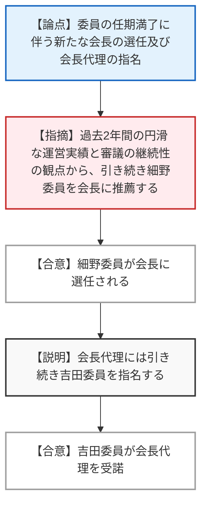
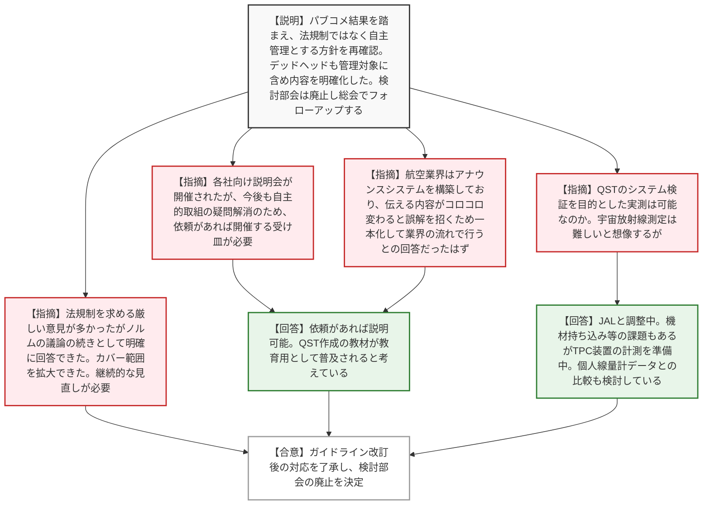
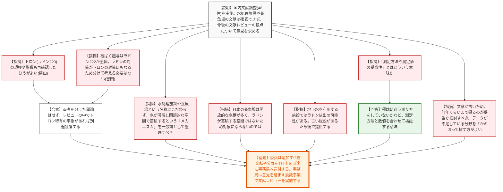
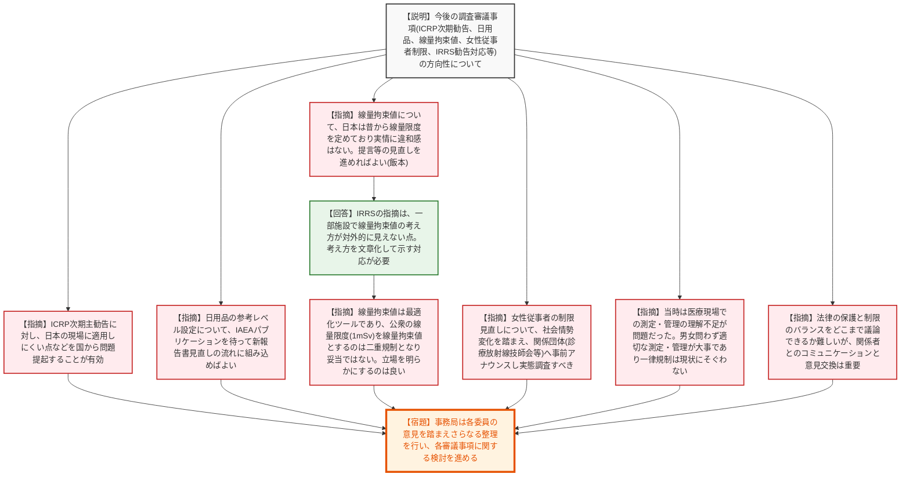

# 第170回放射線審議会総会（令和8年6月30日）
> 出典 : https://youtube.com/live/9v-fBx6B03Y?si=Y5kVnQYzA_KURicE

## 会合の概要作成
* **航空機乗務員の宇宙放射線被ばく管理ガイドラインの改訂完了と部会の廃止:** パブリックコメント（88件）を踏まえ、法令規制ではなく自主管理とする方針を堅持しつつ、会社指示による移動（デッドヘッド）も管理対象に含めるなどの明確化を行ったガイドラインが了承されました。これに伴い検討部会は廃止され、今後のフォローアップは総会で行うことが決定しました。
* **職場環境におけるラドン対策の基礎情報収集と方向性の議論:** 国内文献調査（46件）の結果が報告され、水処理施設や養魚場など特定の施設名称にこだわらず「水が滞留し閉鎖的な空間」というメカニズムに着目すべきとの意見や、トロン（ラドン220）はラドン222の対策に包含されるため分けて考える必要はないとの合意が得られました。
* **今後の調査審議事項（IRRS勧告対応等）の整理:** ICRP次期主勧告への対応、日用品の参考レベル設定、線量拘束値の明文化、女性の放射線業務従事者に対する制限などについて議論されました。特に女性従事者の制限見直しについては、ジェンダーフリーの社会情勢変化を踏まえつつ、関係団体への事前アナウンスや実態調査を通じて慎重に合意形成を図る方針が示されました。

---

## 議題ごとの詳細整理（テキスト）

**【議題（１） 会長の選任及び会長代理の指名】**
* **議論の背景と論点:** 委員の任期満了に伴う新たな会長の選任および会長代理の指名。
* **質疑応答（詳細）:**
  * 【指摘】（松田委員）過去2年間の円滑な運営実績と審議の継続性の観点から、引き続き細野委員を会長に推薦する。
  * 【合意】（全体）細野委員が会長に選任される。
  * 【説明】（細野会長）前会長から引き継ぎ、自然起源放射性物質に対する放射線防護等の議論に取り組んできた。引き続き力を尽くしたい。会長代理には引き続き吉田委員を指名する。
  * 【合意】（吉田委員）了承する。
* **結論と宿題事項（アクションアイテム）:**
  * 細野委員が会長に、吉田委員が会長代理に就任することが決定した。

**【議題（２） 航空機乗務員の宇宙放射線被ばく管理に関するガイドライン等について】**
* **議論の背景と論点:** 部会で審議されたガイドライン改訂案に対するパブリックコメントの結果報告、今後の業界や専門機関の取り組み、および検討部会の廃止について。
* **質疑応答（詳細）:**
  * 【説明者側】（事務局）意見公募で88件の意見が寄せられた。法令規制や太陽フレア発生時の航路変更義務付けを求める声が多かったが、ノルムに対する防護の考え方や現状の管理実態を踏まえ、事業者の自主的管理とする方針を再確認した。ただし、会社指示による移動（デッドヘッド）も含めて線量管理を行う旨など、内容の明確化を行った。今後は業界への周知、QSTによる線量評価支援や実測計画を進める。また、検討部会は廃止し、フォローアップは総会で行う。
  * 【指摘】（松田委員）パブコメは予想以上に多く、法規制を求める厳しい意見が多かったが、ノルムからの議論の続きとして明確に回答できた。線量5mSvの堅持には異論がなく、デッドヘッドも対象に含めカバー範囲を広げられた。今後の20年は変化が大きいため継続的な見直しが必要。
  * 【指摘】（吉田委員）各社向けの説明会が開催されたが、今後も依頼があれば開催する考えはあるか。自主的な取り組みの中で疑問が生じた際のコミュニケーションが重要である。
  * 【指摘】（大野委員）部会でも同じ質問をした。航空機業界はアナウンスのシステムを構築しており、伝える内容がコロコロ変わると誤解を招くため、業界の流れで一本化して教育等を行っていくとの回答だったと認識している。
  * 【回答】（事務局）依頼があれば説明することは可能。QSTが作成した教材もあり、それらが教育教材として普及されると考えている。
  * 【指摘】（吉田委員）一回周知して終わりではなく、リクエストに応える受け皿があることが望ましい。
  * 【指摘】（中村委員）QSTが整備する評価システムの検証目的として実測が計画されているが、宇宙放射線の実測は難しいと想像する。実測による検証は可能なのか。
  * 【回答】（栗原委員）JALと調整中。機材の持ち込みが難しい面もありすぐには進まないが、TPC装置を用いた測定を準備している。また、海外渡航者の個人線量計データと詳細な測定結果を比較し、簡易測定から総量が分かるような取り組みも検討している。
* **結論と宿題事項（アクションアイテム）:**
  * ガイドライン改訂後の対応及び取組が了承され、航空機乗務員等の宇宙放射線防護検討部会の廃止が決定された。今後のフォローアップは来年度中を目途に総会で行う。

**【議題（３） 職場環境におけるラドンについて】**
* **議論の背景と論点:** ノルム報告書で今後の検討課題とされた職場環境のラドン対策に向け、国内文献調査（46件）の結果報告と、今後の文献レビューにおいて考慮すべき観点の整理。
* **質疑応答（詳細）:**
  * 【説明者側】（事務局）国内文献を調査し46件を抽出した。学校、病院、オフィスビル、地下室、温泉地域、地下作業場などがあるが、IAEAのSSG-91で例示された「水処理施設」と「養魚場」の国内文献は確認できなかった。今後の文献レビューの観点について意見を求める。
  * 【指摘】（横山委員・事前コメント）SSG-91ではトロン（ラドン220）のデータは限られているとされるが、国内文献でトロンの規模や影響をどう評価しているか再確認した方がよい。
  * 【指摘】（吉田委員）トロンは半減期が短く、被ばくの起与はラドン222が主体。防護対策をラドンとトロンで分けることはなく、ラドン222の対策がトロンの対策にもなるため、分けて考える必要があるのか疑問である。
  * 【合意】（細野会長）ノルム報告書でも両者を分けた議論はしておらず、レビューの中でトロン特有のことがあれば別途議論する進め方でよいか。（全体了承）
  * 【指摘】（飯本委員・事前コメント）水処理施設や養魚場はたまたま挙げられただけで、液体や気体から流入し閉鎖的な環境で蓄積するという「メカニズム」を一般論として整理することが重要。
  * 【指摘】（高橋委員）海外文献では水処理施設等がプラント的な閉鎖された場所である事例がある。名称にこだわらず、水が溜まりやすい場所があるかというメカニズムを問題にすべき。
  * 【指摘】（中村委員）日本の養魚場は開放的な水槽が多く、ラドンが蓄積する閉鎖空間ではないため、日本の対象にはならないのではないか。
  * 【指摘】（大石委員）地下水を利用する施設ではラドン放出の可能性がある。京都大学の古い総説があるため後ほど提供する。
  * 【指摘】（中村委員）文献レビューの観点にある「測定方法や測定値の妥当性」とはどういう意味か。何と比較して妥当とするのか。
  * 【回答】（事務局）極端に違う測り方をしていないかなど、測定方法と数値を合わせて検証するという意味である。
  * 【指摘】（大野委員）文献が古いものが多いため、今の職業被ばくとして何年くらいまで遡るのが妥当か検討して依頼すべき。
  * 【指摘】（大石委員）データが不足している分野がはっきりしてきたため、そこをさかのぼって探したほうがよい。このレビュー結果は次にどうつながるのか。
  * 【回答】（細野会長）今後の議論の基盤となる貴重な資料となる。レビューの途中経過を委員に見てもらい、どう活用するか意見をいただきたい。
* **結論と宿題事項（アクションアイテム）:**
  * 【宿題】委員は追加すべき文献や分野があれば7月中を目途に事務局へ送付する。事務局は意見を踏まえ、委託事業における文献レビューを着実に実施する。

**【議題（４） 放射線審議会における今後の調査審議の内容について】**
* **議論の背景と論点:** ノルム報告書の取りまとめや宇宙放射線ガイドライン改訂が完了したことを受け、今後の審議事項（ICRP次期主勧告への対応、一般消費財、線量拘束値、女性従事者の制限見直し、IAEA IRRS勧告への対応等）の方向性の確認。
* **質疑応答（詳細）:**
  * 【説明者側】（事務局）今後の調査審議事項として、1. ICRP次期主勧告への対応、2. 実効線量係数等、3. 職場環境のラドン、4. 一般消費財及び日用品、5. 計画被ばく状況における公衆被ばく（線量拘束値）、6. 女性の放射線業務従事者に対する制限、7. IAEA IRRSからの勧告・提言（日用品、線量拘束値、ラドンの所管当局）を挙げる。
  * 【指摘】（吉田委員）ICRP次期主勧告への対応について、日本の現場や規制に適用しにくい点などを国から問題提起することが非常に有効である。
  * 【指摘】（高橋委員）実効線量係数等については、部会を開催しており可能な限り早急に検討を進め、逐次総会に報告したい。
  * 【指摘】（横山委員・事前コメント）日用品等の参考レベル設定について、IRRS勧告を後押しとして積極的に検討を進めていただきたい。
  * 【指摘】（吉田委員）日用品について、IAEAのパブリケーションを待って、新報告書見直しの流れに組み込んでいけばよい。IRRS勧告への回答はすぐではないためタイムスケジュール的にもそれでよい。
  * 【指摘】（飯本委員・事前コメント）線量拘束値について、日本は昔から線量限度を定めている歴史があり実情に違和感はない。提言や解説の一部見直しの議論を進めれば目的は達成できる。
  * 【回答】（事務局）IRRSからの指摘は、一部の施設において線量拘束値の考え方や使い方が文書として対外的に見えない（規制上の立場が欠如している）という点である。前提の考え方や方向性を文章化して示す対応が必要。
  * 【指摘】（吉田委員）線量拘束値は最適化のツールであり、公衆の線量限度の最大値（1mSv）を線量拘束値として考えるのは妥当ではない。線量限度と線量拘束値の両方で二重規制になる使い方は誤りであり、立場を明らかにするのは良いこと。
  * 【指摘】（大野委員）女性の放射線業務従事者に対する制限について、ジェンダーフリーの意識が強まるなど社会情勢が変わっている。関係団体（診療放射線技師会など）に事前アナウンスしないと有効な情報がフィードバックされない。医療関係者の線量管理は以前より充実している。
  * 【指摘】（松田委員）前回は女性従事者や団体の理解が得られなかった。この間の時代とともにどう変わってきたかが分かるような調査を心がけてほしい。
  * 【指摘】（吉田委員）当時の最大の問題は、医療現場の女性作業者における線量測定や管理がしっかりやられておらず、理解がされていなかった点にある。男女問わず適切に線量を測って管理することが大事であり、一律の規制は現在にそぐわない。
  * 【指摘】（高田[知恵]委員）技術的事項を審議する場で、法律の保護と制限のバランスをどこまで議論できるか難しい側面があるが、意見交換は重要である。
  * 【指摘】（高田[綾子]委員）関係者がよくコミュニケーションをとって考えていく必要がある問題である。
  * 【回答】（細野会長）一定の目処が何かの判断は難しいが、関係団体や従事者のフィードバックを得ながら引き続きしっかりと検討を進める。
* **結論と宿題事項（アクションアイテム）:**
  * 提示された今後の調査審議内容の方向性について了承された。
  * 【宿題】事務局は各委員からの意見を踏まえてさらなる整理を行い、各審議事項に関する検討を進める。

**【議題（５） その他】**
* 次回の総会は12月頃の開催を予定し、別途日程調整を行うことが事務局より報告された。

---

## 論理構造の可視化（Mermaid）

### 議題（１） 会長の選任及び会長代理の指名

### 議題（２） 航空機乗務員の宇宙放射線被ばく管理に関するガイドライン等について

### 議題（３） 職場環境におけるラドンについて

### 議題（４） 放射線審議会における今後の調査審議の内容について

