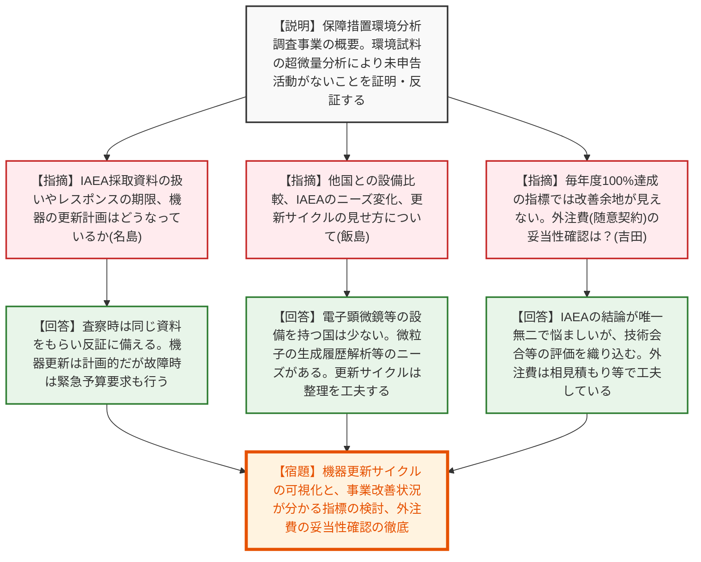
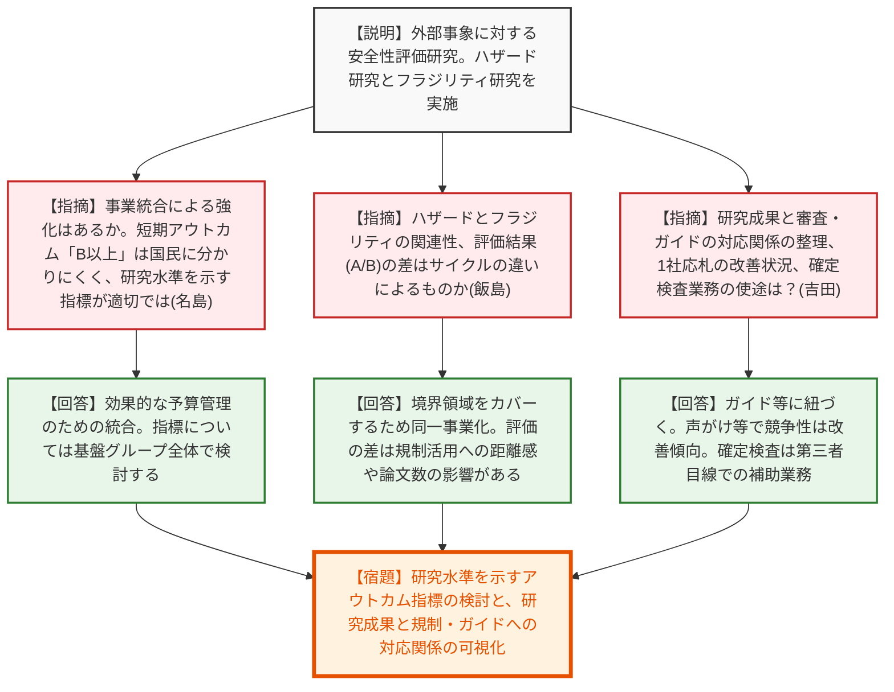
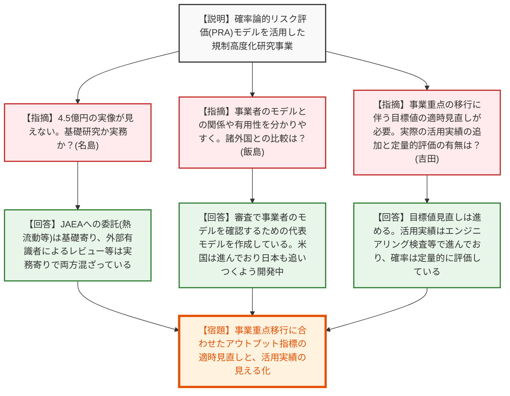
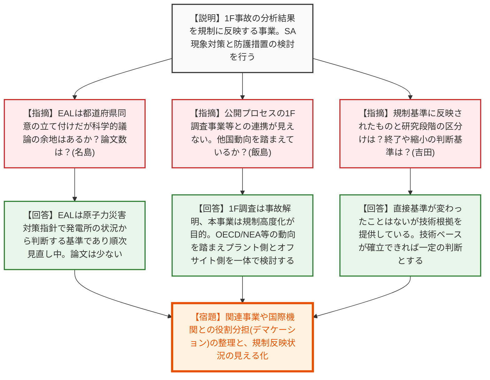
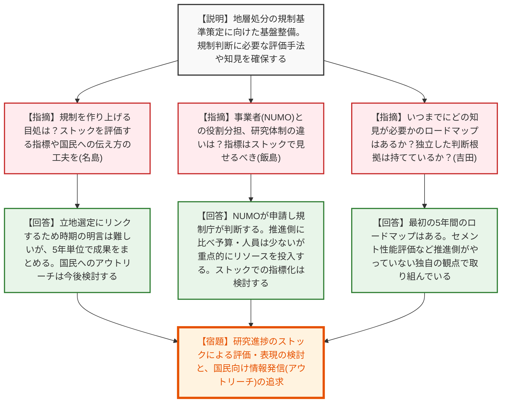
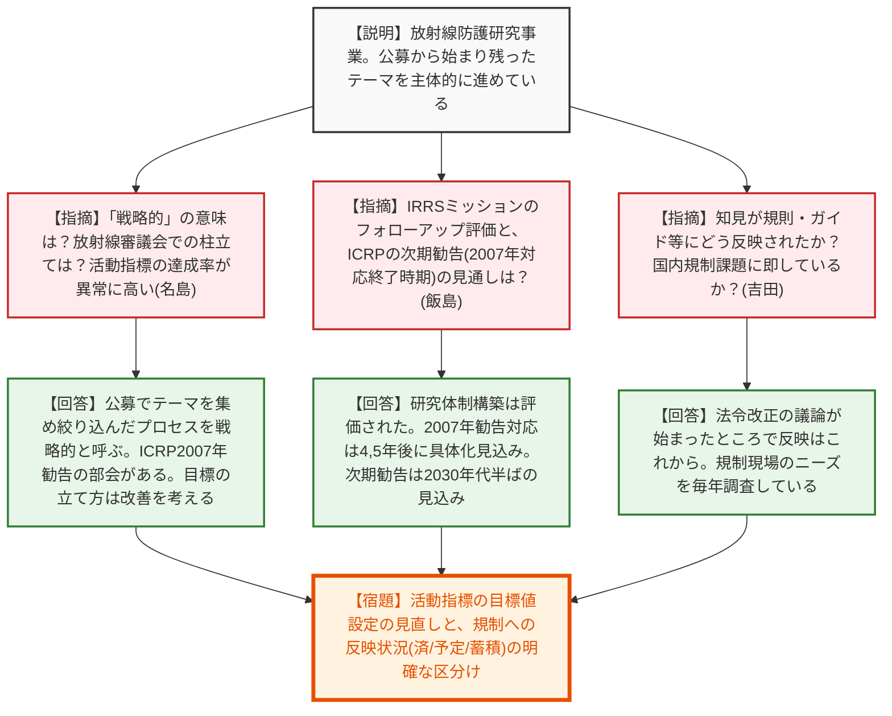
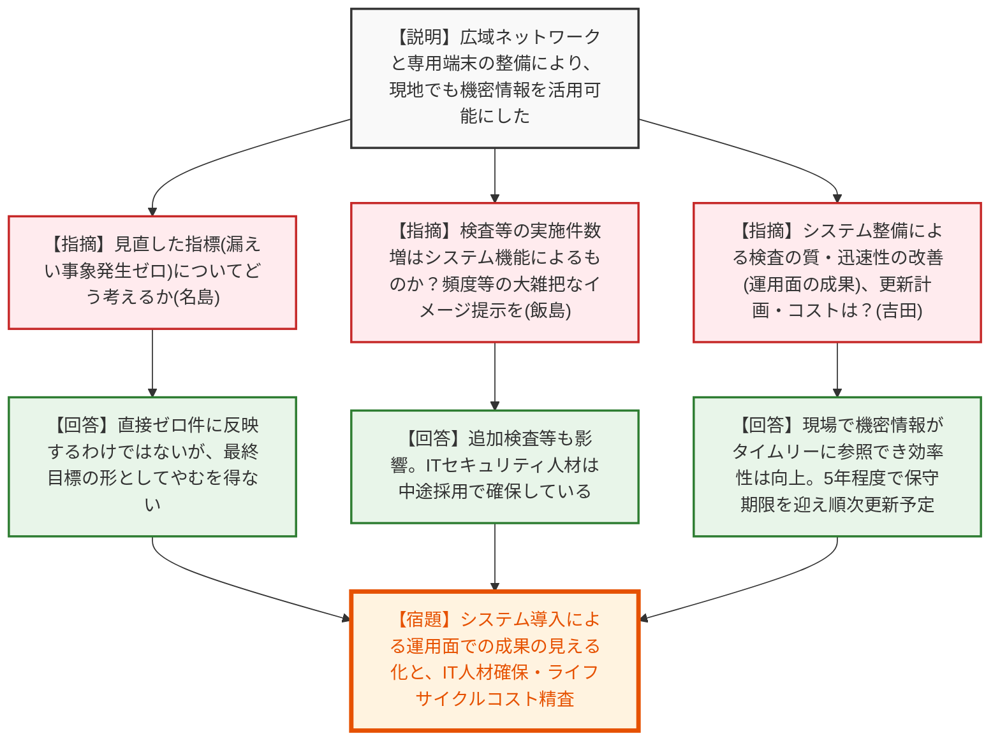
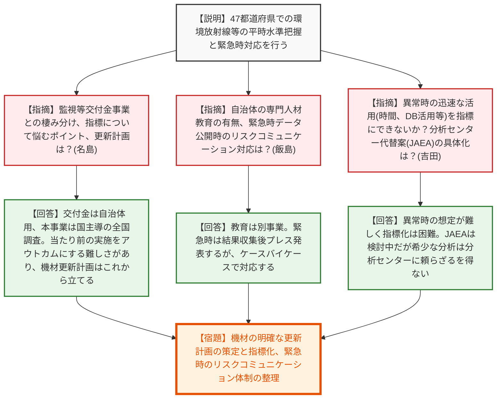

# 第1回令和8年度原子力規制委員会行政事業レビューに係る外部有識者会合（点検対象事業の審議）（令和8年6月30日）
> 出典 : https://youtube.com/live/fddxBKtqxaI?si=EAYPL8q-62IH_f6O

## 会合の概要作成
* **事業の「見せ方」と指標（アウトカム）設定への厳しい指摘:** 全体を通して、外部有識者から「研究事業の成果が規制にどう反映されているのか見えにくい」「活動指標が実態を表しておらず、目標値の立て方が不適切」との指摘が相次ぎました。特に「評価B以上」や「達成率400%」といった表面的な指標に頼るのではなく、論文数、学位取得者数、ストックとしての知見蓄積状況、あるいはデータベースの活用状況など、事業の本質的な進捗を国民に分かりやすく説明する工夫が強く求められました。
* **各事業間の連携と全体俯瞰（デマケーション）の不足:** シビアアクシデント研究やリスク情報の活用など、関連する複数の事業間での役割分担や連携状況が分かりにくいという懸念が示されました。規制側と事業者側（NUMO等）の研究体制の違いや、OECD/NEAなどの国際プロジェクトとの関係性を含め、全体像（ロードマップ）を俯瞰して整理することの必要性が強調されました。
* **緊急時の対応力と代替体制への現実的な懸念:** 環境放射能水準調査における日本分析センターの代替体制（JAEAへの委託等）について、現状では具体的な体制構築に至っていないことが浮き彫りになりました。また、緊急時における情報公開（リスクコミュニケーション）のあり方や、機材の老朽化に対する計画的な更新についても、さらに深い検討が必要であることが認識されました。

---

## 議題ごとの詳細整理（テキスト）

**【議題1：保障措置環境分析調査事業】**
* **議論の背景と論点:** IAEAの査察等で採取された環境試料（拭き取り試料）を分析し、国内の未申告原子力活動がないことを証明・反証するための事業。高度な分析設備の更新計画、指標の妥当性、および随意契約・落札率100%が続く外注費の妥当性が論点となった。
* **質疑応答（詳細）:**
  * 【説明者側】（中桐）IAEAの査察受け入れ等により国内の原子力活動が平和目的にとどまっていることを示す保障措置の一環。JAEAの分析施設（クリア）で環境試料の超微量分析を行い、分析能力の維持向上とIAEAへの国際貢献を目的とする。
  * 【外部有識者（規制側）】（名島）27ページ以降の電子顕微鏡などの流れについて説明してほしい。
  * 【説明者側】（中桐）IAEAが拭き取った試料から超微量の核物質を電子顕微鏡等でピックアップし、質量分析計で核物質の種類や生成年代を解析して、未申告活動の疑いを晴らすための技術的材料を揃える。
  * 【外部有識者（規制側）】（名島）IAEAが採取したものは日本に持ち帰るのか、日本で検証するのか？
  * 【説明者側】（中桐）日本での査察時は同じ試料をもらい保管し、IAEAから指摘があれば分析して反証する。他国で取ったものは国籍を隠してネットワークラボに割り当てられ、分析結果をIAEAに返す。
  * 【外部有識者（規制側）】（名島）IAEAから指摘があった際のレスポンスの期限はあるか？
  * 【説明者側】（中桐）一律の期限はないが、プルトニウムなどは早期解決が求められる。IAEAの年次レポートの状況を見ながら交渉やデータ提出を行う。
  * 【外部有識者（規制側）】（名島）機器の更新は計画的か、必要時に特別会計から支出されるのか？
  * 【説明者側】（中桐）中長期的な計画はあるが、故障時には緊急的に予算要求することも行っている。
  * 【外部有識者（規制側）】（飯島）他国の研究所と比べて日本の設備整備状況は？IAEAのニーズ変化による設備増強プロセスは？
  * 【説明者側】（中桐）精緻な比較はないが、電子顕微鏡でのピックアップ設備を持つ国は少ない。自動化などの工夫も日本ならでは。IAEAからは微粒子の生成履歴の解析や、分析の効率化・時間短縮のニーズが出ている。
  * 【外部有識者（規制側）】（飯島）設置年と更新年を機器ごとに並べてサイクルを見せるとわかりやすい。更新時期は耐用年数を目安にしているか？メンテナンス費用も効いてくるか？
  * 【説明者側】（中桐）メンテナンス費用もかなりかかっている。耐用年数を目安にするが、予算の都合で超えて使うものもあり、故障時に計画を変えて必須分析を行えるようにしている。
  * 【外部有識者（規制側）】（飯島）活動指標「IAEAから試料分析依頼を受けた件数」が80から70に減っている見積もりの根拠は？
  * 【説明者側】（中桐）フル活用で80としたが、実際の依頼件数は多くない。人件費や人員の限界を考え、現実的な70に修正した。引き続き適切な設定を試したい。
  * 【外部有識者（規制側）】（吉田）IAEAの評価を維持する重要性は理解するが「毎年度100%達成」だけだと事業改善の余地が見えにくい。高度化についてどう改善されたか把握しているか？
  * 【説明者側】（中桐）年に1回のIAEAの結論が唯一無二であり悩ましい。ネットワークラボの技術会合で他国比較やIAEAのニーズに照らした評価を把握し、政策評価に織り込むのが現実的と考えている。
  * 【外部有識者（規制側）】（吉田）高度化の成果が設備の更新や予算の優先順位に結びつくとよい。JAEAしか実施できない中、随意契約や落札率100%が続くが、工数や外注費の妥当性はどう確認しているか？
  * 【説明者側】（中桐）特異な分野で外注費も高騰し随意契約が続いている。消耗品などは2社見積もりを取るなど、安価に達成できるよう工夫している。
  * 【外部有識者（規制側）】（吉田）インフレスライド的な費用増はあるが、見積もりを取り妥当性を確認してほしい。事業改善の状況が分かりやすい指標を設けられるとよい。
* **結論と宿題事項（アクションアイテム）:**
  * 【宿題】機器の更新サイクルを視覚的にわかりやすく整理すること。
  * 【宿題】単なる「100%達成」ではなく、事業改善の状況や高度化の成果がわかりやすい指標の設定を検討すること。
  * 【宿題】随意契約が続く中での外注費の妥当性確認（相見積もり等）を引き続き徹底すること。

**【議題2：原子力施設における外部事象等に係る安全規制研究事業】**
* **議論の背景と論点:** 地震、津波、飛来物などの外部事象に対する安全性評価研究。ハザード研究とフラジリティ研究の統合による予算増額の見え方、アウトカム指標（評価B以上等）の妥当性、および研究成果の規制への反映見通しが論点となった。
* **質疑応答（詳細）:**
  * 【説明者側】（杉野）地震・津波等の発生源・作用（ハザード）と、施設への影響度合い（フラジリティ）を研究し、規制基準の見直しや審査の技術的根拠とする。断層と火山のプロジェクトを統合した。
  * 【外部有識者（規制側）】（名島）資料の金額が倍になっているが、事業統合によるものか。統合により強化や変化はあるか？
  * 【説明者側】（杉野）外的要因によるものではなく、効果的な予算管理や関連性が強いものをまとめたためで、中身が変わるわけではない。
  * 【外部有識者（規制側）】（名島）短期アウトカムに「B以上」とあるのはどう理解すべきか？
  * 【説明者側】（杉野）4〜5年のプロジェクトで、5年以上は中間評価を設ける。地震動プロジェクトが8年度に中間評価を受けるため短期アウトカムを設定した。
  * 【外部有識者（規制側）】（名島）国民向け説明として分かりにくい。規制への反映は研究水準に依存する。論文数、学会発表数、学位取得者数など研究水準を表現する指標がふさわしいのではないか。
  * 【説明者側】（杉野）基盤グループ全体で検討させていただく。
  * 【外部有識者（規制側）】（飯島）ハザード研究とフラジリティ研究の関連性やウエイトの置き方は？
  * 【説明者側】（杉野）各20人ずつ、ハザードは4分野に分かれる。別々の部隊でやると境界領域が落ちるため、一つの部門・事業として乗り入れるようにしている。
  * 【外部有識者（規制側）】（飯島）ハザード研究は時間がかかりアウトプットが少なくB判定、フラジリティはA判定。サイクルの違いが原因か？
  * 【説明者側】（杉野）論文の多寡の影響はあると感じる。規制に活用されるまでの距離があり、ハザードでも実務に直結するテーマもあるので進める必要がある。
  * 【外部有識者（規制側）】（飯島）領域に応じたサイクルの違いや規制への距離感を説明した方が事業の評価が正当にできるのではないか。
  * 【説明者側】（杉野）説明の仕方を工夫していきたい。
  * 【外部有識者（規制側）】（吉田）研究成果がどの審査・ガイド・規制判断に使う予定かの対応関係が整理されているか？
  * 【説明者側】（杉野）資料にはないが、地震動プロジェクトは基準地震動の審査ガイド、津波プロジェクトは基準津波の策定ガイドに紐づく。
  * 【外部有識者（規制側）】（吉田）対応関係を示した資料があった方が分かりやすい。規制活用の見通しが弱いテーマがあった場合、計画や予算配分を見直す仕組みはあるか？
  * 【説明者側】（杉野）活用が弱いから予算を減らすことはしていない。技術的成熟度がまちまちであり、将来大事になるものも実施していくことを大事にしている。
  * 【外部有識者（規制側）】（吉田）1社応札が多い中で、競争性が改善したかどう見ているか？
  * 【説明者側】（山崎）声がけや仕様書の分かりやすさ、事業の分割を試みて、数は少ないが複数入札になったものもあり、引き続き続ける。
  * 【外部有識者（規制側）】（吉田）確定検査業務とは何か？委託費の使途や支出が適正か確認しているのか？
  * 【説明者側】（山崎）基盤グループ全体の委託事業に対し、第三者の目で確定検査をする補助業務。費用を各部門に配分して執行している。
* **結論と宿題事項（アクションアイテム）:**
  * 【宿題】研究水準（論文数や学位取得状況等）を表現するアウトカム指標の設定を検討すること。
  * 【宿題】研究成果と規制・ガイドへの反映の対応関係を示す資料を作成し、サイクルの違いや規制への距離感を分かりやすく説明すること。

**【議題3：技術基盤分野の規制高度化研究事業（リスク情報の活用）】**
* **議論の背景と論点:** 確率論的リスク評価（PRA）モデルを活用した規制高度化事業。予算4.5億円の具体的な使途（基礎研究か実務か）、事業者のモデルとの関係、重点課題の移行に伴う目標値の適時見直しの不足が論点となった。
* **質疑応答（詳細）:**
  * 【説明者側】（青野）確率論的リスク評価（PRA）手法を用いて原子力の安全性を評価する手法を研究・開発。原子力規制検査への活用に向けた技術知見の蓄積を行う。
  * 【外部有識者（規制側）】（名島）具体的に何をやっていて、4.5億円を何に使っているのか実像が見えない。
  * 【説明者側】（塚本）研究が大半。JAEAへの委託は、熱流動の実験や解析、リスク評価手法の高度化など基礎研究寄り。受け負いは、外部有識者によるPRAモデルのレビューなど実務寄り。両方が混ざった事業である。
  * 【外部有識者（規制側）】（飯島）プラントごとにパラメータを設定し、リスクを評価するツールを作り出すのか？事業者は同じモデルを持っているか？
  * 【説明者側】（青野）事業者は自らPRAモデルを持っている。規制庁は審査・検査でその適切性を確認するため、代表的なPRAモデルを作成し、注意すべき点を炙り出している。
  * 【外部有識者（規制側）】（飯島）事業者との関係でこのモデルの有用性が分かるようにしてほしい。諸外国と比べて出遅れているという話があったが現状は？
  * 【説明者側】（青野）米国は地震や火災を原因としたPRAモデルも作っており進んでいる。日本も追いつけるよう開発している。
  * 【外部有識者（規制側）】（吉田）事業の重点がPRAモデルの整理から高度化へ移ったとのことだが、どのタイミングで指標を見直す運用にするのか？
  * 【説明者側】（青野）重点が変わったタイミングで本来やるべきだった。アウトプットの件数も研究が進めば減るため、2026年度は50件に設定した。
  * 【外部有識者（規制側）】（吉田）実際の活用実績（検査の効率化等）を資料に追加してほしい。確率は高中低だけでなく定量的な評価ができるのか？
  * 【説明者側】（青野）「小」は炉心損傷頻度が10^-6/年といったクライテリアを設けて定量的に評価している。
  * 【外部有識者（規制側）】（飯島）機器の故障確率は独立か、依存関係（従属故障）も盛り込んでいるか？
  * 【説明者側】（青野）独立して発生するとして計算しているが、地震等の外部衝撃に対してはある程度関係性を持たせて計算している。
* **結論と宿題事項（アクションアイテム）:**
  * 【宿題】事業の重点移行に合わせたアウトプット指標の適時見直しを行うこと。
  * 【宿題】PRAモデルの実際の活用実績（検査の効率化等への貢献）を資料に追加し、有用性を見える化すること。

**【議題4：シビアアクシデント時の放射性物質放出に係る規制高度化研究事業（東京電力福島第一原子力発電所事故分析結果の反映）】**
* **議論の背景と論点:** 1F事故の分析結果を規制に反映する事業。シビアアクシデント現象への対策とオフサイトの防護措置（EAL等）という二つの研究が混在しており、全体像の俯瞰（デマケーション）が不足していること、および研究終了の判断基準が曖昧であることが指摘された。
* **質疑応答（詳細）:**
  * 【説明者側】（青野）1F事故の調査分析結果を踏まえたシビアアクシデント現象への対策と、環境中への放出を想定した防護措置（EALの見直し等）の二つを研究対象とする。
  * 【外部有識者（規制側）】（名島）EAL（緊急時活動レベル）について。避難に関する基準は都道府県が同意する立て付けで、科学的議論の外側にあると思っていたが？
  * 【説明者側】（防護企画課）原子力災害対策指針で定めており、発電所の状況からAL, SE, GEを判断するのは技術者が決める。それに基づき住民の防護措置を指示する。EAL自体は1F事故直後に設定されたものを順次見直している最中である。
  * 【外部有識者（規制側）】（名島）学会発表や論文は出されているか？
  * 【説明者側】（青野）EALに関する論文2件、学会発表1件程度。上の54件の大半はシビアアクシデント現象（実験・解析）に関するものである。
  * 【外部有識者（規制側）】（飯島）公開プロセスの1F事故分析事業との関連性や連携は？他国の状況を踏まえてテーマを精査しているか？一つの事業に技術的対策と防護措置の二つが入っており連携が見えない。
  * 【説明者側】（青野）1F調査事業は事故解明が主目的で、本事業は規制の高度化が主目的。OECD/NEAのプロジェクトにも参加し知見を取得し、日本適用時の問題点に感度を高くして研究を企画する。
  * 【説明者側】（大一）事故発生時の発電所側とオフサイト（住民避難）側を一体として総合的に見ないと本当の効果が見えないため、一つの事業で計画している。
  * 【外部有識者（規制側）】（吉田）規制基準等に反映されたものと研究段階のものの区分けは？
  * 【説明者側】（青野）直接規制基準が変わったことはない。1F事故分析検討会の中間取りまとめへの反映や、緊急時対応技術マニュアルへの技術根拠の提供を行っている。
  * 【外部有識者（規制側）】（吉田）必要性が高い一方で継続が前提になりやすい。終了や縮小の判断基準は？
  * 【説明者側】（星）現象を理解し、評価・解析手法を整備して、実機規模で実際的な影響の有無が判断できれば、基本的な技術ベースは確立したと判断する。
  * 【外部有識者（規制側）】（吉田）規制課題への結びつきや中間段階の評価を見える化した方がよい。
  * 【外部有識者（規制側）】（名島）複数の事業やOECD/NEA等との役割分担（デマケーション）を俯瞰して整理してほしい。
* **結論と宿題事項（アクションアイテム）:**
  * 【宿題】関連する他事業や国際機関との役割分担（デマケーション）を整理し、俯瞰的な全体像を示すこと。
  * 【宿題】研究成果が規制に反映されたものと研究段階のもの（中間段階）を明確に区分し、見える化すること。

**【議題5：最終処分の安全確保に係る規制技術研究事業】**
* **議論の背景と論点:** 地層処分の規制基準策定に向けた基盤整備。事業者の研究との差別化（独立した判断根拠の確保）、超長期にわたる研究成果のストックとしての評価方法、および国民へのアウトリーチのあり方が論点となった。
* **質疑応答（詳細）:**
  * 【説明者側】（大塚）最終処分の安全確保に向け、規制判断に必要な評価手法や知見をあらかじめ確保する。事業の実施にあたっては推進側との役割分担を明確化している。
  * 【外部有識者（規制側）】（名島）初年度の規制検討だが、いつ頃までに規制を作り上げるという目処はあるか？ストックを評価することはできないか？
  * 【説明者側】（大塚）立地選定の進捗にリンクするため定量的な時期の目標は設定していないが、5年間の研究計画で成果をまとめる。ストックの評価として、学会発表、安全研究成果報告書、NUMOとの意見交換を通じた規制側の能力の蓄積を公表していく。
  * 【外部有識者（規制側）】（名島）インナーサークルの議論だけでなく、国民にどう伝えるかという指標も今後は追求してほしい。
  * 【説明者側】（大塚）公費を使う説明責任として重要であり、長期に及ぶ事業なので今後観点として入れていきたい。
  * 【外部有識者（規制側）】（飯島）事業者（NUMO）と規制庁の役割分担、研究体制の違いは？
  * 【説明者側】（大塚）NUMOは安全性の責任を負い申請する。規制庁はその妥当性を判断する。体制として推進側が約30億に対し規制側は約7000万と少ないが、安全に重要なクリティカルなポイントを特定して重点的にリソースを投入する。推進側の研究動向もオブザーバー参加等で常にウォッチしている。
  * 【外部有識者（規制側）】（飯島）活動指標の「解析・実験項目数」はフローだが、一定期間積み上げたストックで見せていく方がわかりやすい。
  * 【説明者側】（大塚）ストックで見ることでどこまで来たか分かるという意見は非常にその通りであり検討する。
  * 【外部有識者（規制側）】（吉田）いつまでにどの知見が必要かというロードマップ的なものはあるか？
  * 【説明者側】（大塚）安全研究プロジェクトとして最初の5年間のロードマップを示している。その先も見通して研究の全体像を作ってきた考え方をNRA技術ノートなどで公表していく。
  * 【外部有識者（規制側）】（吉田）事業者側の開発に依存せず、独立した判断根拠をどの程度持てているか？
  * 【説明者側】（大塚）始まったばかりで完全に独立して言えることはまだないが、セメントの性能評価（吸着効果の長期的変遷など）は推進側があまりやっていない部分であり、独立した観点として取り組んでいる。
* **結論と宿題事項（アクションアイテム）:**
  * 【宿題】研究の進捗をフロー（単年度）ではなくストック（累積）で評価・表現する指標を検討すること。
  * 【宿題】専門家間のインナーサークルにとどまらず、国民に向けた情報発信（アウトリーチ）のあり方を追求すること。

**【議題6：放射線安全規制研究戦略的推進事業】**
* **議論の背景と論点:** 放射線防護に関する研究事業。目標値（1件）に対して実績（2〜4件）の達成率が異常に高いことへの疑問や、「戦略的」という名称の意図、ICRP2007年勧告の取り入れに向けたロードマップが論点となった。
* **質疑応答（詳細）:**
  * 【説明者側】（森泉）IAEAのIRRSミッション勧告を受け、国内の放射線防護研究を厚くするための事業。公募事業から始まり、残ったテーマを規制庁内で主体的に進めている。
  * 【外部有識者（規制側）】（名島）「戦略的」に込められた意味は？
  * 【説明者側】（森泉）最初は公募で幅広くテーマを集め、そこから残ったテーマを規制庁内で主体的に進めるように絞り込んでいったプロセスを「戦略的」と呼んでいる。
  * 【外部有識者（規制側）】（名島）放射線審議会での柱立て（部会等）はあるか？
  * 【説明者側】（森泉）ICRP2007年勧告の取り入れ（国内法令改正、放射能濃度規制値のアップデート等）があり、そのための部会を立ち上げて検討を進めている。審議会で定められた重要度に応じて優先的に取り組んでいる。
  * 【外部有識者（規制側）】（飯島）IRRSミッションのフォローアップでの評価は？ICRPの次の勧告に向けた日本の体制は？
  * 【説明者側】（森泉）フォローアップでは研究体制の構築について評価され、特段のさらなる指摘はなかった。ICRPの次期主勧告は2030年代半ばの見込みであり、日本としては1F事故の知見を国際社会に発信し貢献していく。
  * 【外部有識者（規制側）】（飯島）2007年勧告への対応が終わる時期の目処は？
  * 【説明者側】（森泉）ICRPからの個別具体的な防護情報が数年後に出揃う見込みで、4,5年後には国内法令改正が具体的になると見込んでいる。
  * 【外部有識者（規制側）】（吉田）得られた知見が実際にどの規則・ガイド等に反映されたか整理されているか？国際動向の追随だけでなく国内の規制課題に即しているか？
  * 【説明者側】（森泉）法令改正の議論が始まったところで、まだ具体的に反映されたものはない。議論に必要な情報を提供・準備している。規制現場のニーズを毎年調査し、日本に即した技術開発を進めている。
  * 【外部有識者（規制側）】（吉田）今後の反映予定や知見蓄積段階のものを分けて説明すると成果が伝わりやすい。
  * 【外部有識者（規制側）】（名島）活動指標の「規制行政の改善につなげた件数」が目標1件に対し実績が2〜4件で達成率が異常に高い。目標値が甘いのではないか？
  * 【説明者側】（森泉）放射線審議会への国際動向報告は確実に行うため目標を1としているが、技術支援の依頼件数は読みにくいため目標に含めていない。目標の立て方は何とかならないか考えている。
  * 【外部有識者（規制側）】（名島）目標数値を設定しない、あるいは設定が適切でないと説明するやり方もある。
* **結論と宿題事項（アクションアイテム）:**
  * 【宿題】「達成率400%」等となる活動指標について、目標値の設定方法を見直すか、目標数値を設定せず実績ベースで説明する等の改善を行うこと。
  * 【宿題】規制に反映されたもの、反映予定のもの、知見蓄積段階のものを明確に分けて説明すること。

**【議題7：核物質防護検査体制の充実・強化事業】**
* **議論の背景と論点:** 核セキュリティ不備事案を受けた広域ネットワークと専用端末の整備。長期アウトカム（漏えい事象発生ゼロ）の妥当性と、システム整備による検査の質・迅速性の向上（定量・定性効果）の見える化が論点となった。
* **質疑応答（詳細）:**
  * 【説明者側】（栗原）迅速な規制対応のため、広域機密情報ネットワークに機能を追加し、原子力規制事務所など現地でも情報を活用できるよう専用端末を整備した。
  * 【外部有識者（規制側）】（名島）前回の指摘を踏まえた見直しに感謝。見直した指標（特定核物質の漏えい事象を発生させなかった発電所の割合：正の値）についてどう考えるか？
  * 【説明者側】（栗原）システムの利用結果が直接ゼロ件に反映するわけではないが、最終目標としての形としてはやむを得ないと思っている。
  * 【外部有識者（規制側）】（飯島）検査等の実施件数が増えているのはシステム機能によるものか？件数のカウント方法は？
  * 【説明者側】（核セキュリティ部門）ガイドラインに基づくサンプルの合計数。件数増はシステム整備のほか、不適切部分が見つかり追加検査をしていることも影響している。
  * 【外部有識者（規制側）】（飯島）頻度など大雑把にイメージできるものと結びつけると分かりやすい。ITセキュリティ人材の確保はどうしているか？
  * 【説明者側】（栗原）主に中途採用で確保している状況。
  * 【外部有識者（規制側）】（吉田）システムの整備により検査の質や迅速性はどう改善したか？運用面での成果は把握しているか？
  * 【説明者側】（核セキュリティ部門）柏崎の事案を踏まえ、現場に常駐検査官を置いた。機密情報の要求事項を現場の端末でタイムリーに参照でき、懸念点があれば本庁と速やかに共有できるため、効率性の面で非常に有意義。ただし定量的な指標での評価には至っていない。
  * 【外部有識者（規制側）】（吉田）今後の更新計画やライフサイクルコストはどう整理されているか？
  * 【説明者側】（栗原）5年程度で保守期限を迎えるため、令和9年度以降に順次更新していく。ライセンス値上げ等も踏まえ、より効率的なシステム構成を調査研究している。
* **結論と宿題事項（アクションアイテム）:**
  * 【宿題】現場判断の短縮や情報共有の効率化など、システム導入による運用面での成果（定性的・定量的な効果）を分かりやすく示す工夫を行うこと。
  * 【宿題】ITセキュリティ人材の継続的な確保と、将来のシステム更新に向けたライフサイクルコストの精査を行うこと。

**【議題8：環境放射能水準調査等事業】**
* **議論の背景と論点:** 全国47都道府県における環境放射線等の平時水準の把握と緊急時対応。監視等交付金事業との棲み分け、機材の更新計画の指標化、および緊急時における公開データのリスクコミュニケーションのあり方が論点となった。
* **質疑応答（詳細）:**
  * 【説明者側】（下口/山下）47都道府県で平常時の環境放射線量を把握し、異常値検出時は影響評価を行う。自治体が避難判断等に用いる「監視等交付金」に対し、本事業は国主導の全国調査。
  * 【外部有識者（規制側）】（名島）指標について悩まれているポイントは？更新計画を指標にできないか？
  * 【説明者側】（下口）47都道府県での実施等、当たり前のものをアウトカムにする難しさがある。資機材の更新が重要になるが、震災後15年を迎えこれからしっかり計画していく段階であり、厳密な更新計画はまだ立っていない。
  * 【外部有識者（規制側）】（飯島）各自治体の専門人材の教育や情報交換は本事業に含まれるか？機材購入費の割合や更新計画を見える化すべき。
  * 【説明者側】（下口）教育は別の「分析研修」事業で行っている。機材購入費の更新計画は分かりやすくするよう検討する。
  * 【外部有識者（規制側）】（飯島）緊急時のデータ公開におけるリスクコミュニケーション（デマ対策等）はどうしているか？
  * 【説明者側】（下口）結果収集後、規制庁がメディアにプレス発表する段取り。ケースバイケースで対応していく。
  * 【外部有識者（規制側）】（吉田）異常時の迅速な活用（確認・公表までの時間、データベース活用状況等）を指標にできないか？日本分析センターの機能不全時の代替案（JAEA）の具体化は？
  * 【説明者側】（下口）異常時の想定が難しく、北朝鮮の核実験時も有意な値が出なかったため、指標にするのは難しい。JAEAにも問題意識は持ってもらっているが検討中。希少な分析は日本分析センターにお願いせざるを得ない。
  * 【外部有識者（規制側）】（名島）北朝鮮の核実験時に「検出されなかった（ゼロ情報）」というのも、安心感を与える貴重な情報である。
  * 【説明者側】（下口）自然放射線はあるため「いつもと変わらない値」という表現が正確。データベースが平常の情報伝達に使われているか見ていくことが大事と考えている。
* **結論と宿題事項（アクションアイテム）:**
  * 【宿題】震災後15年を迎える機材の老朽化に対し、明確な更新計画を策定し、それを進捗指標として活用することを検討すること。
  * 【宿題】緊急時における情報発信の手順（リスクコミュニケーション）を整理し、デマ拡散等のリスクに備えること。日本分析センターの代替体制の具体化を進めること。

---

## 論理構造の可視化（Mermaid）

### 議題1：保障措置環境分析調査事業

### 議題2：原子力施設における外部事象等に係る安全規制研究事業

### 議題3：技術基盤分野の規制高度化研究事業（リスク情報の活用）

### 議題4：シビアアクシデント時の放射性物質放出に係る規制高度化研究事業

### 議題5：最終処分の安全確保に係る規制技術研究事業

### 議題6：放射線安全規制研究戦略的推進事業

### 議題7：核物質防護検査体制の充実・強化事業

### 議題8：環境放射能水準調査等事業

