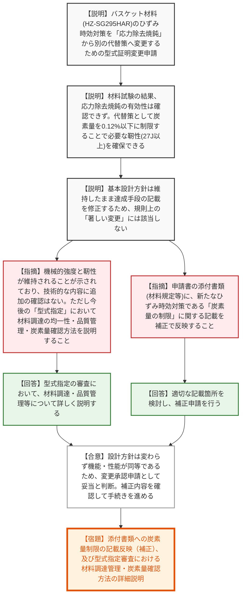

# 第43回特定兼用キャスクの設計の型式証明等に係る審査会合（令和8年6月30日）
> 出典 : https://youtube.com/live/9TDsFKD0YsQ?si=iZ4znx5zOsr6f5GF

## 会合の概要作成
* **技術的代替策の成立性に対する規制側の完全な納得:** バスケット材料のひずみ時効脆化対策について、事業者が実施した「応力除去焼鈍」の有効性が確認できなかった事実をオープンにし、代替案として「炭素量の上限制限（0.12％）」を提示しました。豊富な材料試験データと統計評価に基づく論理的な説明に対し、規制庁側は「技術的な内容について追加の確認はない」と即座に妥当性を認め、非常にスムーズで納得感の高い審査となりました。
* **「著しい変更」非該当の確認と手続きの円滑な進行:** 今回の変更が、基本設計方針（長期健全性の確保）を維持したまま「達成手段」のみを変更するものであるとの事業者側の主張が全面的に受け入れられました。規制側からも「機能・性能が同等であり、変更承認申請として認められる」と明言され、審査の手続きは円滑に次のステップへと進むこととなりました。
* **今後の「型式指定」に向けた品質管理の焦点化:** 型式証明の変更そのものは了承されたものの、実運用である「型式指定」のフェーズを見据え、規制側から「炭素量を制限した材料を均一に調達・品質管理できるのか」という実務的な懸念が示されました。これに対して事業者は、今後の審査で詳細に説明することを約束し、次の論点が明確化されました。

---

## 議題ごとの詳細整理（テキスト）

**【議題1：カナデビア（株）特定兼用キャスクの設計の型式証明変更について（Hitz-B69 型）】**
* **議論の背景と論点:** 
  バスケット材料（HZ-SG295HAR）の冷間加工に伴うひずみ時効脆化対策として、従来は型式証明において「応力除去焼鈍」を実施することが規定されていました。しかし、追加の材料試験においてその有効性（靭性の回復）が確認できなかったため、別の代替策である「炭素量の制限」を適用できるよう、型式証明の記載内容を変更（達成手段の変更）することが技術的及び法的に妥当か（著しい変更に該当しないか）が最大の論点となりました。

* **質疑応答（詳細）:**
  * 【説明者側】（カナデビア 濱田氏・竹内氏）応力除去焼鈍ではひずみ時効による脆化の回復効果が小さく、対策として不十分であることが判明した。一方で、材料の炭素量に着目した試験を実施した結果、炭素量上限を0.12%に制限することで、最低使用温度を包含する-23℃の環境下において、金属キャスク構造規格で認められた材料（SGV410等）と同等の要求靭性（吸収エネルギー27J以上）を確保できることを確認した。設計方針は変えずに達成手段の記載を変更するのみであるため、「著しい変更」には該当しない。
  * 【規制側】（規制庁 森野氏）機械的強度が維持され、必要な靭性が確保されていることが試験結果から示されているため、本変更の技術的な内容について追加の確認はない。ただし、今後の「型式指定」の審査において、炭素量制限した材料の調達における均一性の観点、品質管理、及び炭素量の確認方法について詳細に説明してほしい。
  * 【説明者側】（カナデビア 樋口氏）型式指定の申請・審査において、材料の調達管理について詳しく説明させていただく。
  * 【規制側】（規制庁 櫻井氏）申請書の本文の変更箇所は問題ないが、添付書類（バスケット材料の説明書や材料規定など）のほうにも、新たなひずみ時効対策である「炭素量の制限」に関する記載を補正によって適正化・反映してほしい。
  * 【説明者側】（カナデビア 樋口氏）適切な記載箇所を再度検討し、補正申請を行わせていただく。
  * 【規制側】（規制庁 稲川氏）長期健全性確保の設計方針は変わらず、達成手段を変更するものであるため「著しい変更」には該当せず、変更後も機能・性能が同等であることを確認した。したがって、今回の申請は変更承認申請として認められると考える。補正内容を確認し、新たな論点があれば改めて会合で確認する進め方でよいか。
  * 【説明者側】（カナデビア 樋口氏）承知した。

* **結論と宿題事項（アクションアイテム）:**
  * 炭素量制限によるひずみ時効対策の技術的妥当性、及び本申請が「著しい変更」に該当しないことが規制側から了承された。
  * 【宿題】申請書の添付書類（材料規定等）へ、炭素量制限に関する具体的な記載を反映した補正申請を行うこと。
  * 【宿題】今後の「型式指定」の審査において、材料調達時の均一性確保、品質管理体制、及び炭素量の具体的な確認方法について詳細に説明すること。

---

## 論理構造の可視化（Mermaid）

