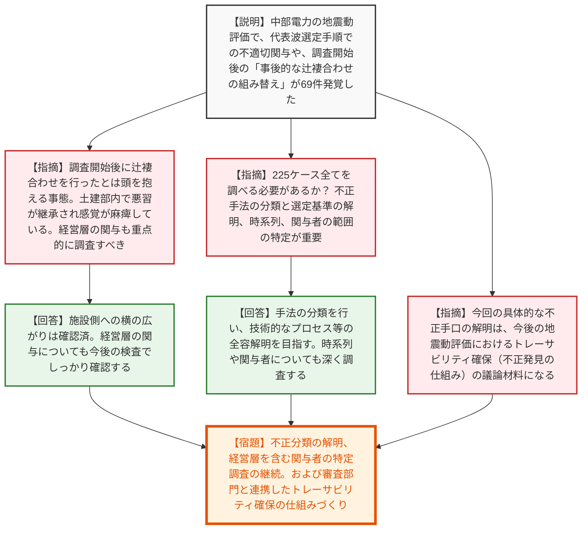
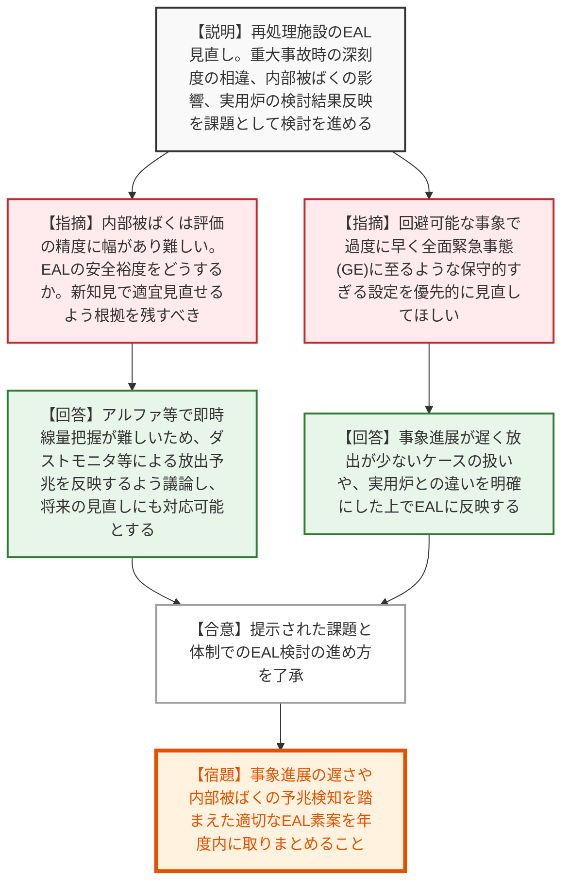
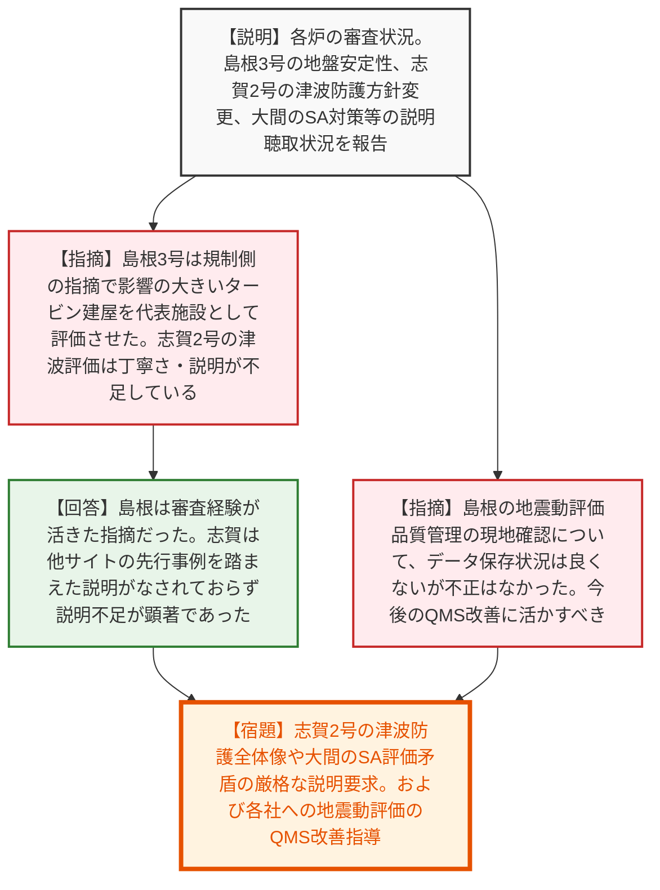
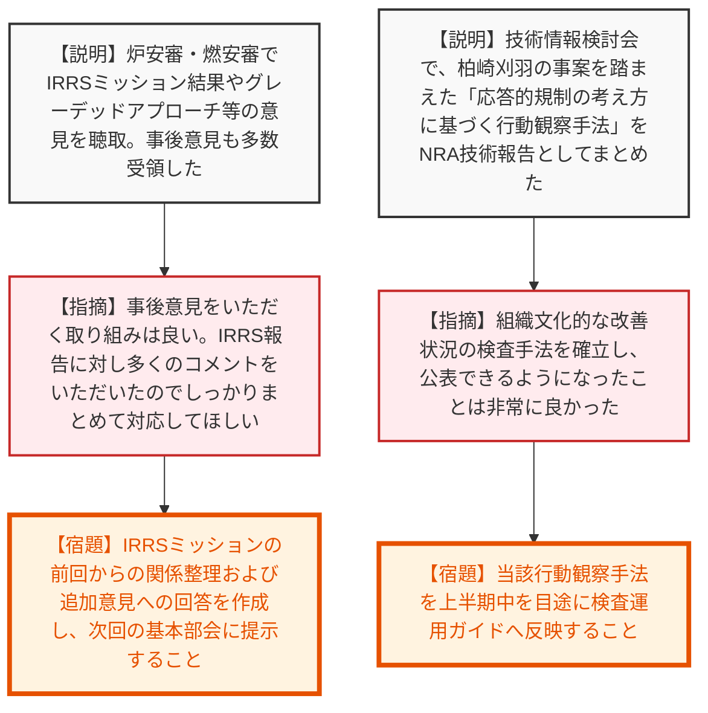

# 第18回原子力規制委員会（令和8年7月1日）
> 出典 : https://youtube.com/live/Tig3GElMkeU?si=HezNEKDRDVRDiW_c

## 会合の概要作成
* **中部電力の地震動評価における不正行為の悪質性の露呈と厳格な検査の継続:** 中部電力の基準地震動算定において、代表波の選定過程で施設所管部署と不適切なやり取りを繰り返し、申告制度による調査開始後も都合の良い地震波への「事後的な組み替え（辻褄合わせ）」を自動的・組織的に行っていた実態が報告されました。規制側からは「言葉を失う」「感覚が麻痺している」との極めて厳しい叱責が飛び、経営層の関与も含めた全容解明と厳格な検査の継続が指示されました。
* **新規制基準適合性審査等の進捗と課題の顕在化:** 島根3号炉の地盤安定性評価において、規制側の指摘によりタービン建屋の影響が大きいことが確認されるなど、審査の有効性が確認されました。一方、志賀2号炉の津波評価や大間原発のSA対策では、資料の説明不足や前提条件の矛盾が指摘され、事業者に対する丁寧かつ論理的な説明の要求がなされました。
* **EAL（緊急時活動レベル）見直しと組織文化評価手法の確立:** 再処理施設のEALについて、事象進展の遅さや内部被ばくの影響といった特有の課題を踏まえた見直し方針が了承されました。また、柏崎刈羽原発の核セキュリティ事案を契機に開発された、組織文化の成熟度に応じた「応答的規制に基づく行動観察手法」のNRA技術報告が公開され、規制側の検査手法の高度化と透明性確保が高く評価されました。

---

## 議題ごとの詳細整理（テキスト）

**【議題1：中部電力株式会社の不正行為に係る検査状況の報告】**
* **議論の背景と論点:** 中部電力の基準地震動評価に関する不正行為（225ケース）の事実関係の調査状況。申告調査開始後にも「事後的な組み替え」が行われていたという悪質な実態が判明し、不正の全容解明、経営層の関与の有無、および今後のデータ保存（トレーサビリティ）のあり方が最大の論点となった。
* **質疑応答（詳細）:**
  * 【説明者側】（忠内調査官）中部電力本店への検査の結果、225ケースのうち63ケースで代表波選定手順が整理された。施設所管部署との間で代表波選定に関するやり取りが複数回行われていた。さらに、申告調査開始後にも、都合の良い19波を組み合わせる「事後的な組み替え」が69ケースで行われていたことが判明した。引き続き経営層を含めた調査を継続する。
  * 【規制側】（山岡委員）1000波や2万波の計算を行い、調査開始後に辻褄合わせの事後組み替えを行っていたとは、頭を抱えてしまう事態である。引き続き事実確認をお願いしたい。225ケース全てを0から100まで調べる必要があるか？
  * 【説明者側】（忠内調査官）手法の分類（方法1、2等）ができれば、全てを調べるのではなく技術的にどういうプロセスで行われたかの全容が分かることが大事と考えている。
  * 【規制側】（伴委員）事後組み替えは看過できない。都合の良い代表波の作り方が土建部内で継承され、感覚が麻痺していたのではないか。調査への対応について上層部（経営層）が関与した可能性もあり、重点的に確認すべき。
  * 【説明者側】（忠内調査官）土建部だけでなく施設側との関与など横の広がりは確認している。上層部・経営層の関与についても今後の検査でしっかり確認する。
  * 【規制側】（更田委員）今回の具体的な手順解明は、今後の地震動評価のトレーサビリティ確保（不正をすれば発覚する仕組み作り）の議論の材料になる。検査部門だけでなく審査部門も巻き込んで議論に活かしてほしい。
  * 【規制側】（山中委員長）事後組み替えという恣意的な選定が明らかになった。不正の分類と選定基準の解明、2012年からの時系列の解明、関与した人の範囲（事実関係）の3点を全体像を見る上でしっかり調べてほしい。
* **結論と宿題事項（アクションアイテム）:**
  * 報告を受理。
  * 【宿題】不正の分類と選定基準の解明、2012年からの時系列の整理、経営層を含む関与者の範囲の特定を検査で継続実施すること。
  * 【宿題】今回の不正手法の手口を分析し、審査部門とも共有して今後の地震動評価におけるトレーサビリティ確保の仕組みづくりに反映させること。

**【議題2：再処理施設の緊急時活動レベル（ＥＡＬ）に関する検討の進め方】**
* **議論の背景と論点:** 再処理施設のEALは新規制基準適合性審査と並行していたため未反映の課題があった。重大事故時の深刻度の相違、内部被ばく（アルファ・ベータ核種）の支配的影響、実用炉での検討結果の反映などをどう進めるかが論点。
* **質疑応答（詳細）:**
  * 【説明者側】（御器谷調整官）再処理施設のEAL見直しについて、重大事故時の敷地境界線量の相違、蒸発乾固等における内部被ばくの影響、実用炉の検討結果（パラメータベースへの移行等）の反映という3つの課題を抽出し、事業者の協力を得て検討を進めたい。来年3月を目途に素案をまとめる。
  * 【規制側】（伴委員）内部被ばくは線量・影響評価の精度に幅があり難しい。EAL発出の安全裕度をどうするか。今後の新知見で適宜見直せるよう、根拠をたどれるようにしてほしい。
  * 【説明者側】（御器谷調整官）アルファ・ベータ核種は即時に線量把握が難しいため、ダストモニタ等による放出の予兆をEALに反映するよう議論する。今後の新知見も反映できる形で進める。
  * 【規制側】（更田委員）過度に保守的に設定され、回避できるのに早期に全面緊急事態（GE）に至ってしまうような事象を優先的に見直してほしい。実用炉とは分解能が違うため専門家を交えて速やかに進めたい。
  * 【説明者側】（御器谷調整官）事象の進展が遅く放出が少ないケースの扱いや、炉と再処理施設の違いを明確にした上でEALに反映していく。
  * 【規制側】（山中委員長）事象進展がゆっくりである特徴や、内部被ばくの考慮をどうEALに入れ込むか、担当委員を含めて十分議論してほしい。
* **結論と宿題事項（アクションアイテム）:**
  * 再処理施設のEAL検討の進め方と体制（杉山委員・長崎委員の参画等）が了承された。
  * 【宿題】事象進展の遅さや内部被ばくの予兆検知を踏まえた適切なEAL素案を年度内に取りまとめること。

**【議題3：原子力発電所の新規制基準適合性審査等の状況】**
* **議論の背景と論点:** 各発電所の審査・検査状況の報告。島根3号炉の地盤安定性評価や志賀2号炉の津波防護方針、大間原発のSA対策など、事業者からの説明内容の妥当性や品質管理が論点。
* **質疑応答（詳細）:**
  * 【説明者側】（西崎・村田・名倉各管理官）志賀2号炉は津波防護方針に大きな変更があり全体像の説明を求めた。大間原発はSA対策で独自の新規対策を導入しており有効性評価の解析条件に矛盾がある点を指摘した。島根3号炉は追加のタービン建屋の地盤安定性を確認。また島根では中部電力の事案を踏まえた品質管理の現地確認を行い、記録保存状況は良くないがプロセス自体に不適切な点は認められなかった。
  * 【規制側】（山岡委員）島根3号炉の地盤安定性で、事業者ではなく規制側の指摘により影響の大きいタービン建屋を代表施設として評価させた点を強調したい。また、志賀2号炉の津波評価は資料として丁寧さが不足している。
  * 【説明者側】（名倉管理官）島根の地盤安定性は過去の経験が活かされた指摘だった。志賀の津波評価は他サイトの先行事例を踏まえた説明がなされておらず説明不足が顕著であった。
* **結論と宿題事項（アクションアイテム）:**
  * 報告を受理。
  * 【宿題】志賀2号炉の津波防護方針の全体像と関連条文への適合性、大間原発のSA有効性評価の解析条件の矛盾について、引き続き事業者へ厳格な説明を求めること。
  * 【宿題】島根3号炉の現地確認結果を踏まえ、地震動評価のプロセス明確化とデータ保存（QMS改善）を引き続き指導すること。

**【議題4：原子炉安全専門審査会及び核燃料安全専門審査会（基本部会）の審議結果報告】**
* **議論の背景と論点:** 炉安審・燃安審でのIRRSミッション結果、グレーデッドアプローチの適用、安全向上評価制度等に関する委員からの意見報告。
* **質疑応答（詳細）:**
  * 【説明者側】（田口課長）IRRS結果について、グレーデッドアプローチを規制全体に徹底すべきとの意見や、マネジメントシステムの前回対応の検証の必要性が指摘された。また、安全向上評価制度の目的明示などのコメントがあり、後日追加で提出された意見も含め回答を作成して次回配布する。
  * 【規制側】（山中委員長）事後に多くの意見をいただく取り組みは良い。IRRS報告に対し多くのコメントをいただいたので、しっかりまとめて対応してほしい。
* **結論と宿題事項（アクションアイテム）:**
  * 報告を受理。
  * 【宿題】IRRSミッションの指摘事項に関する前回（2016年）との関係整理、および委員からの追加意見に対する回答を作成し、次回の基本部会に提示すること。

**【議題5：第79回及び第80回技術情報検討会の結果概要】**
* **議論の背景と論点:** 技術情報検討会で審議されたNRA技術報告（応答的規制の考え方に基づく行動観察手法、モンテカルロコードによる遮蔽評価）や、国内外のトラブル情報（非常用DG連続運転試験、太陽フレア対応等）の報告。
* **質疑応答（詳細）:**
  * 【説明者側】（上谷課長等）柏崎刈羽の核セキュリティ事案を受け、組織文化の成熟度に応じて観察手法を変化させる「応答的規制に基づく行動観察手法」を開発しNRA技術報告としてまとめた。自己評価や他分野への適用も可能。また、モンテカルロコードによる遮蔽評価結果の信頼性確認手法もまとめた。
  * 【規制側】（山中委員長）セキュリティ事案についての組織文化的な改善状況をどう検査したか公表し、皆に見てもらえるようになったことは非常に良かった。
* **結論と宿題事項（アクションアイテム）:**
  * 報告を受理。
  * 【宿題】「応答的規制の考え方に基づく行動観察手法」を上半期中を目途に検査運用ガイドへ反映すること。

---

## 論理構造の可視化（Mermaid）

### 議題1：中部電力株式会社の不正行為に係る検査状況の報告

### 議題2：再処理施設の緊急時活動レベル（ＥＡＬ）に関する検討の進め方

### 議題3：原子力発電所の新規制基準適合性審査等の状況

### 議題4・5：炉安審・燃安審の審議結果／技術情報検討会の結果概要

