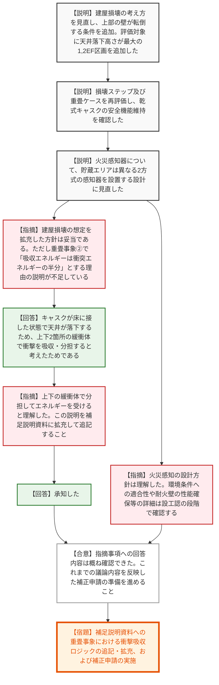

# 第1419回原子力発電所の新規制基準適合性に係る審査会合（令和8年7月2日）
> 出典 : https://youtube.com/live/uwWkuNBdB7E?si=oX5JXs3GX0pAOMqR

## 会合の概要作成
* **波及的影響評価の厳格化と妥当性の確認:** 川内原子力発電所の乾式貯蔵施設設置に関する審査において、建屋損壊時に乾式キャスクへ与える波及的影響評価の前提条件が見直されました。壁の転倒や最も落下高さの大きい区画を評価対象に加えるなど、より厳しく現実的な想定に基づく解析が行われ、規制側からもその方針と安全機能維持の結果が「妥当である」と高く評価されました。
* **解析モデルの前提条件に関する説明性の向上要求:** 重畳事象（キャスクが床に接地した状態での天井落下）の評価において、衝突エネルギーが上下の緩衝体で二等分されるという力学的なロジックについて、規制側から「結論だけでなく考え方の説明が不足している」との指摘がありました。事業者が口頭で補足説明を行い理解は得られましたが、審査資料としてのエビデンス拡充が求められました。
* **補正申請に向けた最終調整と今後の展望:** 火災感知設備についても、火災防護審査基準に則った異方式の感知器設置への設計見直しが了承され、詳細な耐火性能の確認は設工認（工事計画認可）段階へ移行することが確認されました。これまでの指摘事項に対する回答が概ね出揃ったことで、議論を反映した補正申請の提出に向けた最終段階に入り、現場は建設的な納得感に包まれていました。

---

## 議題ごとの詳細整理（テキスト）

**【議題1：九州電力（株）川内原子力発電所1号炉及び2号炉の設置変更許可申請（使用済燃料乾式貯蔵施設の設置）に係る審査について】**

* **議論の背景と論点:** 
  乾式貯蔵施設の設置にあたり、過去の会合での指摘事項である「建屋損壊による乾式キャスクへの波及的影響評価において、最も厳しい衝突ケースを網羅できているか（コメントNo.12）」、および「火災感知設備の設計が火災防護審査基準と同等の安全性を確保しているか（コメントNo.13）」に対する事業者の回答内容と妥当性が論点となった。

* **質疑応答（詳細）:**
  * 【説明者側】（九州電力 田中氏）建屋損壊の考え方を見直し、天井直下落下だけでなく、上部の壁等がキャスクに向かって転倒する条件を追加した。これに伴い、評価対象を天井寸法が最大の「1,2BC区画」に加え、天井の落下高さが最大となり防風板等の影響を受ける「1,2EF区画」のキャスクも対象とした。
  * 【説明者側】（九州電力 田中氏）重畳ケース（貯蔵架台の片落ち＋天井落下等）を含めて再評価した結果、乾式キャスクの安全機能が維持されることを確認した。
  * 【説明者側】（九州電力 田中氏）火災感知器について、貯蔵エリアは火災防護審査基準に基づき異なる2方式の感知器をそれぞれ設置する設計に見直した。乾式貯蔵容器の設置がないユーティリティエリアは3時間の耐火壁で分離し、消防法に基づく設計とする。
  * 【規制側】（規制庁 藤川氏）建屋損壊の想定を拡充し、複数の区画を評価対象とした方針は妥当である。評価結果も判定基準を満足していることを確認した。ただし、重畳事象②の注釈にある「吸収エネルギーは衝突エネルギーの半分となる」という考え方の説明が資料上不足しているため、説明を求める。
  * 【説明者側】（九州電力 田中氏）重畳事象②は、キャスクが床に接した状態で上から天井が落下してくるため、衝撃を「床側」と「天井側」の上下2箇所の緩衝体で吸収・分担できると考え、吸収エネルギーを半分としている。
  * 【規制側】（規制庁 藤川氏）上下の緩衝体で分担してエネルギーを受けると理解した。本日口頭であった詳しい説明を補足説明資料に拡充して追記すること。
  * 【説明者側】（九州電力 田中氏）承知した。
  * 【規制側】（規制庁 鳥枝氏）火災感知設備の設計方針は理解した。2種類の感知器の環境条件への適合性や、ユーティリティエリアとの境界となる耐火壁（開口部含む）の性能確保等の詳細については、設工認の段階で確認する。
  * 【規制側】（規制庁 皆川氏）プラント側のこれまでの指摘事項への回答内容は概ね確認できた。これまでの議論内容を反映した補正申請の準備をお願いする。補正申請提出後、書類を確認し新たな論点があれば改めて会合で確認する。

* **結論と宿題事項（アクションアイテム）:**
  * 建屋損壊による波及的影響評価の再整理、および火災感知器の設計見直しについて、規制側はおおむね妥当と判断し了承した。
  * 【宿題】重畳事象の評価において「衝突エネルギーを上下2箇所の緩衝体で半減して吸収・分担する」という考え方を、補足説明資料に追記・拡充すること。
  * これまでの審査会合での議論内容を反映した補正申請を行い、詳細な設備仕様・性能確認は次段階である設工認にて行う。

---

## 論理構造の可視化（Mermaid）

