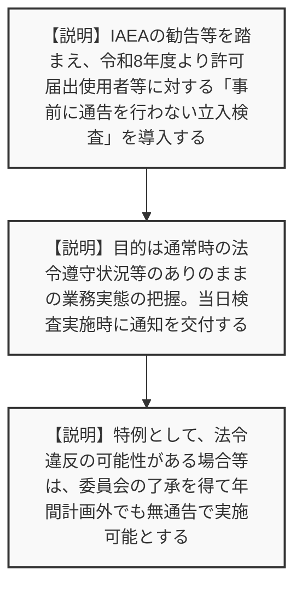
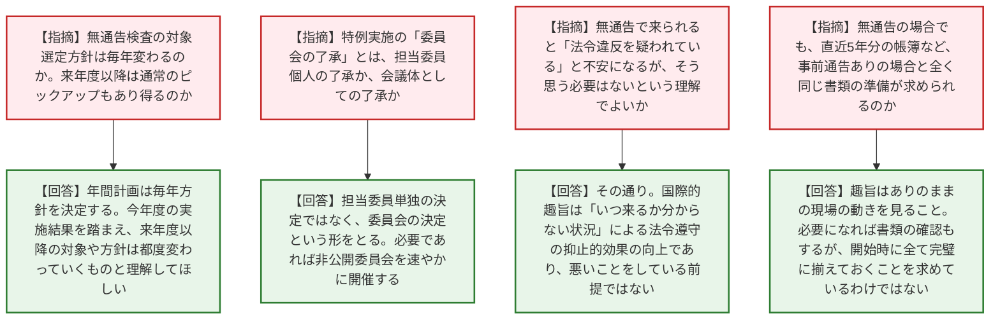
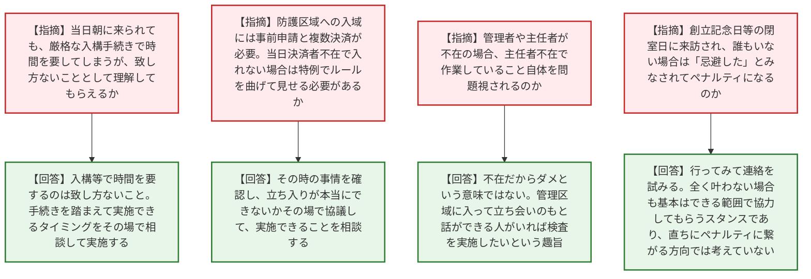

# 第1回立入検査実施要領の改正に関する説明会（令和8年7月6日）
> 出典 : https://youtube.com/live/_T0u1VJMPBU?si=P5QWhUiTR7wE8ZGg

## 会合の概要作成
* **無通告立入検査の導入と背景:** IAEAからの勧告を踏まえ、令和8年度より許可届出使用者等に対する「事前に通告を行わない立入検査（無通告検査）」が試行的に導入される旨が説明されました。法令遵守の抑止的効果を高め、ありのままの管理状況を確認することが主目的とされています。
* **事業者の強い懸念と実務的課題の噴出:** 質疑応答では、当日突然検査官が来訪することに対し、「担当者や管理者が不在の場合はどうなるのか」「厳格な入構手続きや防護区域への入域ルール（事前申請・複数決済）に当日は対応しきれない」「休業日やイベント開催時への配慮はあるか」など、現場の実務に即した切実な懸念や戸惑いが事業者側から相次いで示されました。
* **規制側の柔軟な対応スタンスの提示:** こうした事業者の不安に対し、規制庁側は「無通告だからといって違反を疑っているわけではない」「やむを得ない事情（入構手続きの遅れ、担当者不在、診療・実験への影響等）がある場合は、その場で協議して柔軟に開始時間や検査範囲を調整する」「検査を忌避したとして直ちにペナルティを科すものではない」と繰り返し強調し、事業者との対話と協力を重視する姿勢を示しました。

---

## 議題ごとの詳細整理（テキスト）

**【議題1：立入検査実施要領の改正の背景・趣旨および概要】**
* **議論の背景と論点:** IAEAの勧告（定期検査と無通告検査の組み合わせ）および国内での早急な事実確認の必要性から、立入検査実施要領が改正された。本改正の柱である「無通告立入検査」の目的、対象、および実施プロセス（事前連絡なし、当日玄関先での通知交付等）が論点となった。
* **質疑応答（詳細）:**
  * 【説明者側】（規制庁 高木）IAEA勧告等を受け、令和8年度より年間計画に基づき一部の立入検査を無通告で実施する。対象は許可届出使用者等であり、当日のありのままの業務実態を把握することが目的。従来のような約1ヶ月前の事前の日程調整・通告は行わず、当日検査実施時に通知を交付する。
  * 【説明者側】（規制庁 高木）特例として、法令違反の疑い等があり早急な確認が必要な場合は、年間計画外であっても原子力規制委員会の了承を得て無通告検査を実施できる。
  * 【説明者側】（規制庁 高木）今年度の年間実施予定は、放射線障害防止検査110件、防護検査119件であり、この中の一部を無通告とする。登録認証機関等への無通告検査は今年度は計画していない。
* **結論と宿題事項（アクションアイテム）:**
  * 令和8年度より無通告立入検査が試行導入される方針が事業者に周知された。事業者からの質問や要望を踏まえ、規制庁HPのQ&Aを適宜拡充していくこととなった。

**【議題2：無通告立入検査の実務対応に関する質疑応答（対象選定・通知・当日体制等）】**
* **議論の背景と論点:** 無通告検査の対象選定基準や、無通告と事前通告ありの検査内容の違い、また「無通告で来られる＝違反を疑われているのか」という事業者の心理的負担についての確認が論点となった。
* **質疑応答（詳細）:**
  * 【事業者側】（日本工業検査 若林、大阪大学 吉村）スライド13ページの無通告の選定条件は永続的なものか？来年度以降は通常の対象からピックアップされることもあり得るのか？また方針は毎年変わるのか？
  * 【規制庁】（高木）年間計画は毎年方針を決定・公開している。今年度の実施結果や本説明会での意見を踏まえ、来年度以降の対象や方針（グレーデッドアプローチ等）は都度検討し変わっていくものと理解してほしい。
  * 【事業者側】（東京科学大学 林崎）「特例として委員会の了承を得て」とあるが、これは会議体の了承か、担当委員個人の了承か？
  * 【規制庁】（高木）事案の早急さによるが、担当委員単独の決定ではなく、委員会の決定という形をとる。必要であれば非公開委員会を速やかに開催して決定する。
  * 【事業者側】（東京科学大学 林崎）無通告で来られると「自分たちは法令違反を疑われているのか」と不安になるが、そう思う必要はないという理解でよいか？
  * 【規制庁】（高木）おっしゃる通りである。無通告導入の国際的な趣旨は、いつ来るか分からない状況を作ることによる「法令遵守の抑止的効果」の向上であり、悪いことをしている前提で伺うわけではない。
  * 【事業者側】（IHI検査計測 滝田、東京科学大学 林崎）予定されている110件、119件という件数は違反の恐れがあるからか？また無通告の対象は既に決まっているのか？
  * 【規制庁】（高木）件数は従来の立入検査の年間計画総数であり、その一部を無通告に振り分ける。対象は一定程度決めているが、試行状況等により柔軟に検討する。
  * 【事業者側】（広島大学 小畑）無通告の場合でも、直近5年分の帳簿など、事前通告ありの場合と全く同じ書類の準備が求められるのか？
  * 【規制庁】（高木）趣旨は「日頃のありのままの現場の動き」を見ること。必要になれば書類の確認もするが、開始時に過去の書類を全て完璧に揃えておくことを求めているわけではない。
* **結論と宿題事項（アクションアイテム）:**
  * 無通告検査は違反を疑っているわけではなく、抑止力向上とありのままの現場確認が目的であることが規制庁から明確に示され、事業者へ一定の安心感が提示された。

**【議題3：無通告立入検査の実務対応に関する質疑応答（入構・区域立入制限・不在時対応）】**
* **議論の背景と論点:** 当日アポなしで来訪された場合における、厳格な入構手続きや防護区域への入域申請（複数決済）、責任者の不在、休業日等の物理的・ルールの壁に対し、規制側がどこまで配慮し、ペナルティ扱いとしないかが最大の論点となった。
* **質疑応答（詳細）:**
  * 【事業者側】（日本原子力発電 緒方）当日朝に門前で「検査をやります」と言われても、核物質防護のための入構手続き等で時間を要してしまうが、理解してもらえるのか？
  * 【規制庁】（高木）入構等で時間を要するのは致し方ないこと（やむを得ない事情）と認識している。手続きを踏まえて実施できるタイミングをその場で相談して実施する。
  * 【事業者側】（東京都立産業技術研究センター 川原）防護区域への立ち入りには事前申請と複数人の決済が必要なルールだが、当日決済者が不在で入れない場合はどうなるのか？特例としてルールを曲げて見せる必要があるか？また自衛消防訓練などのイベント中は待ってもらえるか？
  * 【規制庁】（高木）その時の事情を確認し、立ち入りが本当にできないかその場で協議する。イベント等も含め、やむを得ない事情としてできることを考えながら柔軟に進める。
  * 【事業者側】（長崎大学 近藤）管理者や主任者が不在の場合でも「ありのままの状況を確認する」とあるが、主任者不在で作業していること自体を問題視されるのか？
  * 【規制庁】（高木）主任者がいないからダメという意味ではない。不在でも、管理区域に入って立ち会いのもと話ができる放射線取扱者がいれば検査を実施したいという趣旨。不在をもって法令遵守がなっていないとする意図はない。
  * 【事業者側】（大阪大学 眞部、九州大学 本田）施設運営が火水木のみの場合や、創立記念日等の閉室日に来訪され、電話も繋がらず誰もいない場合は「忌避した」とみなされてペナルティになるのか？
  * 【規制庁】（高木）行ってみてその場で連絡を試みる。全く繋がらない場合の対応は明言が難しいが、基本はできる範囲で協力してもらうスタンスであり、忌避とみなして直ちにペナルティに繋がるような方向では考えていない。
* **結論と宿題事項（アクションアイテム）:**
  * 施設のセキュリティルールや人員不在、休業等に起因する当日の対応遅延や立入不可について、規制庁側は「やむを得ない事情」としてその場で協議し柔軟に対応する姿勢を示した。

---

## 論理構造の可視化（Mermaid）

### 【議題1】立入検査実施要領の改正の背景・趣旨および概要

### 【議題2】無通告立入検査の実務対応に関する質疑応答（対象選定・通知・当日体制等）

### 【議題3】無通告立入検査の実務対応に関する質疑応答（入構・区域立入制限・不在時対応）

